# 
COURSE PROJECT

    <strong>Universidad Peruana de Ciencias Aplicadas</strong> 
    </img> 
    <strong>Ingeniería de Software</strong> 
    <strong>Aplicaciones Web - SV51</strong> 
    <strong>Profesor: Angel Augusto Velasquez Nuñez </strong> 
     INFORME TB1

#### Startup: **ClearView**
#### Product: **KeepItFresh**

### 
Team Members

| Member                       | Code       |
|------------------------------|------------|
| Briceño Llanos, Ayrton Omar          | U202311077 |
| Guia Carrasco, Pedro Andre | U202212010 |
| Lang Nassi, Werner Khalil    | U202310003 |
| Nakasone Gomes, Marco Antonio     | U202210790 |
| Rodas Sotomayor, Ernesto        | U202312443 |

  ABRIL 2025

# Registro de Versiones del Informe

| Version | Fecha      | Autor                           | Descripción de Modificación                                                    |
|---------|------------|---------------------------------|--------------------------------------------------------------------------------|
| 0.0.1   | 04/04/2025 |  | Desarrollo Capítulo (1) APARTADO 1.1 - 1.2 - 1.3                               |
| 0.0.2   | 04/04/2025 |        | Desarrollo Capítulo (2) APARTADO 2.1 - 2.2 - 2.3 - 2.4                            |
| 0.0.3   | 04/04/2025 |     | Desarrollo Capítulo (3) APARTADO 3.1 - 3.2 - 3.3 - 3.4                         |

# Project Report Collaboration Insights
Analiza cómo la colaboración y la gestión de tareas influyeron en los resultados del proyecto, destacando fortalezas y áreas de mejora para optimizar futuras estrategias.

Reporte:  
Organización:  
Landing Page: 
# Contenido
[Registro de Versiones del Informe](#registro-de-versiones-del-informe)  
[Project Report Collaboration Insights](#project-report-collaboration-insights)  
[Student Outcome](#student-outcome)  

[Capítulo I: Introducción](#capítulo-i-introducción)

[1.1 Startup Profile](#11-startup-profile)  
[1.1.1. Descripción de la Startup](#111-descripción-de-la-startup)  
[1.1.2. Perfiles de integrantes del equipo](#112-perfiles-de-integrantes-del-equipo)  

[1.2. Solution Profile](#12-solution-profile)  
[1.2.1 Antecedentes y problemática](#121-antecedentes-y-problemática)  
[1.2.2 Lean UX Process.](#122-lean-ux-process)  
[1.2.2.1. Lean UX Problem Statements.](#1221-lean-ux-problem-statements)  
[1.2.2.2. Lean UX Assumptions.](#1222-lean-ux-assumptions)  
[1.2.2.3. Lean UX Hypothesis Statements.](#1223-lean-ux-hypothesis-statements)  
[1.2.2.4. Lean UX Canvas.](#1224-lean-ux-canvas)  

[1.3. Segmentos objetivo.](#13-segmentos-objetivo)  

[Capítulo II: Requirements Elicitation & Analysis](#capítulo-ii-requirements-elicitation--analysis)  

[2.1. Competidores](#21-competidores)  
[2.1.1. Análisis competitivo](#211-análisis-competitivo)  
[2.1.2. Estrategias y tácticas frente a competidores](#211-análisis-competitivo)  

[2.2. Entrevistas](#22-entrevistas)  
[2.2.1. Diseño de entrevistas](#221-diseño-de-entrevistas)  
[2.2.2. Registro de entrevistas](#222-registro-de-entrevistas)  
[2.2.3. Análisis de entrevistas](#223-análisis-de-entrevistas)  

[2.3. Needfinding](#23-needfinding)  
[2.3.1. User Personas](#231-user-personas)  
[2.3.2. User Task Matrix](#232-user-task-matrix)  
[2.3.3. User Journey Mapping](#233-user-journey-mapping)  
[2.3.4. Empathy Mapping](#234-empathy-mapping)  
[2.3.5. As-is Scenario Mapping](#235-as-is-scenario-mapping) 

[2.4. Ubiquitous Language](#24-ubiquitous-language)  

[Capítulo III: Requirements Specification](#capítulo-iii-requirements-specification)  

[3.1. To-Be Scenario Mapping](#31-to-be-scenario-mapping)    
[3.2. User Stories](#32-user-stories)  
[3.3. Impact Mapping](#33-impact-mapping)  
[3.4. Product Backlog](#34-product-backlog)  

[Capítulo IV: Product Design](#capítulo-iv-product-design)  

[4.1. Style Guidelines.](#41-style-guidelines)  
[4.1.1. General Style Guidelines.](#411-general-style-guidelines)  
[4.1.2. Web Style Guidelines.](#412-web-style-guidelines)  

[4.2. Information Architecture.](#42-information-architecture)  
[4.2.1. Organization Systems.](#421-organization-systems)  
[4.2.2. Labeling Systems.](#422-labeling-systems)  
[4.2.3. SEO Tags and Meta Tags.](#423-seo-tags-and-meta-tags)  
[4.2.4. Searching Systems.](#424-searching-systems)  
[4.2.5. Navigation Systems.](#425-navigation-systems)  

[4.3. Landing Page UI Design.](#43-landing-page-ui-design)  
[4.3.1. Landing Page Wireframe.](#431-landing-page-wireframe)  
[4.3.2. Landing Page Mock-up.](#432-landing-page-mock-up)  

[4.4. Web Applications UX/UI Design.](#44-web-applications-ux-ui-design)  
[4.4.1. Web Applications Wireframes.](#441-web-applications-wireframes)  
[4.4.2. Web Applications Wireflow Diagrams.](#442-web-applications-wireflow-diagrams)  
[4.4.3. Web Applications Mock-ups.](#443-web-applications-mock-ups)  
[4.4.4. Web Applications User Flow Diagrams.](#444-web-applications-user-flow-diagrams)  

[4.5. Web Applications Prototyping.](#45-web-applications-prototyping)  

[4.6. Domain-Driven Software Architecture.](#46-domain-driven-software-architecture)  
[4.6.1. Software Architecture Context Diagram.](#461-software-architecture-context-diagram)  
[4.6.2. Software Architecture Container Diagrams.](#462-software-architecture-container-diagrams)  
[4.6.3. Software Architecture Components Diagrams.](#463-software-architecture-components-diagrams)  

[4.7. Software Object-Oriented Design.](#47-software-object-oriented-design)  
[4.7.1. Class Diagrams.](#471-class-diagrams)  
[4.7.2. Class Dictionary.](#472-class-dictionary)  

[4.8. Database Design.](#48-database-design)  
[4.8.1. Database Diagram.](#481-database-diagram)  

[Capítulo V: Product Implementation, Validation & Deployment](#capítulo-v-product-implementation-validation-deployment)  

[5.1. Software Configuration Management.](#51-software-configuration-management)  
[5.1.1. Software Development Environment Configuration.](#511-software-development-environment-configuration)  
[5.1.2. Source Code Management.](#512-source-code-management)  
[5.1.3. Source Code Style Guide & Conventions.](#513-source-code-style-guide--conventions)
[5.1.4. Software Deployment Configuration.](#514-software-deployment-configuration)  

[5.2. Landing Page, Services & Applications Implementation.](#52-landing-page-services--applications-implementation)
[5.2.1. Sprint n.](#521-sprint-n)  
[5.2.1.1. Sprint Planning n.](#5211-sprint-planning-n)  
[5.2.1.2. Aspect Leaders and Collaborators.](#5212-aspect-leaders-and-collaborators)  
[5.2.1.3. Sprint Backlog n.](#5213-sprint-backlog-n)  
[5.2.1.4. Development Evidence for Sprint Review.](#5214-development-evidence-for-sprint-review)  
[5.2.1.5. Execution Evidence for Sprint Review.](#5215-execution-evidence-for-sprint-review)  
[5.2.1.6. Services Documentation Evidence for Sprint Review.](#5216-services-documentation-evidence-for-sprint-review)  
[5.2.1.7. Software Deployment Evidence for Sprint Review.](#5217-software-deployment-evidence-for-sprint-review)  
[5.2.1.8. Team Collaboration Insights during Sprint.](#5218-team-collaboration-insights-during-sprint)  

[Conclusiones](#conclusiones)  
[Conclusiones y recomendaciones.](#conclusiones-y-recomendaciones)  
[Video About-the-Team.](#video-about-the-team)  

[Bibliografía](#bibliografía)  

[Anexos](#anexos)

# Student Outcome
El curso contribuye al cumplimiento del **Student Outcome ABET:ABET – EAC - Student Outcome 5** Criterio: La capacidad de funcionar efectivamente en un equipo cuyos miembros juntos proporcionan liderazgo, crean un entorno de colaboración e inclusivo, establecen objetivos, planifican tareas y cumplen objetivos.

| Criterio Especifico                                                                            | Acciones Realizadas | Conclusiones |
|------------------------------------------------------------------------------------------------|-----------------------------------------------------------------------------------------------------------------------------------------------------------------------------------------------------------------------------------------------------------------------------------------------------------------------------------------------------------------------------------------------------------------------------------------------------------------------------------------------------------------------------------------------------------------------------------------------------------------------------------------------------------------------------------------------------------------------------------------------------------------------------------------------------------------------------------------------------------------------------------------------------------------------------------------------------------------------------------------------------------------------------------------------------------------------------------------------------------------------------------------------------------------------------------------------------------------------------------------------------------------------------------------------------------------------------------------------------------------------------------------------------------------------------------------------------------------------------------------------------------------------------------------------------------------------------------------------------------------------------------------------------------------------------------------------------------------------------------------------------------------------------------------------------------------------------------------------------------------------------------------------------------------------------------------------------------------------------------------------------------------------------------------------------------------------------------------------------------------------------------------------------------------------------------------------------------------------------------------------------------------------------------------------------------------------------------------------------------------------------------------------------------------------------------------------------------------------------------------------------------------------------------------------------------------------------------------------------------------------------------------------------------------------------------------------------------------------------------------------------------------------------------------------------------------------------------------------------------------------------------------------------------------------------------------------------------------------------------------------------------------------------------------------------------------------------------------------------------------------------------------------------------------------------------------------------------------------------------------------------------------------------------------------------------------------------------------------------------------------------------------------------------------------------------------------------------------------------------------------------------------------------------------------------------------------------------------------------------------------------------------------------------------------------------------------------------------------------------------------------------------------------------------------------------------------------------------------------------------------------------------------------------------------------------------------------------------------------------------------------------------------------------------------------------------------------------------------------------------------------------------------------------------------------------------------------------------------------------------------------------------------------------------------------------------------------------------------------------------------------------------------------------------------------------------------------------------------------------------------------------------------------------------------------------------------------------------------------------------------------------------------------------------------------------------------------------------------------------------------------------------------------------------------------------------------------------------------------------------------------------------------------------------------------------------------------------------------------------------------------------------------------------------------------------------------------------------------------------------------------------------------------------------------------------------------------------------------------------------|------------------------------------------------------------------------------------------------------------------------------------------------------------------------------------------------------------------------------------------------------------------------------------------------------------------------------------------------------------------------------------------------------------------------------------------------------------------------------------------------------------------------------------------------------------------------------------------------------------------------------------------------------------------------------------------------------------------------------------------------------------------------------------------------------------------------------------------------------------------------------------------------------------------------------------------------------------------------------------------------------------------------------------------------------------------------------------------------|
| Trabaja en equipo para proporcionar liderazgo en forma conjunta</td>                           | Escribir aqui | Escribir aqui |
| Crea un entorno colaborativo e inclusivo, establece metas, planifica tareas y cumple objetivos | Escribir aquí | Escribir aquí |

# Capítulo I: Introduccion
## 1.1. Startup Profile

### 1.1.1. Descripción de la Startup

ClearView es una startup dedicada a soluciones digitales enfocadas en restaurantes. Utilizamos tecnologías IoT para agilizar la gestión de restaurantes. Nuestro enfoque es preventivo, proporcionando sensores y herramientas para evitar problemas tales como la desposesión de alimentos. No ofrecemos servicios de intervención, ni de acción inmediata.

***Mision:***
Facilitar la gestión de los restaurantes a través de tecnologías las cuales permiten el monitoreo continuo del restaurante, al igual que optimizan la atención de los trabajadores, para que estos puedan ofrecer un mejor servicio a sus consumidores.

***Visión:***
Ser la empresa más importante en Perú, en el ámbito de gestión y optimización de restaurantes con el uso de soluciones tecnológicas.

### 1.1.2. Perfiles de integrantes del equipo

|                                                                   | Apellido y Nombre               | Carrera                | Acerca de                                                                                                                                                                                                                                                                                                                                                                      | Habilidades                                                                                             |
|-------------------------------------------------------------------|---------------------------------|------------------------|--------------------------------------------------------------------------------------------------------------------------------------------------------------------------------------------------------------------------------------------------------------------------------------------------------------------------------------------------------------------------------|---------------------------------------------------------------------------------------------------------|
| | Briceño Llanos, Ayrton Omar | Ingeniería de Software | Escribir aqui | Escribir aqui |
| | Guia Carrasco, Pedro Andre | Ingeniería de Software | Escribir aqui | Escribir aqui |
| | Lang Nassi, Werner Khalil | Ingeniería de Software | Escribir aqui | Escribir aqui |
| | Nakasone Gomes, Marco Antonio | Ingeniería de Software | Escribir aqui | Escribir aqui |
| | Rodas Sotomayor, Ernesto | Ingeniería de Software | Escribir aqui | Escribir aqui |

## 1.2. Solution Profile

Product Name: KeepItFresh

Description: KeepItFresh, es una Web App que tiene como objetivo optimizar la gestión de los restaurantes. Para ello, esta permite al usuario monitorear los IoT que este tiene, mostrando información útil, ayudando con la gestión de inventarios y agilizando el trabajo de los trabajadores en la tienda. Los dueños de los restaurantes pueden usar KeepItFresh con el fin de optimizar varios procesos.

Monetización: KeepItFresh funciona mediante un modelo de suscripción mensual o anual, en el cual se alquilan los diferentes dispositivos IoT.

### 1.2.1. Antecedentes y problemática
**Antecedentes:**

Estudios recientes han analizado los factores que impulsan el desperdicio de alimentos en restaurantes informales de gama media, diferenciado entre el desperdicio generado por el cliente y el generado en la cocina. Una investigación en destinos turísticos de Lituania (Morkunas et al, 2025), empleo entrevistas con gerentes y un Proceso Analítico Jerárquico (AHP) difuso para priorizar las causas, revelando hallazgos clave:

* Cliente: Destacaron el sentimiento de vergüenza, barrera lingüística, presentación inadecuada de platos tradicionales, tanto en destinos locales e internacionales.

* Cocina: Asociado a fallas en la planificación de demanda, ineficiencias operativas y limitaciones en infraestructura de almacenamiento.

Dicho estudio, propone soluciones adaptadas a cada factor identificado, ofreciendo un marco relevante para abordar problemáticas similares en contextos gastronómicos. 

**Problematicas:**

La gestión del inventario de un restaurante suele llegar a consumir muchos recursos y tiempo. Además también es muy complicado estar al tanto de la fecha de vencimiento por producto, al igual que la temperatura idónea de los mismos. También cuando un restaurante tiene una gran cantidad de clientela se le suele dificultar a los mozos darse cuenta cuando un cliente requiere de atención.

**What**
* El problema es la mala gestión del inventario en los restaurantes, lo que genera desperdicio de alimentos y un alto consumo de recursos debido al vencimiento de productos y a la falta de control eficiente.Además, el personal de atención enfrenta dificultades para identificar cuándo un cliente requiere asistencia, lo que puede afectar la calidad del servicio y la experiencia del cliente.

**Why: ¿Por qué es importante que se gestione el inventario en los restaurantes?**

**Who: ¿Quienes se ven afectados?**
* Los dueños o gerentes y trabajadores de un restaurante.

**When: ¿Cuándo sucede la problemática?**
* La problemática sucede en cualquier momento del día, ya que los restaurantes operan constantemente y deben gestionar su inventario y atención al cliente en todo momento.

**Where: ¿Dondé implementaríamos nuestra solución?**
* En restaurantes nacionales e internacionales.

**How: ¿Cómo ayudará nuestra solución?**

**How much: ¿Cúanto costará?**

### 1.2.2. Lean UX Process
#### 1.2.2.1. Lean UX Problem Statements

#### 1.2.2.2. Lean UX Assumptions

#### 1.2.2.3. Lean UX Hypothesis Statements

#### 1.2.2.4. Lean UX Canvas.

## 1.3. Segmentos Objetivos

# Capitulo II: Requeriments Elicitation & Analysis

## 2.1. Competidores 

### 2.1.1. Análisis competitivo

<table>
  <tr>
    <th colspan="22">Competitive Analysis Landscape</th>
  </tr>
  <tr>
    <td colspan="1">¿Por qué llevar a cabo el análisis?</td>
    <td colspan="17">El objetivo de este análisis es conocer las diferencias entre los competidores que hay en el mercado actual.</td>
  </tr>
  <tr>
    <td colspan="2"></td>
    <td> </td>
    <td>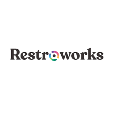 </td>
    <td> </td>
    <td> </td>
</tr>
  <tr>
    <td rowspan="2">Perfil</td>
    <td>Overview</td>
    <td></td>
    <td></td>
    <td></td>
    <td></td>
</tr>
  <tr>
  <td>Ventaja competitiva ¿Qué valor ofrece a los clientes?</td>
    <td>KeepItFresh ofrece un software inteligente para gestionar el inventario de tu negocio. Brinda un control completo del estado de los productos almacenados, recomienda las mejores condiciones de conservación para los alimentos y, además, incluye un botón para llamar a los mozos de forma rápida y eficiente.</td>
    <td>Restroworks ofrece un software con información de inventario en tiempo real para tomar decisiones más inteligentes </td>
    <td>Oddo ofrece un software para comercio e inventario personalizado a pedido de sus clientes</td>
    <td>SolverMedia ofrece un software para control de stacks, puede generar horarios y también realizar pedidos al proveedor</td>
    </tr>
<tr>
    <td rowspan="2">Perfil de Marketing</td>
    <td>Mercado Objetivo</td>
    <td>Enfocado en restaurantes criollos, cevicherías y pollerías.</td>
    <td>Enfocado en negocios del sector gastronómico, especialmente cadenas de comida rápida y restaurantes.</td>
    <td>Enfocado a negocios que buscan un software personalizado para sus restaurantes.</td>
    <td>Enfocado en restaurantes, cafeterias y terminal punto de ventas en hotelería.</td>
  </tr>
  <tr>
  <td>Estrategias de Marketing</td>
    <td>Publicidad, posicionamiento de Landing page, redes sociales y entrevistas.</td>
    <td>Posicionamiento de su Landing Page y colaboración con grandes empresas</td>
    <td>Publicidad, posicionamiento de su Landing Page y entrevistas</td>
    <td>Publicidad y posicionamiento de su Landing Page</td>
    </tr>
<tr>
    <td rowspan="3">Perfil de Producto</td>
    <td>Productos y Servicios</td>
    <td>Software de manejo de inventario para restaurantes y análisis de datos de los productos alojados.</td>
    <td>Ofrece una Plataforma de gestión de inventario y monitoreo en tiempo real.</td>
    <td>Proporciona un software personalizado para el usuario.</td>
    <td>Ofrece un software de control de stack, genera horarios para el equipo del restaurante y realiza pedidos al proveedor.</td>
  </tr>
  <tr>
  <td>Precios y Costos</td>
    <td>Suscripción de cada IOT para los restaurantes</td>
    <td>El precio depende de la complejidad del software y hardware</td>
    <td>El precio depende de la cotización del software</td>
    <td>Suscripciones a partir de 5$ que ofrece una experiencia más extendida</td>
    </tr>
<td>Canales de distribución (Web y/o Móvil)</td>
    <td>Web y móvil</td>
    <td>Web y móvil</td>
    <td>Web y móvil</td>
    <td>Web</td>
<tr>
    <td rowspan="4">Análisis SWOT</td>
    <td>Fortalezas</td>
    <td>Ofrecer tecnología IOT de sensores y una interfaz intuitiva para todo público.</td>
    <td>Reconocimiento por empresas grandes y ofrece varias opciones personalizables.</td>
    <td>Ser personalizable para el negocio que solicita su servicio.</td>
    <td>Barato comparado a su competencia.</td>
  </tr>
  <tr>
  <td>Debilidades</td>
    <td>Poca experiencia en el mercado.</td>
    <td>Mala administración de redes sociales (no promociona su marca).</td>
    <td>Cubrir muchos sectores sin especializarse en uno.</td>
    <td>La interfaz del software es muy complicada de entender.</td>
    </tr>
  <tr>
<td>Oportunidades</td>
    <td>El cliente puede ajustar la cantidad de dispositivos IOT que desee alquilar de acuerdo a su presupuesto</td>
    <td>Colaboraciones estratégicas con cadenas reconocidas pueden aumentar presencia y consolidar su reputación internacional.</td>
    <td>El sector gastronómico es diverso y extenso, ideal para escalar y captar múltiples tipos de clientes.</td>
    <td>Ofrecer planes accesibles permitiendo llegar a pequeños negocios que no pueden costear soluciones costosas.</td>
</tr>
  <tr>
<td>Amenazas</td>
    <td>Competencia de empresas con mayor manejo y tiempo en el mercado</td>
    <td>Problemas con plataformas externas pueden afectar la experiencia del cliente y generar desconfianza en usuarios.</td>
    <td>Cambios en la demanda del mercado.</td>
    <td>Competidores con alta experiencia en el mercado.</td>
</tr>
</table>

### 2.1.2. Estrategias y tácticas frente a competidores

Desarrollar estrategias y tácticas efectivas para enfrentar a nuestros competidores requiere de un enfoque cuidadoso y planificado. A continuación, se presentan algunas estrategias y tácticas que podrían ser consideradas para tener una ventaja competitiva frente a otras alternativas:

1.	Implementación de tecnología IOT: Utilizamos sensores IOT para ofrecer un monitore continuo de el estado de los alimentos que hay en el almacenamiento del restaurante y también le damos la oportunidad al cliente de decider cuantos sensores desea de acuerdo a su presupuesto.
2.	Enfoque en la experiencia para el usuario: Desarrollar una interfaz simple y fácil de entender para que el usuario no tenga dificultades en entenderla y pueda usarla sin problemas.
3.	Mantenimiento y mejoras en la aplicación: Mantener un ritmo constante en las actualizaciones para mejorar y arreglar la aplicación es esencial para que el usuario tenga la mejor experiencia posible y esto lo haremos recopilando información de errores y quejas de los usuarios.

Por otro lado, dado que hemos reconocido a nuestros posibles competidores, estos son nuestras estrategias específicas para Restroworks, Odoo y SolverMedia.

1.	Frente a Restroworks: A diferencia de Restroworks, KeepItFresh estará diseñado para negocios pequeños y medianos como pollerías, cevicherías, etc. Y ofrecerá planes económicos que sean aptos para todo público, además, con nuestra tecnología IOT podrá monitorear el estado, caducidad y temperatura de los productos y también tendrá un soporte personalizado para el usuario y una interfaz fácil de manejar.
2.	Frente a Odoo: KeepItFresh planea tener un mercado objetivo más claro que Odoo ya que ellos trabajan en varios campos y esto no les permite brindar un software completo para lo que quieren los usuarios, de esta manera tendremos un mejor manejo en el mercado de los restaurantes a comparación de Odoo ya que KeepItFresh ofrece ayuda para los cocineros, mozos y clientes.
3. Frente a SolverMedia: Se realizará una landing page y una aplicación con interfaz fácil de entender y manejar además de brindarle un soporte 24/7 al cliente para cualquier duda o error con la aplicación, de estar forma se mantendrá un público satisfecho con la app.

## 2.2. Entrevistas

### 2.2.1. Diseño de entrevistas

A continuación, se presentan las preguntas para las entrevistas para ambos segmentos objetivo.

Preguntas para los dueños de restaurantes:

- Podría contarme un poco cómo funciona el restaurante día a día?
- ¿Cuántas personas trabajan en cocina y cuántas en el salón?
- ¿Tienen alguna herramienta para llevar el control del inventario? ¿Cómo lo hacen?
- ¿Qué tan seguido revisan el stock (cantidad de productos en almacén)? 
- ¿Cómo hacen para saber si un producto está por vencer o si necesita cierta temperatura? 
- ¿Alguna vez han tenido problemas por productos vencidos o mal conservados? ¿Qué consecuencias tuvo? 
- ¿Tiene alguna forma de prever esas situaciones? 
- ¿Qué pasa cuando el restaurante está lleno? 
- ¿Cómo manejan la atención al cliente en esos momentos? 
- ¿Cómo se organiza el equipo para responder rápido ante emergencias? 
- ¿Usan alguna tecnología para mejorar estos procesos? (Apps, sensores, tablets...)
- Si existiera una herramienta que te ayude a automatizar el control de stock y también mejore la experiencia del cliente, ¿cómo la imaginas? 
- ¿Qué características te parecerían más útiles o importantes? 
- ¿Estarías dispuesto a probar algo así en tu restaurante?

Preguntas para el segmento "Trabajadores de restaurantes"

- ¿Qué tareas haces normalmente durante tu turno?
- ¿Tenés que ver con el inventario o con revisar productos? ¿Cómo lo hacés?
- ¿Con qué frecuencia revisas los productos en stock?
- ¿Cómo se enteran si un producto está por vencerse?
- ¿Alguna vez tuvieron que tirar algo porque se pasó la fecha o estaba mal conservado?
- Cuando el restaurante está lleno, ¿cómo te das cuenta si un cliente necesita algo si no te llama directamente?
- ¿Te pasó alguna vez que un cliente se molestó por no recibir atención a tiempo?
- ¿Qué es lo más difícil de esos momentos de mucho trabajo?
- ¿Cómo te imaginas que una app o sistema podría ayudarte a hacer tu trabajo más fácil?

### 2.2.2. Registro de entrevistas

En esta sección se aborda la información recolectada de cada entrevista incluyendo un resumen de las respuestas de los entrevistados.

Entrevistas del segmento de dueño de restaurante:

- Entrevista 1

| Nombre               | Luis                                                                                                                                                                                                                                                                                                                        |
|----------------------|-----------------------------------------------------------------------------------------------------------------------------------------------------------------------------------------------------------------------------------------------------------------------------------------------------------------------------|
| Apellido             | Agurto                                                                                                                                                                                                                                                                                                                      |
| Edad                 | 34 años                                                                                                                                                                                                                                                                                                                     |
| Distrito             | San Borja                                                                                                                                                                                                                                                                                                                   |
| Evidencia            | 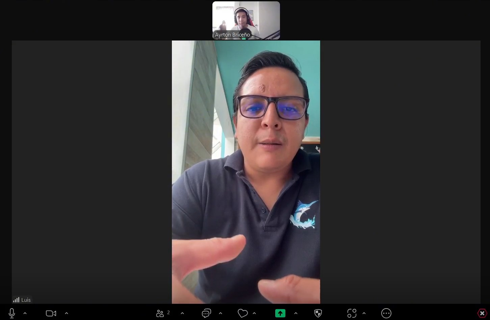                                                                                                                                                                                                                                                                            |
| URL                  | https://upcedupe-my.sharepoint.com/:v:/g/personal/u202311077_upc_edu_pe/EcyEvfJJK95LlKXxm5fzHMABMmlq3vvVZPcnYcX1jgHR2w?nav=eyJyZWZlcnJhbEluZm8iOnsicmVmZXJyYWxBcHAiOiJPbmVEcml2ZUZvckJ1c2luZXNzIiwicmVmZXJyYWxBcHBQbGF0Zm9ybSI6IldlYiIsInJlZmVycmFsTW9kZSI6InZpZXciLCJyZWZlcnJhbFZpZXciOiJNeUZpbGVzTGlua0NvcHkifX0&e=HrwezL |
| Inicio de entrevista | 00:00                                                                                                                                                                                                                                                                                                                       |    
| Fin de entrevista    | 06:30                                                                                                                                                                                                                                                                                                                       |

Resumen de entrevista: Luis Agurto, fundador y gerente general de la cevichería "El Molinero", señaló durante la entrevista que le resultaría altamente beneficioso contar con una aplicación que facilite la gestión de inventario. Aunque actualmente utiliza un método propio para organizar sus productos y alimentos, considera que una solución tecnológica que automatice el control de stock, sugiera ubicaciones óptimas de almacenamiento, genere estadísticas predictivas como alertas sobre posibles faltantes y optimice el trabajo del personal de atención, sería ideal para mejorar la eficiencia operativa del restaurante. Luis nos comenta que le gustaría utilizar la aplicación porque sería algo distinto, innovador y podría facilitar todos los procesos.

- Entrevista 2

| Nombre               | Daniel                                                                                                                                                                                                                                                                                                                      |
|----------------------|-----------------------------------------------------------------------------------------------------------------------------------------------------------------------------------------------------------------------------------------------------------------------------------------------------------------------------|
| Apellido             | Céspedes                                                                                                                                                                                                                                                                                                                    |
| Edad                 | 54 años                                                                                                                                                                                                                                                                                                                     |
| Distrito             | Miami                                                                                                                                                                                                                                                                                                                       |
| Evidencia            |                                                                                                                                                                                                                                                                                                                             |
| URL                  | https://upcedupe-my.sharepoint.com/:v:/g/personal/u202311077_upc_edu_pe/EcyEvfJJK95LlKXxm5fzHMABMmlq3vvVZPcnYcX1jgHR2w?nav=eyJyZWZlcnJhbEluZm8iOnsicmVmZXJyYWxBcHAiOiJPbmVEcml2ZUZvckJ1c2luZXNzIiwicmVmZXJyYWxBcHBQbGF0Zm9ybSI6IldlYiIsInJlZmVycmFsTW9kZSI6InZpZXciLCJyZWZlcnJhbFZpZXciOiJNeUZpbGVzTGlua0NvcHkifX0&e=HrwezL |
| Inicio de entrevista | 14:43                                                                                                                                                                                                                                                                                                                       |    
| Fin de entrevista    | 29:10                                                                                                                                                                                                                                                                                                                       |

Resumen de entrevista:

Daniel Céspedes, cofundador del restaurante de comida criolla en Miami "El pollo Inka", demostró un alto interés en los beneficios que este contaría con una aplicación o sistema que le ayude a gestionar su inventario. Este comenta que, a pesar de que ellos ya constan con un método para organizar varios de sus productos, esto suele consumir bastante tiempo por parte del personal, por lo cual una aplicación como esta le ayudaría bastante en distribuir mejor las horas para sus trabajadores. Asimismo, el entrevistado deja a remarcar lo importante que es la incorporación de estas tecnologías en cualquier tipo de negocio, y cómo estás ayudan a optimizar el gasto de recursos y tiempo.

Entrevista del segmento trabajadores del restaurante

- Entrevista 3

| Nombre               | Kaleb                                                                                                                                                                                                                                                                                                                       |
|----------------------|-----------------------------------------------------------------------------------------------------------------------------------------------------------------------------------------------------------------------------------------------------------------------------------------------------------------------------|
| Apellido             | Frias                                                                                                                                                                                                                                                                                                                       |
| Edad                 | 21                                                                                                                                                                                                                                                                                                                          |
| Distrito             | San Miguel                                                                                                                                                                                                                                                                                                                  |
| Evidencia            |                                                                                                                                                                                                                                                                                             |
| URL                  | https://upcedupe-my.sharepoint.com/:v:/g/personal/u202311077_upc_edu_pe/EcyEvfJJK95LlKXxm5fzHMABMmlq3vvVZPcnYcX1jgHR2w?nav=eyJyZWZlcnJhbEluZm8iOnsicmVmZXJyYWxBcHAiOiJPbmVEcml2ZUZvckJ1c2luZXNzIiwicmVmZXJyYWxBcHBQbGF0Zm9ybSI6IldlYiIsInJlZmVycmFsTW9kZSI6InZpZXciLCJyZWZlcnJhbFZpZXciOiJNeUZpbGVzTGlua0NvcHkifX0&e=HrwezL |
| Inicio de entrevista | 09:41                                                                                                                                                                                                                                                                                                                       |
| Fin de entrevista    | 14:42                                                                                                                                                                                                                                                                                                                       | 

Resumen de entrevista: 

Kaleb Frias trabaja en un restaurante atendiendo clientes, tomando pedidos y organizando el salón también apoya en la revisión de inventario especialmente bebidas e insumos controlando fechas de vencimiento una vez por semana y a diario para productos de alta rotación ha tenido que desechar productos vencidos en ocasiones durante alta demanda se guía por el lenguaje corporal del cliente para atenderlos y sugiere una app que avise cuando el cliente necesite algo y ayude con el control de stock en tiempo real.

- Entrevista 4

| Nombre               | Matthew                                                                                                                                                                                                                                                                                                                |
|----------------------|------------------------------------------------------------------------------------------------------------------------------------------------------------------------------------------------------------------------------------------------------------------------------------------------------------------------|
| Apellido             | Yonamine                                                                                                                                                                                                                                                                                                               |
| Edad                 | 20                                                                                                                                                                                                                                                                                                                     |
| Distrito             | Pueblo Libre                                                                                                                                                                                                                                                                                                           |
| Evidencia            |                                                                                                                                          |
| URL                  | https://upcedupe-my.sharepoint.com/:v:/g/personal/u202311077_upc_edu_pe/EcyEvfJJK95LlKXxm5fzHMABMmlq3vvVZPcnYcX1jgHR2w?nav=eyJyZWZlcnJhbEluZm8iOnsicmVmZXJyYWxBcHAiOiJPbmVEcml2ZUZvckJ1c2luZXNzIiwicmVmZXJyYWxBcHBQbGF0Zm9ybSI6IldlYiIsInJlZmVycmFsTW9kZSI6InZpZXciLCJyZWZlcnJhbFZpZXciOiJNeUZpbGVzTGlua0NvcHkifX0&e=HrwezL |
| Inicio de entrevista | 29:11                                                                                                                                                                                                                                                                                                                  |
| Fin de entrevista    | 39:10                                                                                                                                                                                                                                                                                                                  | 

Resumen de entrevista:

Matthew nos dió a conocer un poco sobre como es el hambiente laboral dentro de un resaturante, lo dificil es que a veces satisfacer a todos los clientes en horas donde el restaurante esta en "rush", tambien nos da su opinión positiva sobre nuestro producto. El como mozo si quisiera aumentar su eficiencia mediante la tecnología, con la ayuda de los botones que le comentamos en la entrevista, a la vez nos dió ideas sobre como se podrías mejorar tambien la atención al cliente, siempre desde su experiencia laboral. 

- Entrevista 5

| Nombre               | Diego                                                                                                                                                                                                                                                                                                                       |
|----------------------|-----------------------------------------------------------------------------------------------------------------------------------------------------------------------------------------------------------------------------------------------------------------------------------------------------------------------------|
| Apellido             | Ahane                                                                                                                                                                                                                                                                                                                       |
| Edad                 | 19                                                                                                                                                                                                                                                                                                                          |
| Distrito             | San Miguel                                                                                                                                                                                                                                                                                                                  |
| Evidencia            |                                                                                                                                                                                                                                                                                |
| Url                  | https://upcedupe-my.sharepoint.com/:v:/g/personal/u202311077_upc_edu_pe/EcyEvfJJK95LlKXxm5fzHMABMmlq3vvVZPcnYcX1jgHR2w?nav=eyJyZWZlcnJhbEluZm8iOnsicmVmZXJyYWxBcHAiOiJPbmVEcml2ZUZvckJ1c2luZXNzIiwicmVmZXJyYWxBcHBQbGF0Zm9ybSI6IldlYiIsInJlZmVycmFsTW9kZSI6InZpZXciLCJyZWZlcnJhbFZpZXciOiJNeUZpbGVzTGlua0NvcHkifX0&e=HrwezL |
| Inicio de entrevista | 06:30                                                                                                                                                                                                                                                                                                                       |
| Fin de entrevista    | 09:40                                                                                                                                                                                                                                                                                                                       | 

Resumen de entrevista: 

Durante la entrevista, Diego, trabajador de un restaurante, explicó que una de sus principales tareas es verificar que los productos estén en buen estado y disponibles antes del inicio del servicio, priorizando aquellos de mayor rotación. Señaló que en horas de alta demanda, como el almuerzo o la cena, se generan situaciones de presión que afectan la eficiencia y la atención al cliente. Además, mencionó la dificultad de identificar productos próximos a vencer, lo que puede generar pérdidas. Destacó que una herramienta tecnológica que alerte automáticamente sobre fechas de caducidad y facilite la organización del trabajo sería de gran utilidad para optimizar tiempos, reducir desperdicios y mejorar la experiencia del cliente.

### 2.2.3. Análisis de entrevistas

Tras analizar las entrevistas realizadas a distintos actores del rubro gastronómico, 
se identifican necesidades comunes y oportunidades claras para el 
desarrollo de una solución tecnológica enfocada en la gestión operativa de restaurantes.

En primer lugar, la gestión de inventario surge como el principal problema compartido entre los entrevistados. 
Luis Agurto, gerente general de la cevichería "El Molinero", y Daniel Céspedes, cofundador del restaurante "El Pollo Inka", 
coinciden en que actualmente utilizan métodos propios para organizar sus productos, pero estos procesos son manuales, poco 
eficientes y consumen mucho tiempo del personal. Ambos señalan que una aplicación que automatice el control de stock, 
sugiera ubicaciones de almacenamiento, y genere estadísticas predictivas sería ideal para optimizar el funcionamiento del negocio.

Por otro lado, trabajadores operativos como Kaleb Frias, Diego y Matthew refuerzan esta necesidad desde una perspectiva funcional.
Kaleb menciona que, al encargarse de revisar bebidas e insumos, ha tenido que desechar productos vencidos por no contar con 
un control actualizado. Diego destaca la dificultad de identificar productos próximos a vencer durante los momentos de 
alta demanda, lo cual genera pérdidas y presión sobre el equipo. Ambos valoran la posibilidad de contar con una aplicación 
que envíe alertas automáticas sobre caducidad y stock bajo. Estas funciones permitirían organizar mejor el trabajo y evitar desperdicios.

A lo largo de todas las entrevistas se observa una actitud positiva hacia el uso de tecnología. 
Los propietarios consideran que incorporar una aplicación como esta sería una forma innovadora de facilitar procesos y diferenciarse en el mercado. El personal 
de atención ve en esta solución una herramienta útil para reducir la carga de trabajo y mejorar la experiencia del cliente.

Podemos concluir que el análisis revela una clara oportunidad de mercado para una aplicación que integre funciones de 
control de inventario en tiempo real, alertas automáticas, sugerencias inteligentes y herramientas de apoyo para la atención 
al cliente. La solución tecnológica propuesta no solo responde a necesidades operativas y estratégicas, sino que también cuenta 
con una aceptación favorable por parte de usuarios de diferentes niveles jerárquicos del restaurante, lo que valida su viabilidad 
e impacto potencial.

Ademas del analisis de entrevistas, hemos realizado algunos formularios hacia algunos usuarios externos, las siguientes imagenes muestran las estadisticas del formulario

- En cuanto a la skill de Amabilidad, el 66.7% de los encuestados evaluó 
con puntuaciones altas (75% y 100%), lo que indica una percepción mayormente 
positiva en este aspecto. No se registraron valoraciones inferiores al 75%, lo 
cual resalta un buen nivel de trato cordial en las interacciones observadas.

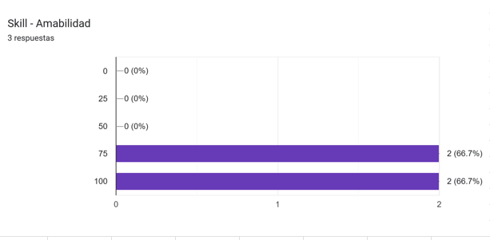

- En cuanto a la habilidad de Comunicación, el 66.7% de los encuestados otorgó 
una valoración del 75%, mientras que el 33.3% la calificó con el 100%. 
Esto indica que la mayoría percibe un buen nivel de comunicación, aunque aún 
hay margen para alcanzar la excelencia de manera más uniforme.

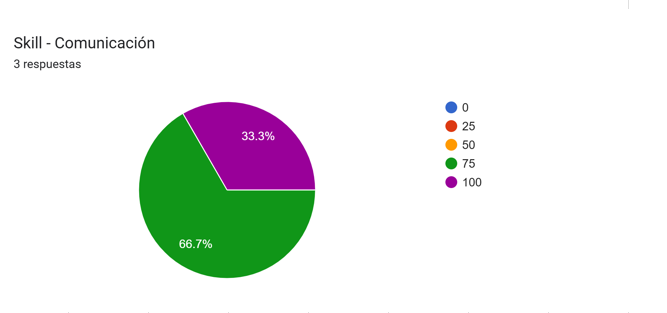

- Respecto a la Resistencia Física, el 66.7% de los encuestados la valoró 
con un 75%, mientras que el 33.3% otorgó la máxima puntuación (100%). 
Estos resultados reflejan una percepción mayoritariamente positiva sobre 
la capacidad física, con un buen nivel de desempeño sostenido durante las jornadas laborales.

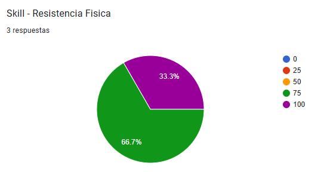

- En cuanto a la Responsabilidad, el 66.7% de los encuestados 
la calificó con un 100%, mientras que el 33.3% la valoró con un 75%. 
Esto refleja una percepción general muy positiva, destacando 
un alto nivel de compromiso en el cumplimiento de las tareas asignadas.

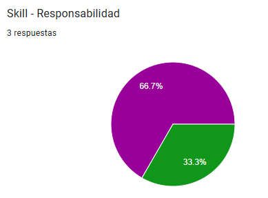

- En cuanto a los canales de comunicación preferidos, el 100% de los 
encuestados optó por mensajería como medio principal. 
Facebook e Instagram también fueron seleccionados por el 66.7% de los 
participantes, mientras que Twitter y TikTok no fueron elegidos por 
ningún encuestado. Esto sugiere que los canales más efectivos para 
interactuar con los usuarios son los mensajes directos y las redes sociales 
más consolidadas.

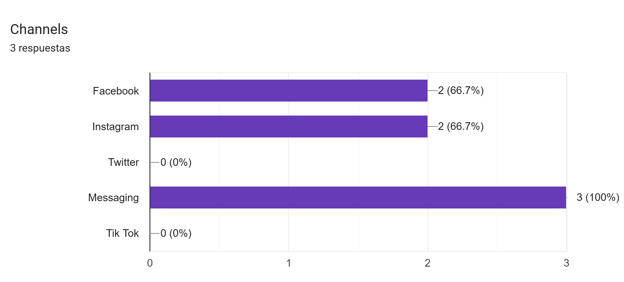

- Respecto al tipo de sistema operativo que utilizan los participantes en 
sus teléfonos móviles, el 66.7% usa iOS, mientras que el 33.3% utiliza Android. 
Este dato es importante para definir la prioridad en el desarrollo o adaptación 
de la aplicación móvil, ya que indica una ligera mayoría de usuarios con dispositivos Apple.

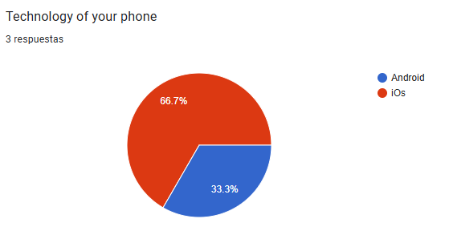

- Según los resultados, el 66.7% de los encuestados utiliza Microsoft (Windows) como sistema operativo de escritorio, mientras que el 33.3% usa Mac, 
no se reportaron usuarios de Linux ni Ubuntu. Este dato es relevante para decidir la compatibilidad de software o herramientas de escritorio: si se desarrolla una aplicación o herramienta, debe priorizarse la compatibilidad con Windows y macOS.

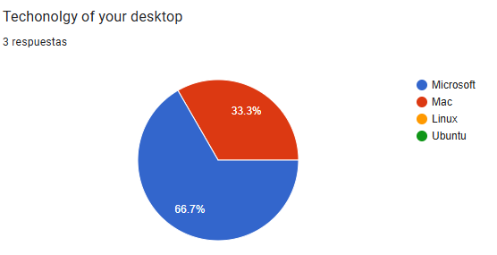

- El gráfico muestra que Edge y Firefox tienen 3 respuestas (100%), 
siendo los mejor valorados. Opera tiene puntuaciones negativas 
(-2 en 67% y -1 en 33%), indicando problemas.
Chrome no tiene datos. La escala 0-3 sugiere calificaciones, 
pero los valores negativos requieren más contexto. 
Edge y Firefox lideran, mientras Opera tiene baja aceptación.
- 
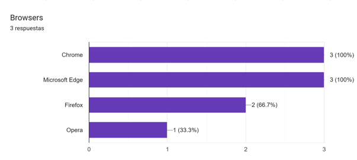

- El análisis de marcas e influencers se basa en 3 respuestas recibidas 
donde aparecen mencionadas varias opciones como Pardos Chicken, La Romana, Don Belesario, 
El Bote y Antigua Taberna Queirolo, entre las marcas mientras que Jose Antonio y La Retama, 
figuran como influencers. Los porcentajes muestran un 33 3% repetido dos veces lo que sugiere una distribución 
equitativa con aproximadamente un voto por cada opción seleccionada aunque al existir siete alternativas en total algunas 
podrían no haber obtenido votos en esta pequeña muestra de tres respuestas

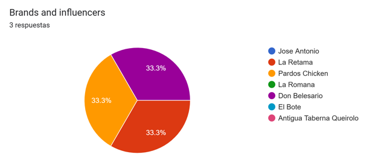

## 2.3. Needfinding 

### 2.3.1. User Personas

#### Segmento 1: Dueños de restaurantes.
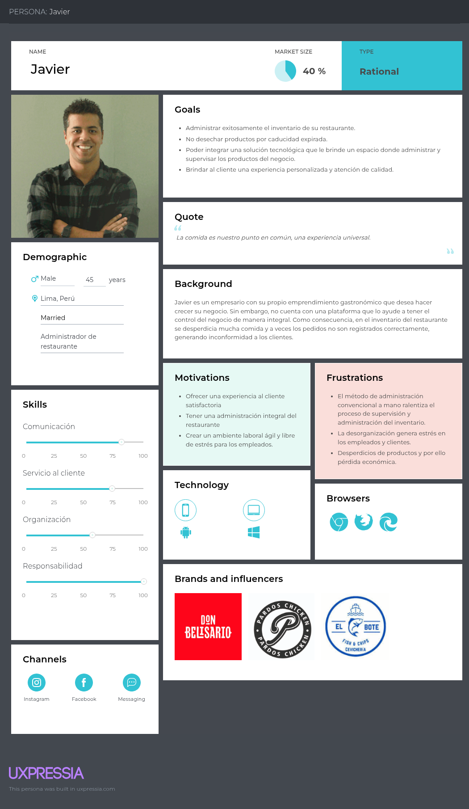

#### Segmento 2: Empleados de restaurantes.

### 2.3.2. User Task Matrix 

| **Tareas**                                                           | **Daniel** Frecuencia | **Daniel** Importancia | **Javier** Frecuencia | **Javier** Importancia |
|----------------------------------------------------------------------|---------------------------|----------------------------|--------------------------|----------------------------|
| Atender y servir a los comensales                                    | Alta                      | Alta                       | Media                    | Alta                       |
| Verificar disponibilidad de productos en el almacén                  | Media                     | Media                      | Alta                     | Alta                       |
| Reportar falta de productos o incidentes con insumos                 | Alta                      | Alta                       | Alta                     | Alta                       |
| Resolver quejas o problemas en sala                                  | Alta                      | Alta                       | Baja                     | Media                      |
| Coordinar con cocina y almacén para sincronizar pedidos              | Alta                      | Alta                       | Media                    | Alta                       |
| Administrar y supervisar inventario                                  | Baja                      | Media                      | Alta                     | Alta                       |
| Registrar productos próximos a vencer o vencidos                     | Baja                      | Media                      | Alta                     | Alta                       |
| Capacitar a personal en el uso del sistema de gestión                | Baja                      | Media                      | Media                    | Alta                       |
| Revisar métricas sobre el consumo y stock de productos               | Baja                      | Media                      | Alta                     | Alta                       |
| Sugerir productos del menú según disponibilidad                      | Alta                      | Alta                       | Media                    | Media                      |
| Asegurar temperatura adecuada para insumos sensibles                 | Baja                      | Baja                       | Alta                     | Alta                       |

### 2.3.3. User Journey Mapping

#### Segmento 1: Dueños de restaurantes.

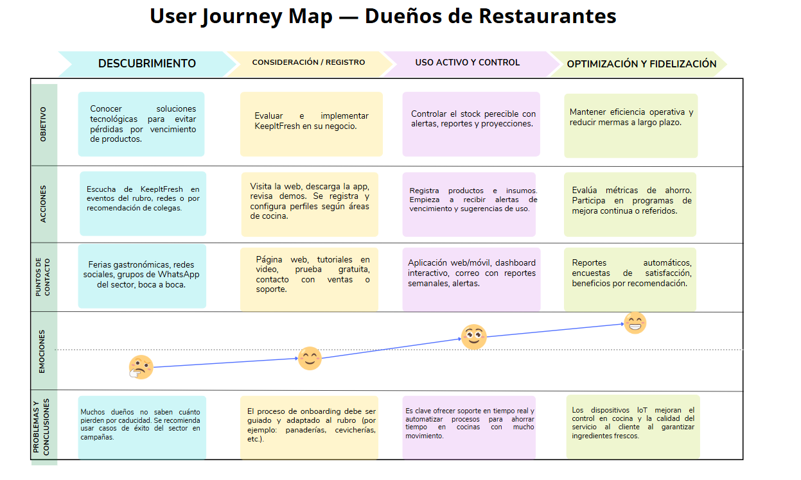

### Segmento 2: Empleados de restaurantes.

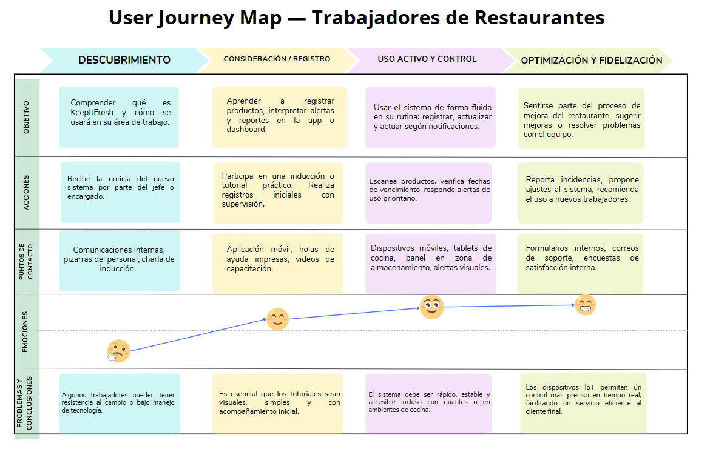

### 2.3.4. Empathy Mapping

#### Segmento 1: Dueños de restaurantes.

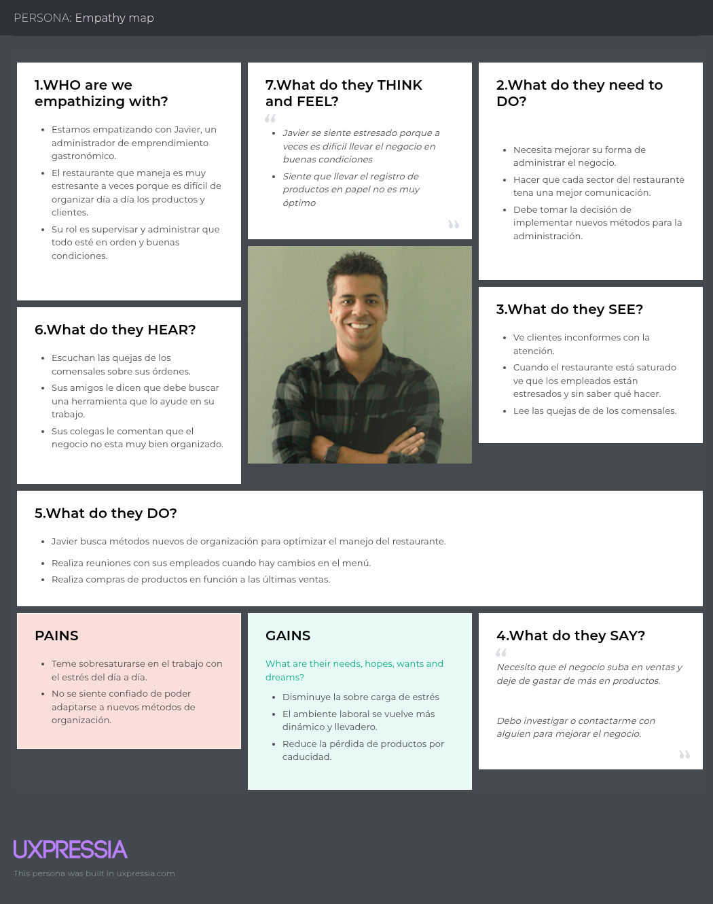

### Segmento 2: Empleados de restaurantes.

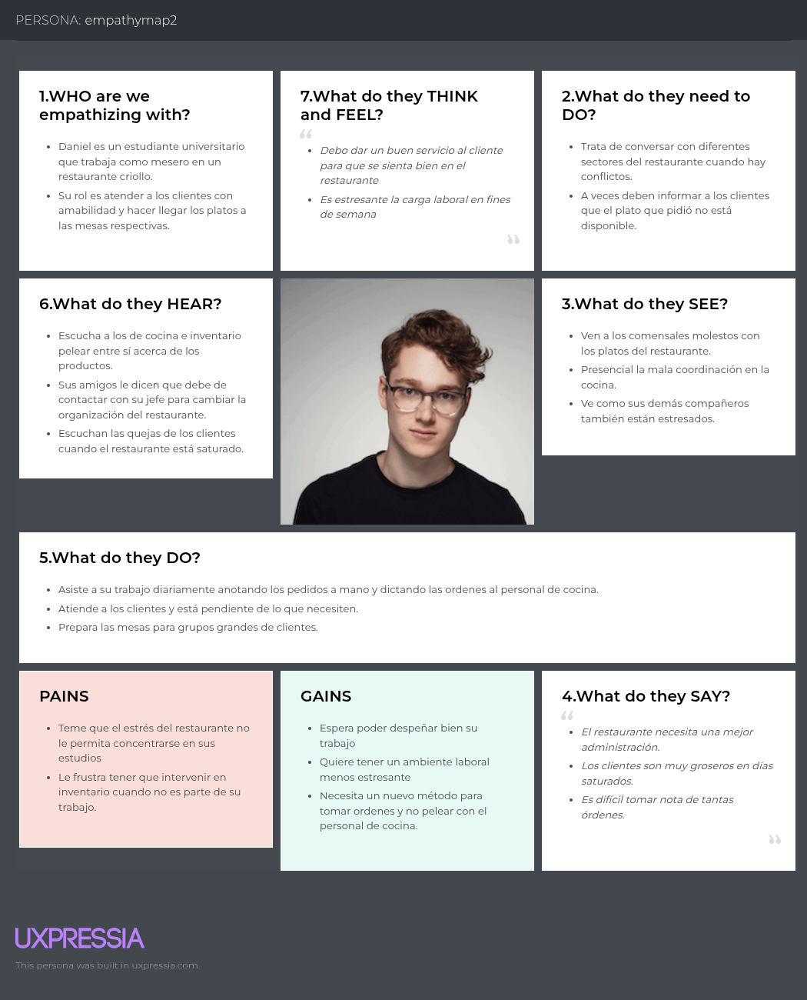

### 2.3.5. As-Is Scenario Mapping

**Segmento 1**

Escenario: El dueño necesita revisar el estado de las mesas, el inventario de ingredientes y asignar tareas al personal.

As-Is:

| Fases    |                      Verificar disponibilidad de mesas                         |                         Verificacion de inventario                         |                Asignar tareas al personal                  |              Comunicacion con el equipo                                       |
|----------|---------------------------------------------------------------------------|---------------------------------------------------------------------------|-----------------------------------------------------------|----------------------------------------------------------------------|
| Doing    | Revisa mesas físicamente                               | Cuenta ingredientes manualmente                | Asigna tareas verbalmente                  | Comunica cambios en persona              |
| Thinking | "No tengo visibilidad en tiempo real" | "Podríamos quedarnos sin ingredientes"  | "El personal parece sobrecargado" | "La comunicación es ineficiente" |
| Feeling  | Me siento inseguro sobre la disponibilidad de la mesas | Me preocupa que tengamos posibles ingredientes faltantes. | me siento estresado por la carga laboral | Me frusta que existan malentendidos al momento de comunicar |

**Segmento 2**  

Escenario: El empleado completa tareas y necesita comunicar su estado al supervisor.

As-Is:

| Fases    |                         Realizacion de tareas                               |                             Notificacion de tareas                         |                   Verificacion de insumos                       |     Comunicacion con el supervisor                                               |
|----------|------------------------------------------------------------------|-----------------------------------------------------------------------|---------------------------------------------------------------------|------------------------------------------------------------------------|
| Doing    | Limpia o Prepara manualmente                          | Notificando al supervisor cuando terminan las tareas de limpieza      | Verifica fisicamente el stock             | Busca al supervisor para reportes               |
| Thinking | "Podría ser más eficiente" | "No sé si me escucharon" | "No hay sistema para ver stock" | "Ojalá hubiera mejor comunicación" |
| Feeling  | Me siento insatisfecho con la manera en que realice mis tareas | Me siento inseguro sobre algunas notificaciones | Me preocupa que hayan faltantes | Me frusta dichos procesos |

## 2.4. Ubiquitous Language

* RestaurantOwner (Dueño Del Restaurante): 

    Persona encargada de la administración general del restaurante. Supervisa el inventario, el personal, la calidad del servicio y toma decisiones operativas clave.

* RestaurantStaff (PersonalDelRestaurante): 

    Conjunto de trabajadores que incluyen mozos, cocineros, encargados de almacén, entre otros. Reciben tareas y ejecutan las operaciones diarias del restaurante.

* Product (Producto): 

    Insumo alimenticio o material consumible utilizado en el restaurante, como carnes, verduras, condimentos, bebidas o productos de cocina. Cada producto puede tener una fecha de caducidad y condiciones de almacenamiento específicas.

* Inventory (Inventario): 

    Conjunto de productos registrados y almacenados en el restaurante. Su correcta gestión evita pérdidas, desperdicio y garantiza disponibilidad.

* StorageUnit (UnidadDeAlmacenamiento): 

    Espacio físico donde se conservan los productos. Puede ser una nevera, congelador, despensa o zona de temperatura controlada.

* ExpirationDate (FechaDeCaducidad): 
    
    Fecha límite en la que un producto debe ser utilizado o descartado. Su control es clave para evitar pérdidas y riesgos sanitarios.

* ExpirationAlert (AlertaDeCaducidad): 

    Notificación que indica que un producto está por vencer o ya ha vencido, para tomar acción inmediata.

* TemperatureMonitoring (MonitoreoDeTemperatura): 

    Proceso que permite verificar que los productos almacenados están a la temperatura adecuada para preservar su calidad.

* RealTimeTracking (SeguimientoEnTiempoReal): 

    Visualización instantánea del estado de los productos, inventario, alertas y condiciones de almacenamiento en todo momento.

* CustomerAttentionAlert (AlertaDeAtenciónAlCliente): 

    Señal visual o notificación que permite al personal saber cuándo un cliente necesita atención.

* WaiterInterface (InterfazDelMozo): 

    Herramienta que utilizan los mozos para recibir alertas, visualizar solicitudes de los clientes y gestionar su atención de forma organizada.

# Capitulo III: Requeriments Specification

## 3.1. To-Be Scenario Mapping 
## 3.2. User Stories

## 3.3. Impact Mapping
## 3.4. Product Backlog

# Capítulo IV: Product Design

## 4.1. Style Guidelines
### 4.1.1. General Style Guidelines
### 4.1.2. Web Style Guidelines

## 4.2. Information Architecture
### 4.2.1. Organization Systems
### 4.2.2. Labeling Systems
### 4.2.3. SEO Tags and Meta Tags
### 4.2.4. Searching Systems
### 4.2.5. Navigation Systems

## 4.3. Landing Page UI Design
### 4.3.1. Landing Page Wireframe
### 4.3.2. Landing Page Mock-up

## 4.4. Web Applications UX/UI Design
### 4.4.1. Web Applications Wireframes
### 4.4.2. Web Applications Wireflow Diagrams
### 4.4.3. Web Applications Mock-ups
### 4.4.4. Web Applications User Flow Diagrams

## 4.5. Web Applications Prototyping

## 4.6. Domain-Driven Software Architecture
### 4.6.1. Software Architecture Context Diagram
### 4.6.2. Software Architecture Container Diagrams
### 4.6.3. Software Architecture Components Diagrams

## 4.7. Software Object-Oriented Design
### 4.7.1. Class Diagrams
### 4.7.2. Class Dictionary

## 4.8. Database Design
### 4.8.1. Database Diagram

# Capítulo V: Product Implementation, Validation & Deployment

## 5.1. Software Configuration Management
### 5.1.1. Software Development Environment Configuration
### 5.1.2. Source Code Management
### 5.1.3. Source Code Style Guide & Conventions
### 5.1.4. Software Deployment Configuration

## 5.2. Landing Page, Services & Applications Implementation
### 5.2.1. Sprint n
#### 5.2.1.1. Sprint Planning n
#### 5.2.1.2. Aspect Leaders and Collaborators
#### 5.2.1.3. Sprint Backlog n
#### 5.2.1.4. Development Evidence for Sprint Review
#### 5.2.1.5. Execution Evidence for Sprint Review
#### 5.2.1.6. Services Documentation Evidence for Sprint Review
#### 5.2.1.7. Software Deployment Evidence for Sprint Review
#### 5.2.1.8. Team Collaboration Insights during Sprint

# Conclusiones
## Conclusiones y recomendaciones

## Video About-the-Team

## Bibliografía

## Anexos
