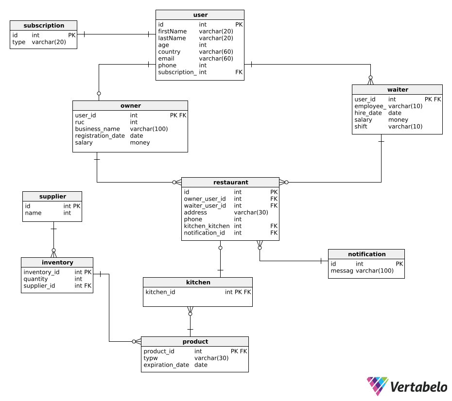

<p align="center" id="caratula">
    <strong>Universidad Peruana de Ciencias Aplicadas</strong><br>
    <br>
    <strong>Ingeniería de Software</strong><br>
    <strong>Aplicaciones Web - SV51</strong><br>
    <strong>Profesor: Angel Augusto Velasquez Nuñez</strong><br><br>
    INFORME TB1
</p>

<p align="center">
    <strong>StartUp: ClearView</strong><br>
    <strong>Product: KeepItFresh</strong>
</p>

<h3 align="center">Integrantes:</h3>

<table style="margin-left:auto; margin-right:auto;">
    <tr>
        <th style="text-align:center;">Integrante</th>
        <th style="text-align:center;">Código</th>
    </tr>
    <tr>
        <td style="text-align:center;">Briceño Llanos, Ayrton Omar</td>
        <td style="text-align:center;">U202311077</td>
    </tr>
    <tr>
        <td style="text-align:center;">Guia Carrasco, Pedro Andre</td>
        <td style="text-align:center;">U202212010</td>
    </tr>
    <tr>
        <td style="text-align:center;">Lang Nassi, Werner Khalil</td>
        <td style="text-align:center;">U202212010</td>
    </tr>
    <tr>
        <td style="text-align:center;">Nakasone Gomes, Marco Antonio</td>
        <td style="text-align:center;">U202210790</td>
    </tr>
    <tr>
        <td style="text-align:center;">Rodas Sotomayor, Ernesto</td>
        <td style="text-align:center;">U202312443</td>
    </tr>
</table>

<p align="center">
    <strong>Abril 2025</strong>
</p>

# Registro de Versiones del Informe

| Version | Fecha      | Autor           | Descripción de Modificación |
|---------|------------|-----------------|-----------------------------|
| 1.0   | 04/04/2025 | Grupo ClearView | Desarrollo de TB1           |
| 2.0   | 28/04/2025 | Grupo ClearView | Corección de TB1            |

# Project Report Collaboration Insights
Analiza cómo la colaboración y la gestión de tareas influyeron en los resultados del proyecto, destacando fortalezas y áreas de mejora para optimizar futuras estrategias.

Reporte: https://github.com/UPC-PRE-202501-1ASI0730-4350-ClearView/KeepItFresh-project-report

Organización:  https://github.com/orgs/UPC-PRE-202501-1ASI0730-4350-ClearView/repositories

Landing Page: https://upc-pre-202501-1asi0730-4350-clearview.github.io/KeepItFresh-landing-page/

TB1: El equipo entero participó en el desarrollo del sistema, asignando las tareas de manera equitativa entre todos. También trabajamos juntos en aspectos esenciales, como las entrevistas con usuarios y el diseño de la página de inicio. Este método integral y colaborativo nos permitió asegurar calidad y eficiencia durante todas las fases del proyecto.  

* Cada miembro redactó y organizó sus contenidos en formato Markdown, haciendo commits para garantizar el progreso en el repositorio.
* Se crearon los artefactos necesarios usando las herramientas recomendadas y se obtuvieron enlaces de imagen desde la carpeta "assets" en la rama develop del repositorio del informe.
* Se programaron reuniones para coordinar el avance de los elementos del informe y comunicar los logros del Sprint 1, centrado en la página de inicio. 


# Contenido
[Registro de Versiones del Informe](#registro-de-versiones-del-informe)  
[Project Report Collaboration Insights](#project-report-collaboration-insights)  
[Student Outcome](#student-outcome)  

[Capítulo I: Introducción](#capítulo-i-introducción)

[1.1 Startup Profile](#11-startup-profile)  
[1.1.1. Descripción de la Startup](#111-descripción-de-la-startup)  
[1.1.2. Perfiles de integrantes del equipo](#112-perfiles-de-integrantes-del-equipo)  

[1.2. Solution Profile](#12-solution-profile)  
[1.2.1 Antecedentes y problemática](#121-antecedentes-y-problemática)  
[1.2.2 Lean UX Process.](#122-lean-ux-process)  
[1.2.2.1. Lean UX Problem Statements.](#1221-lean-ux-problem-statements)  
[1.2.2.2. Lean UX Assumptions.](#1222-lean-ux-assumptions)  
[1.2.2.3. Lean UX Hypothesis Statements.](#1223-lean-ux-hypothesis-statements)  
[1.2.2.4. Lean UX Canvas.](#1224-lean-ux-canvas)  

[1.3. Segmentos objetivo.](#13-segmentos-objetivo)  

[Capítulo II: Requirements Elicitation & Analysis](#capítulo-ii-requirements-elicitation--analysis)  

[2.1. Competidores](#21-competidores)  
[2.1.1. Análisis competitivo](#211-análisis-competitivo)  
[2.1.2. Estrategias y tácticas frente a competidores](#211-análisis-competitivo)  

[2.2. Entrevistas](#22-entrevistas)  
[2.2.1. Diseño de entrevistas](#221-diseño-de-entrevistas)  
[2.2.2. Registro de entrevistas](#222-registro-de-entrevistas)  
[2.2.3. Análisis de entrevistas](#223-análisis-de-entrevistas)  

[2.3. Needfinding](#23-needfinding)  
[2.3.1. User Personas](#231-user-personas)  
[2.3.2. User Task Matrix](#232-user-task-matrix)  
[2.3.3. User Journey Mapping](#233-user-journey-mapping)  
[2.3.4. Empathy Mapping](#234-empathy-mapping)  
[2.3.5. As-is Scenario Mapping](#235-as-is-scenario-mapping) 

[2.4. Ubiquitous Language](#24-ubiquitous-language)  

[Capítulo III: Requirements Specification](#capítulo-iii-requirements-specification)  

[3.1. To-Be Scenario Mapping](#31-to-be-scenario-mapping)    
[3.2. User Stories](#32-user-stories)  
[3.3. Impact Mapping](#33-impact-mapping)  
[3.4. Product Backlog](#34-product-backlog)  

[Capítulo IV: Product Design](#capítulo-iv-product-design)  

[4.1. Style Guidelines.](#41-style-guidelines)  
[4.1.1. General Style Guidelines.](#411-general-style-guidelines)  
[4.1.2. Web Style Guidelines.](#412-web-style-guidelines)  

[4.2. Information Architecture.](#42-information-architecture)  
[4.2.1. Organization Systems.](#421-organization-systems)  
[4.2.2. Labeling Systems.](#422-labeling-systems)  
[4.2.3. SEO Tags and Meta Tags.](#423-seo-tags-and-meta-tags)  
[4.2.4. Searching Systems.](#424-searching-systems)  
[4.2.5. Navigation Systems.](#425-navigation-systems)  

[4.3. Landing Page UI Design.](#43-landing-page-ui-design)  
[4.3.1. Landing Page Wireframe.](#431-landing-page-wireframe)  
[4.3.2. Landing Page Mock-up.](#432-landing-page-mock-up)  

[4.4. Web Applications UX/UI Design.](#44-web-applications-ux-ui-design)  
[4.4.1. Web Applications Wireframes.](#441-web-applications-wireframes)  
[4.4.2. Web Applications Wireflow Diagrams.](#442-web-applications-wireflow-diagrams)  
[4.4.3. Web Applications Mock-ups.](#443-web-applications-mock-ups)  
[4.4.4. Web Applications User Flow Diagrams.](#444-web-applications-user-flow-diagrams)  

[4.5. Web Applications Prototyping.](#45-web-applications-prototyping)  

[4.6. Domain-Driven Software Architecture.](#46-domain-driven-software-architecture)  
[4.6.1. Software Architecture Context Diagram.](#461-software-architecture-context-diagram)  
[4.6.2. Software Architecture Container Diagrams.](#462-software-architecture-container-diagrams)  
[4.6.3. Software Architecture Components Diagrams.](#463-software-architecture-components-diagrams)  

[4.7. Software Object-Oriented Design.](#47-software-object-oriented-design)  
[4.7.1. Class Diagrams.](#471-class-diagrams)  
[4.7.2. Class Dictionary.](#472-class-dictionary)  

[4.8. Database Design.](#48-database-design)  
[4.8.1. Database Diagram.](#481-database-diagram)  

[Capítulo V: Product Implementation, Validation & Deployment](#capítulo-v-product-implementation-validation-deployment)  

[5.1. Software Configuration Management.](#51-software-configuration-management)  
[5.1.1. Software Development Environment Configuration.](#511-software-development-environment-configuration)  
[5.1.2. Source Code Management.](#512-source-code-management)  
[5.1.3. Source Code Style Guide & Conventions.](#513-source-code-style-guide--conventions)
[5.1.4. Software Deployment Configuration.](#514-software-deployment-configuration)  

[5.2. Landing Page, Services & Applications Implementation.](#52-landing-page-services--applications-implementation)
[5.2.1. Sprint n.](#521-sprint-n)  
[5.2.1.1. Sprint Planning n.](#5211-sprint-planning-n)  
[5.2.1.2. Aspect Leaders and Collaborators.](#5212-aspect-leaders-and-collaborators)  
[5.2.1.3. Sprint Backlog n.](#5213-sprint-backlog-n)  
[5.2.1.4. Development Evidence for Sprint Review.](#5214-development-evidence-for-sprint-review)  
[5.2.1.5. Execution Evidence for Sprint Review.](#5215-execution-evidence-for-sprint-review)  
[5.2.1.6. Services Documentation Evidence for Sprint Review.](#5216-services-documentation-evidence-for-sprint-review)  
[5.2.1.7. Software Deployment Evidence for Sprint Review.](#5217-software-deployment-evidence-for-sprint-review)  
[5.2.1.8. Team Collaboration Insights during Sprint.](#5218-team-collaboration-insights-during-sprint)  

[Conclusiones](#conclusiones)  
[Conclusiones y recomendaciones.](#conclusiones-y-recomendaciones)  
[Video About-the-Team.](#video-about-the-team)  

[Bibliografía](#bibliografía)  

[Anexos](#anexos)

# Student Outcome
El curso contribuye al cumplimiento del **Student Outcome ABET:ABET – EAC - Student Outcome 5** Criterio: La capacidad de funcionar efectivamente en un equipo cuyos miembros juntos proporcionan liderazgo, crean un entorno de colaboración e inclusivo, establecen objetivos, planifican tareas y cumplen objetivos.

| Criterio Especifico                                                                            | Acciones Realizadas                                                                                                                                                                                                                                                                                                                                                                                                                                                                                                                                                                                                                                                                                                                                                                                                                                                                                                                                                                                                                                                                                                                                                                                                                                                                                                                                                                                                                                                                                                                                                                                                                                                                                                                                                                                                                                                                                                                                                                                                                                                                                                                                                                                                                                                                                                                                                                                                                                                                                                                                                                          | Conclusiones                                                                   |
|------------------------------------------------------------------------------------------------|----------------------------------------------------------------------------------------------------------------------------------------------------------------------------------------------------------------------------------------------------------------------------------------------------------------------------------------------------------------------------------------------------------------------------------------------------------------------------------------------------------------------------------------------------------------------------------------------------------------------------------------------------------------------------------------------------------------------------------------------------------------------------------------------------------------------------------------------------------------------------------------------------------------------------------------------------------------------------------------------------------------------------------------------------------------------------------------------------------------------------------------------------------------------------------------------------------------------------------------------------------------------------------------------------------------------------------------------------------------------------------------------------------------------------------------------------------------------------------------------------------------------------------------------------------------------------------------------------------------------------------------------------------------------------------------------------------------------------------------------------------------------------------------------------------------------------------------------------------------------------------------------------------------------------------------------------------------------------------------------------------------------------------------------------------------------------------------------------------------------------------------------------------------------------------------------------------------------------------------------------------------------------------------------------------------------------------------------------------------------------------------------------------------------------------------------------------------------------------------------------------------------------------------------------------------------------------------------|--------------------------------------------------------------------------------|
| Trabaja en equipo para proporcionar liderazgo en forma conjunta</td>                           | <br> **Marco Nakasone:**</br><br>En esta entrega, me encargué de desarrollar la Landing Page usando HTML, CSS y JavaScript. Mi rol fue asegurar que la página fuera atractiva y responsive en diferentes dispositivos. Trabajé de cerca con el equipo, promoviendo la comunicación y coordinando tareas para que todos estuviera alineados con los objetivos del proyecto. Así, conseguimos avanzar juntos, compartiendo ideas y soluciones para enfrentar los desafíos.</br> <br>**Werner Lang:**</br><br>En esta entrega me encarga de diseñar los User y techincal stories, además de los wireframes y mockups. Trabaje junto con el equipo en diversos objetivos, promoviendo la cooperación y coordinación. Gracias a esto logramos nuestros objetivos de forma conjunta y apoyándonos como equipo.</br> <br>**Pedro Guia:**</br><br>En esta entrega me encargue en realizar el capitulo 5 sobre el sprint 1 y ademas diseñe la base de datos de nuestra proyecto. Gracias a esto logramos un objetivo que es la colaboracion de trabajo en equipo.</br> <br> **Ernesto Rodas**: <br> </br> En esta entrega participé activamente en el desarrollo del proyecto Keep It Fresh, colaborando en el diseño de los wireframes y en la definición de criterios de experiencia de usuario (UX) para asegurar una interfaz funcional y centrada en las necesidades del usuario. Además, contribuí en la elaboración de la presentación en PowerPoint, estructurando los contenidos y apoyando en la organización visual de las ideas, cooperando y promoviendo el trabajo en equipo. </br> <br> **Ayrton Omar Briceño Llanos**: <br> </br> En esta entrega realicé las epic stories, user y technical stories junto con mi compañero Werner, además del analisis competitivo de la empresa y el product backlog, también aporté con las entrevistas y con el To-be scenario mapping. Ayudé a todos los integrantes del equipo a coordinarse mejor y también en sus tareas para avanzar juntos como equipo.                                                                                                                                                                                                                                                                                                                                                                                                                                                                                                                                                                                     | Asumo un rol activo dentro del equipo, promoviendo la participación equitativa y el cumplimiento de metas comunes. Coordino acciones con mis compañeros, distribuyendo responsabilidades de manera justa y fomentando un ambiente de respeto y colaboración. Ejercito el liderazgo compartido, guiando y apoyando al grupo en la toma de decisiones y en la resolución de problemas de forma conjunta. |
| Crea un entorno colaborativo e inclusivo, establece metas, planifica tareas y cumple objetivos | <br> **Marco Nakasone:**</br><br>En esta entrega, me aseguré de que todos los miembros del equipo tuvieran un espacio para compartir sus ideas y aportar soluciones. Establecimos metas claras y realistas, dividiendo las tareas en partes específicas para cada uno. Yo me encargué de la Landing Page, planificando las etapas de desarrollo y asegurándome de que el equipo estuviera al tanto de los avances. Fomenté una comunicación constante para resolver problemas rápidamente, asegurándonos de cumplir los objetivos del proyecto de manera eficiente..</br><br>**Werner Lang:**</br><br>En esta entrega, todos los integrantes del equipo colaboraron en la mayor parte del entregable y aportaron ideas para diversos objetivos. Nos establecimos objetivos claros y coordinamos de forma eficaz nuestros tiempos para avanzar en conjunto. Por mi parte me encargue de la introduccion, user stories y wireframes, planificando y colaborando con otros compañeros en todos las partes del documento. Tuvimos una comunicacion constante lo cual nos permitio cumplir nuestros objetivos propuestos de forma eficiente.</br> <br>**Pedro Guia:** </br><br>En esta entrega todos los integrantes del equipo colaboraron en la mayor parte del entregable y aportaron ideas para diversos objetivos. Nos establecimos objetivos claros y coordinamos de forma eficaz nuestros tiempos para avanzar en conjunto. Por mi parte realice el startup profile, needfinding, diagrama de base de datos y gran parte del sprint 1.  </br> <br>  **Ernesto Rodas**: <br> </br> En esta entrega, procuré que todos los miembros del equipo contaran con un espacio abierto para expresar sus ideas, participar activamente y proponer soluciones. Establecimos metas claras desde el inicio y dividimos las tareas de manera equitativa, respetando las fortalezas de cada integrante. Promoví una comunicación fluida durante todo el proceso, lo que nos permitió resolver dificultades con agilidad, mantenernos alineados en nuestras decisiones y avanzar de forma cohesionada. Gracias a esta dinámica colaborativa, logramos cumplir los objetivos planteados con eficiencia y compromiso conjunto. </br> <br> **Ayrton Omar Briceño Llanos**: <br> </br> En esta entrega, logré que todos los miembros del equipo participaran activamente en el proyecto. Además fomenté un ambiente de amistad y compañerismo entre todos. Avancé con las epics, user y technical stories. Ayudé a mi equipo en todo momento avanzando juntos y de esta manera cumplimos todas nuestras metas. | Fomento un ambiente de respeto y apertura, donde todas las voces son escuchadas y valoradas. Defino metas claras junto al equipo, organizo las tareas de manera eficiente y doy seguimiento al progreso para asegurar el cumplimiento de los objetivos. Me adapto a las necesidades del grupo, promoviendo siempre la inclusión y el trabajo en conjunto.                                                                  |


# Capítulo I: Introduccion
## 1.1. Startup Profile

### 1.1.1. Descripción de la Startup

ClearView es una startup dedicada a soluciones digitales enfocadas en restaurantes. Utilizamos tecnologías IoT para agilizar la gestión de restaurantes. Nuestro enfoque es preventivo, proporcionando sensores y herramientas para evitar problemas tales como la desposesión de alimentos. No ofrecemos servicios de intervención, ni de acción inmediata.

***Mision:***
Facilitar la gestión de los restaurantes a través de tecnologías las cuales permiten el monitoreo continuo del restaurante, al igual que optimizan la atención de los trabajadores, para que estos puedan ofrecer un mejor servicio a sus consumidores.

***Visión:***
Ser la empresa más importante en Perú, en el ámbito de gestión y optimización de restaurantes con el uso de soluciones tecnológicas.

### 1.1.2. Perfiles de integrantes del equipo

|                                | Apellido y Nombre               | Carrera                | Acerca de                                                                                                                                                                                                                                                                                                                                                                      | Habilidades                                                                                             |
|--------------------------------|---------------------------------|------------------------|--------------------------------------------------------------------------------------------------------------------------------------------------------------------------------------------------------------------------------------------------------------------------------------------------------------------------------------------------------------------------------|---------------------------------------------------------------------------------------------------------|
|   | Briceño Llanos, Ayrton Omar | Ingeniería de Software | Soy Ayrton Briceño. Me apasiona el desarrollo de Software y la creación de soluciones tecnológicas que impacten positivamente en las personas | JavaScript, CSS, C#, HTML, Java, SQL Server, MongoDB |
|    | Guia Carrasco, Pedro Andre | Ingeniería de Software | Soy Pedro Guia, estudiante de la UPC. Estoy llevando mi cuarto año en la universidad y sigo firme a mis logros a futuro. | Java, Python, HTML, CSS, JavaScript, Angular, MySQL |
|   | Lang Nassi, Werner Khalil | Ingeniería de Software | Estudiante de la Universidad Peruana de Ciencias Aplicadas (UPC), cursando en 5.º ciclo. Soy un estudiante que le gusta investigar cosas nuevas. | Java, JavaScript, C++, C#, SQL sever, Python, CSS, HTML|
|    | Nakasone Gomes, Marco Antonio | Ingeniería de Software | Soy estudiante de Ingeniería de software, tengo cualidades como la perseverancia, que me va a ayudar a ser resiliente ante cualquier adversidad que se nos presente más adelante en el trabajo y tambien soy buen compañero de trabajo que siempre quiere lo mejor para su grupo. | Java, Python, HTML, CSS, JS, MySQL |
|  | Rodas Sotomayor, Ernesto | Ingeniería de Software | Mi nombre es Ernesto Rodas, me apasiona la tecnología, el desarrollo de sistemas y la innovación en soluciones digitales. | Java, Python y JavaScript. (MySQL) y NoSQL (MongoDB). |

## 1.2. Solution Profile

Product Name: KeepItFresh

Description: KeepItFresh, es una Web App que tiene como objetivo optimizar la gestión de los restaurantes. Para ello, esta permite al usuario monitorear los IoT que este tiene, mostrando información útil, ayudando con la gestión de inventarios y agilizando el trabajo de los trabajadores en la tienda. Los dueños de los restaurantes pueden usar KeepItFresh con el fin de optimizar varios procesos.

Monetización: KeepItFresh funciona mediante un modelo de suscripción mensual o anual, en el cual se alquilan los diferentes dispositivos IoT.

### 1.2.1. Antecedentes y problemática
**Antecedentes:**


Estudios recientes han analizado los factores que impulsan el desperdicio de alimentos en restaurantes informales de gama media, diferenciado entre el desperdicio generado por el cliente y el generado en la cocina. Una investigación en destinos turísticos de Lituania (Morkunas et al, 2025), empleo entrevistas con gerentes y un Proceso Analítico Jerárquico (AHP) difuso para priorizar las causas, revelando hallazgos clave:

* Cliente: Destacaron el sentimiento de vergüenza, barrera lingüística, presentación inadecuada de platos tradicionales, tanto en destinos locales e internacionales.

* Cocina: Asociado a fallas en la planificación de demanda, ineficiencias operativas y limitaciones en infraestructura de almacenamiento.

Dicho estudio, propone soluciones adaptadas a cada factor identificado, ofreciendo un marco relevante para abordar problemáticas similares en contextos gastronómicos. 

**Problematicas:**

La gestión del inventario de un restaurante suele llegar a consumir muchos recursos y tiempo. Además también es muy complicado estar al tanto de la fecha de vencimiento por producto, al igual que la temperatura idónea de los mismos. También cuando un restaurante tiene una gran cantidad de clientela se le suele dificultar a los mozos darse cuenta cuando un cliente requiere de atención.


**What**
* El problema es la mala gestión del inventario en los restaurantes, lo que genera desperdicio de alimentos y un alto consumo de recursos debido al vencimiento de productos y a la falta de control eficiente.Además, el personal de atención enfrenta dificultades para identificar cuándo un cliente requiere asistencia, lo que puede afectar la calidad del servicio y la experiencia del cliente.

**Why: ¿Por qué es importante que se gestione el inventario en los restaurantes?**
* La mala o dificultosa gestión de inventario en restaurantes se debe a la falta de herramientas adecuadas para monitorear y gestionar eficientemente el
inventario, así como a la falta de visibilidad y datos concretos sobre el estado de los productos.

**Who: ¿Quienes se ven afectados?**
* Los dueños o gerentes y trabajadores de un restaurante.

**When: ¿Cuándo sucede la problemática?**
* La problemática sucede en cualquier momento del día, ya que los restaurantes operan constantemente y deben gestionar su inventario y atención al cliente en todo momento.

**Where: ¿Dondé implementaríamos nuestra solución?**
* En restaurantes nacionales e internacionales.

**How: ¿Cómo ayudará nuestra solución?**

* KeepItFresh facilitará el proceso de gestión de inventario mediante el monitoreo de los mismos gracias a sus modernos sensores conectados a la app.

**How much: ¿Cúanto costará?**

* KeepItFresh tendrá el alcance de resolver esta problemática a todo aquel restaurante que compre sus servicios.

### 1.2.2. Lean UX Process
#### 1.2.2.1. Lean UX Problem Statements

En el entorno laboral actual, los restaurantes enfrentan dificultades para monitorear y gestionar su inventario de manera efectiva. Esto debido a la falta de herramientas adecuadas y el trabajo tedioso que esto suele ser, para hacerlo de forma continua y detallada. Lo cual da a una falta de visibilidad y datos concretos, lo cual lleva a gastos innecesarios con el inventario y posibilidad de descomposición de alimentos.<br>

El desafío que hay actualmente es que las soluciones actuales no proveen un precio accesible, al mismo tiempo que mantienen una alta calidad de servicio. Frente a esta problemática, planteamos a siguiente pregunta:<br>

¿Cómo podemos ofrecer a los restaurantes una plataforma con un precio accesible que al mismo tiempo ofrezca la calidad que estos necesitan?

#### 1.2.2.2. Lean UX Assumptions

<ins>**Users Assumptions:**</ins>

1. **Creo que mis clientes necesitan** una herramienta fácil de usar para la gestión de inventarios, la cual facilite sus funciones, identificando problemas tales como posible descomposición, o niveles no óptimos para la temperatura.
2. **Estas necesidades se pueden resolver con** una aplicación web como KeepItFresh, la cual ofrece una mayor facilidad para la gestión de inventarios de calidad, aun manteniendo un precio accesible.
3. **Mis clientes iniciales son** restaurantes medianos, tales como restaurantes de comida criolla y pollerías. Las cuales tengan problemas de gestión de inventarios y requieran una solución de alta calidad, pero no se pueden permitir gastos grandes.
4. **El valor #1 que un cliente quiere de mi servicio es** la capacidad de gestionar fácilmente el inventario de los restaurantes mediante sensores IoT en tiempo real.
5. **El cliente también puede obtener estos beneficios adicionales,** esto ayuda a que todos los productos del inventario sean bien utilizados a tiempo y no se malogren. Así mismo también contamos con otro IoT que consta de un botón para llamar a los meseros para mejorar la atención al cliente en los restaurantes.
6. **Voy a adquirir la mayoría de mis clientes a través de estrategias de** marketing digital y recomendaciones entre empresas que valoren la facilidad en gestión que ofrecemos.
7. **Haré dinero a través de** un modelo de suscripción mensual o anual para los diferentes IoT, lo cual le da al cliente la posibilidad de alquilar la cantidad que él requiere basado en su poder adquisitivo.
8. **Mi competencia principal en el mercado serán** otras plataformas de gestión de inventarios tales como MarketMan y OpenTable.
9. **Los venceremos debido a** que ofrecemos un servicio de alta calidad manteniendo los precios accesibles ofreciendo todas las funciones de la aplicación web desde un inicio mientras el cliente cuente con el IoT.
10. **Mi mayor riesgo de producto es** que los restaurantes no adopten fácilmente la tecnología IoT por falta de conocimientos técnicos.
11. **Resolveremos esto a través de** un proceso de onboarding intuitivo, soporte técnico constante, tutoriales interactivos y demostraciones en vivo que permitan a los usuarios entender y aprovechar los beneficios de nuestro servicio sin necesidad de conocimientos técnicos avanzados.
12. **¿Qué otras suposiciones tenemos? ¿Eso, si se prueba que es falso, causará que nuestro negocio/proyecto no funcione?**

- Los clientes están dispuestos a confiar en la certeza de nuestros IoT para gestionar los inventarios. Si los encargados creen que estos nos tienen una total certeza, podríamos tener dificultades para atraer usuarios.
- Los restaurantes asignarán presupuesto para herramientas IoT que ayuden con la gestión del restaurante. Si estos creen que este tipo de servicios es un lujo y no algo necesario, la propuesta que ofrecemos va a dejar de ser de valor para ellos.

**¿Quién es el usuario?**<br>

Dueños de restaurantes y meseros.

**¿Dónde encaja nuestro producto en su trabajo o vida?**<br>

Nuestro producto encaja en el trabajo diario de los usuarios, proporcionando herramientas útiles para la gestión de sus inventarios con el fin de facilitar su trabajo, así mismo facilita el trabajo de los meseros al recibir las llamadas de los clientes con una mayor facilidad.

**¿Qué problemas tiene nuestro producto y cómo se pueden resolver?**<br>

KeepItFresh puede enfrentar problemas tales como la falta de familiaridad de los usuarios con tecnologías IoT, desconfianza de la precisión de los sensores y la adaptación a diversos tipos de restaurantes. Para resolver estos problemas, se puede implementar un proceso de onboarding claro con tutoriales visuales y ofrecer un soporte técnico constante.

**¿Cuándo y cómo se usa el producto?**<br>

El producto se utilizará de manera diaria durante las horas operativas del restaurante, tanto en la gestión del inventario como la mejora de atención al cliente. Se accede a través de una aplicación web compatible con computadoras, tablets o smartphones, permitiendo el monitoreo en tiempo real. Además, durante el servicio, los meseros van a recibir notificaciones mediantes los botones IoT colocados en las mesas, lo que agiliza la atención al cliente y mejora su eficiencia en el trabajo.

**¿Qué características son importantes?**<br>


Entre las características más importantes de KeepItFresh se encuentra el monitoreo en tiempo real de sensores IoT, un panel de control intuitivo y visualmente claro, la integración sencilla con múltiples dispositivos y sensores, y la escalabilidad del servicio para adaptarse al crecimiento del restaurante.


**¿Cómo debe verse nuestro producto y cómo debe comportarse?**<br>
KeepItFresh debe tener un diseño visual moderno, limpio y profesional, con una paleta de colores que transmita frescura y confianza. La interfaz debe ser intuitiva, con una navegación fluida y amigable que permita al usuario encontrar con facilidad la información que necesita. Debe comportarse de forma estable y responsive, adaptándose sin dificultad a distintos tamaños de pantallas y dispositivos. La información debe de presentarse de forma clara, utilizando elementos como gráficos, iconos y colores para facilitar la interpretación de los datos.

<ins>**Business Outcomes:**</ins>
1. Al desarrollar KeepItFresh, prevemos un aumento en la cantidad de restaurantes con afinidad a nuestra plataforma, lo cual incrementará nuestras ventas y nos posicionará como una solución confiable en el mercado.
2. Generación de ingresos constantes y predecibles mediante el modelo de suscripción mensual o anual, lo cual facilita la proyección financiera a largo plazo.
3. Expansión del negocio hacia nuevos mercados y segmentos, como cadenas de restaurantes o franquicias, gracias a la escalabilidad de nuestro servicio.

<ins>**User Outcomes:**</ins>

1. Los usuarios podrán monitorear el estado de su inventario en tiempo real, lo que les permitirá tomar decisiones informadas y reducir el desperdicio de alimentos.
2. Los dueños de restaurantes tendrán una mayor tranquilidad al saber que los productos están siendo almacenados adecuadamente, minimizando pérdidas económicas.
3. La experiencia del cliente en el restaurante va a mejorar gracias al botón de llamado a meseros, agilizando la atención al cliente.

<ins>**Features:**</ins>

- Monitoreo en tiempo real de sensores IoT.
- Panel de control centralizado e intuitivo con una fácil navegación.
- Botón IoT para llamado de meseros que mejora la experiencia del cliente.
- Alertas automáticas cuando las condiciones del inventario están fuera del rango óptimo.
- Registro y consulta de inventario detallado
- Historial de alertas
- Medición del tiempo de respuesta de atencion al cliente
- Gestión de suscripcion y facturación
- Flujo de recepción y almacenamiento de inventario por el personal


#### 1.2.2.3. Lean UX Hypothesis Statements

1. Hipótesis 1: Creemos que al implementar el monitoreo continuo y en tiempo real del estado del inventario mediante sensores IoT, los dueños de restaurantes podrán tomar decisiones más informadas sobre el inventario, lo cual reducirá el desperdicio de alimentos y las pérdidas.

2. Hipótesis 2: Creemos que al ofrecer un panel de control centralizado e intuitivo con fácil navegación para dueños y personal, la plataforma será fácil de usar y mejorará la eficiencia general en la gestión de inventario y alertas.

3. Hipótesis 3: Creemos que al facilitar la atención al cliente mediante un botón IoT de llamado a meseros, los comensales solicitarán atención más fácilmente, lo cual disminuirá los tiempos de espera y generará una mejora en la experiencia y percepción del servicio por parte de los comensales.

4. Hipótesis 4: Creemos que al enviar alertas automáticas cuando las condiciones del inventario están fuera del rango óptimo, los dueños y el personal podrán reaccionar a tiempo ante condiciones críticas, lo cual prevenirá la descomposición y reducirá las pérdidas económicas.

5. Hipótesis 5: Creemos que al permitir a los dueños registrar y consultar inventario detallado (incluyendo vencimiento y condiciones de almacenamiento), tendrán mejor control sobre su stock y facilitarán una gestión más organizada del inventario.

6. Hipótesis 6: Creemos que al proporcionar a los dueños un historial de alertas pasadas, podrán entender los incidentes ocurridos en ciertos días, lo cual les permitirá mejorar la planificación y toma de decisiones futuras para prevenir problemas recurrentes.

7. Hipótesis 7: Creemos que al permitir a los administradores medir cuánto tiempo tarda el personal en atender una solicitud, podrán evaluar la eficiencia del servicio, lo cual contribuirá al objetivo de disminuir los tiempos de espera.

8. Hipótesis 8: Creemos que al implementar un sistema de gestión de suscripción y facturación, generaremos un flujo de ingresos seguro y predecible para ClearView, mientras los dueños gestionan de forma transparente su alquiler de servicio.

9. Hipótesis 9: Creemos que al proporcionar un flujo específico para que el personal registre y almacene inventario entrante, el proceso de actualización de stock será más eficiente y preciso para los trabajadores, lo cual reducirá su carga de trabajo y asegurará registros exactos en el sistema.

#### 1.2.2.4. Lean UX Canvas.

## 1.3. Segmentos Objetivos

KeepItFresh es una plataforma enfocada en los dos segmentos clave dentro de un restaurante; Los dueños y trabajadores de los restaurantes. Estos dos grupos son los encargados principales en proveer la mejor experiencia posible al consumidor y de administrar el restaurante, por ello KeepItFresh se enfoca en proporcionarles soluciones inteligentes los cuales facilitan la labor de ambos segmentos.
- **Dueños:** KeepItFresh, está hecho con el fin de facilitar la gestión del inventario por parte de los dueños de los restaurantes, debido a que esta es una tarea de gran dificultad, puesto que se sabe que en el 2019 aproximadamente el 47,6% de los alimentos producidos son descompuestos.

- **Trabajadores:** KeepItFresh está pensado para apoyar a los trabajadores del restaurante en sus tareas diarias. La plataforma les permite registrar el uso de ingredientes, reportar productos en mal estado y recibir alertas sobre insumos próximos a vencer, todo de forma rápida y sencilla. Esto mejora la organización en cocina, reduce el desperdicio y garantiza la frescura de los alimentos. Además, su diseño intuitivo facilita el uso por parte del personal, optimizando la comunicación y el trabajo en equipo.

# Capitulo II: Requeriments Elicitation & Analysis

## 2.1. Competidores 

### 2.1.1. Análisis competitivo

Este análisis es llevado a cabo porque se busca conocer cuáles son las ventajas y desventajas que presenta nuestra aplicación frente a la competencia.

<table>
  <tr>
    <th colspan="22">Competitive Analysis Landscape</th>
  </tr>
  <tr>
    <td colspan="1">¿Por qué llevar a cabo el análisis?</td>
    <td colspan="17">El objetivo de este análisis es conocer las diferencias entre los competidores que hay en el mercado actual.</td>
  </tr>
  <tr>
    <td colspan="2"></td>
    <td><br></td>
    <td><br></td>
    <td><br></td>
    <td><br></td>
</tr>
  <tr>
    <td rowspan="2">Perfil</td>
    <td>Overview</td>
</tr>
  <tr>
  <td>Ventaja competitiva ¿Qué valor ofrece a los clientes?</td>
    <td>KeepItFresh ofrece un software inteligente para gestionar el inventario de tu negocio. Brinda un control completo del estado de los productos almacenados, recomienda las mejores condiciones de conservación para los alimentos y, además, incluye un botón para llamar a los mozos de forma rápida y eficiente.</td>
    <td>Restroworks ofrece un software con información de inventario en tiempo real para tomar decisiones más inteligentes </td>
    <td>Oddo ofrece un software para comercio e inventario personalizado a pedido de sus clientes</td>
    <td>SolverMedia ofrece un software para control de stacks, puede generar horarios y también realizar pedidos al proveedor</td>
    </tr>
<tr>
    <td rowspan="2">Perfil de Marketing</td>
    <td>Mercado Objetivo</td>
    <td>Enfocado en restaurantes criollos, cevicherías y pollerías.</td>
    <td>Enfocado en negocios del sector gastronómico, especialmente cadenas de comida rápida y restaurantes.</td>
    <td>Enfocado a negocios que buscan un software personalizado para sus restaurantes.</td>
    <td>Enfocado en restaurantes, cafeterias y terminal punto de ventas en hotelería.</td>
  </tr>
  <tr>
  <td>Estrategias de Marketing</td>
    <td>Publicidad, posicionamiento de Landing page, redes sociales y entrevistas.</td>
    <td>Posicionamiento de su Landing Page y colaboración con grandes empresas</td>
    <td>Publicidad, posicionamiento de su Landing Page y entrevistas</td>
    <td>Publicidad y posicionamiento de su Landing Page</td>
    </tr>
<tr>
    <td rowspan="3">Perfil de Producto</td>
    <td>Productos y Servicios</td>
    <td>Software de manejo de inventario para restaurantes y análisis de datos de los productos alojados.</td>
    <td>Ofrece una Plataforma de gestión de inventario y monitoreo en tiempo real.</td>
    <td>Proporciona un software personalizado para el usuario.</td>
    <td>Ofrece un software de control de stack, genera horarios para el equipo del restaurante y realiza pedidos al proveedor.</td>
  </tr>
  <tr>
  <td>Precios y Costos</td>
    <td>Suscripción de cada IOT para los restaurantes</td>
    <td>El precio depende de la complejidad del software y hardware</td>
    <td>El precio depende de la cotización del software</td>
    <td>Suscripciones a partir de 5$ que ofrece una experiencia más extendida</td>
    </tr>
<td>Canales de distribución (Web y/o Móvil)</td>
    <td>Web y móvil</td>
    <td>Web y móvil</td>
    <td>Web y móvil</td>
    <td>Web</td>
<tr>
    <td rowspan="4">Análisis SWOT</td>
    <td>Fortalezas</td>
    <td>Ofrecer tecnología IOT de sensores y una interfaz intuitiva para todo público.</td>
    <td>Reconocimiento por empresas grandes y ofrece varias opciones personalizables.</td>
    <td>Ser personalizable para el negocio que solicita su servicio.</td>
    <td>Barato comparado a su competencia.</td>
  </tr>
  <tr>
  <td>Debilidades</td>
    <td>Poca experiencia en el mercado.</td>
    <td>Mala administración de redes sociales (no promociona su marca).</td>
    <td>Cubrir muchos sectores sin especializarse en uno.</td>
    <td>La interfaz del software es muy complicada de entender.</td>
    </tr>
  <tr>
<td>Oportunidades</td>
    <td>El cliente puede ajustar la cantidad de dispositivos IOT que desee alquilar de acuerdo a su presupuesto</td>
    <td>Colaboraciones estratégicas con cadenas reconocidas pueden aumentar presencia y consolidar su reputación internacional.</td>
    <td>El sector gastronómico es diverso y extenso, ideal para escalar y captar múltiples tipos de clientes.</td>
    <td>Ofrecer planes accesibles permitiendo llegar a pequeños negocios que no pueden costear soluciones costosas.</td>
</tr>
  <tr>
<td>Amenazas</td>
    <td>Competencia de empresas con mayor manejo y tiempo en el mercado</td>
    <td>Problemas con plataformas externas pueden afectar la experiencia del cliente y generar desconfianza en usuarios.</td>
    <td>Cambios en la demanda del mercado.</td>
    <td>Competidores con alta experiencia en el mercado.</td>
</tr>
</table>

### 2.1.2. Estrategias y tácticas frente a competidores

Desarrollar estrategias y tácticas efectivas para enfrentar a nuestros competidores requiere de un enfoque cuidadoso y planificado. A continuación, se presentan algunas estrategias y tácticas que podrían ser consideradas para tener una ventaja competitiva frente a otras alternativas:

1.	Implementación de tecnología IOT: Utilizamos sensores IOT para ofrecer un monitore continuo de el estado de los alimentos que hay en el almacenamiento del restaurante y también le damos la oportunidad al cliente de decider cuantos sensores desea de acuerdo a su presupuesto.
2.	Enfoque en la experiencia para el usuario: Desarrollar una interfaz simple y fácil de entender para que el usuario no tenga dificultades en entenderla y pueda usarla sin problemas.
3.	Mantenimiento y mejoras en la aplicación: Mantener un ritmo constante en las actualizaciones para mejorar y arreglar la aplicación es esencial para que el usuario tenga la mejor experiencia posible y esto lo haremos recopilando información de errores y quejas de los usuarios.

Por otro lado, dado que hemos reconocido a nuestros posibles competidores, estos son nuestras estrategias específicas para Restroworks, Odoo y SolverMedia.

1.	Frente a Restroworks: A diferencia de Restroworks, KeepItFresh estará diseñado para negocios pequeños y medianos como pollerías, cevicherías, etc. Y ofrecerá planes económicos que sean aptos para todo público, además, con nuestra tecnología IOT podrá monitorear el estado, caducidad y temperatura de los productos y también tendrá un soporte personalizado para el usuario y una interfaz fácil de manejar.
2.	Frente a Odoo: KeepItFresh planea tener un mercado objetivo más claro que Odoo ya que ellos trabajan en varios campos y esto no les permite brindar un software completo para lo que quieren los usuarios, de esta manera tendremos un mejor manejo en el mercado de los restaurantes a comparación de Odoo ya que KeepItFresh ofrece ayuda para los cocineros, mozos y clientes.
3. Frente a SolverMedia: Se realizará una landing page y una aplicación con interfaz fácil de entender y manejar además de brindarle un soporte 24/7 al cliente para cualquier duda o error con la aplicación, de estar forma se mantendrá un público satisfecho con la app.

## 2.2. Entrevistas

### 2.2.1. Diseño de entrevistas

A continuación, se presentan las preguntas para las entrevistas para ambos segmentos objetivo.

Preguntas para los dueños de restaurantes:

- Podría contarme un poco cómo funciona el restaurante día a día?
- ¿Cuántas personas trabajan en cocina y cuántas en el salón?
- ¿Tienen alguna herramienta para llevar el control del inventario? ¿Cómo lo hacen?
- ¿Qué tan seguido revisan el stock (cantidad de productos en almacén)? 
- ¿Cómo hacen para saber si un producto está por vencer o si necesita cierta temperatura? 
- ¿Alguna vez han tenido problemas por productos vencidos o mal conservados? ¿Qué consecuencias tuvo? 
- ¿Tiene alguna forma de prever esas situaciones? 
- ¿Qué pasa cuando el restaurante está lleno? 
- ¿Cómo manejan la atención al cliente en esos momentos? 
- ¿Cómo se organiza el equipo para responder rápido ante emergencias? 
- ¿Usan alguna tecnología para mejorar estos procesos? (Apps, sensores, tablets...)
- Si existiera una herramienta que te ayude a automatizar el control de stock y también mejore la experiencia del cliente, ¿cómo la imaginas? 
- ¿Qué características te parecerían más útiles o importantes? 
- ¿Estarías dispuesto a probar algo así en tu restaurante?

Preguntas para el segmento "Trabajadores de restaurantes"

- ¿Qué tareas haces normalmente durante tu turno?
- ¿Tenés que ver con el inventario o con revisar productos? ¿Cómo lo hacés?
- ¿Con qué frecuencia revisas los productos en stock?
- ¿Cómo se enteran si un producto está por vencerse?
- ¿Alguna vez tuvieron que tirar algo porque se pasó la fecha o estaba mal conservado?
- Cuando el restaurante está lleno, ¿cómo te das cuenta si un cliente necesita algo si no te llama directamente?
- ¿Te pasó alguna vez que un cliente se molestó por no recibir atención a tiempo?
- ¿Qué es lo más difícil de esos momentos de mucho trabajo?
- ¿Cómo te imaginas que una app o sistema podría ayudarte a hacer tu trabajo más fácil?

### 2.2.2. Registro de entrevistas

En esta sección se aborda la información recolectada de cada entrevista incluyendo un resumen de las respuestas de los entrevistados.

Entrevistas del segmento de dueño de restaurante:

- Entrevista 1

| Nombre               | Luis                                                                                                                                                                                                                                                                                                                        |
|----------------------|-----------------------------------------------------------------------------------------------------------------------------------------------------------------------------------------------------------------------------------------------------------------------------------------------------------------------------|
| Apellido             | Agurto                                                                                                                                                                                                                                                                                                                      |
| Edad                 | 34 años                                                                                                                                                                                                                                                                                                                     |
| Distrito             | San Borja                                                                                                                                                                                                                                                                                                                   |
| Evidencia            |                                                                                                                                                                                                                                                               |
| URL                  | https://upcedupe-my.sharepoint.com/:v:/g/personal/u202311077_upc_edu_pe/EcyEvfJJK95LlKXxm5fzHMABMmlq3vvVZPcnYcX1jgHR2w?nav=eyJyZWZlcnJhbEluZm8iOnsicmVmZXJyYWxBcHAiOiJPbmVEcml2ZUZvckJ1c2luZXNzIiwicmVmZXJyYWxBcHBQbGF0Zm9ybSI6IldlYiIsInJlZmVycmFsTW9kZSI6InZpZXciLCJyZWZlcnJhbFZpZXciOiJNeUZpbGVzTGlua0NvcHkifX0&e=HrwezL |
| Inicio de entrevista | 00:00                                                                                                                                                                                                                                                                                                                       |    
| Fin de entrevista    | 06:30                                                                                                                                                                                                                                                                                                                       |

Resumen de entrevista: Luis Agurto, fundador y gerente general de la cevichería "El Molinero", señaló durante la entrevista que le resultaría altamente beneficioso contar con una aplicación que facilite la gestión de inventario. Aunque actualmente utiliza un método propio para organizar sus productos y alimentos, considera que una solución tecnológica que automatice el control de stock, sugiera ubicaciones óptimas de almacenamiento, genere estadísticas predictivas como alertas sobre posibles faltantes y optimice el trabajo del personal de atención, sería ideal para mejorar la eficiencia operativa del restaurante. Luis nos comenta que le gustaría utilizar la aplicación porque sería algo distinto, innovador y podría facilitar todos los procesos.

- Entrevista 2

| Nombre               | Daniel                                                                                                                                                                                                                                                                                                                     |
|----------------------|----------------------------------------------------------------------------------------------------------------------------------------------------------------------------------------------------------------------------------------------------------------------------------------------------------------------------|
| Apellido             | Céspedes                                                                                                                                                                                                                                                                                                                   |
| Edad                 | 54 años                                                                                                                                                                                                                                                                                                                    |
| Distrito             | Miami                                                                                                                                                                                                                                                                                                                      |
| Evidencia            |                                                                                                                                                                                                                                                                                          |
| URL                  | https://upcedupe-my.sharepoint.com/:v:/g/personal/u202311077_upc_edu_pe/EcyEvfJJK95LlKXxm5fzHMABMmlq3vvVZPcnYcX1jgHR2w?nav=eyJyZWZlcnJhbEluZm8iOnsicmVmZXJyYWxBcHAiOiJPbmVEcml2ZUZvckJ1c2luZXNzIiwicmVmZXJyYWxBcHBQbGF0Zm9ybSI6IldlYiIsInJlZmVycmFsTW9kZSI6InZpZXciLCJyZWZlcnJhbFZpZXciOiJNeUZpbGVzTGlua0NvcHkifX0&e=HrwezL |
| Inicio de entrevista | 14:43                                                                                                                                                                                                                                                                                                                      |    
| Fin de entrevista    | 29:10                                                                                                                                                                                                                                                                                                                      |


Resumen de entrevista:

Daniel Céspedes, cofundador del restaurante de comida criolla en Miami "El pollo Inka", demostró un alto interés en los beneficios que este contaría con una aplicación o sistema que le ayude a gestionar su inventario. Este comenta que, a pesar de que ellos ya constan con un método para organizar varios de sus productos, esto suele consumir bastante tiempo por parte del personal, por lo cual una aplicación como esta le ayudaría bastante en distribuir mejor las horas para sus trabajadores. Asimismo, el entrevistado deja a remarcar lo importante que es la incorporación de estas tecnologías en cualquier tipo de negocio, y cómo estás ayudan a optimizar el gasto de recursos y tiempo.

Entrevista del segmento trabajadores del restaurante

- Entrevista 3

| Nombre               | Kaleb                                                                                                                                                                                                                                                                                                                       |
|----------------------|-----------------------------------------------------------------------------------------------------------------------------------------------------------------------------------------------------------------------------------------------------------------------------------------------------------------------------|
| Apellido             | Frias                                                                                                                                                                                                                                                                                                                       |
| Edad                 | 21                                                                                                                                                                                                                                                                                                                          |
| Distrito             | San Miguel                                                                                                                                                                                                                                                                                                                  |
| Evidencia            |                                                                                                                                                                                                                                                                                            |
| URL                  | https://upcedupe-my.sharepoint.com/:v:/g/personal/u202311077_upc_edu_pe/EcyEvfJJK95LlKXxm5fzHMABMmlq3vvVZPcnYcX1jgHR2w?nav=eyJyZWZlcnJhbEluZm8iOnsicmVmZXJyYWxBcHAiOiJPbmVEcml2ZUZvckJ1c2luZXNzIiwicmVmZXJyYWxBcHBQbGF0Zm9ybSI6IldlYiIsInJlZmVycmFsTW9kZSI6InZpZXciLCJyZWZlcnJhbFZpZXciOiJNeUZpbGVzTGlua0NvcHkifX0&e=HrwezL |
| Inicio de entrevista | 09:41                                                                                                                                                                                                                                                                                                                       |
| Fin de entrevista    | 14:42                                                                                                                                                                                                                                                                                                                       | 

Resumen de entrevista: 

Kaleb Frias trabaja en un restaurante atendiendo clientes, tomando pedidos y organizando el salón también apoya en la revisión de inventario especialmente bebidas e insumos controlando fechas de vencimiento una vez por semana y a diario para productos de alta rotación ha tenido que desechar productos vencidos en ocasiones durante alta demanda se guía por el lenguaje corporal del cliente para atenderlos y sugiere una app que avise cuando el cliente necesite algo y ayude con el control de stock en tiempo real.

- Entrevista 4

| Nombre               | Matthew                                                                                                                                                                                                                                                                                                                |
|----------------------|------------------------------------------------------------------------------------------------------------------------------------------------------------------------------------------------------------------------------------------------------------------------------------------------------------------------|
| Apellido             | Yonamine                                                                                                                                                                                                                                                                                                               |
| Edad                 | 20                                                                                                                                                                                                                                                                                                                     |
| Distrito             | Pueblo Libre                                                                                                                                                                                                                                                                                                           |
| Evidencia            |                                                                                                                                          |
| URL                  | https://upcedupe-my.sharepoint.com/:v:/g/personal/u202311077_upc_edu_pe/EcyEvfJJK95LlKXxm5fzHMABMmlq3vvVZPcnYcX1jgHR2w?nav=eyJyZWZlcnJhbEluZm8iOnsicmVmZXJyYWxBcHAiOiJPbmVEcml2ZUZvckJ1c2luZXNzIiwicmVmZXJyYWxBcHBQbGF0Zm9ybSI6IldlYiIsInJlZmVycmFsTW9kZSI6InZpZXciLCJyZWZlcnJhbFZpZXciOiJNeUZpbGVzTGlua0NvcHkifX0&e=HrwezL |
| Inicio de entrevista | 29:11                                                                                                                                                                                                                                                                                                                  |
| Fin de entrevista    | 39:10                                                                                                                                                                                                                                                                                                                  | 

Resumen de entrevista:

Matthew nos dió a conocer un poco sobre como es el hambiente laboral dentro de un resaturante, lo dificil es que a veces satisfacer a todos los clientes en horas donde el restaurante esta en "rush", tambien nos da su opinión positiva sobre nuestro producto. El como mozo si quisiera aumentar su eficiencia mediante la tecnología, con la ayuda de los botones que le comentamos en la entrevista, a la vez nos dió ideas sobre como se podrías mejorar tambien la atención al cliente, siempre desde su experiencia laboral. 

- Entrevista 5

| Nombre               | Diego                                                                                                                                                                                                                                                                                                                       |
|----------------------|-----------------------------------------------------------------------------------------------------------------------------------------------------------------------------------------------------------------------------------------------------------------------------------------------------------------------------|
| Apellido             | Ahane                                                                                                                                                                                                                                                                                                                       |
| Edad                 | 19                                                                                                                                                                                                                                                                                                                          |
| Distrito             | San Miguel                                                                                                                                                                                                                                                                                                                  |
| Evidencia            |                                                                                                                                                                                                                                                                               |
| Url                  | https://upcedupe-my.sharepoint.com/:v:/g/personal/u202311077_upc_edu_pe/EcyEvfJJK95LlKXxm5fzHMABMmlq3vvVZPcnYcX1jgHR2w?nav=eyJyZWZlcnJhbEluZm8iOnsicmVmZXJyYWxBcHAiOiJPbmVEcml2ZUZvckJ1c2luZXNzIiwicmVmZXJyYWxBcHBQbGF0Zm9ybSI6IldlYiIsInJlZmVycmFsTW9kZSI6InZpZXciLCJyZWZlcnJhbFZpZXciOiJNeUZpbGVzTGlua0NvcHkifX0&e=HrwezL |
| Inicio de entrevista | 06:30                                                                                                                                                                                                                                                                                                                       |
| Fin de entrevista    | 09:40                                                                                                                                                                                                                                                                                                                       | 

Resumen de entrevista: 

Durante la entrevista, Diego, trabajador de un restaurante, explicó que una de sus principales tareas es verificar que los productos estén en buen estado y disponibles antes del inicio del servicio, priorizando aquellos de mayor rotación. Señaló que en horas de alta demanda, como el almuerzo o la cena, se generan situaciones de presión que afectan la eficiencia y la atención al cliente. Además, mencionó la dificultad de identificar productos próximos a vencer, lo que puede generar pérdidas. Destacó que una herramienta tecnológica que alerte automáticamente sobre fechas de caducidad y facilite la organización del trabajo sería de gran utilidad para optimizar tiempos, reducir desperdicios y mejorar la experiencia del cliente.

### 2.2.3. Análisis de entrevistas

**Segmento 1:**
**Propietarios y/o fundadores de restaurantes**
**Entrevistados**: Luis Agurto, Daniel Céspedes Cantidad: 2/5 (33%)

**Características objetivas:**

- Experiencia en gestión de restaurantes: 2/2 (100%)

- Uso de métodos manuales (papel/lápiz o propios): 2/2 (100%)

- Deseo de automatizar la gestión de inventario: 2/2 (100%)

Características subjetivas:

- Valoración de la eficiencia operativa: 2/2 (100%)

- Interés por análisis de datos y ventas: 2/2 (100%)

- Actitud abierta a la innovación tecnológica: 2/2 (100%)

**Segmento 2:**
**Meseros y/o cocineros de restaurantes**
**Entrevistados**: Diego Ahane, Matthew Yonamine, Kaleb Frias. Cantidad 3/5 (60%) </br>
Caracteristicas Objetivas

- Participación en gestión de inventario: 3/3 (100%)

- Frecuencia de revisión del inventario durante el día: 2/3 (66%)

- Interacción directa con cocina y atención al cliente: 3/3 (100%)

**Características subjetivas:**

- Deseo de automatización para facilitar el trabajo: 3/3 (100%)

- Necesidad de mejorar la coordinación entre cocina y servicio: 3/3 (100%)

- Percepción de carga de trabajo o estrés por falta de tecnología: 3/3 (100%)

**Conclusiones para construcción de arquetipos**

**Arquetipo 1: El Administrador Estratégico.**

**Perfil:** Propietario o gerente de restaurante.

**Dolor principal:** Gestión manual del inventario, falta de análisis detallado de ventas.

**Necesidades:** Plataforma que brinde control de inventario, estadísticas de productos más vendidos y sugerencias para optimizar el menú.

**Motivación:** Optimización de recursos y mejora en la toma de decisiones.

**Arquetipo 2:** El Operador Multifuncional.

**Perfil:** Personal operativo (meseros o encargados de inventario).

**Dolor principal:** Carga de trabajo alta, poca visibilidad del estado de pedidos, coordinación deficiente con cocina.

**Necesidades:** Aplicación que automatice el control de stock, indique vigencia de productos, organice pedidos y comunique alertas de cocina.

**Motivación:** Agilizar tareas diarias, reducir errores y evitar desplazamientos innecesarios.

## 2.3. Needfinding 

### 2.3.1. User Personas
En esta sección, se incluyen las fichas de User Personas que representan arquetipos detallados de los segmentos objetivo definidos para nuestro sitio web. Estos arquetipos se han creado a partir de un análisis de las entrevistas que hemos realizado con usuarios reales y un estudio comparativo de la competencia, con el objetivo de capturar las caracteristicas, necesidades, y comportamientos de nuestros usuarios.

<ul>
    <li>
        <p>Dueños de restaurantes</p>
        
    </li>
    <li>
        <p>Empleados de restaurantes</p>
        
    </li>
</ul>

### 2.3.2. User Task Matrix 
En esta sección, se presenta el User Task Matrix, que agrupa las principales tareas que los User Personas realizan para cumplir sus objetivos. Los segmentos considerados para este análisis son "Javier Rojas", un dueño de restaurante que busca la mejora para el manejamiento de inventario en la cocina, y "Daniel Paredes", un mesero que ayuda a mejorar la administración en el restaurante y atiende de manera perfecta a los clientes. Las siguientes tareas identificadas reflejan las actividades esenciales que estos usuarios realizan independientemente de la existencia de nuestra aplicación web.

| **Tareas**                                                           | **Daniel**<br>Frecuencia | **Daniel**<br>Importancia | **Javier**<br>Frecuencia | **Javier**<br>Importancia |
|----------------------------------------------------------------------|---------------------------|----------------------------|--------------------------|----------------------------|
| Atender y servir a los comensales                                    | Alta                      | Alta                       | Media                    | Alta                       |
| Verificar disponibilidad de productos en el almacén                  | Media                     | Media                      | Alta                     | Alta                       |
| Reportar falta de productos o incidentes con insumos                 | Alta                      | Alta                       | Alta                     | Alta                       |
| Resolver quejas o problemas en sala                                  | Alta                      | Alta                       | Baja                     | Media                      |
| Coordinar con cocina y almacén para sincronizar pedidos              | Alta                      | Alta                       | Media                    | Alta                       |
| Administrar y supervisar inventario                                  | Baja                      | Media                      | Alta                     | Alta                       |
| Registrar productos próximos a vencer o vencidos                     | Baja                      | Media                      | Alta                     | Alta                       |
| Capacitar a personal en el uso del sistema de gestión                | Baja                      | Media                      | Media                    | Alta                       |
| Revisar métricas sobre el consumo y stock de productos               | Baja                      | Media                      | Alta                     | Alta                       |
| Sugerir productos del menú según disponibilidad                      | Alta                      | Alta                       | Media                    | Media                      |
| Asegurar temperatura adecuada para insumos sensibles                 | Baja                      | Baja                       | Alta                     | Alta                       |

### 2.3.3. User Journey Mapping
En esta sección se presentan los User Journey Maps, que ilustran el end-to-end journey que experimentan nuestros segmentos objetivo sin la intervención de nuestra solución propuesta. En estos mapas se identifican las etapas, interacciones y puntos de contacto que atraviesan para cumplir sus objetivos. Por un lado, se presenta el recorrido completo que sigue el dueño, Javier Rojas, al buscar una solucion tecnológica para evitar pérdidas por vencimiento de productos. Por otro lado, se detalla el recorrido del mesero, Daniel Paredes, al comprender nuestro producto y cómo se usará en su área del trabajo.

#### Segmento 1: Dueños de restaurantes.


### Segmento 2: Empleados de restaurantes.


### 2.3.4. Empathy Mapping
Para los Empathy Mapping, esta herramienta nos ayudará a conocer un poco más lo que los usuarios sienten o necesitan de nuestra aplicación. Para llevarlo a cabo, se usará a las User Personas, los cuales son "Javier Rojas", quien es el dueño que enseña como manejar el negocio con el producto KeepItFresh. El segundo es "Daniel Paredes", quien es un trabajador que desea conocer el producto para desempeñar en el restaurante.
#### Segmento 1: Dueños de restaurantes.


### Segmento 2: Empleados de restaurantes.


### 2.3.5. As-Is Scenario Mapping

Para los As-Is Scenario, es una herramienta que nos ayuda a ejemplificar de mejor manera cual es el escenario actual sobre el problema que se intentará resolver, en este caso revisar el estado de las mesas, inventerio de ingredientes, asignar tareas al personal, y al momento de completar dichas tareas, comunicar su estado al supervisor.<br>

<ul>
  <li>
    <p>Dueños de restaurantes</p>
    
  </li>
  <li>
    <p>Empleados de restaurantes</p>
    
  </li>
</ul>

## 2.4. Ubiquitous Language

```
RestaurantOwner (DueñoDelRestaurante): Persona encargada de la administración general del restaurante. Supervisa el inventario, el personal, la calidad del servicio y toma decisiones operativas clave.

RestaurantStaff (PersonalDelRestaurante): Conjunto de trabajadores que incluyen mozos, cocineros, encargados de almacén, entre otros. Reciben tareas y ejecutan las operaciones diarias del restaurante.

Product (Producto): Insumo alimenticio o material consumible utilizado en el restaurante, como carnes, verduras, condimentos, bebidas o productos de cocina. Cada producto puede tener una fecha de caducidad y condiciones de almacenamiento específicas.

Inventory (Inventario): Conjunto de productos registrados y almacenados en el restaurante. Su correcta gestión evita pérdidas, desperdicio y garantiza disponibilidad.

StorageUnit (UnidadDeAlmacenamiento): Espacio físico donde se conservan los productos. Puede ser una nevera, congelador, despensa o zona de temperatura controlada.

ExpirationDate (FechaDeCaducidad): Fecha límite en la que un producto debe ser utilizado o descartado. Su control es clave para evitar pérdidas y riesgos sanitarios.

ExpirationAlert (AlertaDeCaducidad): Notificación que indica que un producto está por vencer o ya ha vencido, para tomar acción inmediata.

TemperatureMonitoring (MonitoreoDeTemperatura): Proceso que permite verificar que los productos almacenados están a la temperatura adecuada para preservar su calidad.

RealTimeTracking (SeguimientoEnTiempoReal): Visualización instantánea del estado de los productos, inventario, alertas y condiciones de almacenamiento en todo momento.

CustomerAttentionAlert (AlertaDeAtenciónAlCliente): Señal visual o notificación que permite al personal saber cuándo un cliente necesita atención.

WaiterInterface (InterfazDelMozo): Herramienta que utilizan los mozos para recibir alertas, visualizar solicitudes de los clientes y gestionar su atención de forma organizada.

```
---

# Capitulo III: Requeriments Specification

## 3.1. To-Be Scenario Mapping

Para los To-Be Scenario, es una herramienta que nos ayuda a ejemplificar de mejor manera cual es el posible escenario sobre el problema después de que le demos una solución, en este caso usaremos las clases en línea, presentando cómo nuestro proyecto ayuda a solucionar el problema de revisar el estado de las mesas, inventerio de ingredientes, asignar tareas al personal, y al momento de completar dichas tareas, comunicar su estado al supervisor.<br>

<ul>
  <li>
    <p>Dueños de Restaurantes</p>
    
  </li>
  <li>
    <p>Empleados de Restaurantes</p>
    
  </li>
</ul>


## 3.2. User Stories

| EPIC/ USER STORY ID | Título                                      | Descripción                                                                                                                                                                                   | Criterio de aceptación                                                                                                                                                                                                                                                                                                                                                                                                                                                                                                                                                                                                                           | Relacionado a la épica # |
|---------------------|---------------------------------------------|-----------------------------------------------------------------------------------------------------------------------------------------------------------------------------------------------|----------------------------------------------------------------------------------------------------------------------------------------------------------------------------------------------------------------------------------------------------------------------------------------------------------------------------------------------------------------------------------------------------------------------------------------------------------------------------------------------------------------------------------------------------------------------------------------------------------------------------------------------------|--------------------------|
| E01                 | Registro y Autenticación                    | Como usuario de KeepItFresh (dueño de restaurante o trabajador), quiero poder registrarme e iniciar sesión en la plataforma para acceder a las funcionalidades específicas asignadas a mi rol. |                                                                                                                                                                                                                                                                                                                                                                                                                                                                                                                                                                                                                                                    |                          |
| E02                 | Monitoreo de Sensores IoT                   | Como dueño de restaurante, quiero poder monitorear en tiempo real las lecturas de los sensores IoT instalados para controlar temperatura, gases y otros factores críticos.                   |                                                                                                                                                                                                                                                                                                                                                                                                                                                                                                                                                                                                                                                    |                          |
| E03                 | Gestión de Inventario                      | Como dueño de restaurante, quiero poder gestionar el inventario de mis productos alimenticios para optimizar su uso y evitar pérdidas.                                                      |                                                                                                                                                                                                                                                                                                                                                                                                                                                                                                                                                                                                                                                    |                          |
| E04                 | Sistema de Atención al Cliente             | Como dueño o trabajador de restaurante, quiero administrar eficientemente la atención al cliente mediante el sistema de botones IoT.                                                    | 
| US01                | Registro de usuario                         | **Como** dueño o trabajador de restaurante <br>**Quiero** poder crear una cuenta en la plataforma <br>**Para** acceder a sus funcionalidades según mi rol.                                                                   | Escenario 1: Registro exitoso. Dado que el usuario proporciona datos válidos, cuando envía el formulario de registro, entonces el sistema confirma el registro y permite iniciar sesión.<br>Escenario 2: Registro fallido por correo ya existente. Dado que el usuario usa un correo registrado, cuando intenta enviar el formulario, entonces se muestra un mensaje de error. | E01                      |
| US02                | Inicio de sesión                            | **Como** dueño o trabajador de restaurante <br>**Quiero** poder iniciar sesión con mis credenciales <br>**Para** acceder a las funciones específicas asignadas a mi rol.                                             | Escenario 1: Inicio exitoso. Dado que el usuario está registrado, cuando envía las credenciales correctas, entonces accede al sistema.<br>Escenario 2: Error por credenciales inválidas. Dado que las credenciales son incorrectas, entonces el sistema muestra un mensaje de error.                                                                                                                              | E01                      |
| US03                | Visualización en tiempo real                | **Como** dueño de restaurante <br>**Quiero** ver los datos actuales de sensores IoT <br>**Para** monitorear condiciones del inventario.                                                                         | Escenario 1: Muestra lecturas en tiempo real de temperatura, humedad y gases.<br>Escenario 2: Sensor desconectado muestra advertencia.                                                                                                                                                                                                                      | E02                      |
| US04                | Configuración de alertas IoT               | **Como** dueño de restaurante <br>**Quiero** configurar alertas cuando los valores de los sensores estén fuera del rango ideal <br>**Para** poder reaccionar a tiempo ante condiciones críticas.                                                                        | Escenario 1: Usuario define umbrales máximos/mínimos.<br>Escenario 2: Sistema genera notificación en app cuando se supera un umbral.                                                                                                                                                                                                                      | E02                      |
| US05                | Registro de productos                      | **Como** dueño de restaurante <br>**Quiero** registrar nuevos productos con su fecha de vencimiento y condiciones de almacenamiento <br>**Para** llevar un mejor control del inventario.                                                                   | Escenario 1: Producto agregado con fecha de expiración válida.<br>Escenario 2: Fecha inválida muestra mensaje de error.                                                                                                                                                                                                                      | E03                      |
| US06                | Consulta de inventario                     | **Como** dueño de restaurante <br>**Quiero** consultar el inventario actualizado <br>**Para** tomar decisiones sobre compras y uso.                                                                            | Escenario 1: Muestra lista de productos, fechas de vencimiento, cantidad.<br>Escenario 2: Permite búsqueda por nombre/categoría.                                                                                                                                                                                                                      | E03                      |
| US07                | Alertas de vencimiento                     | **Como** dueño de restaurante <br>**Quiero** recibir notificaciones cuando un producto está por vencer <br>**Para** evitar pérdidas económicas.                                                                                                | Escenario 1: Sistema genera alerta X días antes del vencimiento.<br>Escenario 2: Producto vencido aparece resaltado.                                                                                                                                                                                                                      | E03                      |
| US08                | Solicitud de atención                      | **Como** comensal <br>**Quiero** presionar un botón para solicitar atención <br>**Para** que el personal reciba una notificación inmediata.                                                                                 | Escenario 1: Botón presionado activa notificación.<br>Escenario 2: Personal recibe alerta en dashboard o app móvil.                                                                                                                                                                                                                      | E04                      |
| US09                | Registro de tiempo de respuesta            | **Como** administrador <br>**Quiero** medir cuánto tiempo tarda el personal en atender una solicitud <br>**Para** evaluar la eficiencia del servicio.                                                                          | Escenario 1: Se registra timestamp de solicitud y atención.<br>Escenario 2: Se genera reporte de eficiencia.                                                                                                                                                                                                                      | E04                      |
| TS01                | Endpoint de Registro                        | **Como** desarrollador <br>**Quiero** crear el endpoint POST  <br>**Para** permitir a nuevos usuarios registrarse en la plataforma.                                                       | Escenario 1: Registro exitoso devuelve status 201.<br>Escenario 2: Registro con email duplicado devuelve status 400 con mensaje de error.                                                                                                                                                                                                                      | E01                      |
| TS02                | Endpoint de Autenticación                   | **Como** desarrollador <br>**Quiero** crear el endpoint POST  <br>**Para** autenticar a los usuarios y devolver un token de acceso.                                                                   | Escenario 1: Autenticación válida devuelve status 200 y token.<br>Escenario 2: Credenciales inválidas devuelve status 401 con mensaje de error.                                                                                                                                                                                                                      | E01                      |
| TS03                | Lectura en tiempo real                      | **Como** desarrollador <br>**Quiero** implementar WebSocket o polling  <br>**Para** mostrar lecturas en tiempo real en la interfaz.                                                                 | Escenario 1: Conexión activa transmite lecturas cada X segundos.<br>Escenario 2: Error de red lanza mensaje de reconexión.                                                                                                                                                                                                                      | E02                      |
| TS04                | Configuración de alertas                   | **Como** desarrollador <br>**Quiero** crear el endpoint POST  <br>**Para** permitir a los usuarios configurar alertas personalizadas.                                                                    | Escenario 1: Umbrales válidos se guardan correctamente (status 201).<br>Escenario 2: Faltan campos y retorna error 400.                                                                                                                                                                                                                      | E02                      |
| TS05                | CRUD de inventario                         | **Como** desarrollador <br>**Quiero** implementar endpoints CRUD  <br>**Para** permitir la gestión completa del inventario.                                                                     | Escenario 1: Endpoints permiten crear, leer, actualizar y eliminar productos.<br>Escenario 2: Validaciones en campos obligatorios y duplicados.                                                                                                                                                                                                                      | E03                      |
| TS06                | Notificaciones de vencimiento              | **Como** desarrollador <br>**Quiero** crear una tarea programada que revise fechas de caducidad <br>**Para** generar alertas de productos próximos a vencer.                                                                                    | Escenario 1: La tarea se ejecuta diariamente y detecta productos próximos a caducar.<br>Escenario 2: El sistema notifica vía email o app según configuración.                                                                                                                                                                                                                      | E03                      |
| TS07                | Integración con botón IoT                  | **Como** desarrollador <br>**Quiero** recibir eventos de los botones IoT en el backend <br>**Para** notificar al personal de atención.                                                                             | Escenario 1: POST enviado al endpoint con ID de mesa.<br>Escenario 2: Solicitud almacenada y notificación enviada al staff.                                                                                                                                                                                                                      | E04                      |
| TS08                | Dashboard de atención                      | **Como** desarrollador <br>**Quiero** mostrar las solicitudes de atención pendientes en un panel web <br>**Para** que el personal pueda gestionarlas en tiempo real.                                                                                        | Escenario 1: Panel muestra lista cronológica de solicitudes activas.<br>Escenario 2: Permite marcar solicitudes como atendidas.                                                                                                                                                                                                                      | E04                      |


## 3.3. Impact Mapping

El Impact Map es una herramienta que se utiliza en la planificación de proyectos, productos o iniciativas, donde su objetivo es alinear las actividades de un equipo con los objetivos de negocio, asegurando que los esfuerzos se concentren en generar un impacto real y valioso. Para ello tomaremos algunas de las User Stories y como estos ayudan a los usuarios que usarán nuestra plataforma.<br>


## 3.4. Product Backlog

|     #Orden    |     User Story Id    |                   Título                 |                                                                                          Descripción                                                                                        |     Story Points (1/2/3/5/8)    |
|:-------------:|:--------------------:|:----------------------------------------:|:-------------------------------------------------------------------------------------------------------------------------------------------------------------------------------------------:|:-------------------------------:|
|        1      |          US03        |        Visualización en tiempo real      |                                   Como dueño de restaurante    Quiero ver los datos actuales de sensores IoT    Para monitorear condiciones del inventario.                                 |                 8               |
|        2      |          US04        |        Configuración de alertas IoT      |     Como dueño de restaurante    Quiero configurar alertas cuando los valores de los sensores   estén fuera del rango ideal    Para poder reaccionar a tiempo ante condiciones críticas.    |                 8               |
|        3      |          US05        |           Registro de productos          |         Como dueño de restaurante    Quiero registrar nuevos productos con su fecha de vencimiento y   condiciones de almacenamiento    Para llevar un mejor control del inventario.        |                 3               |
|        4      |          US06        |           Consulta de inventario         |                                     Como dueño de restaurante    Quiero consultar el inventario actualizado    Para tomar decisiones sobre compras y uso.                                   |                 3               |
|        5      |          US07        |           Alertas de vencimiento         |                               Como dueño de restaurante    Quiero recibir notificaciones cuando un producto está por vencer    Para evitar pérdidas económicas.                             |                 2               |
|        6      |          US12        |         Alerta de inventario bajo        |                           Como dueño de restaurante    Quiero alertas cuando el inventario esté bajo    Para llamar a la distribuidora antes que se acabe el stock.                         |                 2               |
|        7      |          US13        |       Notificación diaria de resumen     |                            Como dueño de restaurante    Quiero recibir un resumen diario de ventas    Para llamar a la distribuidora antes que se acabe el stock.                           |                 2               |
|        8      |          US10        |        Resumen general para dueños       |          Como dueño de restaurante    Quiero ver un resumen general de las ventas, pedidos y desempeño   del local en el dashboard    Para conocer el rendimiento de mi restaurante.        |                 5               |
|        9      |          US16        |             Reportes de ventas           |                            Como dueño de restaurante    Quiero generar reportes de ventas diarios, semanales y mensuales    Para saber el rendimiento de mi local.                          |                 5               |
|       10      |          US15        |             Exportar reportes            |                                 Como dueño de restaurante    Quiero exportar reportes en PDF o Excel    Para poder tener mis reportes en mi formato favorito.                               |                 3               |
|       11      |          US14        |            Historial de alertas          |                                      Como dueño de restaurante    Quiero ver un historial de alertas pasadas    Para saber lo ocurrido en ciertos días.                                     |                 1               |
|       12      |          US11        |       Alertas visuales en dashboard      |                        Como dueño de restaurante    Quiero que el dashboard me muestre alertas si hay demoras    Para saber en qué momento del día hay más movimiento.                      |                 1               |
|       13      |          US08        |           Solicitud de atención          |                                 Como comensal    Quiero presionar un botón para solicitar atención    Para que el personal reciba una notificación inmediata.                               |                 2               |
|       14      |          US09        |     Registro   de tiempo de respuesta    |                           Como administrador    Quiero medir cuánto tiempo tarda el personal en atender una   solicitud    Para evaluar la eficiencia del servicio.                         |                 2               |
|       15      |          US01        |            Registro de usuario           |                        Como dueño o trabajador de   restaurante    Quiero poder crear una cuenta en la plataforma    Para acceder a sus funcionalidades según mi rol.                       |                 3               |


# Capítulo IV: Product Design

## 4.1. Style Guidelines
### 4.1.1. General Style Guidelines
**Typography**
La tipografía es la forma en que se ven y se leen los textos, nos ayuda mejorando la legibilidad y la experiencia de usuario. Se eligieron estas tipografías por esa razón.

**Head**


**Body**


**Colors**


**Spacing**


**Color Primario:** Decidimos que los tonos azules serían nuestro color primario ya que estos representan confianza, seguridad, orden y profesionalismo, características que debemos de mostrar por lo que nuestro proyecto se basa en la gestión y ordenamiento de inventarios.

**Color Secundario:** El color turquesa y gris que pertenecen a nuestros tonos secundarios nos brindan un contraste entre los azules, haciendo que se resalten las ayudas visuales que tenemos en nuestra aplicación. 

**Brand Overview**

KeepItFresh es una plataforma de gestión de inventario que ayuda a controlar productos perecibles, reducir pérdidas y tomar decisiones rápidas con herramientas automatizadas y alertas inteligentes.

**Brand Name**

"KeepItFresh" mantener el inventario fresco, ordenado y bajo control. El término “fresh” no solo significa productos en buen estado, sino que también una buena gestión moderna, ágil y renovada.

A continuación, se mostrará el logo de nuestra aplicación.


### 4.1.2. Web Style Guidelines
Desarrollaremos una plataforma digital que pueda usarse en cualquier dispositivo tecnológico, manteniendo el mismo diseño y estructura, para eso debemos tener en cuenta las cualidades de cada dispositivo para poder mantener un buen orden y diseño para todos los dispositivos. 


## 4.2. Information Architecture
En este apartado nos vamos a centrar en el contenido visual y estilos que se usarán durante el desarrollo de nuestra aplicación web y landing page. 

### 4.2.1. Organization Systems

**Menú:**
- **Home:** En este apartado se muestra un mensaje que da a conocer la intenciones del producto.
- **Team:** Apartado en donde se presenta a cada uno de los miembros de ClearView, con su descripción y rol en el equipo.
- **About:** Apartado en donde se puede visualizar información sobre nuestro producto, nuestra esencia, y nuestra misión, visión, valores de nuestro equipo de trabajo. 
- **Features:** En este apartado se podrán ver las características de nuestro proyecto, funcionalidades que va a tener nuestra aplicación web.
- **Contact:** En este apartado los usuarios podrán contactárnos por si tienen algun tipo de duda o necesitan soporte.

**Página Home:**
- Se de a conocer las intenciones que tiene el producto, mediante una descripción corta.
- Botón de acción: "Registrate ahora"

**Página Team:**
- Presentación del equipo completo a cargo del desarrollo del producto, que incluye una breve descripción, rol en el equipo, nombres, y fotos.

**Página About:**
- Se da a conocer nuestra esencia, nuestros valores, misión y visión de la organización.

**Página Features:**
- Se dan a conocer la principales funcionalidades del producto:
  - Seguimiento en tiempo real
  - Manejo de temperatura
  - Alertas y notificaciones
  - Gestión de inventario
  - Llamado al mozo

 **Página Contact:**
 - Se visualizan los métodos de contacto:
   - Nombre completo
   - Correo electrónico
   - Detalles

### 4.2.2. Labeling Systems
Los sistemas de etiquetado sirven para **identificar**, **organizar**, y **rastrear** productos o elementos dentro de un inventario. En el contexto de una app de gestión de inventario como Keep It Fresh, su función principal incluye:
- Asignar etiquetas únicas
- Facilitar en el escaneo y registro rápido
- Reducir errores
- Mejorar la trazabilidad
- Organizar físicamente el inventario

**Emjemplos**
- **Menú:** "Equipo", "Acerca", "Características", "Contacto".
- **Secciones:**
  - **Team:** Nombres y descripciones de los miembros del equipo: "Marco Nakasone", "Pedro Guia", "Werner Lang", "Ayrton Briceño", "Ernesto Rodas".
  - **About:** "Nestra esencia", "misión", "visión", "valores".
  - **Features:** "Seguimiento en tiempo real", "Manejo de temperatura", "Alertas y notificaciones", "Gestión de inventario", "Llamado al mozo".
  - **Contact:**"Nombre completo", "Correo electrónico", "Detalles", "Enviar".
 
  
### 4.2.3. SEO Tags and Meta Tags
Aquí mostraremos los Meta Tagas y los SEO tags que hemos usado para poder desarrollar el landing page con el objetivo de que sea agradable para los usuarios.

```html
<!DOCTYPE html>
<html lang="es">
<head>
    <meta charset="UTF-8" />
    <meta name="viewport" content="width=device-width, initial-scale=1.0" />

    <title data-i18n="meta.title">KeepItFresh | Optimiza tu restaurante con inteligencia</title>

    <meta
        name="description"
        content="KeepItFresh es una solución inteligente para restaurantes que optimiza la gestión de inventario, temperatura y atención al cliente."
        data-i18n="meta.description"
    />

    <meta
        name="keywords"
        content="KeepItFresh, gestión de restaurantes, inventario, temperatura, atención al cliente, tecnología para restaurantes"
        data-i18n="meta.keywords"
    />

    <meta name="author" content="Equipo KeepItFresh" data-i18n="meta.author" />

    <meta name="robots" content="index, follow" />

    <meta
        property="og:title"
        content="KeepItFresh | Optimiza tu restaurante con inteligencia"
        data-i18n="meta.og_title"
    />
    <meta
        property="og:description"
        content="Solución inteligente para gestión de inventario, temperatura y atención al cliente en restaurantes."
        data-i18n="meta.og_description"
    />
    <meta property="og:image" content="https://tusitio.com/img/logo.png" />
    <meta property="og:url" content="https://tusitio.com/" />
    <meta property="og:type" content="website" />

    <meta name="twitter:card" content="summary_large_image" />
    <meta
        name="twitter:title"
        content="KeepItFresh | Optimiza tu restaurante con inteligencia"
        data-i18n="meta.twitter_title"
    />
    <meta
        name="twitter:description"
        content="Solución inteligente para restaurantes. Gestión de inventario, temperatura y más."
        data-i18n="meta.twitter_description"
    />
    <meta name="twitter:image" content="https://tusitio.com/img/logo.png" />

    <link rel="icon" href="img/logo.png" type="image/x-icon" />

    <link
        rel="stylesheet"
        href="https://cdnjs.cloudflare.com/ajax/libs/font-awesome/6.4.0/css/all.min.css"
    />
    <link rel="stylesheet" href="style.css" />
    <link
        href="https://unpkg.com/boxicons@2.1.4/css/boxicons.min.css"
        rel="stylesheet"
    />
    <link
    rel="stylesheet"
    href="https://cdn.jsdelivr.net/npm/swiper@11/swiper-bundle.min.css"
    />

</head>
```

### 4.2.4. Searching Systems
Los Sistemas de Búsqueda permiten a los usuarios encontrar rápidamente productos específicos dentro del inventario usando filtros, palabras clave, categorías o códigos.

Esto es útil para:

- Ahorrar tiempo al localizar productos.
- Encontrar ítems por nombre, tipo, fecha de ingreso, etc.
- Apoyar decisiones rápidas sobre stock o caducidad.


### 4.2.5. Navigation Systems
Los Sistemas de Navegación ayudan al usuario a moverse fácilmente por la interfaz de la aplicación.

Incluyen menús, barras laterales, breadcrumbs, y enlaces que permiten:

- Acceder intuitivamente a secciones como productos, reportes, o alertas.
- Mejorar la experiencia de uso y reducir la curva de aprendizaje.
- Guiar al usuario en flujos como registrar productos o revisar inventario.


## 4.3. Landing Page UI Design
### 4.3.1. Landing Page Wireframe
**Landing Page para Desktop Web Browser**

Esta es la vista en un navegador de escritorio de nuestra pagina, en donde podemos ver secciones como el menú, la pagina principal, el apartado de los miembros, la sección que contendrá la información general del equipo, la características que tendrá nuestra aplicación y por ultimo un formulario para que nos contacten los usuarios.


**Landing Page para Mobile Web Browser**

Esta es la vista en un navegador móvil de nuestra página, que tiene el mismo contenido solo que esta adaptado a las características que tiene un movil, es decir, la pantalla más pequeña.


### 4.3.2. Landing Page Mock-up

**Landing Page para Desktop Web Browser**

Gracias a los wireframes de la versión desktop pudimos ver cómo organizar de la mejor manera nuestra landing page, en base a eso se creó la versión mock-up de la landing page, en el que se aplican la paleta de colores y la tipografia que ya se mencionaron antes. 


**Landing Page para Mobile Web Browser**

Igualmente gracias a los wireframes pudimos ver como quedaría en un mobile web browser, aquí se mantiene la estructura del diseño, la paleta de colores y la tipografia. Se adapta a la pantalla de los dispositivos móviles.


## 4.4. Web Applications UX/UI Design
### 4.4.1. Web Applications Wireframes
Los wireframes de la plataforma web KeepItFresh muestran la estructura funcional pensada para ayudar a propietarios y gestores a mantener un control eficiente sobre su inventario con sensores inteligentes. Incluyen:

- **Pantallas de Autenticación:** flujo de inicio de sesión, registro de usuarios y recuperación de contraseñas.

- **Dashboard Principal:** vista central con el estado en tiempo real de sensores, resumen del inventario, alertas y reportes.

- **Apartado Estadístico:** muestra datos sobre temperatura y niveles de gas de forma gráfica y comprensible.

- **Gestión de Reportes:** sección dedicada a visualizar y exportar reportes, con una confirmación previa antes de descargar.

- **Alertas de Productos:** notificaciones sobre el estado de los productos almacenados.

- **Sistema de Suscripción:** validación de métodos de pago, confirmación de transacciones y formulario para registrar datos de tarjeta.

Estos wireframes sientan las bases para una plataforma intuitiva, enfocada en la prevención de pérdidas y la toma de decisiones basada en datos.


### 4.4.2. Web Applications Wireflow Diagrams

**User Goal:** Registrarme o iniciar sesión en KeepItFresh

**Descripción:**

Como dueño de restaurante, deseo crear una cuenta o iniciar sesión con mis credenciales, para acceder a las funcionalidades de la plataforma según mi rol.


**User Goal:** Visualizar el estado de los sensores en tiempo real

**Descripción:**

Como dueño de restaurante, quiero ver los datos actualizados de temperatura y gas desde los sensores IoT, para monitorear las condiciones de mi inventario y asegurar su conservación.


**User Goal:** Registrar y consultar mi inventario

**Descripción:**

Como dueño de restaurante, deseo ingresar productos con su fecha de vencimiento y condiciones de almacenamiento, y consultar el inventario actualizado, para tomar mejores decisiones de compra y uso.


**User Goal:** Ser notificado ante productos por vencer, bajo stock o condiciones no tan buenas

**Descripción:**

Como dueño de restaurante, deseo recibir alertas cuando un producto esté por vencer, el stock esté bajo, o condiciones no tan buneas para evitar pérdidas económicas y reponer a tiempo con la distribuidora.


**User Goal:** Generar y exportar reportes

**Descripción:**

Como dueño de restaurante, deseo generar reportes de ventas y exportarlos en formatos PDF o Excel, para tener acceso a estos datos en mi formato preferido y compartirlos fácilmente.


### 4.4.3. Web Applications Mock-ups


### 4.4.4. Web Applications User Flow Diagrams

**Segmento Objetivo: Trabajadores**

User Goal: Como trabajador, deseo iniciar sesión en KeepItFresh para acceder a las funciones disponibles.

Descripción: El trabajador ingresa sus credenciales (correo y contraseña). Si los datos son correctos, podrá acceder al sistema y realizar sus tareas diarias, como gestionar inventarios y revisar alertas.

User Goal: Como trabajador, deseo registrar los productos que han llegado al almacén.

Descripción: El trabajador escanea los productos recibidos, ingresa los detalles del producto en el sistema y actualiza el inventario. Si el producto ya está en el sistema, se actualiza la cantidad disponible.

User Goal: Como trabajador, deseo actualizar el estado de los productos en el inventario.

Descripción: El trabajador puede acceder al inventario, buscar productos y editar la información relevante (por ejemplo, cantidad, fecha de vencimiento o ubicación en el almacén).

User Goal: Como trabajador, deseo revisar las alertas de productos en el inventario.

Descripción: El trabajador accede a la sección de alertas, donde puede ver productos con fechas de vencimiento próximas, temperaturas fuera de rango o productos que requieren atención especial.

User Goal: Como trabajador, deseo realizar inventarios periódicos.

Descripción: El trabajador realiza un conteo físico de los productos en el almacén y actualiza el sistema con los resultados del inventario para asegurar que los registros sean precisos.

**Segmento Objetivo: Propietarios**

User Goal: Como propietario, deseo iniciar sesión en KeepItFresh para gestionar el negocio.

Descripción: El propietario ingresa sus credenciales para acceder a las herramientas administrativas, donde puede controlar la plataforma, ver estadísticas y gestionar usuarios y productos.

User Goal: Como propietario, deseo ver estadísticas de ventas e inventario.

Descripción: El propietario puede acceder a un panel de control con estadísticas sobre las ventas, productos más vendidos y la cantidad de productos disponibles en el inventario, ayudando en la toma de decisiones.

User Goal: Como propietario, deseo agregar o eliminar productos en el catálogo.

Descripción: Desde el panel de administración, el propietario puede agregar nuevos productos o eliminar los que ya no se venden. Esto permite mantener el catálogo actualizado y optimizar las ventas.

User Goal: Como propietario, deseo revisar el desempeño de los empleados.

Descripción: El propietario puede ver informes de las actividades realizadas por los empleados, como la gestión de inventarios, el manejo de alertas y las tareas completadas, para evaluar el rendimiento y la eficiencia.

User Goal: Como propietario, deseo configurar alertas para el inventario.

Descripción: El propietario puede configurar alertas automáticas sobre productos que necesiten reposición, productos con fechas de vencimiento cercanas o problemas en la cadena de suministro, para tomar acciones preventivas.


## 4.5. Web Applications Prototyping
Hemos hecho un bosquejo de nuestro prototipo de web en figma


## 4.6. Domain-Driven Software Architecture
### 4.6.1. Software Architecture Context Diagram
En el diagrama de contexto se presenta cómo los usuarios, que incluyen a dueños de restaurantes y trabajadores, interactúan tanto con nuestro software. Además, se incluyen los sistemas externos que utilizaría KeepItFresh.


### 4.6.2. Software Architecture Container Diagrams

A continuación, se presentará el diagrama de contenedores de nuestro sistema. Este artefacto corresponde al segundo nivel del modelo C4 y ofrece una descripción más detallada de los componentes técnicos, lo que proporciona una visión ampliada de la arquitectura del software.


### 4.6.3. Software Architecture Components Diagrams

A continuación, se mostrarán los diagramas de componentes para cada Bounded Context, junto con detalles sobre las tecnologías utilizadas e implementaciones específica.

## 4.7. Software Object-Oriented Design
Diagrama de componente de Customer Feedback


Diagrama de componente de Inventory Monitoring


Diagrama de componente de Location and Environment


Diagrama de componente de Restaurant Operations


### 4.7.1. Class Diagrams
### 4.7.2. Class Dictionary

## 4.8. Database Design
### 4.8.1. Database Diagram


# Capítulo V: Product Implementation, Validation & Deployment

## 5.1. Software Configuration Management
### 5.1.1. Software Development Environment Configuration

En esta sección se proporcionan los enlaces a las aplicaciones y productos de software que utilizaremos durante el desarrollo del proyecto.

Con ese fin, se organizará en las siguientes secciones: 

* Project Management
* Requirements Management
* Product UX/UI Design
* Software Development
* Software Testing
* Software Documentation

Asimismo, se clasificarán los elementos de estas secciones como rutas de referencia (para software basado en modelos Saas) o rutas de descarga (para productos que se ejecuten en las computadoras de los miembros del equipo) para cada uno de los productos de software.

**Project Management**

Esta disciplina se fundamenta en la administración de proyectos y busca principalmente la mejora de procesos y su entorno con el propósito de lograr los resultados esperados.

* Durante el ciclo digital del proyecto, se llevará a cabo la implementación de un producto de software basado en el modelo SaaS, el cual funcionará a través de un navegador web; no obstante, no se desarrollará una versión de la aplicación móvil correspondiente.

**Requirements Management:**

Este proceso se enfoca en asegurar que una organización documente, verifique y satisfaga las necesidades y expectativas de sus clientes, así como las de las partes interesadas internas o externas.

* **Pivotal Tracker:** Esta herramienta se describe como una plataforma que facilita la gestión de las historias de usuario, organizándolas en epopeyas y evaluando su importancia en el programa según su puntuación. Se utilizó debido a su capacidad para permitir que cada miembro del equipo comparta una vista en tiempo real de los avances en cada proyecto, contribuyendo con diferentes secciones o ajustando el flujo del proyecto.

**Product UX/UI Design**

Esta herramienta facilita la creación digital de modelos que se integran en la vida del consumidor. En este caso, estamos desarrollando un modelo de sitio web compatible tanto con computadoras como con dispositivos móviles.

Para lograrlo, utilizamos varias herramientas de diseño y colaboración, que incluyen:

* **Uxpressia:** Uxpressia es una plataforma en línea especializada en el mapeo de la trayectoria del cliente. Nos ayuda a crear mapas de impacto y perfiles de usuario, como User Personas, Empathy Maps y Journey Maps. Puedes encontrar más información sobre Uxpressia en [este enlace](https://uxpressia.com/).
* **MIRO:** MIRO es una pizarra digital colaborativa en línea que se adapta a diversas actividades colaborativas, como investigación, ideación, creación de lluvias de ideas y mapas mentales. Es una herramienta versátil que facilita el trabajo en equipo. Descubre más sobre MIRO en [su sitio web](https://miro.com/app/dashboard/).
* **Figma:** Figma es una herramienta de prototipado web y un editor de gráficos vectoriales. A diferencia de otras herramientas, Figma se ejecuta en línea, lo que permite crear modelos que funcionan tanto en navegadores web como en navegadores móviles. Puedes explorar Figma en [este enlace](https://www.figma.com/design/).
* **Lucid Chart:** Esta es una aplicación de diagramación en línea que permite a los usuarios colaborar y trabajar juntos en tiempo real para crear una variedad de diseños, incluidos diagramas UML, mapas mentales, prototipos de software y otros tipos de diagramas. Puedes conocer más acerca de Lucid Chart en [este enlace](https://lucid.app/lucidchart/).
* **Overflow:** Overflow es una herramienta de diagramación que ofrece la posibilidad de colaborar en tiempo real. Utilizamos esta herramienta para crear diagramas de Userflows. Si deseas obtener más información sobre Overflow, visita [su sitio web](https://userflow.com/app/).

Estas herramientas nos ayudan a dar vida a nuestros diseños digitales y a garantizar que nuestros productos sean accesibles y atractivos en diferentes plataformas.

**Software Development:**

* **GitHub:** Esta es una plataforma digital donde se pueden alojar proyectos mediante repositorios, los cuales utilizan un sistema de control de versiones llamado Git. GitHub nos permite trabajar colaborativamente y tener un seguimiento detallado de los avances en el proyecto. Para acceder a nuestro repositorio utiliza [este enlace](https://github.com/Dotvue).

* **Git:** Este es un software de control de versiones el cual se instala localmente y nos permite tener un historial de cambios que se realizan en el proyecto mediante commits. También se utiliza para trabajar colaborativamente en repositorios que se encuentran subidos en GitHub. Para descargar Git utiliza [este enlace](https://git-scm.com).

* **WebStorm:** Este es un entorno de desarrollo, el cual nos permite trabajar con HTML, CSS, Javascript y con frameworks como Vue y Angular. Para obtener WebStorm utiliza [este enlace](https://www.jetbrains.com/es-es/webstorm/).

* **Rider:** Este es un entorno de desarrollo, el cual nos permite trabajar con el lenguaje C# y la plataforma .NET que nos permite crear diferentes tipos de aplicaciones, ya sean móvil, web o de escritorio. En nuestro caso, usaremos ASP .NET para crear un Web Service para nuestro proyecto. Para obtener Rider utiliza [este enlace](https://www.jetbrains.com/es-es/rider/).

**Software Testing:**

Se trata de la acción de evaluar los elementos y el funcionamiento del software sometido a prueba mediante procesos de validación y verificación.

**Lenguaje Gherkin:** Este lenguaje, conocido como DSL (Lenguaje Específico de Dominio), está diseñado específicamente para abordar problemas particulares. Además de poder ser interpretado en código, permite agregar historias de usuario del programa junto con sus componentes correspondientes, como Característica, Escenario, Ejemplo, Esquema de Escenario, Dado, Cuando, Entonces y Y.

**Software Documentation**

Se refiere a textos escritos o ilustraciones que acompañan al software de computadora o están integrados en su código fuente. Esta documentación tiene como objetivo explicar cómo funciona el software o cómo utilizarlo.

### 5.1.2. Source Code Management

En esta sección se detalla qué medios se utilizaron para el seguimiento de las modificaciones, así como la semántica y nomenclatura que se usará para los commits y releases que se implementarán durante el avance del proyecto.

Antes que nada, hay que mencionar que se utilizará GitHub como sistema de control de versiones del informe, landing page, web service y frontend de nuestro proyecto. Para ello se crearon sus respectivos repositorios:

* Url de la organización: [github.com/ClearView](https://github.com/UPC-PRE-202501-1ASI0730-4350-ClearView)
* Repositorio Landing page: [github.com/ClearView/KeepItFresh-landing-page](https://github.com/UPC-PRE-202501-1ASI0730-4350-ClearView/ClearView-landing-page)

**GitFlow:**

Git Flow es un modelo de trabajo el cual consta de ramas principales y ramas de apoyo. Decidimos utilizar este modelo ya que nos permite mantener el código de nuestro proyecto limpio y ordenado al dividirlo en ramas, de tal forma que nos facilita trabajar colaborativamente. Además, lo que hace eficiente a GitFlow es que presenta una gran variedad de ramas, las cuales son:

* **Ramas Principales:**
    * **Main:** Esta es la rama principal desde donde se ramifican todas las demás. Además, contiene el código fuente que está listo para producción y cada cambio que se realice en esta se consideraría como una nueva versión del proyecto
    * **Develop:** Esta rama surge a partir de la rama Main y se utiliza para integrar las funcionalidades trabajadas en las ramas posteriores. Aquí se acopla todo el código que está listo para pasar a la rama Main y crear una nueva versión (Release) de nuestro proyecto.

* **Ramas de Apoyo:**

    * **Feature:** Estas son ramas creadas a partir Develop y se crean tantas como funcionalidades presenta nuestro proyecto. Una vez se termina de trabajar en estas ramas, deben fusionarse con la rama Develop para posteriormente ser eliminada. La nomenclatura que se utiliza es la siguiente:

            feature/collaboration-insights
            feature/competitor-analysis
            feature/product-design
            feature/product-implementation
            feature/project-report
            feature/requirements-specification

    * **Release:** Estas son ramas creadas a partir de Develop y sirven para preparar una nueva versión de nuestro proyecto que está listo para publicar. Cabe destacar que, en caso se requiera agregar nuevas funcionalidades, se tendrá que crear otra rama Release siguiendo las normas del Semantic Versioning 2.0.0, la cual se explicará más adelante.

    * **Hotfix:** Estas ramas son creadas a partir del Main y sirven para corregir rápidamente los errores que se presentan en el código publicado en esa rama (Main). Cabe destacar que una vez corregido el error, las ramas Hotfix deben fusionarse con las ramas Main y Develop.


**Semantic Versioning**

Este es un conjunto de reglas que nos permitirán gestionar correctamente la numeración de versiones de nuestro proyecto, para ello lo implementaremos en las ramas Release siguiendo el formato X.Y.Z (Major, Minor, Patch)

* **Versión de Parche (Z):** Se incrementa solo si se implementan correcciones compatibles con versiones anteriores.

* **Versión Secundaria (Y):** Se incrementa cuando se agregan nuevas funcionalidades que son compatibles con versiones anteriores.

* **Versión Principal (X):** Se incrementa cuando los cambios agregados no son compatibles con las versiones anteriores. Cabe destacar que al incrementar este parámetro, la enumeración de los parámetros Y y Z se inicializan en 0.

        release-1.0.5
        release-2.1.3
        release-2.2.1

**Conventional Commits**

Este es un conjunto de reglas, las cuales deben seguir nuestros commits para crear un historial explícito de los cambios realizados en el proyecto, haciéndolo más sencillo de comprender para el equipo de desarrollo. Los conventional commits siguen la siguiente estructura: 

    <type> [opcional scope]: <description>
    [optional body]
    [optional footer]

* **type:** Dependiendo del cambio que se realicen en el proyecto, los commits pueden ser:
    * **feat:** Cuando se agrega una nueva funcionalidad (feature)
    * **docs:** Cuando se realizan cambios en la documentación del proyecto
    * **fix:** Cuando se corrige un error en el código
    * **chore**: Cuando se realizan cambios que no afectan al código
    * **refactor:** Cuando se realizan cambios es la estructura del código, sin afectar al comportamiento del proyecto
    * **build**: Cuando se realizan cambios en los componentes del proyecto, como dependencias externas.
    * **perf:** Cuando se realizan cambio que mejoran el rendimiento del proyecto
* **scope:** Este es un campo opcional, que nos permite especificar el alcance que tiene el commit.
* **description:** Este es un campo obligatorio, ya que proporciona información breve y concisa de los cambios que se han realizado. Además debe ser escrito en minúsculas y de modo imperativo
* **body:** Este es un campo opcional en el cual se detalla más información sobre el commit, como el motivo del cambio. 
* **footer:** Este es un campo opcion y se utiliza para informar respecto a cambios importantes en el proyecto

### 5.1.3. Source Code Style Guide & Conventions

**Nomenclatura General**

Para los nombres de variables, objetos, elementos y funciones no se utilizarán mayúsculas en estos nombres, ya que, de acuerdo con W3Schools (sin fecha), puesto que la combinación entre mayúsculas y minúsculas puede dificultar la legibilidad del código.

Ejemplos de nomenclatura estándar, siguiendo las recomendaciones de Google (s.f.):

```
.gallery {}
.video {}
.login {}
```

**Sangría**

Al trabajar con HTML, CSS y/o JavaScript, se aplicará un espaciado de dos espacios antes de cada línea que se encuentre dentro de un bloque. Según W3Schools (sin fecha), no se recomienda el uso de la tecla "Tabulación". 

Ejemplo de nomenclatura estándar de la sangría HTML según W3Schools(s.f):
``` html
<!DOCTYPE html>
<html>
  <head>
    <title>Título</title>
  </head>
  <body>
    <h1>Encabezado</h1>
    <p>Párrafo.</p>
  </body>
</html>
```


Ejemplo de formato estándar de sangría en CSS según W3Schools (s.f):

``` CSS
html {
  background: #fff; /* Fondo blanco */
  color: #404;     /* Color de texto gris */
}
```

Ejemplo de nomenclatura estándar de la sangría en JavaScript según W3School (s.f.):

``` JavaScript
function toCelsius(fahrenheit) {
  return (5 / 9) * (fahrenheit - 32);
}
```

**HTML:**


HTML, acrónimo de HyperText Markup Language en inglés, es un lenguaje de marcado que se utiliza para definir la estructura de una página web. También incluye funcionalidades que permiten controlar el comportamiento de diferentes elementos del contenido de la página, como cambiar el tamaño del texto o aplicar formato cursiva, entre otros. En nuestro proyecto, emplearemos HTML5, y las pautas a seguir para utilizar este lenguaje de la siguiente manera:

* **Declare Document Type**
La declaración del tipo de documento debe realizarse en la primera línea del código. Según Google (s.f.), se prefiere la sintaxis de HTML5 para todos los documentos HTML. Para declararla, simplemente copia lo siguiente:

``` html
<!DOCTYPE html>
```

* **Blank**
Cada vez que comienza un nuevo bloque, lista o tabla de gran longitud, es recomendable dejar una línea en blanco después del elemento anterior para mejorar la legibilidad y la presentación del código, de acuerdo con las pautas de W3Schools (s.f.).
Ejemplo:

``` html
<body>

<h1>Famous Cities</h1>

<h2>Tokyo</h2>
<p>Tokyo is the capital of Japan, the center of the Greater Tokyo Area, and the most populous metropolitan area in the world.</p>

<h2>London</h2>
<p>London is the capital city of England. It is the most populous city in the United Kingdom.</p>

<h2>Paris</h2>
<p>Paris is the capital of France. The Paris area is one of the largest population centers in Europe.</p>

</body>
```

Esta práctica de dejar una línea en blanco mejora la estructura y legibilidad del código HTML.

* **Quote attribute Values**
Para los valores de los atributos, aunque no sea una caractística obligatoria,es común utilizar comillas dobles alrededor de ellos. Según W3Schools (s.f), esto hace el código más legible y es una práctica común entre los desarrolladores. 
Ejemplo:

``` html
<table class="striped">
```

Este enfoque de usar comillas dobles alrededor de los valores de los atributos es ampliamente aceptado y recomendado en la comunidad de desarrollo web.

* **Never Skip the \<title> Element**
El elemento `<title>` permite que las páginas aparezcan en la lista de resultados al realizar búsquedas en un navegador web. Además, este elemento es responsable de proporcionar el nombre de la página cuando se agrega a marcadores o favoritos.
Ejemplo:

``` html
<title>HTML Style Guide and Coding Conventions</title>
```

Este elemento es esencial para mejorar la identificación y accesibilidad de una página web.

* **HTML Line-Wrapping**
A pesar de que  no exista un límite de palabras por línea en un documento HTML, no se recomienda generar líneas de código excesivamente largas. Para la siguiente línea, se deben utilizar al menos cuatro espacios para distinguir elementos secundarios.
Ejemplo según Google (s.f):

``` html
<button mat-icon-button color='primary' class="menu-button"
(click)="openMenu()">
<mat-icon>menu</mat-icon>
</button>
```


**CSS:**

Conocido así por el acrónimo de su nombre en inglés, Cascading Style Sheets, es un lenguaje que se enfoca en definir y mejorar la presentación de un documento basado en HTML. Las pautas a seguir al utilizar CSS son:

* **Shorthand Properties**
Se debe declarar los campos de los elementos en la menor cantidad de líneas posible, según Google (s.f). esto mejora la eficiencia del código y lo hace más legible. Además, se debe evitar agregar unidades después del valor cero.

Ejemplo segpun Google (s.f):

``` css
border-top: 0;
font: 100%/1.6 palatino, georgia, serif;
padding: 0 1em 2em;
```

* **Declaration**
Es importante incluir un espacio entre el nombre del selector del elemento y la llave que inicia el bloque de CSS. Tambien es necesario incluir un espacio entre los dos puntos que siguen del nombre de una propiedad y su valor correspondiente. Como en la mayoría de lenguajes de programación, debe colocarse punto y coma al final de cada declaración en CSS, según Google (s.f), esta práctica contribuye a mantener la coherencia en el código.

Ejemplo según Google (s.f)

``` css
html {
  background: #fff;
  color: #404;
}
```

* **CSS quotation Marks**
No se deben utilizar comillas dobles (`"`) en el código CSS; en su lugar, se permiten y deben emplearse comillas simples (`'`) únicamente para selectores de atributos y valores de propiedades.
Ejemplo conforme a las pautas estándar de Google (sin fecha):

``` css
html {
  font-family: 'open sans', arial, sans-serif;
}
```

Este ejemplo demuestra el uso de comillas simples para encerrar el valor del atributo `font-family` en CSS, lo cual es una práctica común y aceptada.

**JavaScript**

JavaScript es un lenguaje de programación que permite especificar de manera precisa las acciones que debe realizar el navegador web, incluyendo el orden de ejecución de tareas y la frecuencia con la que se deben llevar a cabo. A continuación, se presentan las pautas para el uso de JavaScript en nuestro proyecto:

* **Spaces around operators**
Se debe colocar un espacio alrededor de cada operador matemático y tambien dcomas que se usen en el código JavaScript. 
Ejemplo estándar de W3Schools (s.f):

``` javascript
let x = y + z;
const myArray = ['Volvo', 'Saab', 'Fiat'];
```

El uso consistente de espacios alrededor de operadores y comas mejora la legibilidad del código JavaScript.

* **Simple Statement's End**
Como en el caso de muchos otros lenguajes de programación, se debe terminar una declaración con punto y coma.
Ejemplo estándar según W3Schools (s.f):

``` javascript
const cars = ['Volvo', 'Saab', 'Fiat'];

const person = {
  firstName: "John",
  lastName: "Doe",
  age: 50,
  eyeColor: "blue"
};
```

* **Beginning and End of Function**
Un bloque de función debe incluir una llave al final de la primera línea, de modo que el cierre de la función esté en la última línea, sin necesidad de un punto y coma. Esto mismo se aplica a las estructuras condicionales y los bucles. 
Ejemplo estándar según W3Schools (s.f):

``` javascript
function toCelsius(fahrenheit) {
  return (5 / 9) * (fahrenheit - 32);
}
```

* **Object Rules**
Para la creación de un objeto, al igual que en una función, se comienza con una llave al final de la primera línea, pero en este caso, la llave de cierre debe ir seguida de un punto y coma. Para definir las propiedades del objeto, coloque dos puntos y un espacio para indicar su valor. Si el valor es un string, se debe encerrar entre comillas dobles.
Ejemplo estándar según W3Schools (s.f):

``` javascript
const person = {
  firstName: "John",
  lastName: "Doe",
  age: 50,
  eyeColor: "blue"
};
```

**Gherkin:**

Gherkin es un Lenguaje Específico de Dominio (DSL) que se utiliza para resolver problemas específicos mediante la generación de casos de prueba que validan una característica en diversos escenarios. Gherkin incluye varios elementos, entre los cuales los más conocidos y utilizados son Feature, Scenario, Example, Given, When y Then. A continuación, se presentan las pautas que debemos seguir al utilizar Gherkin en nuestro código:

* **Discernible Given-When-Then Blocks**
Es importante aplicar sangría a los elementos que representan los pasos a seguir en un escenario. En el caso de "And", se debe aplicar una sangría adicional. Siguiendo la recomendación de Keiblinger (2021), este enfoque ayuda a identificar rápidamente las partes que componen un escenario. A continuación, se muestra un ejemplo:

``` gherkin
Scenario: Administrador accedde al catálogo de menús diarios
  Given que el administrador está autenticado en la plataforma de administración
  When el administrador navega a la sección de "Catálogo de Menús" o "Menúes diarios"
    Then el sistema debería mostrar una lista de menús diarios proporcionados por los restaurantes afiliados
      And proporcionar opciones de filtrado y búsqueda para facilitar la selección
      And permitir al administrador ver los detalles de cada menú, como nombre, descripción y precio
```


* **Step with Tables**
Según Keiblinger (2021), cuando sea necesario introducir valores en partes del escenario, se debe emplear una tabla o crear un formulario que refleje esa parte del escenario. Antes de esta representación, se deben colocar dos puntos.
Ejemplo:

``` gherkin
Then se mostrará el mensaje:
  | Mensaje |
  | Se completaron los requisitos adecuadamente |
```

* **Reducing Noise**
Con el propósito de reducir la acumulación de líneas de código excesivas en un escenario, los valores predeterminados deben colocarse en pasos para campos que no están muy relacionados con el escenario. Los valores "estándar" que coloquemos deben ir entre comillas simples. Según Keiblinger (2021), esta operación reduce considerablemente el tamaño del código.
Ejemplo:

``` gherkin
When escribo claramente los requisitos 'dominio en C'
```

* **Scenarios Separator**
Para separar dos escenarios, se debe insertar un salto de línea y, según Keiblinger (2021), de ser posible, agregar una línea de comentario para facilitar la legibilidad de estos. De esta manera, se identifica rápidamente el inicio y el fin de un escenario. 
Ejemplo:

``` gherkin
Scenario: Administrador recibe notificación sobre estado del pedido
Given que el administrador está autenticado en la plataforma de administración
When el estado de un pedido cambia, por ejemplo, de "Pendiente" a "En Preparación" o "Entregado"
  Then el sistema debería enviar una notificación al administrador sobre el cambio de estado del pedido
    And la notificación debería incluir detalles relevantes del pedido, como número de pedido, estado actual, fecha y hora estimada de entrega

# --------------------------

Scenario: Otro escenario
Given que en otro contexto
When ocurre algo diferente
  Then se muestra otro resultado
```

### 5.1.4. Software Deployment Configuration

Dado que hemos mencionado anteriormente, la administración de nuestro código fuente se llevará a cabo mediante GitHub. Además, utilizaremos GitHub Pages para la publicación y despliegue de la página.

En cuanto al desarrollo del landing page, estamos utilizando el repositorio ubicado en el siguiente URL: https://github.com/orgs/UPC-PRE-202501-1ASI0730-4350-ClearView/repositories


Para desplegar la Landing Page de manera local descargamos el zip, o podemos clonar el repositorio con la herramienta git y el comando: 

    git clone + URL repository

La URL del repositorio se ubica en la siguiente sección de cada repositorio en GitHub:


Desde el IDE de nuestra preferencial (para muestras de ejemplo se usará Webstorm de Jetbrains) seleccionamos la opción “Get from VCS” e insertamos la URL que obtuvimos del repositorio.


## 5.2. Landing Page, Services & Applications Implementation

### 5.2.1. Sprint 1

En la etapa inicial de nuestro proyecto, decidimos llevar a cabo la implementación del diseño de nuestra Landing Page utilizando WebStorm como el entorno de desarrollo.

Repositorio GitHub: https://github.com/UPC-PRE-202501-1ASI0730-4350-ClearView/KeepItFresh-landing-page

#### 5.2.1.1. Sprint Planning 1

Para el primer sprint el equipo establecio que el desarrollo de las tareas serian unas 20 horas.

<table>
    <thead>
        <tr>
            <th>Sprint #</th>
            <th>Sprint 1</th>
        </tr>
    </thead>
    <tbody>
        <tr>
            <td colspan="2"><b>Sprint  Background</b></td>
        </tr>
        <tr>
            <td>Date</td>
            <td>2025/04/07</td>
        </tr>
        <tr>
            <td>Time</td>
            <td>5:40 PM</td>
        </tr>
        <tr>
            <td>Location</td>
            <td>Google meet</td>
        </tr>
        <tr>
            <td>Prepared by</td>
            <td>Ayrton Omar Briceño Llanos</td>
        </tr>
        <tr>
            <td>Atendees (to  meeting)</td>
            <td>
                <li>Pedro Andre Guia Carrasco/li>
                <li>Werner Khalil Lang Nassi</li>
                <li>Marco Antonio Nakasone Gomes</li>
                <li>Ernesto Rodas Sotomayor</li>
            </td>
        </tr>
        <tr>
            <td>Sprint 1 Review Summary</td>
            <td>
                Este es el primer sprint a realizar por el equipo
            </td>
        </tr>
        <tr>
            <td>Sprint 1 Retrospective Summary</td>
            <td>
                Acuerdo de la implementación de una primera versión del Landing Page  
            </td>
        </tr>
        <tr>
            <td colspan="2"><b>Sprint Goal & User Stories</b></td>
        </tr>
        <tr>
            <td>Sprint 1 Goal</td>
            <td style="text-align: justify">
                <p>
                Nuestro objetivo en este sprint es desarrollar la primera versión de la Landing Page de KeepItFresh, enfocándonos en una estructura que sea visualmente atractiva y fácil de navegar. Utilizando HTML, CSS y JavaScript, crearemos una interfaz responsive que se adapte de manera óptima a dispositivos móviles y de escritorio.
                </p>
                <p>
                Creemos que esta Landing Page ofrecerá una introducción profesional y accesible a KeepItFreet, mejorando la experiencia de usuario y estableciendo una base sólida para la intecon el sistema. El éxito de este sprint se confirmará cuando los usuarios puedan explorar la Landing Page de manera fluida en distintos dispositivos, logrando una primera impresión positiva y una navegación sencilla que los motive a explorar más sobre el sistema.
                </p>
            </td>
        </tr>
        <tr>
            <td>Sprint 1 Velocity</td>
            <td>
                8
            </td>
        </tr>
        <tr>
            <td>Sum of story points</td>
            <td>
                8
            </td>
        </tr>
    </tbody>

#### 5.2.1.2. Aspect Leaders and Collaborators

| Team Member (Last Name, First Name)       | GitHub Username | Aspect Name 1 (L/C) | Aspect Name 2 (L/C) |
|-------------------------------------------|------------------|----------------------|----------------------|
| Briceño Llanos, Ayrton Omar             | AyrtonBriceno    | L                    | C                    |
| Guia Carrasco, Pedro Andre              | Pedrivizz           | L                    | C                    |
| Lang Nassi, Werner Khalil             | 00WernerLang           | L                    | C                    |
| Nakasone Gomes, Marco Antonio              | marquinho04           | L                    | C                    |
| Rodas Sotomayor, Ernesto             | ernesto0710          | L                    | C                    |

#### 5.2.1.3. Sprint Backlog 1
<table>
  <tr>
   <tr>
    <td> <strong>Sprint #</strong></td>
    <td align="center" colspan="7"> <strong>Sprint 1</strong> </td>
  </tr>

   <tr>
    <td align="center" colspan="2"> <strong>User Story</strong></td>
    <td align="center" colspan="6"> <strong>Work-item/Task</strong></td>
  </tr>
  <tr>
    <td align="center"> <strong>ID</strong> </td>
    <td align="center"> <strong>Title<strong></td>
    <td align="center"> <strong>ID</strong> </td>
    <td align="center"> <strong>Title<strong></td>
    <td align="center"> <strong>Description<strong></td>
    <td align="center"> <strong>Estimation (Hours)<strong></td>
    <td align="center"> <strong>Assigned To<strong></td>
    <td align="center"> <strong> Status (To-do/In-Process/To-Review/Done)  <strong></td>
  </tr>
  <!---------------------------------------------------------------------- -->
  <tr>
    <td rowspan="4" align="center"> ID </td>
    <td rowspan="4" align="center"> US11 Alertas visuales en dashboard</td>
    <td align="center"> TA01 </td>
     <td align="center"> Notificacion de la alerta.</td>
    <td align="center">Cuando una alerta ocurra el usuario debe recibir una notificación. </td>
    <td align="center"> 2</td>
    <td align="center"> Marco Antonio Nakasone Gomes</td>
    <td align="center">Todo</td>
    <td rowspan="4" align="center"> US18 Navegación por la Landing Page</td>
    <td align="center"> TA01 </td>
     <td align="center"> menu con hipervinculos responsive</td>
    <td align="center">Cada Hipervinculo debe de rediriguirte a una seccion especifica de la landing page </td>
    <td align="center"> 2</td>
    <td align="center"> Gonzalo Andre Zavala Quedena</td>
    <td align="center">Done</td>
  </tr>

  <tr>
    <td align="center"> TA02 </td>
    <td align="center"> Pop up de alerta</td>
    <td align="center"> Debe aparecer un pop up en la pagina cuando una alerta ocurra.</td>
    <td align="center"> 2</td>
    <td align="center"> Marco Antonio Nakasone Gomes</td>
    <td align="center"> menu de navegacion mobile</td>
    <td align="center"> Se debe desarrollar el menu mobile, haciendo uso de un icono que despliegue los hipervinculos</td>
    <td align="center"> 2</td>
    <td align="center"> Gonzalo Andre Zavala Quedena</td>
    <td align="center">Done</td>
  </tr>

   <tr>
    <td align="center"> TA03 </td>
    <td align="center"> Historial</td>
    <td align="center"> El historia de alertas debe ser visible.</td>
    <td align="center"> 2</td>
    <td align="center"> Marco Antonio Nakasone Gomes</td>
    <td align="center"> Hero</td>
    <td align="center"> Se debe desarrollar un banner con una frase y un botón call to action que permita dirigirnos a la aplicación web.</td>
    <td align="center"> 2</td>
    <td align="center"> Daniel Mateo del Castillo Bueno</td>
    <td align="center">Done</td>
  </tr>
  <tr>
    <td align="center"> TA04 </td>
    <td align="center"> Resumen</td>
    <td align="center"> Las alertas deben de contar con un resumen de los sucedido.</td>
    <td align="center"> 1</td>
    <td align="center"> Marco Antonio Nakasone Gomes</td>
    <td align="center">Done</td>
  </tr>
<!----------------------------------------------->
  <tr>
    <td rowspan="2" align="center"> ID </td>
    <td rowspan="2" align="center"> US01 Registro de usuario</td>
    <td align="center"> TA01 </td>
    <td align="center"> Registro</td>
    <td align="center"> El usuario debe poder registrarse de forma correcta.</td>
    <td align="center"> 1</td>
    <td align="center"> Marco Antonio Nakasone Gomes</td>
    <td align="center">Done</td>
  </tr>

  <tr>
    <td align="center"> TA02 </td>
    <td align="center"> Security </td>
    <td align="center"> En caso un usuario ya este registrado anteriormente, no se puede crear otra cuenta con sus credenciales. </td>
    <td align="center"> 2</td>
    <td align="center"> Marco Antonio Nakasone Gomes</td>
    <td align="center"> Doing</td>
  </tr>
    <td align="center"> Hero responsive</td>
    <td align="center"> Esta seccion debe de ajustarse el diseño dependiendo del tamaño de la pantalla del navegador.</td>
    <td align="center"> 1</td>
    <td align="center"> Daniel Mateo del Castillo Bueno</td>
    <td align="center">Done</td>
  </tr>
  <!------------------------------------------------>
   <tr>
    <td rowspan="1" align="center"> ID </td>
    <td rowspan="1" align="center"> US22 Consulta de reseñas de clientes</td>
    <td align="center"> TA01 </td>
    <td align="center"> Reseñas</td>
    <td align="center"> Se desarrolla secion donde se muestra comentarios de las experiencias de los usuarios de la plataforma web</td>
    <td align="center"> 2</td>
    <td align="center"> Gonzalo Andre Zavala Quedena </td>
    <td align="center"> Done</td>
  </tr>
  
</table>

#### 5.2.1.4. Development Evidence for Sprint Review

<table>
  <tr>
    <td align ="center" > <strong>Repository</strong></td>
    <td  align ="center" > <strong>Branch</strong></td>
    <td  align ="center" > <strong>Commit ID</strong></td>
    <td  align ="center" > <strong>Commit message</strong></td>
    <td  align ="center" > <strong>Commit Masagge body</strong></td>
    <td  align ="center" > <strong>Commit on (date)</strong></td>
  </tr>

  <tr>
    <td rowspan="27" align="center">https://github.com/UPC-PRE-202501-1ASI0730-4350-ClearView/KeepItFresh-landing-page </td>
    <td align="center"> main</td>
    <td align="center"> 0833c84</td>
    <td align="center"> Primer avance del landing page</td>
    <td align="center"> Primer avance del landing paget</td>
    <td align="center"> ---</td>
    <td align="center"> 04/04/2025</td>
  </tr>
</table>

#### 5.2.1.5. Execution Evidence for Sprint Review

Después de finalizar el Sprint 1, hemos logrado implementar todas las secciones de nuestra Landing Page, aunque con algunos desperfectos en cuanto a diseño. A continuación, te invitamos a explorar nuestros avances a través de imágenes que muestran el resultado obtenido.

*Seccion de navegacion* : Nos ayudara a redirigirnos a secciones especificas de la lading page.


*Perfiles de integrantes* : Conoce los participantes de este proyecto.


*Esencia* : Descubre nuestra esencia que satisfacera la solucion del problema.


*Hazañas* : Conce la mision, vison y valores de esta empresa.


*Caracteristicas* : Descubre las interesantes caracterisitcas de esta empresa.


*Consulta* : Si necesitas ayuda, no dudes en dejar un mensaje.


=======


*Perfiles* : Averigua quienes son los integrantes de este proyecto.


*Esencia* : Descubre la esencia que propone esta empresa para la solucion del problema.


*Hazañas* : Descubre la mision, vision y valores que ofrecemos.


*Caracterisitas* : Descubre las caractericias que proponemos para la solucion.


*Consulta* : Si necesitas ayuda, no dudes en dejarnos un mensaje.


#### 5.2.1.6. Services Documentation Evidence for Sprint Review

En el primer sprint, hemos realizado el diseño, la programación y el despligue de la Landing Page que presentará nuesta apliación web "KeepItFresh"

<table> 
  <tr>
    <td> <strong>End Point </strong></td>
    <td align="center"> <strong>Funciones</strong> </td>
  </tr>

  <tr>
    <td> https://upc-pre-202501-1asi0730-4350-clearview.github.io/KeepItFresh-landing-page/</td>
    <td> Desplegar Landing Page de KeepItFresh</td>
  </tr>
</table>

#### 5.2.1.7. Software Deployment Evidence for Sprint Review

Para el despliegue de nuestra Landing Page hemos utilizado GitHub Pages. Para hacer esto, hemos trabajado en un repositorio de GitHub donde divimos el trabajo en ramas. En la sección de configuración y Pages, seleccionamos la rama main para desplegar nuestra web. 

**Link de la landing page desplegada:** https://upc-pre-202501-1asi0730-4350-clearview.github.io/KeepItFresh-landing-page/


#### 5.2.1.8. Team Collaboration Insights during Sprint

La meta de este sprint fue la implementación de la Landing Page. Para llevar a cabo este objetivo, hicimos uso de diversas herramientas como GitHub, Visual Studio Code, HTML, CSS y JavaScript. Como evidencias del trabajo realizado tenemos los diagramas de flujo que representan los commits realizados por cada miembro del equipo ClearView.


#### 5.2.1.8. Team Collaboration Insights during Sprint

La meta de este sprint fue la implementación de la Landing Page. Para llevar a cabo este objetivo, hicimos uso de diversas herramientas como GitHub, Visual Studio Code, HTML, CSS y JavaScript. Como evidencias del trabajo realizado tenemos los diagramas de flujo que representan los commits realizados por cada miembro del equipo KeepItFresh.


La imagen muestra un gráfico de barras donde se refleja la cantidad de commits hechos por cada miembro del equipo en la Landing Page.


En esta imagen se refleja la el nivel de modificaciones realizadas por los commits de cada integrante en la Landing Page.


En la imagen se puede apreciar las ramas feature creadas para el repositorio y las fechas en que se unieron.

## Conclusiones y recomendaciones
## Conclusiones

El desarrollo del proyecto Keep It Fresh nos ha permitido validar gran parte de los supuestos planteados inicialmente respecto al comportamiento de nuestros segmentos objetivo: dueños de restaurantes y trabajadores operativos del rubro gastronómico. A partir de las entrevistas realizadas y el análisis de campo, confirmamos que existe una necesidad latente de optimizar el control de productos perecibles y los tiempos de preparación durante los picos de alta demanda. Este hallazgo respalda directamente los Problem Statements formulados sobre la pérdida de insumos por falta de monitoreo, y los retrasos operativos por ausencia de información anticipada.

Los Assumptions relacionados con la disposición del personal a utilizar soluciones digitales de fácil acceso fueron en su mayoría validados, especialmente por parte del personal operativo, quienes demostraron apertura hacia herramientas que no interrumpan su flujo de trabajo. En cuanto a los Hypotheses Statements, se comprobó que una plataforma complementada con sensores IoT puede generar alertas eficientes que optimicen decisiones diarias, tanto en cocina como en gestión administrativa. Asimismo, se identificó que la visualización anticipada de vencimientos y horarios de mayor afluencia influye positivamente en la reducción del desperdicio y en la mejora del servicio al cliente.

En relación a los criterios de éxito, se logró validar el valor percibido por los usuarios potenciales, la relevancia de las funcionalidades propuestas y la viabilidad técnica inicial del producto.

## Recomendaciones

Iteración de funcionalidades clave:
Priorizar la validación de componentes como el dashboard de alertas, el calendario de vencimientos y los reportes automáticos para toma de decisiones rápidas, aplicando ciclos cortos de testeo con usuarios reales.

Alianzas estratégicas para pruebas piloto:
Establecer acuerdos con restaurantes independientes o pequeñas cadenas gastronómicas dispuestas a participar en pilotos controlados, lo que permitirá obtener retroalimentación directa en contextos reales de uso.

Ampliación del roadmap:
Incorporar progresivamente otras funcionalidades en el producto digital, como la predicción de demanda basada en históricos y la gestión inteligente de inventario, para evolucionar hacia un modelo más robusto e integral.

Enfoque en escalabilidad y UX:
A medida que se avance en la implementación técnica, mantener como prioridad el diseño centrado en el usuario, garantizando que la solución sea accesible, intuitiva y adaptable a distintos tamaños de operación.

- El trabajo en equipo ha sido fundamental para avanzar en este proyecto. A lo largo de la primera entrega, hemos logrado establecer un entorno de colaboración inclusivo, donde todos los miembros pudieron aportar sus ideas y enfoques. La planificación de tareas y la asignación de responsabilidades han permitido un avance organizado, manteniendo el enfoque en los objetivos comunes. A través de la comunicación constante y la resolución conjunta de problemas, hemos alcanzado importantes avances que nos permiten estar alineados hacia el cumplimiento de nuestras metas. Este enfoque colaborativo ha sido clave para el desarrollo del proyecto y continuará siendo esencial en las próximas etapas.

## Video About-the-Team

## Bibliografía

Atzori, L., Iera, A., & Morabito, G. (2017). Understanding the Internet of Things: Definition, potentials, and challenges. Computer Networks, 56(3), 278–294. https://doi.org/10.1016/j.comnet.2011.09.01

Bedoya-Perales, N. S., & Magro, G. P. D. (2021). Quantification of Food Losses and Waste in Peru: A Mass Flow Analysis along the Food Supply Chain. Sustainability, 13(5), 2807. https://doi.org/10.3390/su13052807

Deloitte. (2020). The Future of Fresh: The rise of the fresh food ecosystem. Deloitte Insights. https://www2.deloitte.com

Verdouw, C. N., Wolfert, J., Beulens, A. J. M., & Rialland, A. (2016). Virtualization of food supply chains with the Internet of Things. Journal of Food Engineering, 176, 128–136. https://doi.org/10.1016/j.jfoodeng.2015.11.009

## Anexos
