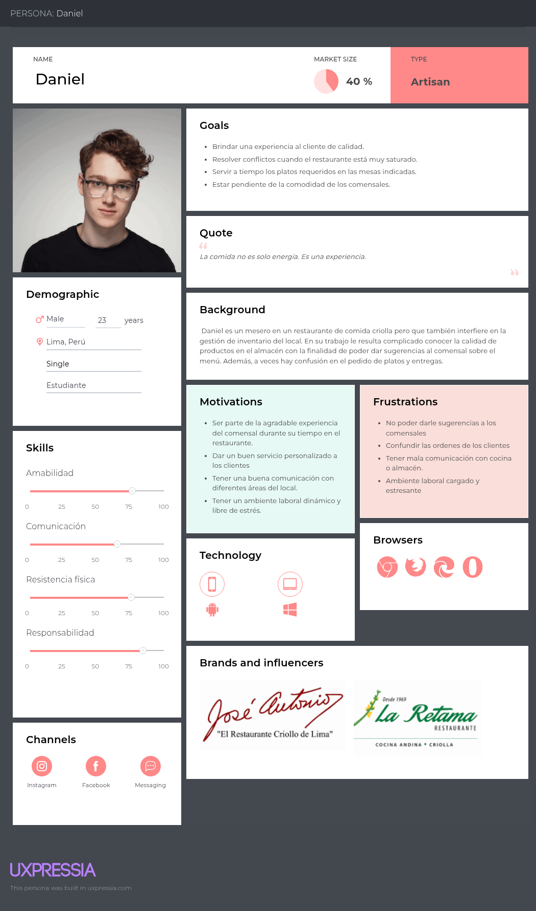

<p align="center" id="caratula">
    <strong>Universidad Peruana de Ciencias Aplicadas</strong><br>
    <br>
    <strong>Ingeniería de Software</strong><br>
    <strong>Aplicaciones Web - SV51</strong><br>
    <strong>Profesor: Angel Augusto Velasquez Nuñez</strong><br><br>
    INFORME TB2
</p>

<p align="center">
    <strong>StartUp: ClearView</strong><br>
    <strong>Product: KeepItFresh</strong>
</p>

<h3 align="center">Integrantes:</h3>

<table style="margin-left:auto; margin-right:auto;">
    <tr>
        <th style="text-align:center;">Integrante</th>
        <th style="text-align:center;">Código</th>
    </tr>
    <tr>
        <td style="text-align:center;">Briceño Llanos, Ayrton Omar</td>
        <td style="text-align:center;">U202311077</td>
    </tr>
    <tr>
        <td style="text-align:center;">Guia Carrasco, Pedro Andre</td>
        <td style="text-align:center;">U202212010</td>
    </tr>
    <tr>
        <td style="text-align:center;">Lang Nassi, Werner Khalil</td>
        <td style="text-align:center;">U202212010</td>
    </tr>
    <tr>
        <td style="text-align:center;">Nakasone Gomes, Marco Antonio</td>
        <td style="text-align:center;">U202210790</td>
    </tr>
    <tr>
        <td style="text-align:center;">Rodas Sotomayor, Ernesto</td>
        <td style="text-align:center;">U202312443</td>
    </tr>
</table>

<p align="center">
    <strong>Abril 2025</strong>
</p>

# Registro de Versiones del Informe

| Version | Fecha      | Autor           | Descripción de Modificación |
|---------|------------|-----------------|-----------------------------|
| 1.0     | 04/04/2025 | Grupo ClearView | Desarrollo de TB1           |
| 2.0     | 28/04/2025 | Grupo ClearView | Corrección de TB1           |
| 3.0     | 13/05/2025 | Grupo ClearView | Desarrollo de TP            |
| 4.0     | 18/06/2025 | Grupo ClearView | Desarrollo de TB2           |

# Project Report Collaboration Insights
Analiza cómo la colaboración y la gestión de tareas influyeron en los resultados del proyecto, destacando fortalezas y áreas de mejora para optimizar futuras estrategias.

Reporte: https://github.com/UPC-PRE-202501-1ASI0730-4350-ClearView/KeepItFresh-project-report

Organización:  https://github.com/orgs/UPC-PRE-202501-1ASI0730-4350-ClearView/repositories

Landing Page: https://upc-pre-202501-1asi0730-4350-clearview.github.io/KeepItFresh-landing-page/

TB1: El equipo entero participó en el desarrollo del sistema, asignando las tareas de manera equitativa entre todos. También trabajamos juntos en aspectos esenciales, como las entrevistas con usuarios y el diseño de la página de inicio. Este método integral y colaborativo nos permitió asegurar calidad y eficiencia durante todas las fases del proyecto.  

* Cada miembro redactó y organizó sus contenidos en formato Markdown, haciendo commits para garantizar el progreso en el repositorio.
* Se crearon los artefactos necesarios usando las herramientas recomendadas y se obtuvieron enlaces de imagen desde la carpeta "assets" en la rama develop del repositorio del informe.
* Se programaron reuniones para coordinar el avance de los elementos del informe y comunicar los logros del Sprint 1, centrado en la página de inicio. 


TP: Se completaron las tareas previstas para la entrega del TP, y se documentaron de manera adecuada en el repositorio de GitHub del equipo.

* Los contenidos asignados a cada miembro se redactaron y organizaron en formato Markdown, realizando commits para garantizar el seguimiento del avance en el repositorio.
* Se crearon los artefactos necesarios utilizando las herramientas sugeridas.
* Se realizaron reuniones para coordinar el progreso de los elementos del informe y compartir los avances del Sprint 2, enfocado en el desarrollo de la aplicación web.


TB2: Las tareas asignadas para la entrega del TB2 se completaron y se documentaron adecuadamente en el repositorio de GitHub del equipo.

* Los contenidos asignados a cada integrante fueron preparados y estructurados en formato Markdown.
* Se realizaron commits para garantizar el seguimiento del progreso en el repositorio.
* Se crearon los artefactos necesarios utilizando las herramientas recomendadas.
* Se mantuvieron reuniones para coordinar el avance de los componentes del informe.


# Contenido
[Registro de Versiones del Informe](#registro-de-versiones-del-informe)  
[Project Report Collaboration Insights](#project-report-collaboration-insights)  
[Student Outcome](#student-outcome)  

[Capítulo I: Introducción](#capítulo-i-introducción)

[1.1 Startup Profile](#11-startup-profile)  
[1.1.1. Descripción de la Startup](#111-descripción-de-la-startup)  
[1.1.2. Perfiles de integrantes del equipo](#112-perfiles-de-integrantes-del-equipo)  

[1.2. Solution Profile](#12-solution-profile)  
[1.2.1 Antecedentes y problemática](#121-antecedentes-y-problemática)  
[1.2.2 Lean UX Process.](#122-lean-ux-process)  
[1.2.2.1. Lean UX Problem Statements.](#1221-lean-ux-problem-statements)  
[1.2.2.2. Lean UX Assumptions.](#1222-lean-ux-assumptions)  
[1.2.2.3. Lean UX Hypothesis Statements.](#1223-lean-ux-hypothesis-statements)  
[1.2.2.4. Lean UX Canvas.](#1224-lean-ux-canvas)  

[1.3. Segmentos objetivo.](#13-segmentos-objetivo)  

[Capítulo II: Requirements Elicitation & Analysis](#capítulo-ii-requirements-elicitation--analysis)  

[2.1. Competidores](#21-competidores)  
[2.1.1. Análisis competitivo](#211-análisis-competitivo)  
[2.1.2. Estrategias y tácticas frente a competidores](#211-análisis-competitivo)  

[2.2. Entrevistas](#22-entrevistas)  
[2.2.1. Diseño de entrevistas](#221-diseño-de-entrevistas)  
[2.2.2. Registro de entrevistas](#222-registro-de-entrevistas)  
[2.2.3. Análisis de entrevistas](#223-análisis-de-entrevistas)  

[2.3. Needfinding](#23-needfinding)  
[2.3.1. User Personas](#231-user-personas)  
[2.3.2. User Task Matrix](#232-user-task-matrix)  
[2.3.3. User Journey Mapping](#233-user-journey-mapping)  
[2.3.4. Empathy Mapping](#234-empathy-mapping)  
[2.3.5. As-is Scenario Mapping](#235-as-is-scenario-mapping) 

[2.4. Ubiquitous Language](#24-ubiquitous-language)  

[Capítulo III: Requirements Specification](#capítulo-iii-requirements-specification)  

[3.1. To-Be Scenario Mapping](#31-to-be-scenario-mapping)    
[3.2. User Stories](#32-user-stories)  
[3.3. Impact Mapping](#33-impact-mapping)  
[3.4. Product Backlog](#34-product-backlog)  

[Capítulo IV: Product Design](#capítulo-iv-product-design)  

[4.1. Style Guidelines.](#41-style-guidelines)  
[4.1.1. General Style Guidelines.](#411-general-style-guidelines)  
[4.1.2. Web Style Guidelines.](#412-web-style-guidelines)  

[4.2. Information Architecture.](#42-information-architecture)  
[4.2.1. Organization Systems.](#421-organization-systems)  
[4.2.2. Labeling Systems.](#422-labeling-systems)  
[4.2.3. SEO Tags and Meta Tags.](#423-seo-tags-and-meta-tags)  
[4.2.4. Searching Systems.](#424-searching-systems)  
[4.2.5. Navigation Systems.](#425-navigation-systems)  

[4.3. Landing Page UI Design.](#43-landing-page-ui-design)  
[4.3.1. Landing Page Wireframe.](#431-landing-page-wireframe)  
[4.3.2. Landing Page Mock-up.](#432-landing-page-mock-up)  

[4.4. Web Applications UX/UI Design.](#44-web-applications-ux-ui-design)  
[4.4.1. Web Applications Wireframes.](#441-web-applications-wireframes)  
[4.4.2. Web Applications Wireflow Diagrams.](#442-web-applications-wireflow-diagrams)  
[4.4.3. Web Applications Mock-ups.](#443-web-applications-mock-ups)  
[4.4.4. Web Applications User Flow Diagrams.](#444-web-applications-user-flow-diagrams)  

[4.5. Web Applications Prototyping.](#45-web-applications-prototyping)  

[4.6. Domain-Driven Software Architecture.](#46-domain-driven-software-architecture)  
[4.6.1. Software Architecture Context Diagram.](#461-software-architecture-context-diagram)  
[4.6.2. Software Architecture Container Diagrams.](#462-software-architecture-container-diagrams)  
[4.6.3. Software Architecture Components Diagrams.](#463-software-architecture-components-diagrams)  

[4.7. Software Object-Oriented Design.](#47-software-object-oriented-design)  
[4.7.1. Class Diagrams.](#471-class-diagrams)  
[4.7.2. Class Dictionary.](#472-class-dictionary)  

[4.8. Database Design.](#48-database-design)  
[4.8.1. Database Diagram.](#481-database-diagram)  

[Capítulo V: Product Implementation, Validation & Deployment](#capítulo-v-product-implementation-validation-deployment)  

[5.1. Software Configuration Management.](#51-software-configuration-management) 

[5.1.1. Software Development Environment Configuration.](#511-software-development-environment-configuration)  
[5.1.2. Source Code Management.](#512-source-code-management)  
[5.1.3. Source Code Style Guide & Conventions.](#513-source-code-style-guide--conventions)                  
[5.1.4. Software Deployment Configuration.](#514-software-deployment-configuration)  

[5.2. Landing Page, Services & Applications Implementation.](#52-landing-page-services--applications-implementation)

[5.2.1. Sprint 1](#521-sprint-1)  
[5.2.1.1. Sprint Planning 1](#5211-sprint-planning-1)  
[5.2.1.2. Aspect Leaders and Collaborators 1](#5212-aspect-leaders-and-collaborators)  
[5.2.1.3. Sprint Backlog 1](#5213-sprint-backlog-1)  
[5.2.1.4. Development Evidence for Sprint Review.](#5214-development-evidence-for-sprint-review)  
[5.2.1.5. Execution Evidence for Sprint Review.](#5215-execution-evidence-for-sprint-review)  
[5.2.1.6. Services Documentation Evidence for Sprint Review.](#5216-services-documentation-evidence-for-sprint-review)  
[5.2.1.7. Software Deployment Evidence for Sprint Review.](#5217-software-deployment-evidence-for-sprint-review)  
[5.2.1.8. Team Collaboration Insights during Sprint.](#5218-team-collaboration-insights-during-sprint)

[5.2.2. Sprint 2](#522-sprint-2)  
[5.2.2.1. Sprint Planning 2](#5221-sprint-planning-2)  
[5.2.2.2. Aspect Leaders and Collaborators 2](#5222-aspect-leaders-and-collaborators)  
[5.2.2.3. Sprint Backlog 2](#5223-sprint-backlog-2)  
[5.2.2.4. Development Evidence for Sprint Review.](#5224-development-evidence-for-sprint-review)  
[5.2.2.5. Execution Evidence for Sprint Review.](#5225-execution-evidence-for-sprint-review)  
[5.2.2.6. Services Documentation Evidence for Sprint Review.](#5226-services-documentation-evidence-for-sprint-review)  
[5.2.2.7. Software Deployment Evidence for Sprint Review.](#5227-software-deployment-evidence-for-sprint-review)  
[5.2.2.8. Team Collaboration Insights during Sprint.](#5228-team-collaboration-insights-during-sprint)

[5.2.3. Sprint 3](#523-sprint-3)  
[5.2.3.1. Sprint Planning 3](#5231-sprint-planning-3)  
[5.2.3.2. Aspect Leaders and Collaborators 3](#5232-aspect-leaders-and-collaborators)  
[5.2.3.3. Sprint Backlog 3](#5233-sprint-backlog-3)  
[5.2.3.4. Development Evidence for Sprint Review.](#5234-development-evidence-for-sprint-review)  
[5.2.3.5. Execution Evidence for Sprint Review.](#5235-execution-evidence-for-sprint-review)  
[5.2.3.6. Services Documentation Evidence for Sprint Review.](#5236-services-documentation-evidence-for-sprint-review)  
[5.2.3.7. Software Deployment Evidence for Sprint Review.](#5237-software-deployment-evidence-for-sprint-review)  
[5.2.3.8. Team Collaboration Insights during Sprint.](#5238-team-collaboration-insights-during-sprint)

[5.3. Validation Interviews.](#53-validation-interviews)
[5.3.1. Diseño de Entrevistas.](#531-diseño-de-entrevistas)
[5.3.2. Registro de Entrevistas.](#532-registro-de-entrevistas)
[5.3.3. Evaluaciones segun heuristicas.](#533-evaluaciones-según-heurísticas)
[5.4. Video About-the-Product.](#54-video-about-the-product)

[Conclusiones](#conclusiones)  
[Conclusiones y recomendaciones.](#conclusiones-y-recomendaciones)  
[Video About-the-Team.](#video-about-the-team)  

[Bibliografía](#bibliografía)  

[Anexos](#anexos)

# Student Outcome

El curso contribuye al cumplimiento del **Student Outcome ABET:ABET – EAC - Student Outcome 5**  
**Criterio:** La capacidad de funcionar efectivamente en un equipo cuyos miembros juntos proporcionan liderazgo, crean un entorno de colaboración e inclusivo, establecen objetivos, planifican tareas y cumplen objetivos.

| Criterio Específico                                                                            | Acciones Realizadas                                                                                                                                                                                                                                                                                                                                                                                                                                                                                                                                                                                                                                                                                                                                                                                                                                                                                                                                                                                                                                                                                                                                                                                                                                                                                                                                                                                                                                                                                                                                                                                                                                                                                                                                                                                                                                                                                                                                                                                                                                                                                                                                                                                                                                                                                                                                                                                                                                                                                                                                                                                                                                                                                                                                                                                                                                                                                                                                                                                                                                                                                                                                                                                                                                                                                                                                                                                                                                                                                                                                                                                                                                                                                                                                                                                                                                                                                                                                                                                                                                                                                                                                                                                                                                                                                                                                                                                                                                                                                                                                                                                                                                                                                                                                                                                                                                                                                                                                                                                                                                                                                                                                                                                                                                                                                                                                                                                                                                                                                                                                                                                                                                                                                                                                                                                                                                                                       | Conclusiones                                                                                                                                                                                                                                                                                                                                                                                                                                                                                                                                                                                                                                                                                                                                                                                                                                                                                                                                                                                                                                                                                                                                                                                                                                                                                                                                                                                                       |
|------------------------------------------------------------------------------------------------|-------------------------------------------------------------------------------------------------------------------------------------------------------------------------------------------------------------------------------------------------------------------------------------------------------------------------------------------------------------------------------------------------------------------------------------------------------------------------------------------------------------------------------------------------------------------------------------------------------------------------------------------------------------------------------------------------------------------------------------------------------------------------------------------------------------------------------------------------------------------------------------------------------------------------------------------------------------------------------------------------------------------------------------------------------------------------------------------------------------------------------------------------------------------------------------------------------------------------------------------------------------------------------------------------------------------------------------------------------------------------------------------------------------------------------------------------------------------------------------------------------------------------------------------------------------------------------------------------------------------------------------------------------------------------------------------------------------------------------------------------------------------------------------------------------------------------------------------------------------------------------------------------------------------------------------------------------------------------------------------------------------------------------------------------------------------------------------------------------------------------------------------------------------------------------------------------------------------------------------------------------------------------------------------------------------------------------------------------------------------------------------------------------------------------------------------------------------------------------------------------------------------------------------------------------------------------------------------------------------------------------------------------------------------------------------------------------------------------------------------------------------------------------------------------------------------------------------------------------------------------------------------------------------------------------------------------------------------------------------------------------------------------------------------------------------------------------------------------------------------------------------------------------------------------------------------------------------------------------------------------------------------------------------------------------------------------------------------------------------------------------------------------------------------------------------------------------------------------------------------------------------------------------------------------------------------------------------------------------------------------------------------------------------------------------------------------------------------------------------------------------------------------------------------------------------------------------------------------------------------------------------------------------------------------------------------------------------------------------------------------------------------------------------------------------------------------------------------------------------------------------------------------------------------------------------------------------------------------------------------------------------------------------------------------------------------------------------------------------------------------------------------------------------------------------------------------------------------------------------------------------------------------------------------------------------------------------------------------------------------------------------------------------------------------------------------------------------------------------------------------------------------------------------------------------------------------------------------------------------------------------------------------------------------------------------------------------------------------------------------------------------------------------------------------------------------------------------------------------------------------------------------------------------------------------------------------------------------------------------------------------------------------------------------------------------------------------------------------------------------------------------------------------------------------------------------------------------------------------------------------------------------------------------------------------------------------------------------------------------------------------------------------------------------------------------------------------------------------------------------------------------------------------------------------------------------------------------------------------------------------------------------|--------------------------------------------------------------------------------------------------------------------------------------------------------------------------------------------------------------------------------------------------------------------------------------------------------------------------------------------------------------------------------------------------------------------------------------------------------------------------------------------------------------------------------------------------------------------------------------------------------------------------------------------------------------------------------------------------------------------------------------------------------------------------------------------------------------------------------------------------------------------------------------------------------------------------------------------------------------------------------------------------------------------------------------------------------------------------------------------------------------------------------------------------------------------------------------------------------------------------------------------------------------------------------------------------------------------------------------------------------------------------------------------------------------------|
| Trabaja en equipo para proporcionar liderazgo en forma conjunta                                | **TB1: Marco Nakasone:**<br>En esta entrega, me encargué de desarrollar la Landing Page usando HTML, CSS y JavaScript. Mi rol fue asegurar que la página fuera atractiva y responsive en diferentes dispositivos. Trabajé de cerca con el equipo, promoviendo la comunicación y coordinando tareas para que todos estuvieran alineados con los objetivos del proyecto. Así, conseguimos avanzar juntos, compartiendo ideas y soluciones para enfrentar los desafíos.<br><br>**TP: Marco Nakasone:** He desarrollado mi liderazgo colaborativo al trabajar junto con mis compañeros en el diseño y programación de la Landing Page. Tomé decisiones en conjunto, promoví la coordinación y mantuve al equipo enfocado en las metas visuales del proyecto.<br>**TB2: Marco Nakasone:**<br>Para esta entrega siento que he mejorado de alguna u otra menera el liderazgo ya que cada uno fue el encargado de hacer una parte crucial del proyecto proporcionando organización y liderazgo en esa parte en especifico. <br><br>**TB1: Werner Lang:**<br>En esta entrega me encargué de diseñar los User y technical stories, además de los wireframes y mockups. Trabajé junto con el equipo en diversos objetivos, promoviendo la cooperación y coordinación. Gracias a esto logramos nuestros objetivos de forma conjunta y apoyándonos como equipo.<br><br>**TP: Werner Lang:** En esta entrega logré trabajar en forma conjunta con el equipo, organizándonos y designando encargados de diferentes bounded context que lideren el desarrollo del mismo. Gracias a esto logré completar el bounded context designado y así mismo colaborar de forma eficaz en los otros.<br><br>**TB2 Werner Lang:** Durante esta entrega, fortalecí mi capacidad de liderazgo compartido al coordinar el desarrollo del bounded context de Orders junto con el equipo.  Promoví reuniones regulares de sincronización donde cada miembro podía expresar sus ideas y preocupaciones técnicas. Gracias a este enfoque colaborativo, no solo completamos exitosamente nuestro bounded context, sino que también apoyamos activamente a otros miembros del equipo en la resolución de desafíos técnicos, demostrando que el liderazgo efectivo surge de la colaboración y el apoyo mutuo. <br> <br> **TB1: Pedro Guia:** En esta entrega me encargué de realizar el capítulo 5 sobre el Sprint 1 y además diseñé la base de datos de nuestro proyecto. Gracias a esto logramos un objetivo que es la colaboración de trabajo en equipo.<br><br>**TP: Pedro Guia:** Demostré capacidad para integrarme en equipos de trabajo, asumiendo roles y responsabilidades de forma equitativa, promoviendo una comunicación efectiva y aportando en la toma de decisiones grupales.<br>**TB2: Pedro Guia:**<br>En esta entrega he notado un crecimiento en mi capacidad de liderazgo, ya que logramos distribuir responsabilidades de forma equitativa y eficiente. Cada integrante asumió el liderazgo en una parte fundamental del proyecto, lo que permitió una mejor organización y colaboración. Esta dinámica fortaleció el trabajo en equipo y demostró que el liderazgo también consiste en saber confiar y coordinar con otros.<br><br>**TB1: Ernesto Rodas:**<br>En esta entrega participé activamente en el desarrollo del proyecto Keep It Fresh, colaborando en el diseño de los wireframes y en la definición de criterios de experiencia de usuario (UX) para asegurar una interfaz funcional y centrada en las necesidades del usuario. Además, contribuí en la elaboración de la presentación en PowerPoint, estructurando los contenidos y apoyando en la organización visual de las ideas, cooperando y promoviendo el trabajo en equipo.<br><br>**TP: Ernesto Rodas:** Fortalecí mi capacidad para asumir liderazgo compartido, promoviendo el diálogo y la coordinación entre los miembros del equipo durante el desarrollo del módulo de inventario y la estructuración de entregables clave.<br><br>**TB1: Ayrton Briceño:**<br>En esta entrega realicé las epic stories, user y technical stories junto con mi compañero Werner, además del análisis competitivo de la empresa y el product backlog. También aporté con las entrevistas y con el To-be scenario mapping. Ayudé a todos los integrantes del equipo a coordinarse mejor y también en sus tareas para avanzar juntos como equipo.<br><br>**TP: Ayrton Briceño:** He desarrollado mi capacidad de liderazgo compartido al trabajar en equipo, tomando la iniciativa cuando fue necesario y apoyando a mis compañeros para tomar decisiones de forma conjunta, lo que fortaleció la cohesión del grupo y mejoró significativamente nuestros resultados. <br><br> **TB2:** Ayrton Omar Briceño Llanos: En esta entrega, ejercí un rol activo en el trabajo en equipo al liderar y colaborar de manera conjunta con mis compañeros en el desarrollo del proyecto. Como responsable del bounded context de Profile, no solo cumplí con mis tareas técnicas, sino que también apoyé a otros integrantes para que cumplan con sus entregables, resolviendo dudas y proponiendo soluciones. Fomenté una dinámica en la que todos pudimos aportar y avanzar hacia un objetivo común: desarrollar KeepItFresh de forma eficiente y cumpliendo con los criterios del project statement.<br>                                                                                                                                                                                                                                                                                                                                                                                                                                                                                                                                                 | **TB1:** Asumo un rol activo dentro del equipo, promoviendo la participación equitativa y el cumplimiento de metas comunes. Coordino acciones con mis compañeros, distribuyendo responsabilidades de manera justa y fomentando un ambiente de respeto y colaboración. Ejercito el liderazgo compartido, guiando y apoyando al grupo en la toma de decisiones y en la resolución de problemas de forma conjunta.<br><br>**TP:** Asumimos roles de liderazgo compartido de manera activa y responsable, facilitando la toma de decisiones colectivas, el cumplimiento de metas y el fortalecimiento de la colaboración dentro del equipo. Esto permitió ejecutar el proyecto de forma estratégica y efectiva. <br> <br> **TB2:** Durante esta entrega, se evidenció un trabajo en equipo sólido, basado en la colaboración, el liderazgo compartido y el respeto mutuo. Cada integrante asumió un rol activo en la toma de decisiones, contribuyendo al liderazgo conjunto y al fortalecimiento del grupo. Se promovió un ambiente inclusivo donde todas las voces fueron escuchadas y valoradas, lo cual permitió establecer metas claras, planificar tareas de manera eficiente y avanzar con responsabilidad hacia los objetivos planteados. La coordinación, el compromiso y la comunicación constante fueron fundamentales para lograr una experiencia de trabajo productiva y equilibrada para todo el equipo. |
| Crea un entorno colaborativo e inclusivo, establece metas, planifica tareas y cumple objetivos | **TB1: Marco Nakasone:**<br>En esta entrega, me aseguré de que todos los miembros del equipo tuvieran un espacio para compartir sus ideas y aportar soluciones. Establecimos metas claras y realistas, dividiendo las tareas en partes específicas para cada uno. Yo me encargué de la Landing Page, planificando las etapas de desarrollo y asegurándome de que el equipo estuviera al tanto de los avances. Fomenté una comunicación constante para resolver problemas rápidamente, asegurándonos de cumplir los objetivos del proyecto de manera eficiente.<br><br>**TP: Marco Nakasone:** Me aseguré de que todos los miembros del equipo pudieran expresarse libremente. A través de reuniones constantes, definimos objetivos y tareas según nuestras fortalezas, logrando una ejecución efectiva.<br><br>**TB2: Marco Nakasone**<br>Gracias a la ayuda de alguna herramientas como Trello que nos ayudo a organizar de manera mas eficiente nuestro trabajo pudiendo marcar objetivos, siento que adquiri un nuevo conocimiento para poder mejorar tanto mi habilidad colaborativa como la organizativa.<br><br>**TB1: Werner Lang:**<br>En esta entrega, todos los integrantes del equipo colaboraron en la mayor parte del entregable y aportaron ideas para diversos objetivos. Nos establecimos objetivos claros y coordinamos de forma eficaz nuestros tiempos para avanzar en conjunto. Por mi parte me encargué de la introducción, user stories y wireframes, planificando y colaborando con otros compañeros en todas las partes del documento. Tuvimos una comunicación constante lo cual nos permitió cumplir nuestros objetivos propuestos de forma eficiente.<br><br>**TP: Werner Lang:** Establecí metas propias y planifiqué mi trabajo para terminar de forma organizada y facilitar la colaboración de mis compañeros en el bounded context designado. Gracias a esto, el desarrollo del front end se integró de forma coherente al resto del sistema.<br><br>**TB2 Werner Lang:**Durante esta segunda entrega, me dediqué a fortalecer la cultura colaborativa del equipo mediante la implementación de prácticas ágiles efectivas. Promovemos retrospectivas regulares donde reflexionábamos sobre nuestros procesos y identificábamos oportunidades de mejora. Esta aproximación sistemática nos permitió no solo cumplir con los entregables técnicos, sino también crear un ambiente de aprendizaje continuo donde cada miembro del equipo pudo desarrollar nuevas competencias mientras contribuía al objetivo común.<br><br> **TB1: Pedro Guia:**<br>En esta entrega todos los integrantes del equipo colaboraron en la mayor parte del entregable y aportaron ideas para diversos objetivos. Nos establecimos objetivos claros y coordinamos de forma eficaz nuestros tiempos para avanzar en conjunto. Por mi parte realicé el startup profile, needfinding, diagrama de base de datos y gran parte del sprint 1.<br><br>**TP: Pedro Guia:** Lideré y colaboré en equipo para alcanzar metas comunes, aplicando principios de liderazgo compartido, gestionando conflictos, delegando responsabilidades y garantizando el cumplimiento de los objetivos del proyecto.<br><br>**TB1: Ernesto Rodas:**<br>En esta entrega, procuré que todos los miembros del equipo contaran con un espacio abierto para expresar sus ideas, participar activamente y proponer soluciones. Establecimos metas claras desde el inicio y dividimos las tareas de manera equitativa, respetando las fortalezas de cada integrante. Promoví una comunicación fluida durante todo el proceso, lo que nos permitió resolver dificultades con agilidad, mantenernos alineados en nuestras decisiones y avanzar de forma cohesionada. Gracias a esta dinámica colaborativa, logramos cumplir los objetivos planteados con eficiencia y compromiso conjunto.<br><br>**TP: Ernesto Rodas:** Promoví un entorno de comunicación fluida y planificación coordinada, asignando responsabilidades en función de las fortalezas del equipo, lo que permitió un trabajo sincrónico y una ejecución ágil de las funcionalidades del inventario.<br>**TB2: Pedro Guia**<br>El uso de herramientas como Trello fue clave para optimizar la organización de nuestro trabajo. Gracias a su funcionalidad para asignar tareas y visualizar avances, pude fortalecer mis habilidades de organización y mejorar la colaboración con mi equipo. Esta experiencia me permitió adquirir nuevos conocimientos sobre cómo estructurar mejor el trabajo en grupo y cumplir objetivos de manera más clara y eficiente.<br><br>**TB1: Ayrton Briceño:**<br>En esta entrega, logré que todos los miembros del equipo participaran activamente en el proyecto. Además fomenté un ambiente de amistad y compañerismo entre todos. Avancé con las epics, user y technical stories. Ayudé a mi equipo en todo momento avanzando juntos y de esta manera cumplimos todas nuestras metas.<br><br>**TP: Ayrton Briceño:** He logrado fomentar un entorno de trabajo colaborativo e inclusivo, donde todos los miembros del equipo se sintieron escuchados y valorados. Gracias a una planificación clara y metas bien definidas, pude contribuir activamente al cumplimiento de los objetivos propuestos dentro de los plazos establecidos.<br><br> TB2:Ayrton Omar Briceño Llanos: En esta entrega, me esforcé por crear un entorno de trabajo colaborativo e inclusivo, donde todos los integrantes del equipo pudieran participar activamente. Utilicé herramientas como Trello y GitHub Projects para organizar y planificar tareas, establecer metas claras y hacer seguimiento del avance del equipo. A través de esta planificación conjunta, logramos cumplir los objetivos de la entrega a tiempo, manteniendo una comunicación constante y un ambiente de apoyo mutuo entre todos los miembros.<br><br> | **TB1:** Fomento un ambiente de respeto y apertura, donde todas las voces son escuchadas y valoradas. Defino metas claras junto al equipo, organizo las tareas de manera eficiente y doy seguimiento al progreso para asegurar el cumplimiento de los objetivos. Me adapto a las necesidades del grupo, promoviendo siempre la inclusión y el trabajo en conjunto.<br><br>**TP:** Establecimos un entorno de trabajo donde la planificación, la inclusión y la coordinación fueron claves para avanzar con claridad y responsabilidad. Logramos cumplir los objetivos asignados y promover una experiencia de colaboración efectiva para todos los integrantes.<br> <br> **TB2:** A lo largo de esta entrega, se demostró la capacidad de crear un entorno colaborativo e inclusivo, donde cada miembro del equipo pudo participar activamente y sentirse valorado. Se establecieron metas claras desde el inicio, acompañadas de una planificación estructurada que permitió distribuir tareas de forma equitativa y eficiente. Gracias a una comunicación constante y una coordinación adecuada, se logró cumplir con los objetivos propuestos, manteniendo siempre un ambiente de respeto, compromiso y trabajo en equipo.                                                                                                                                                                                      |

# Capítulo I: Introduccion
## 1.1. Startup Profile

### 1.1.1. Descripción de la Startup

ClearView es una startup dedicada a soluciones digitales enfocadas en restaurantes. Utilizamos tecnologías IoT para agilizar la gestión de restaurantes. Nuestro enfoque es preventivo, proporcionando sensores y herramientas para evitar problemas tales como la desposesión de alimentos. No ofrecemos servicios de intervención, ni de acción inmediata.

***Mision:***
Facilitar la gestión de los restaurantes a través de tecnologías las cuales permiten el monitoreo continuo del restaurante, al igual que optimizan la atención de los trabajadores, para que estos puedan ofrecer un mejor servicio a sus consumidores.

***Visión:***
Ser la empresa más importante en Perú, en el ámbito de gestión y optimización de restaurantes con el uso de soluciones tecnológicas.

### 1.1.2. Perfiles de integrantes del equipo

|                                | Apellido y Nombre               | Carrera                | Acerca de                                                                                                                                                                                                                                                                                                                                                                      | Habilidades                                                                                             |
|--------------------------------|---------------------------------|------------------------|--------------------------------------------------------------------------------------------------------------------------------------------------------------------------------------------------------------------------------------------------------------------------------------------------------------------------------------------------------------------------------|---------------------------------------------------------------------------------------------------------|
|   | Briceño Llanos, Ayrton Omar | Ingeniería de Software | Soy Ayrton Briceño. Me apasiona el desarrollo de Software y la creación de soluciones tecnológicas que impacten positivamente en las personas | JavaScript, CSS, C#, HTML, Java, SQL Server, MongoDB |
|   | Guia Carrasco, Pedro Andre | Ingeniería de Software | Soy Pedro Guia, estudiante de la UPC. Estoy llevando mi cuarto año en la universidad y sigo firme a mis logros a futuro. | Java, Python, HTML, CSS, JavaScript, Angular, MySQL |
|  | Lang Nassi, Werner Khalil | Ingeniería de Software | Estudiante de la Universidad Peruana de Ciencias Aplicadas (UPC), cursando en 5.º ciclo. Soy un estudiante que le gusta investigar cosas nuevas. | Java, JavaScript, C++, C#, SQL sever, Python, CSS, HTML|
|   | Nakasone Gomes, Marco Antonio | Ingeniería de Software | Soy estudiante de Ingeniería de software, tengo cualidades como la perseverancia, que me va a ayudar a ser resiliente ante cualquier adversidad que se nos presente más adelante en el trabajo y tambien soy buen compañero de trabajo que siempre quiere lo mejor para su grupo. | Java, Python, HTML, CSS, JS, MySQL |
|  | Rodas Sotomayor, Ernesto | Ingeniería de Software | Mi nombre es Ernesto Rodas, me apasiona la tecnología, el desarrollo de sistemas y la innovación en soluciones digitales. | Java, Python y JavaScript. (MySQL) y NoSQL (MongoDB). |

## 1.2. Solution Profile

Product Name: KeepItFresh

Description: KeepItFresh, es una Web App que tiene como objetivo optimizar la gestión de los restaurantes. Para ello, esta permite al usuario monitorear los IoT que este tiene, mostrando información útil, ayudando con la gestión de inventarios y agilizando el trabajo de los trabajadores en la tienda. Los dueños de los restaurantes pueden usar KeepItFresh con el fin de optimizar varios procesos.

Monetización: KeepItFresh funciona mediante un modelo de suscripción mensual o anual, en el cual se alquilan los diferentes dispositivos IoT.

### 1.2.1. Antecedentes y problemática
**Antecedentes:**


Estudios recientes han analizado los factores que impulsan el desperdicio de alimentos en restaurantes informales de gama media, diferenciado entre el desperdicio generado por el cliente y el generado en la cocina. Una investigación en destinos turísticos de Lituania (Morkunas et al, 2025), empleo entrevistas con gerentes y un Proceso Analítico Jerárquico (AHP) difuso para priorizar las causas, revelando hallazgos clave:

* Cliente: Destacaron el sentimiento de vergüenza, barrera lingüística, presentación inadecuada de platos tradicionales, tanto en destinos locales e internacionales.

* Cocina: Asociado a fallas en la planificación de demanda, ineficiencias operativas y limitaciones en infraestructura de almacenamiento.

Dicho estudio, propone soluciones adaptadas a cada factor identificado, ofreciendo un marco relevante para abordar problemáticas similares en contextos gastronómicos. 

**Problematicas:**

La gestión del inventario de un restaurante suele llegar a consumir muchos recursos y tiempo. Además también es muy complicado estar al tanto de la fecha de vencimiento por producto, al igual que la temperatura idónea de los mismos. También cuando un restaurante tiene una gran cantidad de clientela se le suele dificultar a los mozos darse cuenta cuando un cliente requiere de atención.


**What**
* El problema es la mala gestión del inventario en los restaurantes, lo que genera desperdicio de alimentos y un alto consumo de recursos debido al vencimiento de productos y a la falta de control eficiente.Además, el personal de atención enfrenta dificultades para identificar cuándo un cliente requiere asistencia, lo que puede afectar la calidad del servicio y la experiencia del cliente.

**Why: ¿Por qué es importante que se gestione el inventario en los restaurantes?**
* La mala o dificultosa gestión de inventario en restaurantes se debe a la falta de herramientas adecuadas para monitorear y gestionar eficientemente el
inventario, así como a la falta de visibilidad y datos concretos sobre el estado de los productos.

**Who: ¿Quienes se ven afectados?**
* Los dueños o gerentes y trabajadores de un restaurante.

**When: ¿Cuándo sucede la problemática?**
* La problemática sucede en cualquier momento del día, ya que los restaurantes operan constantemente y deben gestionar su inventario y atención al cliente en todo momento.

**Where: ¿Dondé implementaríamos nuestra solución?**
* En restaurantes nacionales e internacionales.

**How: ¿Cómo ayudará nuestra solución?**

* KeepItFresh facilitará el proceso de gestión de inventario mediante el monitoreo de los mismos gracias a sus modernos sensores conectados a la app.

**How much: ¿Cúanto costará?**

* KeepItFresh tendrá el alcance de resolver esta problemática a todo aquel restaurante que compre sus servicios.

### 1.2.2. Lean UX Process
En esta sección se aplica el enfoque Lean UX para alinear el desarrollo del producto con las necesidades reales del
negocio y los usuarios. Se define la visión del modelo de negocio que respaldará el software, abarcando elementos 
clave como los Problem Statements (con información sobre el dominio, segmentos de clientes, puntos de dolor, brechas, 
visión y estrategia), así como las suposiciones (Assumptions) y las hipótesis (Hypothesis Statements) iniciales. 
La sección concluye con la elaboración del Lean UX Canvas, herramienta central para guiar el proceso iterativo
de diseño enfocado en generar valor desde las primeras etapas.

#### 1.2.2.1. Lean UX Problem Statements

En el entorno laboral actual, los restaurantes enfrentan dificultades para monitorear y gestionar su inventario de manera efectiva. Esto debido a la falta de herramientas adecuadas y el trabajo tedioso que esto suele ser, para hacerlo de forma continua y detallada. Lo cual da a una falta de visibilidad y datos concretos, lo cual lleva a gastos innecesarios con el inventario y posibilidad de descomposición de alimentos.<br>

El desafío que hay actualmente es que las soluciones actuales no proveen un precio accesible, al mismo tiempo que mantienen una alta calidad de servicio. Frente a esta problemática, planteamos a siguiente pregunta:<br>

¿Cómo podemos ofrecer a los restaurantes una plataforma con un precio accesible que al mismo tiempo ofrezca la calidad que estos necesitan?

#### 1.2.2.2. Lean UX Assumptions

<ins>**Users Assumptions:**</ins>

1. **Creo que mis clientes necesitan** una herramienta fácil de usar para la gestión de inventarios, la cual facilite sus funciones, identificando problemas tales como posible descomposición, o niveles no óptimos para la temperatura.
2. **Estas necesidades se pueden resolver con** una aplicación web como KeepItFresh, la cual ofrece una mayor facilidad para la gestión de inventarios de calidad, aun manteniendo un precio accesible.
3. **Mis clientes iniciales son** restaurantes medianos, tales como restaurantes de comida criolla y pollerías. Las cuales tengan problemas de gestión de inventarios y requieran una solución de alta calidad, pero no se pueden permitir gastos grandes.
4. **El valor #1 que un cliente quiere de mi servicio es** la capacidad de gestionar fácilmente el inventario de los restaurantes mediante sensores IoT en tiempo real.
5. **El cliente también puede obtener estos beneficios adicionales,** esto ayuda a que todos los productos del inventario sean bien utilizados a tiempo y no se malogren. Así mismo también contamos con otro IoT que consta de un botón para llamar a los meseros para mejorar la atención al cliente en los restaurantes.
6. **Voy a adquirir la mayoría de mis clientes a través de estrategias de** marketing digital y recomendaciones entre empresas que valoren la facilidad en gestión que ofrecemos.
7. **Haré dinero a través de** un modelo de suscripción mensual o anual para los diferentes IoT, lo cual le da al cliente la posibilidad de alquilar la cantidad que él requiere basado en su poder adquisitivo.
8. **Mi competencia principal en el mercado serán** otras plataformas de gestión de inventarios tales como MarketMan y OpenTable.
9. **Los venceremos debido a** que ofrecemos un servicio de alta calidad manteniendo los precios accesibles ofreciendo todas las funciones de la aplicación web desde un inicio mientras el cliente cuente con el IoT.
10. **Mi mayor riesgo de producto es** que los restaurantes no adopten fácilmente la tecnología IoT por falta de conocimientos técnicos.
11. **Resolveremos esto a través de** un proceso de onboarding intuitivo, soporte técnico constante, tutoriales interactivos y demostraciones en vivo que permitan a los usuarios entender y aprovechar los beneficios de nuestro servicio sin necesidad de conocimientos técnicos avanzados.
12. **¿Qué otras suposiciones tenemos? ¿Eso, si se prueba que es falso, causará que nuestro negocio/proyecto no funcione?**

- Los clientes están dispuestos a confiar en la certeza de nuestros IoT para gestionar los inventarios. Si los encargados creen que estos nos tienen una total certeza, podríamos tener dificultades para atraer usuarios.
- Los restaurantes asignarán presupuesto para herramientas IoT que ayuden con la gestión del restaurante. Si estos creen que este tipo de servicios es un lujo y no algo necesario, la propuesta que ofrecemos va a dejar de ser de valor para ellos.

**¿Quién es el usuario?**<br>

Dueños de restaurantes y meseros.

**¿Dónde encaja nuestro producto en su trabajo o vida?**<br>

Nuestro producto encaja en el trabajo diario de los usuarios, proporcionando herramientas útiles para la gestión de sus inventarios con el fin de facilitar su trabajo, así mismo facilita el trabajo de los meseros al recibir las llamadas de los clientes con una mayor facilidad.

**¿Qué problemas tiene nuestro producto y cómo se pueden resolver?**<br>

KeepItFresh puede enfrentar problemas tales como la falta de familiaridad de los usuarios con tecnologías IoT, desconfianza de la precisión de los sensores y la adaptación a diversos tipos de restaurantes. Para resolver estos problemas, se puede implementar un proceso de onboarding claro con tutoriales visuales y ofrecer un soporte técnico constante.

**¿Cuándo y cómo se usa el producto?**<br>

El producto se utilizará de manera diaria durante las horas operativas del restaurante, tanto en la gestión del inventario como la mejora de atención al cliente. Se accede a través de una aplicación web compatible con computadoras, tablets o smartphones, permitiendo el monitoreo en tiempo real. Además, durante el servicio, los meseros van a recibir notificaciones mediantes los botones IoT colocados en las mesas, lo que agiliza la atención al cliente y mejora su eficiencia en el trabajo.

**¿Qué características son importantes?**<br>


Entre las características más importantes de KeepItFresh se encuentra el monitoreo en tiempo real de sensores IoT, un panel de control intuitivo y visualmente claro, la integración sencilla con múltiples dispositivos y sensores, y la escalabilidad del servicio para adaptarse al crecimiento del restaurante.


**¿Cómo debe verse nuestro producto y cómo debe comportarse?**<br>
KeepItFresh debe tener un diseño visual moderno, limpio y profesional, con una paleta de colores que transmita frescura y confianza. La interfaz debe ser intuitiva, con una navegación fluida y amigable que permita al usuario encontrar con facilidad la información que necesita. Debe comportarse de forma estable y responsive, adaptándose sin dificultad a distintos tamaños de pantallas y dispositivos. La información debe de presentarse de forma clara, utilizando elementos como gráficos, iconos y colores para facilitar la interpretación de los datos.

<ins>**Business Outcomes:**</ins>
1. Al desarrollar KeepItFresh, prevemos un aumento en la cantidad de restaurantes con afinidad a nuestra plataforma, lo cual incrementará nuestras ventas y nos posicionará como una solución confiable en el mercado.
2. Generación de ingresos constantes y predecibles mediante el modelo de suscripción mensual o anual, lo cual facilita la proyección financiera a largo plazo.
3. Expansión del negocio hacia nuevos mercados y segmentos, como cadenas de restaurantes o franquicias, gracias a la escalabilidad de nuestro servicio.

<ins>**User Outcomes:**</ins>

1. Los usuarios podrán monitorear el estado de su inventario en tiempo real, lo que les permitirá tomar decisiones informadas y reducir el desperdicio de alimentos.
2. Los dueños de restaurantes tendrán una mayor tranquilidad al saber que los productos están siendo almacenados adecuadamente, minimizando pérdidas económicas.
3. La experiencia del cliente en el restaurante va a mejorar gracias al botón de llamado a meseros, agilizando la atención al cliente.

<ins>**Features:**</ins>

- Monitoreo en tiempo real de sensores IoT.
- Panel de control centralizado e intuitivo con una fácil navegación.
- Botón IoT para llamado de meseros que mejora la experiencia del cliente.
- Alertas automáticas cuando las condiciones del inventario están fuera del rango óptimo.
- Registro y consulta de inventario detallado
- Historial de alertas
- Medición del tiempo de respuesta de atencion al cliente
- Gestión de suscripcion y facturación
- Flujo de recepción y almacenamiento de inventario por el personal


#### 1.2.2.3. Lean UX Hypothesis Statements

1. Hipótesis 1: Creemos que al implementar el monitoreo continuo y en tiempo real del estado del inventario mediante sensores IoT, los dueños de restaurantes podrán tomar decisiones más informadas sobre el inventario, lo cual reducirá el desperdicio de alimentos y las pérdidas.

2. Hipótesis 2: Creemos que al ofrecer un panel de control centralizado e intuitivo con fácil navegación para dueños y personal, la plataforma será fácil de usar y mejorará la eficiencia general en la gestión de inventario y alertas.

3. Hipótesis 3: Creemos que al facilitar la atención al cliente mediante un botón IoT de llamado a meseros, los comensales solicitarán atención más fácilmente, lo cual disminuirá los tiempos de espera y generará una mejora en la experiencia y percepción del servicio por parte de los comensales.

4. Hipótesis 4: Creemos que al enviar alertas automáticas cuando las condiciones del inventario están fuera del rango óptimo, los dueños y el personal podrán reaccionar a tiempo ante condiciones críticas, lo cual prevenirá la descomposición y reducirá las pérdidas económicas.

5. Hipótesis 5: Creemos que al permitir a los dueños registrar y consultar inventario detallado (incluyendo vencimiento y condiciones de almacenamiento), tendrán mejor control sobre su stock y facilitarán una gestión más organizada del inventario.

6. Hipótesis 6: Creemos que al proporcionar a los dueños un historial de alertas pasadas, podrán entender los incidentes ocurridos en ciertos días, lo cual les permitirá mejorar la planificación y toma de decisiones futuras para prevenir problemas recurrentes.

7. Hipótesis 7: Creemos que al permitir a los administradores medir cuánto tiempo tarda el personal en atender una solicitud, podrán evaluar la eficiencia del servicio, lo cual contribuirá al objetivo de disminuir los tiempos de espera.

8. Hipótesis 8: Creemos que al implementar un sistema de gestión de suscripción y facturación, generaremos un flujo de ingresos seguro y predecible para ClearView, mientras los dueños gestionan de forma transparente su alquiler de servicio.

9. Hipótesis 9: Creemos que al proporcionar un flujo específico para que el personal registre y almacene inventario entrante, el proceso de actualización de stock será más eficiente y preciso para los trabajadores, lo cual reducirá su carga de trabajo y asegurará registros exactos en el sistema.

#### 1.2.2.4. Lean UX Canvas.


La imagen representa un UX Canvas del proyecto KeepItFresh, una herramienta estratégica que organiza de forma visual los elementos clave para diseñar una experiencia centrada en el usuario. El canvas parte del problema central del negocio —la mala gestión de inventarios en restaurantes medianos— y propone soluciones tecnológicas basadas en sensores IoT, alertas automáticas y control visual accesible, con beneficios tanto operativos como comerciales.

Se identifican claramente a los usuarios (dueños y trabajadores de restaurantes), junto con sus necesidades, beneficios esperados, hipótesis a validar, y acciones mínimas viables para probar la solución. Además, se abordan tanto los aprendizajes prioritarios como las pruebas de menor esfuerzo necesarias para iterar el producto. En conjunto, este canvas guía el desarrollo de KeepItFresh desde la empatía con el usuario hasta la validación del producto en contexto real.

## 1.3. Segmentos Objetivos

KeepItFresh es una plataforma enfocada en los dos segmentos clave dentro de un restaurante; Los dueños y trabajadores de los restaurantes. Estos dos grupos son los encargados principales en proveer la mejor experiencia posible al consumidor y de administrar el restaurante, por ello KeepItFresh se enfoca en proporcionarles soluciones inteligentes los cuales facilitan la labor de ambos segmentos.
- **Dueños:** KeepItFresh, está hecho con el fin de facilitar la gestión del inventario por parte de los dueños de los restaurantes, debido a que esta es una tarea de gran dificultad, puesto que se sabe que en el 2019 aproximadamente el 47,6% de los alimentos producidos son descompuestos.

- **Trabajadores:** KeepItFresh está pensado para apoyar a los trabajadores del restaurante en sus tareas diarias. La plataforma les permite registrar el uso de ingredientes, reportar productos en mal estado y recibir alertas sobre insumos próximos a vencer, todo de forma rápida y sencilla. Esto mejora la organización en cocina, reduce el desperdicio y garantiza la frescura de los alimentos. Además, su diseño intuitivo facilita el uso por parte del personal, optimizando la comunicación y el trabajo en equipo.

# Capitulo II: Requeriments Elicitation & Analysis

## 2.1. Competidores 
En esta sección se identifican y analizan los principales competidores del producto, considerando tanto 
competidores directos con modelos de negocio digitales similares como competidores indirectos, cuyas ofertas 
cubren parcialmente las mismas necesidades del mercado objetivo. Se describen al menos tres competidores, 
evaluando sus propuestas de valor, fortalezas, debilidades y su impacto en el posicionamiento del producto propio.

### 2.1.1. Análisis competitivo

| **Competitive Analysis Landscape**                                                                                                                                                                         |
|------------------------------------------------------------------------------------------------------------------------------------------------------------------------------------------------------------|
| **¿Por qué llevar a cabo el análisis?** El objetivo de este análisis es conocer las diferencias entre los competidores que hay en el mercado actual.                                                       |

| Categoría                | Elemento                                 | <br>**KeepItFresh**                                               | <br>**Restroworks**             | <br>**Odoo**                                   | <br>**SolverMedia**                     |
|-------------------------|------------------------------------------|------------------------------------------------------------------------------------------------|----------------------------------------------------------------------------|------------------------------------------------------------------------------|------------------------------------------------------------------------------------|
| **Perfil**              | Ventaja competitiva ¿Qué valor ofrece?   | Software inteligente de inventario, control de estado, conservación de alimentos y botón de llamado a mozos. | Inventario en tiempo real para decisiones inteligentes.                   | Software personalizado para comercio e inventario.                        | Control de stocks, generación de horarios y pedidos a proveedores.               |
| **Perfil de Marketing** | Mercado Objetivo                         | Restaurantes criollos, cevicherías y pollerías.                                               | Cadenas de comida rápida y restaurantes.                                   | Negocios que buscan software personalizado para restaurantes.            | Restaurantes, cafeterías y puntos de venta en hotelería.                         |
|                         | Estrategias de Marketing                 | Publicidad, landing page, redes sociales y entrevistas.                                       | Landing page y colaboración con grandes empresas.                          | Publicidad, landing page y entrevistas.                                   | Publicidad y landing page.                                                       |
| **Perfil de Producto**  | Productos y Servicios                    | Software de manejo de inventario para restaurantes y análisis de datos.                       | Plataforma de gestión de inventario y monitoreo en tiempo real.            | Software personalizado para el usuario.                                  | Control de stock, generación de horarios y pedidos a proveedor.                 |
|                         | Precios y Costos                         | Suscripción por cada dispositivo IoT.                                                         | Precio según complejidad de software y hardware.                           | Precio según cotización del software.                                    | Desde $5 con funciones extendidas.                                               |
|                         | Canales de distribución (Web y/o Móvil) | Web y móvil.                                                                                   | Web y móvil.                                                               | Web y móvil.                                                            | Solo web.                                                                        |
| **Análisis SWOT**       | Fortalezas                               | Tecnología IoT con interfaz intuitiva.                                                        | Reconocimiento por grandes empresas y opciones personalizables.           | Personalización para el cliente.                                        | Precio accesible comparado a la competencia.                                    |
|                         | Debilidades                              | Poca experiencia en el mercado.                                                               | Mala gestión de redes sociales.                                            | Diversidad de sectores sin especialización.                            | Interfaz difícil de entender.                                                   |
|                         | Oportunidades                            | Alquiler flexible de dispositivos IoT según presupuesto.                                      | Alianzas con cadenas reconocidas para aumentar presencia.                 | Mercado gastronómico amplio para escalar.                              | Planes accesibles para pequeños negocios.                                       |
|                         | Amenazas                                 | Competencia con más experiencia en el mercado.                                                | Problemas con plataformas externas que pueden afectar la experiencia del cliente. | Cambios en la demanda del mercado.                                 | Competidores con mayor experiencia y posicionamiento.                           |


### 2.1.2. Estrategias y tácticas frente a competidores

Desarrollar estrategias y tácticas efectivas para enfrentar a nuestros competidores requiere de un enfoque cuidadoso y planificado. A continuación, se presentan algunas estrategias y tácticas que podrían ser consideradas para tener una ventaja competitiva frente a otras alternativas:

1.	Implementación de tecnología IOT: Utilizamos sensores IOT para ofrecer un monitore continuo de el estado de los alimentos que hay en el almacenamiento del restaurante y también le damos la oportunidad al cliente de decider cuantos sensores desea de acuerdo a su presupuesto.
2.	Enfoque en la experiencia para el usuario: Desarrollar una interfaz simple y fácil de entender para que el usuario no tenga dificultades en entenderla y pueda usarla sin problemas.
3.	Mantenimiento y mejoras en la aplicación: Mantener un ritmo constante en las actualizaciones para mejorar y arreglar la aplicación es esencial para que el usuario tenga la mejor experiencia posible y esto lo haremos recopilando información de errores y quejas de los usuarios.

Por otro lado, dado que hemos reconocido a nuestros posibles competidores, estos son nuestras estrategias específicas para Restroworks, Odoo y SolverMedia.

1.	Frente a Restroworks: A diferencia de Restroworks, KeepItFresh estará diseñado para negocios pequeños y medianos como pollerías, cevicherías, etc. Y ofrecerá planes económicos que sean aptos para todo público, además, con nuestra tecnología IOT podrá monitorear el estado, caducidad y temperatura de los productos y también tendrá un soporte personalizado para el usuario y una interfaz fácil de manejar.
2.	Frente a Odoo: KeepItFresh planea tener un mercado objetivo más claro que Odoo ya que ellos trabajan en varios campos y esto no les permite brindar un software completo para lo que quieren los usuarios, de esta manera tendremos un mejor manejo en el mercado de los restaurantes a comparación de Odoo ya que KeepItFresh ofrece ayuda para los cocineros, mozos y clientes.
3. Frente a SolverMedia: Se realizará una landing page y una aplicación con interfaz fácil de entender y manejar además de brindarle un soporte 24/7 al cliente para cualquier duda o error con la aplicación, de estar forma se mantendrá un público satisfecho con la app.

## 2.2. Entrevistas

### 2.2.1. Diseño de entrevistas

A continuación, se presentan las preguntas para las entrevistas para ambos segmentos objetivo.

Preguntas para los dueños de restaurantes:

- Podría contarme un poco cómo funciona el restaurante día a día?
- ¿Cuántas personas trabajan en cocina y cuántas en el salón?
- ¿Tienen alguna herramienta para llevar el control del inventario? ¿Cómo lo hacen?
- ¿Qué tan seguido revisan el stock (cantidad de productos en almacén)? 
- ¿Cómo hacen para saber si un producto está por vencer o si necesita cierta temperatura? 
- ¿Alguna vez han tenido problemas por productos vencidos o mal conservados? ¿Qué consecuencias tuvo? 
- ¿Tiene alguna forma de prever esas situaciones? 
- ¿Qué pasa cuando el restaurante está lleno? 
- ¿Cómo manejan la atención al cliente en esos momentos? 
- ¿Cómo se organiza el equipo para responder rápido ante emergencias? 
- ¿Usan alguna tecnología para mejorar estos procesos? (Apps, sensores, tablets...)
- Si existiera una herramienta que te ayude a automatizar el control de stock y también mejore la experiencia del cliente, ¿cómo la imaginas? 
- ¿Qué características te parecerían más útiles o importantes? 
- ¿Estarías dispuesto a probar algo así en tu restaurante?

Preguntas para el segmento "Trabajadores de restaurantes"

- ¿Qué tareas haces normalmente durante tu turno?
- ¿Tenés que ver con el inventario o con revisar productos? ¿Cómo lo hacés?
- ¿Con qué frecuencia revisas los productos en stock?
- ¿Cómo se enteran si un producto está por vencerse?
- ¿Alguna vez tuvieron que tirar algo porque se pasó la fecha o estaba mal conservado?
- Cuando el restaurante está lleno, ¿cómo te das cuenta si un cliente necesita algo si no te llama directamente?
- ¿Te pasó alguna vez que un cliente se molestó por no recibir atención a tiempo?
- ¿Qué es lo más difícil de esos momentos de mucho trabajo?
- ¿Cómo te imaginas que una app o sistema podría ayudarte a hacer tu trabajo más fácil?

### 2.2.2. Registro de entrevistas

En esta sección se aborda la información recolectada de cada entrevista incluyendo un resumen de las respuestas de los entrevistados.

Entrevistas del segmento de dueño de restaurante:

- Entrevista 1

| Nombre               | Luis                                            |
|----------------------|-------------------------------------------------|
| Apellido             | Agurto                                          |
| Edad                 | 34 años                                         |
| Distrito             | San Borja                                       |
| Evidencia            |  |
| URL                  | https://acortar.link/7gKjGy                     |
| Inicio de entrevista | 00:00                                           |    
| Fin de entrevista    | 06:30                                           |

Resumen de entrevista: <br>
Luis es un emprendedor joven, dinámico y atento al detalle. Dirige su restaurante ubicado en San Borja, donde diariamente supervisa tanto la atención al cliente como el funcionamiento interno del local. El negocio opera con un equipo compuesto por 5 personas en cocina y 3 en el salón. Actualmente, no cuentan con una herramienta digital para el control de inventario, y este se realiza de manera manual, mediante libretas y revisiones visuales.

Luis revisa el stock aproximadamente cada dos días, aunque admite que en temporadas altas este control se vuelve más desordenado. No cuenta con un sistema específico para identificar productos próximos a vencerse o que requieren temperaturas especiales. Ha tenido problemas con productos vencidos en el pasado, lo cual generó pérdidas económicas y quejas de clientes.

Durante los momentos de alta afluencia de público, la coordinación del equipo se vuelve difícil. Aunque intentan organizarse verbalmente, no existe una estrategia estructurada para responder rápido a emergencias. Tampoco emplean sensores, apps ni dispositivos tecnológicos actualmente, aunque reconoce que le gustaría comenzar a digitalizar su negocio.

Imagina una herramienta ideal como una app sencilla que no solo automatice el inventario, sino que también alerte sobre productos en mal estado, controle temperaturas y ayude a mejorar la atención al cliente. Destacó la importancia de las notificaciones automáticas, facilidad de uso y un sistema visual. Luis está abierto a probar nuevas soluciones tecnológicas, siempre que no interfieran con el ritmo natural del restaurante.

Tecnologías y canales usados: Smartphone Android, Google Chrome como navegador principal, redes sociales (Instagram para el restaurante), no usa sensores ni software especializado.
- Entrevista 2

| Nombre               | Daniel                                  |
|----------------------|-----------------------------------------|
| Apellido             | Céspedes                                |
| Edad                 | 54 años                                 |
| Distrito             | Miami                                   |
| Evidencia            |  |
| URL                  | https://acortar.link/7gKjGy             |
| Inicio de entrevista | 14:43                                   |    
| Fin de entrevista    | 29:10                                   |


Resumen de entrevista:

Daniel es un empresario con más de dos décadas de experiencia en el rubro gastronómico. Su restaurante en Miami cuenta con 8 empleados en cocina y 5 en atención al cliente. Tiene una visión más estructurada del negocio y maneja ciertos procesos digitalizados, aunque sigue dependiendo de métodos mixtos.

El control de inventario lo realiza usando hojas de Excel y comunicación constante con su jefe de cocina. Revisa el stock semanalmente y prioriza evitar el desperdicio. Para detectar productos por vencer, se basa en etiquetas manuales y en la experiencia del personal. En el pasado ha tenido inconvenientes con productos fuera de fecha, lo que lo llevó a reforzar los controles.

Durante los momentos de mayor demanda, suele coordinar personalmente con el personal del salón para garantizar una atención fluida. Utiliza radios de comunicación interna, pero reconoce que aún hay margen de mejora. No utiliza sensores ni apps especializadas, aunque está familiarizado con el uso de tablets para pedidos internos.

Daniel imagina una solución tecnológica que se integre a su flujo actual, capaz de automatizar el stock, notificar en tiempo real sobre vencimientos, e incluso facilitar la interacción entre cocina y salón. Considera fundamental que la app sea personalizable, en español e inglés, y con posibilidad de generar reportes. Se mostró interesado en probar un sistema de este tipo, siempre que ofrezca un buen soporte técnico.

Tecnologías y canales usados: Laptop con navegador Firefox, hojas de Excel, tablets, smartphones iOS, sistema de pedidos interno simple (no automatizado).

**Entrevista del segmento trabajadores del restaurante**

- Entrevista 3

| Nombre               | Kaleb                                 |
|----------------------|---------------------------------------|
| Apellido             | Frias                                 |
| Edad                 | 21                                    |
| Distrito             | San Miguel                            |
| Evidencia            |  |
| URL                  | https://acortar.link/7gKjGy           |
| Inicio de entrevista | 09:41                                 |
| Fin de entrevista    | 14:42                                 | 

Resumen de entrevista: 

Kaleb es un joven proactivo y responsable que trabaja en un restaurante mediano ubicado en San Miguel. Durante su turno, realiza tareas mixtas: apoya en cocina, repone productos y ocasionalmente atiende a clientes. A pesar de no tener un rol principal en el manejo de inventario, se le asigna revisar productos y verificar fechas de vencimiento cada dos o tres días. Lo hace visualmente, sin un sistema que lo alerte automáticamente.

Kaleb ha vivido situaciones en las que productos se echaron a perder por falta de revisión o mala conservación, especialmente salsas y productos lácteos. Cuando el restaurante se llena, le resulta difícil identificar si los clientes necesitan atención sin que estos lo llamen directamente. Esto ha generado situaciones incómodas, aunque procura estar siempre atento.

Lo más difícil para él en horas pico es coordinar con sus compañeros sin chocar tareas ni duplicar acciones, ya que no usan ninguna herramienta para distribuir responsabilidades o reportar avances. Le gustaría contar con una app donde pueda recibir alertas, ver el estado del inventario en tiempo real y tener una lista de tareas según su rol diario.

Tecnologías y canales usados: Usa Android, navegador Chrome, TikTok e Instagram como canales de distracción, y WhatsApp para coordinar con su equipo.

- Entrevista 4

| Nombre               | Matthew                                     |
|----------------------|---------------------------------------------|
| Apellido             | Yonamine                                    |
| Edad                 | 20                                          |
| Distrito             | Pueblo Libre                                |
| Evidencia            |  |
| URL                  | https://acortar.link/7gKjGy                 |
| Inicio de entrevista | 29:11                                       |
| Fin de entrevista    | 39:10                                       | 

Resumen de entrevista:

Matthew es estudiante y trabaja medio tiempo en un restaurante pequeño, donde realiza funciones rotativas. Su principal tarea es la atención al cliente, pero también apoya en cocina y limpieza. Su relación con el inventario es mínima, aunque ocasionalmente revisa productos que están en exhibición o congeladoras. Para saber si algo está por vencer, depende de lo que le diga el encargado o de observar visualmente los productos.

Ha visto cómo se han tenido que desechar productos vencidos por no haber un control constante, especialmente carnes. En días de alta demanda, le cuesta detectar a los clientes que necesitan atención si no levantan la mano o llaman por voz. Esto ha causado demoras en la atención y algunos reclamos.

Para él, una herramienta ideal sería una app que le notifique tareas urgentes, indique si hay productos en mal estado, o incluso si una mesa necesita atención. Le gustaría algo simple y rápido de usar, ya que no puede distraerse mucho del ritmo del trabajo.

Tecnologías y canales usados: Usa iPhone, navegador Safari, aplicaciones como Telegram y WhatsApp, no tiene acceso a computadoras en el restaurante.

- Entrevista 5

| Nombre               | Diego                                                         |
|----------------------|---------------------------------------------------------------|
| Apellido             | Ahane                                                         |
| Edad                 | 19                                                            |
| Distrito             | San Miguel                                                    |
| Evidencia            |  |
| Url                  | https://acortar.link/7gKjGy                                   |
| Inicio de entrevista | 06:30                                                         |
| Fin de entrevista    | 09:40                                                         | 

Resumen de entrevista: 

Diego trabaja como ayudante de cocina en un restaurante local y muestra una actitud entusiasta y colaborativa. Durante su turno, se encarga de limpiar, preparar ingredientes, y ayudar con pedidos. No tiene un rol directo en la gestión del stock, pero a veces le piden que revise la refrigeradora para asegurarse de que todo esté en orden. Lo hace manualmente, y reconoce que más de una vez ha encontrado productos en mal estado o vencidos.

Recuerda incidentes en los que se sirvieron productos vencidos sin darse cuenta, lo cual generó reclamos. En horas de alta demanda, su mayor dificultad es organizarse con el resto del equipo sin pisarse tareas, ya que no hay una estructura clara ni herramientas que faciliten la comunicación rápida.

Diego imagina una app que tenga una interfaz sencilla, donde pueda ver lo que necesita hacer, si hay productos en riesgo, y notificaciones instantáneas. También cree que sería útil que el sistema ayude a saber qué productos usar primero (por fecha) y que indique si una mesa requiere asistencia.

Tecnologías y canales usados: Usa un smartphone Android básico, navegador Chrome, redes sociales como Facebook Lite y Messenger, además de llamadas y mensajes para comunicarse con compañeros.

### 2.2.3. Análisis de entrevistas

Tras analizar las entrevistas realizadas a distintos actores del rubro gastronómico, 
se identifican necesidades comunes y oportunidades claras para el 
desarrollo de una solución tecnológica enfocada en la gestión operativa de restaurantes.

En primer lugar, la gestión de inventario surge como el principal problema compartido entre los entrevistados. 
Luis Agurto, gerente general de la cevichería "El Molinero", y Daniel Céspedes, cofundador del restaurante "El Pollo Inka", 
coinciden en que actualmente utilizan métodos propios para organizar sus productos, pero estos procesos son manuales, poco 
eficientes y consumen mucho tiempo del personal. Ambos señalan que una aplicación que automatice el control de stock, 
sugiera ubicaciones de almacenamiento, y genere estadísticas predictivas sería ideal para optimizar el funcionamiento del negocio.

Por otro lado, trabajadores operativos como Kaleb Frias, Diego y Matthew refuerzan esta necesidad desde una perspectiva funcional.
Kaleb menciona que, al encargarse de revisar bebidas e insumos, ha tenido que desechar productos vencidos por no contar con 
un control actualizado. Diego destaca la dificultad de identificar productos próximos a vencer durante los momentos de 
alta demanda, lo cual genera pérdidas y presión sobre el equipo. Ambos valoran la posibilidad de contar con una aplicación 
que envíe alertas automáticas sobre caducidad y stock bajo. Estas funciones permitirían organizar mejor el trabajo y evitar desperdicios.

A lo largo de todas las entrevistas se observa una actitud positiva hacia el uso de tecnología. 
Los propietarios consideran que incorporar una aplicación como esta sería una forma innovadora de facilitar procesos y diferenciarse en el mercado. El personal 
de atención ve en esta solución una herramienta útil para reducir la carga de trabajo y mejorar la experiencia del cliente.

Podemos concluir que el análisis revela una clara oportunidad de mercado para una aplicación que integre funciones de 
control de inventario en tiempo real, alertas automáticas, sugerencias inteligentes y herramientas de apoyo para la atención 
al cliente. La solución tecnológica propuesta no solo responde a necesidades operativas y estratégicas, sino que también cuenta 
con una aceptación favorable por parte de usuarios de diferentes niveles jerárquicos del restaurante, lo que valida su viabilidad 
e impacto potencial.

Ademas del analisis de entrevistas, hemos realizado algunos formularios hacia algunos usuarios externos, las siguientes imagenes muestran las estadisticas del formulario

- En cuanto a la skill de Amabilidad, el 66.7% de los encuestados evaluó 
con puntuaciones altas (75% y 100%), lo que indica una percepción mayormente 
positiva en este aspecto. No se registraron valoraciones inferiores al 75%, lo 
cual resalta un buen nivel de trato cordial en las interacciones observadas.


- En cuanto a la habilidad de Comunicación, el 66.7% de los encuestados otorgó 
una valoración del 75%, mientras que el 33.3% la calificó con el 100%. 
Esto indica que la mayoría percibe un buen nivel de comunicación, aunque aún 
hay margen para alcanzar la excelencia de manera más uniforme.


- Respecto a la Resistencia Física, el 66.7% de los encuestados la valoró 
con un 75%, mientras que el 33.3% otorgó la máxima puntuación (100%). 
Estos resultados reflejan una percepción mayoritariamente positiva sobre 
la capacidad física, con un buen nivel de desempeño sostenido durante las jornadas laborales.


- En cuanto a la Responsabilidad, el 66.7% de los encuestados 
la calificó con un 100%, mientras que el 33.3% la valoró con un 75%. 
Esto refleja una percepción general muy positiva, destacando 
un alto nivel de compromiso en el cumplimiento de las tareas asignadas.


- En cuanto a los canales de comunicación preferidos, el 100% de los 
encuestados optó por mensajería como medio principal. 
Facebook e Instagram también fueron seleccionados por el 66.7% de los 
participantes, mientras que Twitter y TikTok no fueron elegidos por 
ningún encuestado. Esto sugiere que los canales más efectivos para 
interactuar con los usuarios son los mensajes directos y las redes sociales 
más consolidadas.


- Respecto al tipo de sistema operativo que utilizan los participantes en 
sus teléfonos móviles, el 66.7% usa iOS, mientras que el 33.3% utiliza Android. 
Este dato es importante para definir la prioridad en el desarrollo o adaptación 
de la aplicación móvil, ya que indica una ligera mayoría de usuarios con dispositivos Apple.


- Según los resultados, el 66.7% de los encuestados utiliza Microsoft (Windows) como sistema operativo de escritorio, mientras que el 33.3% usa Mac, 
no se reportaron usuarios de Linux ni Ubuntu. Este dato es relevante para decidir la compatibilidad de software o herramientas de escritorio: si se desarrolla una aplicación o herramienta, debe priorizarse la compatibilidad con Windows y macOS.


- El gráfico muestra que Edge y Firefox tienen 3 respuestas (100%), 
siendo los mejor valorados. Opera tiene puntuaciones negativas 
(-2 en 67% y -1 en 33%), indicando problemas.
Chrome no tiene datos. La escala 0-3 sugiere calificaciones, 
pero los valores negativos requieren más contexto. 
Edge y Firefox lideran, mientras Opera tiene baja aceptación.
- 


- El análisis de marcas e influencers se basa en 3 respuestas recibidas 
donde aparecen mencionadas varias opciones como Pardos Chicken, La Romana, Don Belesario, 
El Bote y Antigua Taberna Queirolo, entre las marcas mientras que Jose Antonio y La Retama, 
figuran como influencers. Los porcentajes muestran un 33 3% repetido dos veces lo que sugiere una distribución 
equitativa con aproximadamente un voto por cada opción seleccionada aunque al existir siete alternativas en total algunas 
podrían no haber obtenido votos en esta pequeña muestra de tres respuestas


## 2.3. Needfinding 

Esta sección presenta los resultados del proceso de análisis de la información recolectada sobre los usuarios
y sus necesidades. Se incluyen artefactos clave como las User Personas, que representan perfiles de usuarios típicos; 
la User Task Matrix, que organiza las tareas según su importancia y frecuencia; los User Journey Maps, que trazan la
experiencia del usuario; el Empathy Mapping, que profundiza en sus emociones y motivaciones; y el As-Is Scenario Mapping,
que describe cómo los usuarios actualmente enfrentan sus problemas. Estos elementos permiten comprender mejor el
contexto del usuario y fundamentar decisiones de diseño centradas en él.

### 2.3.1. User Personas
En esta sección, se incluyen las fichas de User Personas que representan arquetipos detallados de los segmentos objetivo definidos para nuestro sitio web. Estos arquetipos se han creado a partir de un análisis de las entrevistas que hemos realizado con usuarios reales y un estudio comparativo de la competencia, con el objetivo de capturar las caracteristicas, necesidades, y comportamientos de nuestros usuarios.

- Dueños de restaurantes
    

- Empleados de restaurantes
    

### 2.3.2. User Task Matrix 
En esta sección, se presenta el User Task Matrix, que agrupa las principales tareas que los User Personas realizan para cumplir sus objetivos. Los segmentos considerados para este análisis son "Javier Rojas", un dueño de restaurante que busca la mejora para el manejamiento de inventario en la cocina, y "Daniel Paredes", un mesero que ayuda a mejorar la administración en el restaurante y atiende de manera perfecta a los clientes. Las siguientes tareas identificadas reflejan las actividades esenciales que estos usuarios realizan independientemente de la existencia de nuestra aplicación web.

| **Tareas**                                                           | **Daniel**<br>Frecuencia | **Daniel**<br>Importancia | **Javier**<br>Frecuencia | **Javier**<br>Importancia |
|----------------------------------------------------------------------|---------------------------|----------------------------|--------------------------|----------------------------|
| Atender y servir a los comensales                                    | Alta                      | Alta                       | Media                    | Alta                       |
| Verificar disponibilidad de productos en el almacén                  | Media                     | Media                      | Alta                     | Alta                       |
| Reportar falta de productos o incidentes con insumos                 | Alta                      | Alta                       | Alta                     | Alta                       |
| Resolver quejas o problemas en sala                                  | Alta                      | Alta                       | Baja                     | Media                      |
| Coordinar con cocina y almacén para sincronizar pedidos              | Alta                      | Alta                       | Media                    | Alta                       |
| Administrar y supervisar inventario                                  | Baja                      | Media                      | Alta                     | Alta                       |
| Registrar productos próximos a vencer o vencidos                     | Baja                      | Media                      | Alta                     | Alta                       |
| Capacitar a personal en el uso del sistema de gestión                | Baja                      | Media                      | Media                    | Alta                       |
| Revisar métricas sobre el consumo y stock de productos               | Baja                      | Media                      | Alta                     | Alta                       |
| Sugerir productos del menú según disponibilidad                      | Alta                      | Alta                       | Media                    | Media                      |
| Asegurar temperatura adecuada para insumos sensibles                 | Baja                      | Baja                       | Alta                     | Alta                       |

### 2.3.3. User Journey Mapping
En esta sección se presentan los User Journey Maps, que ilustran el end-to-end journey que experimentan nuestros segmentos objetivo sin la intervención de nuestra solución propuesta. En estos mapas se identifican las etapas, interacciones y puntos de contacto que atraviesan para cumplir sus objetivos. Por un lado, se presenta el recorrido completo que sigue el dueño, Javier Rojas, al buscar una solucion tecnológica para evitar pérdidas por vencimiento de productos. Por otro lado, se detalla el recorrido del mesero, Daniel Paredes, al comprender nuestro producto y cómo se usará en su área del trabajo.

#### Segmento 1: Dueños de restaurantes.


Este User Journey Map describe la experiencia del dueño de restaurante en su proceso de adopción de KeepItFresh, desde el descubrimiento de soluciones tecnológicas hasta su fidelización. Se identifican emociones como la duda inicial y la progresiva satisfacción conforme el usuario valida el valor del sistema en el control del stock y la reducción de pérdidas. Los puntos de contacto incluyen desde ferias gastronómicas y redes sociales hasta reportes automáticos y beneficios por recomendación. El mapa refleja una transición emocional positiva basada en la funcionalidad, el ahorro tangible y la facilidad de implementación de la solución, siempre considerando el perfil técnico y operativo del usuario.

### Segmento 2: Empleados de restaurantes.


Este mapa representa la experiencia de los empleados de cocina o de operación directa con el sistema. Comienza con una sensación de inseguridad frente a la tecnología, que evoluciona hacia la confianza y, finalmente, la satisfacción. Las acciones están orientadas al uso práctico del sistema: escanear productos, registrar insumos y responder a alertas. Se enfatiza la necesidad de una interfaz intuitiva, tutoriales claros y compatibilidad con ambientes exigentes. La propuesta responde a mejorar la eficiencia diaria, reducir el estrés operativo y generar sentido de pertenencia con el proceso de mejora del restaurante.

### 2.3.4. Empathy Mapping
Para los Empathy Mapping, esta herramienta nos ayudará a conocer un poco más lo que los usuarios sienten o necesitan de nuestra aplicación. Para llevarlo a cabo, se usará a las User Personas, los cuales son "Javier Rojas", quien es el dueño que enseña como manejar el negocio con el producto KeepItFresh. El segundo es "Daniel Paredes", quien es un trabajador que desea conocer el producto para desempeñar en el restaurante.
#### Segmento 1: Dueños de restaurantes.


Este empathy map describe a Javier, un administrador de restaurante que experimenta altos niveles de estrés debido a la dificultad de mantener el orden y la eficiencia en su negocio. Siente que el registro manual de productos es ineficiente y reconoce la necesidad urgente de herramientas tecnológicas para mejorar su gestión. Está rodeado de comentarios negativos tanto de clientes como de empleados, lo que refuerza su sensación de desorganización. Busca soluciones que le permitan disminuir el estrés, optimizar procesos y reducir pérdidas por caducidad, siendo receptivo a adoptar nuevas tecnologías si estas son accesibles y fáciles de implementar.

### Segmento 2: Empleados de restaurantes.


El segundo empathy map se enfoca en Daniel, un joven estudiante que trabaja como mesero en un restaurante criollo. Se enfrenta diariamente al desorden operativo, conflictos entre personal de cocina e inventario, y la frustración de no poder concentrarse en sus estudios por el ambiente laboral estresante. Daniel desea ofrecer un buen servicio, pero sufre cuando la mala organización le impide hacerlo. Anhela un entorno más estructurado, con herramientas que le permitan tomar pedidos de forma eficiente y mejorar la coordinación interna sin tener que intervenir en procesos que no le competen.

### 2.3.5. As-Is Scenario Mapping

Para los As-Is Scenario, es una herramienta que nos ayuda a ejemplificar de mejor manera cual es el escenario actual sobre el problema que se intentará resolver, en este caso revisar el estado de las mesas, inventerio de ingredientes, asignar tareas al personal, y al momento de completar dichas tareas, comunicar su estado al supervisor.<br>

- Dueños de restaurantes
    El escenario actual refleja los principales puntos de fricción que enfrenta el administrador en la gestión operativa del restaurante. Las tareas como verificar disponibilidad de mesas, 
    controlar inventario y asignar funciones se realizan manualmente y sin visibilidad en tiempo real, lo que genera inseguridad, estrés y sobrecarga. 
    Además, la comunicación interna es deficiente, ya que los cambios se comunican en persona y con frecuencia se producen malentendidos. 
    Este mapeo evidencia la necesidad de digitalizar y automatizar procesos clave para mejorar la eficiencia y la experiencia laboral.

    

- Empleados de restaurantes
    Este mapeo muestra cómo los trabajadores operativos enfrentan procesos manuales y desconectados que afectan tanto su rendimiento como su bienestar. 
    Las tareas de limpieza o preparación se notifican verbalmente al supervisor, sin confirmación clara de recepción, y el control de insumos se hace de forma visual, 
    generando dudas y frustración. La comunicación con los supervisores es limitada y poco fluida. 
    Las emociones predominantes son la inseguridad, insatisfacción y preocupación por fallas operativas, lo cual resalta la oportunidad de implementar herramientas tecnológicas que aporten claridad, agilidad y mejor comunicación.
    
    


## 2.4. Ubiquitous Language
En esta sección se presenta un glosario de términos y conceptos fundamentales del dominio, utilizados en el desarrollo de la plataforma KeepItFresh, orientada a mejorar la conservación de alimentos y la eficiencia del servicio en establecimientos gastronómicos. Estas definiciones reflejan el conocimiento compartido entre todos los miembros del equipo y los stakeholders, y permiten mantener una comunicación clara, sin ambigüedades, durante todo el proceso de diseño e implementación.

Este lenguaje ubicuo ha sido construido con base en entrevistas reales a dueños y trabajadores de restaurantes, y se mantendrá actualizado a medida que evolucione el entendimiento del negocio.

A continuación, se presentan los términos seleccionados, en inglés, con su equivalente en español entre paréntesis y una definición precisa en español.

### Glosario

Expiration Date (Fecha de caducidad):
Fecha límite en la que un producto alimenticio debe ser consumido para garantizar su seguridad y calidad.

Spoilage Level (Nivel de descomposición):
Estado de deterioro de un alimento basado en señales como olor, textura, color o fecha de expiración, que indican que el producto ya no es apto para su consumo.

Food Waste (Desperdicio de alimentos):
Alimentos descartados por vencimiento, mal estado o mal manejo, que podrían haberse aprovechado si se hubieran gestionado adecuadamente.

Freshness (Frescura):
Condición óptima de un alimento, que conserva sus propiedades originales como sabor, textura, aroma y color.

Service Call (Llamado de servicio):
Solicitud realizada por un cliente desde su mesa para recibir atención por parte del personal del restaurante.

Customer Satisfaction (Satisfacción del cliente):
Grado en el que la experiencia del cliente cumple o supera sus expectativas en relación al servicio recibido.

Cold Chain (Cadena de frío):
Proceso logístico que mantiene los productos perecederos a temperaturas controladas desde su origen hasta su consumo final.

Shelf Life (Vida útil):
Periodo durante el cual un alimento conserva sus condiciones de seguridad y calidad, bajo las condiciones adecuadas de almacenamiento.

Inventory Rotation (Rotación de inventario):
Método de gestión que prioriza el uso de productos con fechas de caducidad más próximas, para reducir el desperdicio y asegurar la frescura.

Food Safety (Seguridad alimentaria):
Conjunto de prácticas y medidas que aseguran que los alimentos no representen un riesgo para la salud del consumidor.

# Capitulo III: Requeriments Specification

## 3.1. To-Be Scenario Mapping

Para los To-Be Scenario, es una herramienta que nos ayuda a ejemplificar de mejor manera cual es el posible escenario sobre el problema después de que le demos una solución, en este caso usaremos las clases en línea, presentando cómo nuestro proyecto ayuda a solucionar el problema de revisar el estado de las mesas, inventerio de ingredientes, asignar tareas al personal, y al momento de completar dichas tareas, comunicar su estado al supervisor.<br>

- Dueños de Restaurantes
    El escenario ideal propuesto para el administrador transforma procesos manuales en flujos digitales eficientes. 
    La verificación de mesas se realiza mediante un sistema de reservas en tiempo real, mientras que el inventario se gestiona con alertas automáticas. 
    Las tareas se asignan digitalmente, permitiendo un balance más justo, y la comunicación con el equipo se centraliza mediante chats integrados. 
    Esto genera sensaciones de tranquilidad, control y conexión, reflejando una mejora sustancial en la coordinación, toma de decisiones y reducción del estrés operativo.
    
    


- Empleados de Restaurantes
    En el caso del personal operativo, el nuevo escenario contempla herramientas que facilitan la atención, el control de insumos y la trazabilidad.
    Un botón IoT permite que los clientes soliciten atención de forma precisa y medible, mientras que la verificación de recursos y su estado se realiza digitalmente, previniendo
    pérdidas y garantizando frescura. Además, se integran reportes exportables para mayor orden y control. Esto permite que el empleado se sienta más enfocado, seguro y motivado, eliminando
    la incertidumbre propia de los procesos manuales.
    
    


## 3.2. User Stories
En esta sección, estructuraremos nuestro proceso de desarrollo y aseguraremos de cubrir los os necesarios para satisfacer las necesidades del usuario.

A continuación, estableceremos las épicas, para luego detallarlas en historias de usuario. De este modo estableceremos los objetivos y funcionalidades.

### Epics:

| **Epic / Story ID** | **Título**                                      | **Descripcion**                                                                                                                                                                                                                                  | Criterios de aceptacion                                                                                                                                                                                                                                                                                                                                                                                                                                                                                                                                                              | Relacionado con (Epic ID) |
|---------------------|-------------------------------------------------|--------------------------------------------------------------------------------------------------------------------------------------------------------------------------------------------------------------------------------------------------|--------------------------------------------------------------------------------------------------------------------------------------------------------------------------------------------------------------------------------------------------------------------------------------------------------------------------------------------------------------------------------------------------------------------------------------------------------------------------------------------------------------------------------------------------------------------------------------|---------------------------|
| E01                 | Desarrollo del contenido informativo            | **Como** visitante de la landing page,<br>**Quiero** acceder a secciones informativas claras y relevantes,<br>**Para** comprender fácilmente la propuesta de valor del producto.                                                                 |
| E02                 | Diseño e implementación de la interfaz visual   | **Como** usuario del sitio web,<br>**Quiero** navegar en una interfaz visualmente atractiva, coherente y adaptable a cualquier dispositivo,<br>**Para** tener una experiencia fluida que refleje la identidad de la marca.                       |
| E03                 | Optimización para conversiones y call to action | **Como** potencial cliente,<br>**Quiero** encontrar elementos que me guíen intuitivamente hacia acciones como suscribirme o contactar,<br>**Para** facilitar mi decisión y aumentar las conversiones del sitio.                                  |          
| E04                 | Gestión de Notificaciones de Estado             | **Como** operador del sistema,<br>**Quiero** recibir notificaciones en tiempo real clasificadas por nivel de criticidad,<br>**Para** actuar con rapidez ante eventos de sensores y alimentos y mantener una operación eficiente.                 |
| E05                 | Gestión de Inventario                           | **Como** administrador del sistema,<br>**Quiero** registrar, consultar, actualizar y eliminar productos de forma centralizada,<br>**Para** optimizar el control de insumos, reducir pérdidas y asegurar la disponibilidad de productos críticos. |
| E06                 | Gestión de Perfil de Usuario                     | **Como** usuario del sistema,<br>**Quiero** visualizar, editar y mantener mi información personal actualizada,<br>**Para** tener una experiencia personalizada, segura y alineada con mis necesidades operativas.                                |
| E07                 | Gestión de Notificaciones de Estado (Sensores)                     | Como usuario del sistema, quiero gestionar el estado de los sensores, para recibir notificaciones precisas sobre su actividad.                                                                                                                   |
| E08                 | Gestión de Órdenes                     | Como usuario del sistema, quiero gestionar mis órdenes de servicio, para realizar seguimiento y control de los servicios solicitados.                                                                                                            |
| E09                 | Gestión de Suscripciones y Pagos                     | Como usuario del sistema, quiero gestionar mi suscripción y validar pagos, para acceder a los beneficios del servicio de manera continua.                                                                                                        |
| US1                 | Menu de navegacion               | Como nuevo usuario a la landing de Keep It Fresh Quiero usar un menu de navegacion Para moverme facilmente entre las diferentes secciones.                                                                                                       | "Escenario 1: <br>Redirección automática a secciones informativas <br>Dado que una persona accede por primera vez al sitio  <br>Cuando se activa un mecanismo de navegación interno <br>Entonces el sistema debe dirigir a las secciones de información general, funcionalidades del producto y medios de contacto" <br> "Escenario 2: <br>Adaptabilidad del mecanismo de navegación <br> Dado que se accede al sistema desde diferentes tipos de dispositivos<br> Cuando se activa el mecanismo de navegación <br> Entonces el comportamiento de redirección debe ejecutarde correctamente sin importar el tipo de dispositivo                                                                                                                                                                                 | 1                         |
| US2                 | Seccion quienes somos            | Como nuevo usuario quiero ver una seccion sobre el equipo Para aprender sobre la escencia, mision, vision y valores del equipo.                                                                                                                  | "Escenario 1: <br> Presentación estructura de información organizacional <br>Dado que una persona accede a la sección de información institucional<br>Cuando el sistema entrega el contenido correspondiente<br>Entonces debe incluir los valores fundamentales, misión, visión y esencia del equipo <br> Escenario 2: <br>Inclusión de datos del equipo de trabajo<br>Dado que se consulta la información sobre los integrantes del equipo<br>Cuando el sistema procesa la solicitud<br>Entonces debe presentar los nombres, roles, imágenes y descripciones asociadas a cada miembro"                                                                                                                                                                                                                                                                                                                                              | 1                         |
| US3                 | Seccion Features                 | Como nuevo usuario quiero ver una seccion de features del producto Para comprender las funcionalidades del producto.                                                                                                                             | "Escenario 1:<br>Entrega de contenido funcional del producto <br>Dado que se accede a la sección de funcionalidades<br>Cuando el sistema entrega el contenido<br>Entonces debe incluir descripciones de al menos las siguientes funciones: seguimiento en tiempo real, control de temperatura, alertas automáticas gestión de inventario y llamado al mozo"                                                                                                                                                                                                                                                                                                                                              | 1                         |
| US4                 | Seccion contacto                 | Como nuevo usuario quiero ver una seccion de contacto Para encontrar metodos de contacto al soporte.                                                                                                                                             | "Escenario 1: <br>Recepción de solicitudes de contacto<br>Dado que se completa el proceso de envío de una consulta<br>Cuando el sistema recibe los datos<br>Entonces debe procesarlos y almecenar la solicitud de contacto<br> Escenario 2: <br>Confirmación de recepción de consulta<br>Dado que se ha enviado una consulta correctamente<br>Cuando el sistema finaliza el registro<br> Entonces debe generar una confirmación del envío "                                                                                                                                                                                                                                                                                                                                                                                                            | 1                         |
| US5                 | Diseño responsive                | Quiero que la landing page se adapte correctamente a distintos dispositivos Para poder acceder a la información sin errores de visualización.                                                                                                    | "Escenario 1: <br> Funcionamiento del sistema en dispositivos móviles<br> Dado que una persona accede al sistema desde un dispositivo móvil<br>Cuando se ejecutan los procesos de carga y navegación<br>Entonces el contenido debe estar correctamente estruturado y disponible<br>Escenario 2: <br>Funcionamiento en tablets y dispositivos medianos<br>Dado que se accede al sistema desde una tablet<br>Cuando se ejecutan los procesos internos<br>Entonces la información debe mantenerse disponible y sin distorsiones<br>Escenario 3:<br> Comportamiento ante cambios de tamaño de pantalla<br>Dado que se redimensiona la ventana del navegador<br>Cuando se ajusta el entorno de ejecución<br>Entonces el sistema debe mantener la lógica de presentación y organización del contenido sin errores"                                                                                                                                                                                                                                                                                                                                                                             | 2                         |
| US6                 | Diseño visual coherente          | Quiero que la landing page tenga un diseño visual coherente con la identidad de marca, Para confiar en la profesionalidad del producto.                                                                                                          | "Escenario 1: <br> Dado que el sistema se inicia correctamente <br>Cuando se carga la configuración visual <br> Entonces los parámetros deben respetar la identidad gráfica establecida en la guía de estilo <br> Escenario 2: Dado que se presenta la identidad institucional <br> Cuando se accede al contenido principal<br>Entonces debe confirmarse que el logotipo institucional esté presente como parte de la identidad del sistema"                                                                                                                                                                                                                                                                                                                                                                                                                                                                                         | 2                         |
| US7                 | Organización de secciones claras | Quiero que el contenido esté organizado en secciones claras, Para entender mejor la propuesta del producto.                                                                                                                                      | "Escenario 1: <br> Dado que una persona accede al contenido del sistema<br>Cuando se distribuye la información<br>Entonces debe estar organizada en secciones diferenciadas según su propósito<br>Escenario 2:<br>Dado que se transita entre distintas secciones del contenido<br>Cuando se solicita nueva información<br>Entonces el sistema debe permitir un acceso fluido a cada bloque temático"                                                                                                                                                                                                                                                                                                                                                                                                                                                  | 2                         |
| US8                 | Tipografía legible y accesible   | Quiero que las tipografías estén bien seleccionadas Para que la lectura sea cómoda y accesible.                                                                                                                                                  | "Escenario 1: Dado que se despliega contenido textual<br>Cuando se presenta en diferentes dispositivos<br>Entonces el texto debe ser legible sin distorsión<br>Escenario 2:<br>Dado que se estructuran los niveles de información<br>Cuando se define jerarquía de texto<br>Entonces debe mantenerse la consistencia en los estilos tipográficos"                                                                                                                                                                                                                                                                                                                                                                                                                                                                           | 2                         |
| US9                 | Registro instantaneo             | Como nuevo usuario, quiero encontrar el botón "Register Now" de forma clara y rápida, para completar mi registro sin complicaciones.                                                                                                             | "Escenario 1:<br>Dado que una persona busca iniciar su registro<br>Cuando se activa la opción correspondiente<br>Entonces el sistema debe permitir el acceso a un formulario con los campos esenciales"                                                                                                                                                                                                                                                                                                                                                                                               | 3                         |
| US10                | Envio de consultas               | Como usuario, quiero recibir informacion inmediata al presionar "Send", para asegurarme de que mi consulta fue enviada correctamente.                                                                                                            | "Escenario 1:<br>Dado que una persona completa el registro de una consulta<br>Cuando se envía la información al sistema<br>Entonces debe generarse una confirmación de recepción del mensaje<br>Escenario 2: <br>Dado que la consulta ha sido enviada exitosamente<br>Cuando el proceso concluye<br>Entonces debe enviarse un comprobante de confirmación por correo"                                                                                                                                                                                                                                                                                                                                                                                                                        | 3                         |
| US11                | Notificaciones de conexión/desconexión de sensores       | Como gerente, quiero recibir notificaciones cuando un sensor se conecte o desconecte, para monitorear la integridad del sistema IoT.                                                                                                             | **Sensor desconectado:**<br>Dado que un sensor IoT pierde conexión,<br>Cuando el sistema detecta la desconexión,<br>Entonces se envía una notificación roja al gerente con el mensaje: "Sensor X desconectado".<br><br>**Sensor reconectado:**<br>Dado que un sensor IoT recupera la conexión,<br>Cuando el sistema confirma la reconexión,<br>Entonces se envía una notificación verde al gerente con el mensaje: "Sensor X reconectado".                                                                                                                                           | 4                         |
| US12                | Estado actual de los sensores                            | Como gerente, quiero visualizar el estado operativo de todos los sensores (activos/inactivos) en un panel central, para identificar fallos rápidamente.                                                                                          | **Sensor inactivo:**<br>Dado que un sensor no envía datos por más de 10 minutos,<br>Cuando el sistema verifica su inactividad,<br>Entonces se muestra una notificación amarilla: "Sensor X inactivo - Verificar conexión".<br><br>**Sensor activo:**<br>Dado que todos los sensores están operativos,<br>Cuando el sistema revisa su estado,<br>Entonces se muestra una notificación azul: "Todos los sensores activos".                                                                                                                                                             | 4                         |
| US13                | Alertas de alimentos próximos a vencer                   | Como gerente, quiero recibir alertas cuando un alimento esté próximo a vencer (≤3 días), para evitar pérdidas.                                                                                                                                   | **Alimento próximo a vencer:**<br>Dado que un alimento tiene 2 días restantes para vencer,<br>Cuando el sistema detecta la fecha límite,<br>Entonces se envía una notificación amarilla: "Alimento Y vence en 2 días".<br><br>**Alimento vencido:**<br>Dado que un alimento supera su fecha de vencimiento,<br>Cuando el sistema lo identifica,<br>Entonces se envía una notificación roja: "Alimento Y vencido - Retirar inmediatamente".                                                                                                                                           | 4                         |
| US14                | Notificaciones informativas (azul)                       | Como gerente, quiero recibir notificaciones azules para confirmaciones de operaciones exitosas o actualizaciones del sistema.                                                                                                                    | **Actualización de inventario:**<br>Dado que el inventario se actualiza correctamente,<br>Cuando el sistema finaliza el proceso,<br>Entonces se muestra una notificación azul: "Inventario actualizado a las [hora]".<br><br>**Cierre de sesión:**<br>Dado que un usuario cierra sesión en el sistema,<br>Cuando la acción se completa,<br>Entonces se envía una notificación azul: "Sesión cerrada exitosamente".                                                                                                                                                                   | 4                         |
| US15                | Notificaciones de advertencia (amarillo)                 | Como gerente, quiero recibir notificaciones amarillas para situaciones que requieren atención preventiva.                                                                                                                                        | **Temperatura fuera de rango:**<br>Dado que la temperatura de un almacén supera el límite seguro,<br>Cuando el sistema detecta la anomalía,<br>Entonces se envía una notificación amarilla: "Almacén Z: Temperatura crítica (8°C)".<br><br>**Stock bajo:**<br>Dado que un producto tiene menos del 10% de stock,<br>Cuando el sistema lo identifica,<br>Entonces se envía una notificación amarilla: "Stock bajo: Producto A (5 unidades)".                                                                                                                                          | 4                         |
| US16                | Notificaciones de error (rojo) y éxito (verde)           | Como gerente, quiero notificaciones rojas para errores críticos y verdes para confirmar acciones exitosas.                                                                                                                                       | **Error en sincronización:**<br>Dado que el sistema falla al sincronizar datos con la nube,<br>Cuando se detecta el error,<br>Entonces se envía una notificación roja: "Error: No se sincronizaron los datos".<br><br>**Pedido completado:**<br>Dado que un pedido de reposición se completa exitosamente,<br>Cuando el sistema registra la acción,<br>Entonces se envía una notificación verde: "Pedido #123 enviado al proveedor".                                                                                                                                                 | 4                         |
| US17                | Registro de productos en inventario    | Como administrador, quiero poder registrar productos en el inventario indicando nombre, cantidad, categoría y fecha de vencimiento, para mantener un control actualizado de los insumos.                                                         | Registro exitoso:<br>Dado que se completa el formulario con la información del producto,<br>Cuando se envía el registro,<br>Entonces el sistema almacena los datos y muestra una confirmación.<br><br>Datos incompletos:<br>Dado que el formulario está incompleto,<br>Cuando se intenta registrar el producto,<br>Entonces el sistema informa los campos faltantes o incorrectos.                                                                                                                                                                                                   | 5                         |
| US18                | Consulta del estado del inventario     | Como usuario, quiero revisar el estado actual de los productos registrados en inventario, para tomar decisiones de reposición a tiempo.                                                                                                          | Visualización general:<br>Dado que se accede al módulo de inventario,<br>Cuando se carga la información,<br>Entonces se muestra una lista con nombre, cantidad, categoría y estado de cada producto.<br><br>Búsqueda:<br>Dado que se introduce un término en el campo de búsqueda,<br>Cuando se realiza la búsqueda,<br>Entonces se presentan los productos que coinciden con el término ingresado.                                                                                                                                                                                  | 5                         |
| US19                | Edición de productos en inventario     | Como responsable de almacén, quiero poder actualizar los datos de un producto ya registrado, para reflejar ingresos o corregir errores en la información.                                                                                        | Acceso a edición:<br>Dado que se identifica un producto en el inventario,<br>Cuando se accede a su información editable,<br>Entonces se presenta el formulario con los datos actuales.<br><br>Edición exitosa:<br>Dado que se modifican los campos requeridos,<br>Cuando se actualiza la información,<br>Entonces el sistema registra los cambios y confirma la actualización.                                                                                                                                                                                                       | 5                         |
| US20                | Eliminación de productos caducados     | Como administrador, quiero eliminar productos que ya han vencido, para mantener el inventario limpio y evitar errores de gestión.                                                                                                                | Confirmación requerida:<br>Dado que se identifica un producto caducado,<br>Cuando se solicita su eliminación,<br>Entonces el sistema solicita confirmación antes de continuar.<br><br>Eliminación exitosa:<br>Dado que se confirma la acción,<br>Cuando se completa la eliminación,<br>Entonces el producto deja de estar visible en el listado de inventario.                                                                                                                                                                                                                       | 5                         |
| US21                | Generación de reportes de inventario   | Como supervisor, quiero generar reportes del estado actual del inventario en formatos PDF o Excel, para utilizarlos en reuniones o análisis internos.                                                                                            | Exportación exitosa:<br>Dado que se accede a la sección de reportes,<br>Cuando se solicita la generación del documento,<br>Entonces se descarga un archivo con los datos actualizados del inventario.<br><br>Filtrado por fechas:<br>Dado que se indica un rango de fechas específico,<br>Cuando se genera el reporte,<br>Entonces el contenido incluye únicamente los productos registrados dentro del periodo establecido.                                                                                                                                                         | 5                         |
| US22                | Visualización de información personal | Como usuario, Quiero poder ver mis datos personales como nombre, correo, dirección y teléfono, Para tener acceso rápido a la información registrada en mi cuenta.                                                                                | **Escenario 1: Visualización exitosa de la información personal**<br>Dado que el usuario ha iniciado sesión correctamente,<br>Cuando accede a la página de perfil,<br>Entonces debe poder ver su nombre completo, correo, dirección y número de teléfono.<br><br>**Escenario 2: Imagen de perfil no personalizada**<br>Dado que el usuario no ha subido una imagen de perfil,<br>Cuando accede a su perfil,<br>Entonces debe mostrarse un avatar genérico como imagen por defecto.                                                                                                   | 06                        |
| US23                | Gestión del plan de suscripción       | Como usuario, Quiero ver qué tipo de suscripción tengo, Para saber los beneficios de mi cuenta actual.                                                                                                                                           | **Escenario 1: Usuario con plan premium**<br>Dado que el usuario tiene una suscripción activa al plan premium,<br>Cuando accede a la sección de suscripción,<br>Entonces debe ver un distintivo de "Premium" y un mensaje confirmando su suscripción.<br><br>**Escenario 2: Usuario sin plan premium**<br>Dado que el usuario tiene un plan gratuito,<br>Cuando accede a la sección de suscripción,<br>Entonces debe ver un mensaje indicando que está en el plan gratuito y se le podría sugerir un upgrade.                                                                        | 06                        |
| US24                | Actualización de datos personales     | Como usuario, Quiero poder editar mi contraseña y correo electrónico desde mi perfil, para mantener mi cuenta segura y actualizada.                                                                                                              | **Escenario 1: Actualización exitosa del correo electrónico**<br>Dado que el usuario se encuentra en la sección de perfil,<br>Cuando hace clic en "Editar correo", modifica el correo y guarda los cambios,<br>Entonces el nuevo correo debe guardarse correctamente y mostrarse actualizado.<br><br>**Escenario 2: Intento fallido al actualizar contraseña**<br>Dado que el usuario intenta cambiar su contraseña,<br>Cuando ingresa una contraseña que no cumple los requisitos,<br>Entonces debe mostrarse un mensaje de error indicando la razón y no debe guardarse el cambio. | 06                        |
| TS01                | Crear Registro de Inventario                        | **Como** desarrollador <br>**Quiero** implementar el endpoint POST para crear registros de inventario <br>**Para** permitir a los gerentes del restaurante agregar nuevos productos a su inventario.                                             | Escenario 1: <br>Creación exitosa de un registro de inventario<br>Dado que el endpoint /api/v1/inventory esta disponible, <br>Cuando se envía una solicitud POST con valores para productId y supplierId, <br>Entonces se recibe una respuesta con estado 201, <br>Y el recurso de Inventario está incluido en el cuerpo de la respuesta, con un nuevo ID y los valores registrados. <br>Escenario 2<br> Creación duplicada de un registro de inventario <br> Dado que el endpoint /api/v1/inventory está disponible, <br> Cuando se envía una solicitud POST con valores que ya existen para productId y supplierId, <br> Entonces se recibe una respuesta con estado 400, <br>  Y se incluye un mensaje en el cuerpo de la respuesta, con el valor "No se cumplen todas las restricciones para el inventario: Ya existe un registro de inventario para este producto." | E05                      |
| TS02                | Leer Registro de Inventario                   | **Como** desarrollador <br>**Quiero** implementar el endpoint GET para leer registros de inventario <br>**Para** permitir a los usuarios recuperar los detalles de los elementos del inventario.                                                 | Escenario 1: <br>Recuperación exitosa de un registro de inventario<br>Dado que el endpoint /api/v1/inventory/{id} está disponible,<br>Cuando se envía una solicitud GET con un id válido,<br>Entonces se recibe una respuesta con estado 200,<br>Y el recurso de Inventario está incluido en el cuerpo de la respuesta con los detalles del id especificado. <br>Escenario 2<br>Recuperación de un registro de inventario inexistente <br>Dado que el endpoint /api/v1/inventory/{id} está disponible,<br>Cuando se envía una solicitud GET con un id inválido,<br>Entonces se recibe una respuesta con estado 404,<br>Y se incluye un mensaje en el cuerpo de la respuesta, con el valor "Registro de inventario no encontrado."                                                                                                                                        | E05                      |
| TS03                | Actualizar Registro de Inventario                      | **Como** desarrollador <br>**Quiero** implementar el endpoint PUT para actualizar registros de inventario <br>**Para** permitir a los usuarios modificar detalles existentes del inventario.                                                     | Escenario 1: <br>Actualización exitosa de un registro de inventario<br>Dado que el endpoint /api/v1/inventory/{id} está disponible,<br>Cuando se envía una solicitud PUT con el id y los valores actualizados para productId y supplierId,<br>Entonces se recibe una respuesta con estado 200,<br>Y el recurso de Inventario actualizado está incluido en el cuerpo de la respuesta con los nuevos valores para productId y cantidad.<br>Escenario 2: <br>Actualización de un registro de inventario inexistente<br>Dado que el endpoint /api/v1/inventory/{id} está disponible,<br>Cuando se envía una solicitud PUT con un id inválido y valores actualizados,<br>Entonces se recibe una respuesta con estado 404,<br>Y se incluye un mensaje en el cuerpo de la respuesta, con el valor "Registro de inventario no encontrado para actualizar."                       | E05                      |
| TS04                | Eliminar Registro de Inventario                   | **Como** desarrollador <br>**Quiero** implementar el endpoint DELETE para eliminar registros de inventario <br>**Para** permitir a los usuarios eliminar elementos del inventario de sus registros.                                              | Escenario 1: <br>Eliminación exitosa de un registro de inventario<br>Dado que el endpoint /api/v1/inventory/{id} está disponible,<br>Cuando se envía una solicitud DELETE con un id válido,<br>Entonces se recibe una respuesta con estado 200,<br>Y se incluye un mensaje en el cuerpo de la respuesta, con el valor "Registro de inventario eliminado con éxito.".<br>Escenario 2: <br>Eliminación de un registro de inventario inexistente<br>Dado que el endpoint /api/v1/inventory/{id} está disponible,<br>Cuando se envía una solicitud DELETE con un id inválido,<br>Entonces se recibe una respuesta con estado 404,<br>Y se incluye un mensaje en el cuerpo de la respuesta, con el valor "Registro de inventario no encontrado para eliminar."                                                                                                                                                                                                                                        | E05                      |
| TS05                | Crear Registro de Profile | **Como** nuevo usuario <br>**Quiero** registrar mi perfil en el sistema <br>**Para** tener una cuenta personalizada. | Escenario 1: <br>Registro exitoso del perfil<br>Dado que el endpoint POST /api/v1/profile está disponible,<br>Cuando envío una solicitud con datos válidos,<br>Entonces se crea el perfil correctamente y se devuelve el ID.<br><br>Escenario 2: <br>Error en el registro por datos inválidos<br>Dado que el endpoint POST /api/v1/profile está disponible,<br>Cuando envío una solicitud con datos incompletos o inválidos,<br>Entonces el sistema devuelve un error con un mensaje de validación. | E06 |
| TS06                | Leer Registro de Profile | **Como** usuario registrado <br>**Quiero** poder leer mi información de perfil <br>**Para** visualizar mis datos personales actuales. | Escenario 1: <br>Lectura exitosa del perfil<br>Dado que tengo una sesión iniciada,<br>Cuando hago una solicitud GET a /api/v1/profile,<br>Entonces el sistema devuelve la información completa del perfil.<br><br>Escenario 2: <br>Error por perfil inexistente<br>Dado que el ID del perfil no existe,<br>Cuando hago una solicitud GET,<br>Entonces el sistema responde con un error 404. | E06 |
| TS07                | Actualizar Registro de Profile | **Como** usuario <br>**Quiero** actualizar mi información de perfil <br>**Para** mantenerla correcta y actualizada. | Escenario 1: <br>Actualización exitosa del perfil<br>Dado que estoy autenticado,<br>Cuando envío una solicitud PUT con datos válidos a /api/v1/profile/{id},<br>Entonces el sistema guarda los cambios correctamente.<br><br>Escenario 2: <br>Error en la actualización por datos inválidos<br>Dado que envío datos incorrectos,<br>Cuando intento actualizar mi perfil,<br>Entonces el sistema devuelve un error de validación. | E06 |
| TS08                | Crear Registro de Order | **Como** usuario <br>**Quiero** crear una nueva orden de servicio <br>**Para** solicitar un producto o servicio. | Escenario 1: <br>Creación exitosa de orden<br>Dado que tengo los datos requeridos,<br>Cuando envío una solicitud POST a /api/v1/orders,<br>Entonces el sistema crea la orden y devuelve su ID.<br><br>Escenario 2: <br>Error por datos incompletos<br>Dado que faltan campos obligatorios,<br>Cuando envío la solicitud,<br>Entonces el sistema devuelve un error de validación. | E08 |
| TS09                | Leer Registro de Order | **Como** usuario <br>**Quiero** consultar los detalles de una orden específica <br>**Para** verificar su estado y contenido. | Escenario 1: <br>Lectura exitosa de orden<br>Dado que el ID de la orden existe,<br>Cuando hago una solicitud GET a /api/v1/orders/{id},<br>Entonces el sistema devuelve los datos de la orden.<br><br>Escenario 2: <br>Error por orden inexistente<br>Dado que el ID no corresponde a una orden válida,<br>Cuando realizo la solicitud,<br>Entonces el sistema responde con un error 404. | E08 |
| TS10                | Listar Órdenes | **Como** usuario <br>**Quiero** listar todas mis órdenes <br>**Para** hacer seguimiento a los servicios solicitados. | Escenario 1: <br>Listado exitoso de órdenes<br>Dado que tengo órdenes registradas,<br>Cuando hago una solicitud GET a /api/v1/orders,<br>Entonces el sistema devuelve una lista con todas mis órdenes.<br><br>Escenario 2: <br>Sin órdenes registradas<br>Dado que no tengo órdenes,<br>Cuando hago la solicitud,<br>Entonces el sistema devuelve una lista vacía. | E08 |
| TS11                | Actualizar Registro de Order | **Como** usuario <br>**Quiero** actualizar los datos de una orden <br>**Para** corregir errores o modificar solicitudes. | Escenario 1: <br>Actualización exitosa<br>Dado que la orden está en estado editable,<br>Cuando envío una solicitud PUT con datos válidos,<br>Entonces el sistema actualiza la orden.<br><br>Escenario 2: <br>Orden ya procesada<br>Dado que la orden ya fue completada,<br>Cuando intento modificarla,<br>Entonces el sistema rechaza la solicitud. | E08 |
| TS12                | Eliminar Registro de Order | **Como** usuario <br>**Quiero** eliminar una orden que ya no necesito <br>**Para** evitar confusiones en el sistema. | Escenario 1: <br>Eliminación exitosa<br>Dado que la orden está pendiente,<br>Cuando envío una solicitud DELETE a /api/v1/orders/{id},<br>Entonces el sistema elimina la orden y responde con confirmación.<br><br>Escenario 2: <br>Orden no eliminable<br>Dado que la orden ya fue completada,<br>Cuando intento eliminarla,<br>Entonces el sistema devuelve un error de operación no permitida. | E08 |
| TS13                | Crear Sensor | **Como** administrador <br>**Quiero** asignar un nuevo sensor al sistema <br>**Para** poder monitorear el estado del entorno. | Escenario 1: <br>Asignación exitosa de sensor<br>Dado que tengo los datos correctos del sensor,<br>Cuando hago una solicitud POST a /sensors/assign,<br>Entonces el sistema registra el sensor correctamente.<br><br>Escenario 2: <br>Error por datos incompletos<br>Dado que envío datos incompletos,<br>Cuando hago la solicitud,<br>Entonces el sistema devuelve un error de validación. | E07 |
| TS14                | Leer Sensor | **Como** usuario <br>**Quiero** consultar los sensores registrados <br>**Para** monitorear su estado. | Escenario 1: <br>Listado exitoso de sensores<br>Dado que existen sensores registrados,<br>Cuando hago una solicitud GET a /sensors,<br>Entonces el sistema devuelve la lista de sensores.<br><br>Escenario 2: <br>No hay sensores<br>Dado que no existen sensores en el sistema,<br>Cuando hago la solicitud,<br>Entonces el sistema devuelve una lista vacía. | E07 |
| TS15                | Cambiar estado del sensor | **Como** administrador <br>**Quiero** cambiar el estado de un sensor <br>**Para** activarlo o desactivarlo según necesidad. | Escenario 1: <br>Cambio de estado exitoso<br>Dado que el sensor existe,<br>Cuando envío una solicitud PATCH a /sensors/{id}/state,<br>Entonces el sistema actualiza el estado correctamente.<br><br>Escenario 2: <br>Sensor no encontrado<br>Dado que el ID del sensor no existe,<br>Cuando intento cambiar su estado,<br>Entonces el sistema devuelve un error 404. | E07 |
| TS16                | Registrar Subscription | **Como** usuario <br>**Quiero** registrar una nueva suscripción <br>**Para** acceder a los beneficios del servicio. | Escenario 1: <br>Suscripción registrada exitosamente<br>Dado que envío una solicitud POST válida a /subscriptions,<br>Cuando los datos son correctos,<br>Entonces el sistema crea la suscripción.<br><br>Escenario 2: <br>Error por datos inválidos<br>Dado que envío datos erróneos,<br>Cuando hago la solicitud,<br>Entonces el sistema responde con un mensaje de error. | E09 |
| TS17                | Leer Subscription | **Como** usuario <br>**Quiero** consultar mi suscripción <br>**Para** saber su estado y tipo actual. | Escenario 1: <br>Consulta exitosa<br>Dado que tengo una suscripción activa,<br>Cuando hago una solicitud GET a /subscriptions/{userId},<br>Entonces el sistema devuelve los detalles.<br><br>Escenario 2: <br>No existe suscripción<br>Dado que el usuario no tiene suscripción,<br>Cuando hago la solicitud,<br>Entonces el sistema responde con un mensaje de inexistencia. | E09 |
| TS18                | Validar estado de pago | **Como** sistema <br>**Quiero** validar el estado del pago de una suscripción <br>**Para** confirmar el acceso al servicio. | Escenario 1: <br>Pago exitoso<br>Dado que el pago fue realizado,<br>Cuando se hace la validación POST a /payments/validate,<br>Entonces el sistema marca el pago como confirmado.<br><br>Escenario 2: <br>Pago fallido<br>Dado que la transacción fue rechazada,<br>Cuando se valida el pago,<br>Entonces el sistema marca la suscripción como pendiente o rechazada. | E09 |
| TS19                | Actualizar tipo de suscripción | **Como** usuario <br>**Quiero** cambiar mi tipo de suscripción <br>**Para** acceder a un nuevo plan de servicio. | Escenario 1: <br>Actualización exitosa<br>Dado que tengo una suscripción activa,<br>Cuando envío una solicitud PUT a /subscriptions/{userId}/update,<br>Entonces el sistema aplica el nuevo tipo correctamente.<br><br>Escenario 2: <br>Usuario sin suscripción<br>Dado que no tengo ninguna suscripción,<br>Cuando intento actualizar,<br>Entonces el sistema devuelve un mensaje de error. | E09 |

## 3.3. Impact Mapping

El Impact Map es una herramienta que se utiliza en la planificación de proyectos, productos o iniciativas, donde su objetivo es alinear las actividades de un equipo con los objetivos de negocio, asegurando que los esfuerzos se concentren en generar un impacto real y valioso. Para ello tomaremos algunas de las User Stories y como estos ayudan a los usuarios que usarán nuestra plataforma.<br>


## 3.4. Product Backlog

| Orden# | User Story ID | Título                         | Descripción                                                                                                                                                                                   | Story Points |
|--------|---------------|--------------------------------|-----------------------------------------------------------------------------------------------------------------------------------------------------------------------------------------------|--------------|
| 1      | US1           | Menu de navegacion             | Como nuevo usuario a la landing de Keep It Fresh Quiero usar un menu de navegacion Para moverme facilmente entre las diferentes secciones.                                                     | 3            |
| 2      | US2           | Seccion quienes somos          | Como nuevo usuario a la landing de Keep it Fresh Quiero ver una seccion sobre el equipo Para aprender sobre la escencia, mision, vision y valores del equipo.                                  | 5            |
| 3      | US3           | Seccion Features               | Como nuevo usuario a la landing de Keep it Fresh Quiero ver una seccion de features del producto Para comprender las funcionalidades del producto.                                             | 5            |
| 4      | US4           | Seccion contacto               | Como nuevo usuario a la landing de Keep it Fresh Quiero ver una seccion de contacto Para encontrar metodos de contacto al soporte.                                                              | 3            |
| 5      | US9           | Registro instantaneo           | Como nuevo usuario, quiero encontrar el botón "Register Now" de forma clara y rápida, para completar mi registro en la empresa sin complicaciones.                                              | 2            |
| 6      | US10          | Envio de consultas             | Como usuario, quiero recibir informacion inmediata al presionar "Send", para asegurarme de que mi consulta fue enviada correctamente.                                                          | 3            |
| 7      | US5           | Diseño responsive              | Como usuario potencial interesado en el producto de Keep It Fresh Quiero que la landing page se adapte correctamente a distintos dispositivos Para poder acceder a la información sin errores.  | 8            |
| 8      | US6           | Diseño visual coherente        | Como usuario potencial interesado en el producto de Keep It Fresh Quiero que la landing page tenga un diseño visual coherente con la identidad de marca.                                        | 3            |
| 9      | US7           | Organización de secciones claras | Como usuario, Quiero que el contenido de la landing page esté organizado en secciones claras, Para entender mejor la propuesta del producto.                                                  | 2            |
| 10     | US8           | Tipografía legible y accesible | Como visitante, Quiero que las tipografías estén bien seleccionadas Para que la lectura sea cómoda y accesible.                                                                               | 1            |
| 11     | US11          | Notificaciones conexión/desconexión    | Como gerente, quiero recibir notificaciones cuando un sensor se conecte o desconecte, para monitorear la integridad del sistema IoT.                                                                                             | 4            |
| 12     | US12          | Estado actual de sensores              | Como gerente, quiero visualizar el estado operativo de todos los sensores (activos/inactivos) en un panel central, para identificar fallos rápidamente.                                                                         | 4            |
| 13     | US13          | Alertas de alimentos próximos a vencer | Como gerente, quiero recibir alertas cuando un alimento esté próximo a vencer (≤3 días), para evitar pérdidas.                                                                                                                  | 4            |
| 14     | US15          | Notificaciones de advertencia          | Como gerente, quiero recibir notificaciones amarillas para situaciones que requieren atención preventiva.                                                                                                                        | 4            |
| 15     | US16          | Notificaciones de error y éxito        | Como gerente, quiero notificaciones rojas para errores críticos y verdes para confirmar acciones exitosas.                                                                                                                       | 4            |
| 16     | US17          | Registro de productos en inventario    | Como administrador, quiero registrar productos en el inventario indicando nombre, cantidad, categoría y fecha de vencimiento, para mantener un control actualizado de los insumos.                                              | 5            |
| 17     | US18          | Consulta del estado del inventario     | Como usuario, quiero revisar el estado actual de los productos registrados en inventario, para tomar decisiones de reposición a tiempo.                                                                                          | 5            |
| 18     | US19          | Edición de productos en inventario     | Como responsable de almacén, quiero poder actualizar los datos de un producto ya registrado, para reflejar ingresos o corregir errores en la información.                                                                        | 5            |
| 19     | US20          | Eliminación de productos caducados     | Como administrador, quiero eliminar productos que ya han vencido, para mantener el inventario limpio y evitar errores de gestión.                                                                                                | 5            |
| 20     | US21          | Generación de reportes de inventario   | Como supervisor, quiero generar reportes del estado actual del inventario en formatos PDF o Excel, para utilizarlos en reuniones o análisis internos.                                                                            | 5            |
| 21     | US14          | Notificaciones informativas            | Como gerente, quiero recibir notificaciones azules para confirmaciones de operaciones exitosas o actualizaciones del sistema.                                                                                                    | 4            |
| 22     | US22          | Visualización de información personal | Como usuario, Quiero poder ver mis datos personales como nombre, correo, dirección y teléfono, Para tener acceso rápido a la información registrada en mi cuenta. | 4            |
| 23     | U23           | Gestión del plan de suscripción       | Como usuario, Quiero ver qué tipo de suscripción tengo, Para saber los beneficios de mi cuenta actual.                                                   | 4            |
| 24     | US24          | Actualización de datos personales     | Como usuario, Quiero poder editar mi contraseña y correo electrónico desde mi perfil, para mantener mi cuenta segura y actualizada.                       | 4            |

# Capítulo IV: Product Design

## 4.1. Style Guidelines
### 4.1.1. General Style Guidelines
**Typography**
La tipografía es la forma en que se ven y se leen los textos, nos ayuda mejorando la legibilidad y la experiencia de usuario. Se eligieron estas tipografías por esa razón.

**Head**


**Body**


**Colors**


**Spacing**


**Color Primario:** Decidimos que los tonos azules serían nuestro color primario ya que estos representan confianza, seguridad, orden y profesionalismo, características que debemos de mostrar por lo que nuestro proyecto se basa en la gestión y ordenamiento de inventarios.

**Color Secundario:** El color turquesa y gris que pertenecen a nuestros tonos secundarios nos brindan un contraste entre los azules, haciendo que se resalten las ayudas visuales que tenemos en nuestra aplicación. 

**Brand Overview**

KeepItFresh es una plataforma de gestión de inventario que ayuda a controlar productos perecibles, reducir pérdidas y tomar decisiones rápidas con herramientas automatizadas y alertas inteligentes.

**Brand Name**

"KeepItFresh" mantener el inventario fresco, ordenado y bajo control. El término “fresh” no solo significa productos en buen estado, sino que también una buena gestión moderna, ágil y renovada.

A continuación, se mostrará el logo de nuestra aplicación.


### 4.1.2. Web Style Guidelines
Desarrollaremos una plataforma digital que pueda usarse en cualquier dispositivo tecnológico, manteniendo el mismo diseño y estructura, para eso debemos tener en cuenta las cualidades de cada dispositivo para poder mantener un buen orden y diseño para todos los dispositivos. 


## 4.2. Information Architecture
En este apartado nos vamos a centrar en el contenido visual y estilos que se usarán durante el desarrollo de nuestra aplicación web y landing page. 

### 4.2.1. Organization Systems

**Menú:**
- **Home:** En este apartado se muestra un mensaje que da a conocer la intenciones del producto.
- **Team:** Apartado en donde se presenta a cada uno de los miembros de ClearView, con su descripción y rol en el equipo.
- **About:** Apartado en donde se puede visualizar información sobre nuestro producto, nuestra esencia, y nuestra misión, visión, valores de nuestro equipo de trabajo. 
- **Features:** En este apartado se podrán ver las características de nuestro proyecto, funcionalidades que va a tener nuestra aplicación web.
- **Contact:** En este apartado los usuarios podrán contactárnos por si tienen algun tipo de duda o necesitan soporte.

**Página Home:**
- Se de a conocer las intenciones que tiene el producto, mediante una descripción corta.
- Botón de acción: "Registrate ahora"

**Página Team:**
- Presentación del equipo completo a cargo del desarrollo del producto, que incluye una breve descripción, rol en el equipo, nombres, y fotos.

**Página About:**
- Se da a conocer nuestra esencia, nuestros valores, misión y visión de la organización.

**Página Features:**
- Se dan a conocer la principales funcionalidades del producto:
  - Seguimiento en tiempo real
  - Manejo de temperatura
  - Alertas y notificaciones
  - Gestión de inventario
  - Llamado al mozo

 **Página Contact:**
 - Se visualizan los métodos de contacto:
   - Nombre completo
   - Correo electrónico
   - Detalles

### 4.2.2. Labeling Systems
Los sistemas de etiquetado (Labeling Systems) en KeepItFresh cumplen una función clave para garantizar que la información se represente de forma clara, concisa y comprensible para todos los perfiles de usuario. Su diseño está orientado a minimizar la carga cognitiva, facilitar la navegación y permitir la rápida identificación de datos críticos, especialmente en entornos operativos donde el tiempo y la precisión son factores determinantes.

Las etiquetas se utilizarán tanto en la interfaz gráfica como en la estructura de datos subyacente para identificar productos, acciones, secciones del sistema y flujos de interacción. En todos los casos se optará por nombres breves, intuitivos y consistentes, evitando tecnicismos innecesarios o etiquetas ambiguas.

Principales usos del sistema de etiquetado:
Identificación de productos e inventario:
Cada producto será etiquetado con atributos clave como nombre, categoría, fecha de caducidad y estado (ej. "Pechuga de pollo", "Lácteo - vencido", "Stock bajo").

Menú de navegación principal (navbar):
Las etiquetas en el menú global estarán compuestas por una sola palabra o frases muy cortas, como:
Inicio, Equipo, Acerca, Funciones, Contacto.

Secciones del sitio o aplicación:

- Equipo (Team): "Marco Nakasone", "Pedro Guía", "Werner Lang", etc.

- Acerca (About): "Nuestra esencia", "Misión", "Visión", "Valores".

- Funciones (Features): "Alertas en tiempo real", "Gestión de inventario", "Botón de atención", etc.

- Contacto (Contact): "Nombre completo", "Correo electrónico", "Mensaje", "Enviar".

Botones y llamadas a la acción (CTAs):
Etiquetas claras como Registrar producto, Actualizar stock, Llamar mozo, Ver reporte, Editar, Guardar.

Asociaciones de datos dentro de flujos funcionales:
En los formularios y dashboards, las etiquetas asociarán directamente los campos con su propósito, por ejemplo:
"Cantidad", "Temperatura actual", "Última actualización", "Usuario asignado".

Este sistema de etiquetado fue definido con base en principios de diseño centrado en el usuario y validado preliminarmente mediante formularios en Google Forms para garantizar su comprensibilidad en usuarios de distinto nivel técnico.
  
### 4.2.3. SEO Tags and Meta Tags
Aquí mostraremos los Meta Tagas y los SEO tags que hemos usado para poder desarrollar el landing page con el objetivo de que sea agradable para los usuarios.

```html
<!DOCTYPE html>
<html lang="es">
<head>
    <meta charset="UTF-8" />
    <meta name="viewport" content="width=device-width, initial-scale=1.0" />

    <title data-i18n="meta.title">KeepItFresh | Optimiza tu restaurante con inteligencia</title>

    <meta
        name="description"
        content="KeepItFresh es una solución inteligente para restaurantes que optimiza la gestión de inventario, temperatura y atención al cliente."
        data-i18n="meta.description"
    />

    <meta
        name="keywords"
        content="KeepItFresh, gestión de restaurantes, inventario, temperatura, atención al cliente, tecnología para restaurantes"
        data-i18n="meta.keywords"
    />

    <meta name="author" content="Equipo KeepItFresh" data-i18n="meta.author" />

    <meta name="robots" content="index, follow" />

    <meta
        property="og:title"
        content="KeepItFresh | Optimiza tu restaurante con inteligencia"
        data-i18n="meta.og_title"
    />
    <meta
        property="og:description"
        content="Solución inteligente para gestión de inventario, temperatura y atención al cliente en restaurantes."
        data-i18n="meta.og_description"
    />
    <meta property="og:image" content="https://tusitio.com/img/logo.png" />
    <meta property="og:url" content="https://tusitio.com/" />
    <meta property="og:type" content="website" />

    <meta name="twitter:card" content="summary_large_image" />
    <meta
        name="twitter:title"
        content="KeepItFresh | Optimiza tu restaurante con inteligencia"
        data-i18n="meta.twitter_title"
    />
    <meta
        name="twitter:description"
        content="Solución inteligente para restaurantes. Gestión de inventario, temperatura y más."
        data-i18n="meta.twitter_description"
    />
    <meta name="twitter:image" content="https://tusitio.com/img/logo.png" />

    <link rel="icon" href="img/logo.png" type="image/x-icon" />

    <link
        rel="stylesheet"
        href="https://cdnjs.cloudflare.com/ajax/libs/font-awesome/6.4.0/css/all.min.css"
    />
    <link rel="stylesheet" href="style.css" />
    <link
        href="https://unpkg.com/boxicons@2.1.4/css/boxicons.min.css"
        rel="stylesheet"
    />
    <link
    rel="stylesheet"
    href="https://cdn.jsdelivr.net/npm/swiper@11/swiper-bundle.min.css"
    />

</head>
```

### 4.2.4. Searching Systems
Los sistemas de búsqueda son un componente fundamental en la experiencia del usuario dentro de KeepItFresh, ya que permiten al personal operativo y administrativo localizar de manera rápida y precisa productos específicos dentro del inventario. Este tipo de funcionalidad resulta crucial en entornos como cocinas o almacenes, donde el tiempo de respuesta y la claridad de la información impactan directamente en la eficiencia operativa y la toma de decisiones.

Uno de los principales objetivos de estos sistemas es reducir la carga cognitiva del usuario, evitando que tenga que recorrer manualmente largas listas o estructuras complejas de información. En su lugar, se proporciona una interfaz que facilita búsquedas directas y refinadas mediante distintos criterios como nombres, categorías, fechas de ingreso, códigos únicos (SKU), estados de conservación, entre otros. Esto permite que cualquier usuario, sin importar su nivel de alfabetización digital, pueda obtener los resultados deseados en segundos.

El sistema ofrecerá múltiples métodos de búsqueda adaptados al contexto de uso operativo, tales como:

- Búsqueda por palabra clave: Permite ingresar nombres de productos o términos relacionados para ubicar ítems rápidamente.

- Búsqueda por código de producto o SKU: Ideal para entornos donde se maneja inventario con etiquetas o códigos únicos.

- Filtros avanzados: El usuario podrá refinar resultados aplicando filtros por tipo de producto, estado (próximo a vencer, agotado, en stock), fecha de ingreso, categoría (perecible/no perecible) o zona de almacenamiento.

- Resultados visuales ordenados: Los datos se presentarán de forma clara, con tarjetas o listas que incluirán nombre, cantidad, estado, fecha de vencimiento y alertas asociadas.

Estos mecanismos de búsqueda están diseñados para ser accesibles tanto desde la interfaz web como desde dispositivos móviles. Gracias a esta integración, los usuarios pueden tomar decisiones informadas con mayor agilidad, lo cual impacta positivamente en la gestión de compras, la reducción de desperdicios, el control de mermas y la optimización del inventario general. En resumen, el sistema de búsqueda de KeepItFresh no solo facilita la localización de productos, sino que se convierte en una herramienta estratégica para mejorar la productividad y garantizar un servicio más eficiente y oportuno.

### 4.2.5. Navigation Systems
Los sistemas de navegación en KeepItFresh han sido diseñados para guiar al usuario de forma clara, intuitiva y eficiente a través de la interfaz tanto en la Landing Page como en las distintas secciones de la aplicación web y móvil. Estos sistemas cumplen un rol clave en ayudar al usuario a orientarse, encontrar rápidamente la información que necesita y ejecutar acciones sin fricciones, asegurando una experiencia satisfactoria desde el primer contacto.

Entre los principales elementos de navegación se incluyen:

- Menú principal de navegación (navbar): Presente de forma fija en la parte superior o lateral, permite acceder rápidamente a secciones críticas como productos, reportes, alertas, inventario y configuración.

- Botones de acción contextual (CTA): Guiarán al usuario en flujos específicos como registrar nuevos productos, generar reportes o confirmar alertas.

- Landing Page guiada: Presentará secciones destacadas como beneficios del sistema, testimonios, acceso a demostración y botón claro de registro o inicio de sesión.

La navegación está pensada para adaptarse a distintos perfiles de usuario (desde supervisores hasta personal operativo), minimizando la curva de aprendizaje y permitiendo que cada uno complete sus tareas sin distracciones ni confusión. Además, se garantiza que todos los elementos sean accesibles tanto desde desktop como dispositivos móviles, siguiendo principios de diseño responsive.

## 4.3. Landing Page UI Design
En esta sección se presenta la propuesta de diseño de interfaz de usuario para la Landing Page del producto. 
Se inicia con una introducción donde se explica cómo las decisiones de diseño visual y arquitectura de la información 
se traducen en una experiencia clara, atractiva y funcional para el usuario. La propuesta busca reflejar la identidad 
del producto, captar la atención de los visitantes y facilitar la comprensión de su valor desde el primer contacto.

### 4.3.1. Landing Page Wireframe
**Landing Page para Desktop Web Browser**

Esta es la vista en un navegador de escritorio de nuestra pagina, en donde podemos ver secciones como el menú, la pagina principal, el apartado de los miembros, la sección que contendrá la información general del equipo, la características que tendrá nuestra aplicación y por ultimo un formulario para que nos contacten los usuarios.


**Landing Page para Mobile Web Browser**

Esta es la vista en un navegador móvil de nuestra página, que tiene el mismo contenido solo que esta adaptado a las características que tiene un movil, es decir, la pantalla más pequeña.


### 4.3.2. Landing Page Mock-up

**Landing Page para Desktop Web Browser**

Gracias a los wireframes de la versión desktop pudimos ver cómo organizar de la mejor manera nuestra landing page, en base a eso se creó la versión mock-up de la landing page, en el que se aplican la paleta de colores y la tipografia que ya se mencionaron antes. 


**Landing Page para Mobile Web Browser**

Igualmente gracias a los wireframes pudimos ver como quedaría en un mobile web browser, aquí se mantiene la estructura del diseño, la paleta de colores y la tipografia. Se adapta a la pantalla de los dispositivos móviles.


## 4.4. Web Applications UX/UI Design
En esta sección se expone la propuesta visual y de interacción para las aplicaciones web que conforman
la experiencia del usuario con el producto digital. Se detallan los elementos de diseño de interfaz (UI) y
experiencia de usuario (UX), considerando la coherencia visual, la usabilidad, y la facilidad de navegación. 
Cada propuesta busca responder a las necesidades identificadas de los usuarios,
manteniendo alineación con los objetivos del negocio y la identidad del producto.

### 4.4.1. Web Applications Wireframes
Los wireframes de la plataforma web KeepItFresh muestran la estructura funcional pensada para ayudar a propietarios y gestores a mantener un control eficiente sobre su inventario con sensores inteligentes. Incluyen:

- **Pantallas de Autenticación:** flujo de inicio de sesión, registro de usuarios y recuperación de contraseñas.

- **Dashboard Principal:** vista central con el estado en tiempo real de sensores, resumen del inventario, alertas y reportes.

- **Apartado Estadístico:** muestra datos sobre temperatura y niveles de gas de forma gráfica y comprensible.

- **Gestión de Reportes:** sección dedicada a visualizar y exportar reportes, con una confirmación previa antes de descargar.

- **Alertas de Productos:** notificaciones sobre el estado de los productos almacenados.

- **Sistema de Suscripción:** validación de métodos de pago, confirmación de transacciones y formulario para registrar datos de tarjeta.

Estos wireframes sientan las bases para una plataforma intuitiva, enfocada en la prevención de pérdidas y la toma de decisiones basada en datos.


### 4.4.2. Web Applications Wireflow Diagrams

**User Goal:** Registrarme o iniciar sesión en KeepItFresh

**Descripción:**

Como dueño de restaurante, deseo crear una cuenta o iniciar sesión con mis credenciales, para acceder a las funcionalidades de la plataforma según mi rol.


**User Goal:** Visualizar el estado de los sensores en tiempo real

**Descripción:**

Como dueño de restaurante, quiero ver los datos actualizados de temperatura y gas desde los sensores IoT, para monitorear las condiciones de mi inventario y asegurar su conservación.


**User Goal:** Registrar y consultar mi inventario

**Descripción:**

Como dueño de restaurante, deseo ingresar productos con su fecha de vencimiento y condiciones de almacenamiento, y consultar el inventario actualizado, para tomar mejores decisiones de compra y uso.


**User Goal:** Ser notificado ante productos por vencer, bajo stock o condiciones no tan buenas

**Descripción:**

Como dueño de restaurante, deseo recibir alertas cuando un producto esté por vencer, el stock esté bajo, o condiciones no tan buneas para evitar pérdidas económicas y reponer a tiempo con la distribuidora.


**User Goal:** Generar y exportar reportes

**Descripción:**

Como dueño de restaurante, deseo generar reportes de ventas y exportarlos en formatos PDF o Excel, para tener acceso a estos datos en mi formato preferido y compartirlos fácilmente.


### 4.4.3. Web Applications Mock-ups
Esta sección presenta los mock-ups de las aplicaciones web, acompañados de una explicación que evidencia 
la aplicación de principios de diseño, elementos visuales, criterios de diseño inclusivo y una adecuada 
arquitectura de información. Además, se muestra cómo se ha incorporado el Design System definido para garantizar 
coherencia y escalabilidad en los productos digitales. Los mock-ups fueron elaborados utilizando las herramientas 
recomendadas, reflejando una propuesta visual sólida y centrada en la experiencia del usuario.


### 4.4.4. Web Applications User Flow Diagrams

**Segmento Objetivo: Trabajadores**

User Goal: Como trabajador, deseo iniciar sesión en KeepItFresh para acceder a las funciones disponibles.

Descripción: El trabajador ingresa sus credenciales (correo y contraseña). Si los datos son correctos, podrá acceder al sistema y realizar sus tareas diarias, como gestionar inventarios y revisar alertas.

User Goal: Como trabajador, deseo registrar los productos que han llegado al almacén.

Descripción: El trabajador escanea los productos recibidos, ingresa los detalles del producto en el sistema y actualiza el inventario. Si el producto ya está en el sistema, se actualiza la cantidad disponible.

User Goal: Como trabajador, deseo actualizar el estado de los productos en el inventario.

Descripción: El trabajador puede acceder al inventario, buscar productos y editar la información relevante (por ejemplo, cantidad, fecha de vencimiento o ubicación en el almacén).

User Goal: Como trabajador, deseo revisar las alertas de productos en el inventario.

Descripción: El trabajador accede a la sección de alertas, donde puede ver productos con fechas de vencimiento próximas, temperaturas fuera de rango o productos que requieren atención especial.

User Goal: Como trabajador, deseo realizar inventarios periódicos.

Descripción: El trabajador realiza un conteo físico de los productos en el almacén y actualiza el sistema con los resultados del inventario para asegurar que los registros sean precisos.

**Segmento Objetivo: Propietarios**

User Goal: Como propietario, deseo iniciar sesión en KeepItFresh para gestionar el negocio.

Descripción: El propietario ingresa sus credenciales para acceder a las herramientas administrativas, donde puede controlar la plataforma, ver estadísticas y gestionar usuarios y productos.

User Goal: Como propietario, deseo ver estadísticas de ventas e inventario.

Descripción: El propietario puede acceder a un panel de control con estadísticas sobre las ventas, productos más vendidos y la cantidad de productos disponibles en el inventario, ayudando en la toma de decisiones.

User Goal: Como propietario, deseo agregar o eliminar productos en el catálogo.

Descripción: Desde el panel de administración, el propietario puede agregar nuevos productos o eliminar los que ya no se venden. Esto permite mantener el catálogo actualizado y optimizar las ventas.

User Goal: Como propietario, deseo revisar el desempeño de los empleados.

Descripción: El propietario puede ver informes de las actividades realizadas por los empleados, como la gestión de inventarios, el manejo de alertas y las tareas completadas, para evaluar el rendimiento y la eficiencia.

User Goal: Como propietario, deseo configurar alertas para el inventario.

Descripción: El propietario puede configurar alertas automáticas sobre productos que necesiten reposición, productos con fechas de vencimiento cercanas o problemas en la cadena de suministro, para tomar acciones preventivas.


## 4.5. Web Applications Prototyping
Hemos hecho un bosquejo de nuestro prototipo de web en figma


## 4.6. Domain-Driven Software Architecture
En esta sección se desarrolla la arquitectura de software basada en el enfoque Domain-Driven Design (DDD), centrada en modelar el dominio del problema con precisión y alineación al negocio. Se identifican los Bounded Contexts, las entidades, agregados, servicios del dominio, repositorios y eventos relevantes, promoviendo una separación clara de responsabilidades. Esta arquitectura permite que el sistema evolucione de forma coherente con las reglas del dominio, facilitando la escalabilidad, el mantenimiento y la colaboración entre equipos técnicos y expertos del negocio.

### 4.6.1. Software Architecture Context Diagram
En el diagrama de contexto se presenta cómo los usuarios, que incluyen a dueños de restaurantes y trabajadores, interactúan tanto con nuestro software. Además, se incluyen los sistemas externos que utilizaría KeepItFresh.


### 4.6.2. Software Architecture Container Diagrams

A continuación, se presentará el diagrama de contenedores de nuestro sistema. Este artefacto corresponde al segundo nivel del modelo C4 y ofrece una descripción más detallada de los componentes técnicos, lo que proporciona una visión ampliada de la arquitectura del software.


### 4.6.3. Software Architecture Components Diagrams

A continuación, se mostrarán los diagramas de componentes para cada Bounded Context, junto con detalles sobre las tecnologías utilizadas e implementaciones específica.

- Bounded Context User


Gestiona cuentas de usuarios. La app web usa el User Controller para crear, 
editar o eliminar usuarios. El User Command Service procesa cambios, 
mientras el repositorio guarda los datos en MySQL.

- Bounded Context Report


Genera reportes de ventas e inventario. El Report Controller recibe solicitudes, 
el Query Service prepara los datos, y el repositorio los extrae de la base de datos.

- Bounded Context Order


Administra pedidos. El Order Controller maneja creación y consultas. 
El Query Service busca información, y el repositorio actualiza los registros en la base de datos.

- Bounded Context Notification


Envía alertas. El Notification Controller gestiona mensajes. 
El Query Service lee de reads (rápido) o MySQL (detalles), y el repositorio guarda los datos.

- Bounded Context Inventory


Controla productos. El Inventory Controller ofrece APIs para consultar stock. 
El Query Service obtiene datos, y el repositorio los actualiza en la base de datos.

## 4.7. Software Object-Oriented Design
En esta sección se presenta el diseño orientado a objetos del software, donde se definen las clases, sus responsabilidades y relaciones, siguiendo principios fundamentales como la encapsulación, herencia, abstracción y polimorfismo. El diseño busca garantizar la modularidad, reutilización y mantenibilidad del sistema, apoyándose en patrones de diseño y buenas prácticas de modelado. Se incluyen diagramas (como diagramas de clases) que reflejan la estructura lógica del software y su alineación con los requerimientos funcionales.

### 4.7.1. Class Diagrams


El diagrama de clases del sistema KeepItFresh refleja una arquitectura orientada a objetos donde se modelan las entidades clave de un entorno de gestión inteligente de restaurantes mediante dispositivos IoT. La clase central Restaurant se relaciona con otras clases como Product, Waiter, Button_Notification e IoT Devices, lo que permite gestionar productos perecibles, recibir alertas de atención y controlar sensores ambientales. Los RestaurantOwner pueden tener múltiples restaurantes asociados, y estos se vinculan con un conjunto de productos y meseros, permitiendo una estructura escalable y reutilizable. Las clases User y Subscription definen las credenciales, roles y planes contratados por cada usuario, mientras que las interfaces Operaciones_Usuario y Autenticación_Usuario definen las operaciones abstractas que permiten gestionar cambios de datos, autenticación y control de sesión. Se destaca también el uso de clases como SensorNotification y Button_Notification, que encapsulan eventos críticos dentro del sistema, y su integración con la clase Inventario, que centraliza operaciones como generación de reportes, actualización de stock o auditorías de inventario. En conjunto, el diseño muestra una distribución lógica, coherente con los requerimientos de control en tiempo real, trazabilidad y eficiencia operativa del sistema.

### 4.7.2. Class Dictionary

**User**: Clase que representa a un usuario del sistema.

| **Atributo** | **Tipo** | **Descripción**                                |
|--------------|----------|------------------------------------------------|
| `login_id`     | String   | Identificador de inicio de sesión del usuario. |
| `email`        | String   | Correo electrónico del usuario.                |
| `userName`     | String   | Nombre de usuario.                             |
| `phone_number` | int      | Número de teléfono del usuario.                |
| `userID`       | int      | Identificador único del usuario.               |

| **Función**                                | **Tipo** | **Descripción**                            |
|--------------------------------------------|----------|--------------------------------------------|
| `changePassword(username, oldPass, newPass)` | bool     | Cambia la contraseña del usuario.          |
| `changeName(username, oldName, newName)`     | bool     | Cambia el nombre del usuario.              |
| `EditInfo()`                                 | bool     | Permite editar la información del usuario. |
| `logout(username)`                           | bool     | Cierra la sesión del usuario.              |


**Restaurant**: Representa un restaurante registrado en el sistema.

| **Atributo**     | **Tipo**        | **Descripción**                                   |
|------------------|-----------------|---------------------------------------------------|
| `restaurantID`   | int             | ID único del restaurante.                         |
| `restaurantName` | String          | Nombre del restaurante.                           |
| `restaurantOwner` | RestaurantOwner | Propietario del restaurante.                      |
| `address`         | String          | Dirección del restaurante.                        |
| `product`          | Product         | Producto principal gestionado por el restaurante. |

| **Función**          | **Tipo** | **Descripción**                    |
|----------------------|----------|------------------------------------|
| `addWaiter(waiter)`    | void     | Agrega un mesero al restaurante.   |
| `removeWaiter(waiter)` | void     | Elimina un mesero del restaurante. |

**Waiter**: Representa a un mesero que trabaja en un restaurante.

| **Atributo** | **Tipo** | **Descripción**                  |
|--------------|----------|----------------------------------|
| `name`         | String   | Nombre del mesero.               |
| `age`          | int      | Edad del mesero.                 |
| `occupation`   | String   | Ocupación específica del mesero. |

**RestaurantOwner**: Usuario que posee uno o más restaurantes.

| **Atributo** | **Tipo**         | **Descripción**                        |
|--------------|------------------|----------------------------------------|
| `restaurants`  | List<Restaurant> | Lista de restaurantes del propietario. |

| **Función**            | **Tipo** | **Descripción**                      |
|------------------------|----------|--------------------------------------|
| `watchNotifications()` | void     | Observa notificaciones relacionadas. |

**Product**: Representa un producto del inventario de un restaurante.

| **Atributo**   | **Tipo** | **Descripción**                   |
|----------------|----------|-----------------------------------|
| `name`           | String   | Nombre del producto.              |
| `expirationDate` | String   | Fecha de caducidad del producto.  |
| `quantity`       | int      | Cantidad disponible del producto. |
| `category`       | String   | Categoría del producto.           |

| **Función**      | **Tipo** | **Descripción**                     |
|------------------|----------|-------------------------------------|
| `showInfo()`       | void     | Muestra información del producto.   |
| `updateQuantity()` | void     | Actualiza la cantidad del producto. |

**IoT Devices**: Dispositivos IoT que controlan el inventario automáticamente.

| **Atributo** | **Tipo** | **Descripción**                |
|--------------|----------|--------------------------------|
| `location`     | String   | Ubicación del dispositivo.     |
| `status`       | String   | Estado actual del dispositivo. |
| `last_active`  | String   | Última vez que estuvo activo.  |

| **Funcion**      | **Tipo** | **Descripción**                       |
|------------------|----------|---------------------------------------|
| `AuditInventory()` | void     | Audita el inventario automáticamente. |

**SensorNotification**: Notificaciones enviadas por sensores IoT.

| **Atributo** | **Tipo** | **Descripción**           |
|--------------|----------|---------------------------|
| `alertType`    | String   | Tipo de alerta.           |
| `status`       | String   | Estado actual del sensor. |

| **Función**    | **Tipo** | **Descripción**                         |
|----------------|----------|-----------------------------------------|
| `Send()`         | void     | Envía una notificación.                 |
| `checkProduct()` | void     | Verifica el estado de un producto.      |
| `sendAlert()`    | void     | Envía una alerta basada en condiciones. |
| `getStatus()`    | void     | Obtiene el estado actual del sensor.    |

**Button_Notification**: Simulación de notificaciones por botón físico o interfaz.

| **Atributo**    | **Tipo** | **Descripción**                     |
|-----------------|----------|-------------------------------------|
| `pressed`         | bool     | Estado del botón (presionado o no). |
| `lastPressedTime` | String   | Última vez que se presionó.         |
| `status`          | String   | Estado actual del botón.            |

| **Función**   | **Tipo** | **Descripción**               |
|---------------|----------|-------------------------------|
| `pressButton()` | String   | Simula la presión del botón.  |
| `resetButton()` | String   | Reinicia el estado del botón. |

**Subscription**: Clase que gestiona suscripciones de usuarios.

| **Atributo**   | **Tipo** | **Descripción**                    |
|----------------|----------|------------------------------------|
| `planType`       | String   | Tipo de plan de suscripción.       |
| `startDate`      | String   | Fecha de inicio de la suscripción. |
| `durationMonths` | int      | Duración en meses.                 |
| `pricePerMonth`  | float    | Precio mensual del plan.           |

| **Función**           | **Tipo** | **Descripción**                            |
|-----------------------|----------|--------------------------------------------|
| `calculateTotalPrice()` | float    | Calcula el precio total de la suscripción. |
| `cancelSubscription()`  | void     | Cancela la suscripción del usuario.        |

**Inventory**: Interfaz que define operaciones básicas de gestión de inventario.

| **Función**                      | **Tipo** | **Descripción**                             |
|----------------------------------|----------|---------------------------------------------|
| `AddProduct()`                   | void     | Agrega un producto al inventario.           |
| `RemoveProduct()`                | void     | Elimina un producto del inventario.         |
| `UpdateProduct()`                  | void     | Actualiza datos del producto.               |
| `AdjustStockLevel()`               | void     | Ajusta el nivel de stock.                   |
| `CheckStockLevel()`                | void     | Verifica el nivel de stock.                 |
| `setInventory()`                   | void     | Establece los datos del inventario.         |
| `AuditInventory()`                 | void     | Audita el inventario.                       |
| `SearchProduct(productName: String)` | void     | Busca un producto por nombre.               |
| `GetProductDetails(productCode: int)` | void     | Obtiene detalles de un producto.            |
| `RestoreInventoryCheck()`          | void     | Restaura un chequeo anterior de inventario. |
| `GenerateInventoryReport()`        | void     | Genera un informe del inventario.           |

**User_Authentication**: Interfaz para autenticación y registro de usuarios.

| **Función**                              | **Tipo** | **Descripción**                           |
|------------------------------------------|----------|-------------------------------------------|
| `login(username, password)`                | bool     | Inicia sesión con usuario y contraseña.   |
| `register(email, username, password)`      | bool     | Registra un nuevo usuario.                |
| `logout(username)`                         | bool     | Cierra sesión del usuario.                |
| `validateUser(username, oldPass, newPass)` | bool     | Valida usuario y actualiza la contraseña. |

## 4.8. Database Design
En esta sección se presenta el diseño de la base de datos que soporta el funcionamiento del sistema, alineado con los modelos del dominio y los requerimientos funcionales. Se definen las entidades, relaciones, claves primarias y foráneas, así como las restricciones necesarias para garantizar la integridad de los datos. El diseño busca eficiencia, escalabilidad y facilidad de mantenimiento, considerando tanto el modelo lógico como el modelo físico de la base de datos. Se incluyen diagramas (como el modelo entidad-relación) para representar visualmente la estructura y organización de los datos.

### 4.8.1. Database Diagram


El modelo de la estructura relacional del sistema KeepItFresh, orientado a la gestión operativa de restaurantes. La entidad central es restaurant, la cual se vincula a un propietario (owner) y un mesero (waiter), ambos derivados de la entidad general user, lo que refleja una implementación adecuada de herencia mediante claves foráneas. La entidad subscription define el tipo de plan asociado a cada usuario, lo cual puede relacionarse a funcionalidades o restricciones por rol. A nivel logístico, se destacan las entidades kitchen, product, inventory y supplier, que permiten gestionar el stock y su trazabilidad. La relación entre inventory y product permite identificar insumos almacenados por proveedor, cantidad y fecha de vencimiento. Por otro lado, el sistema de alertas se representa con la tabla notification, la cual está conectada a los restaurantes, permitiendo una retroalimentación directa del estado de productos, operaciones o servicio. En conjunto, el modelo presenta una base sólida y normalizada, adecuada para respaldar un sistema integral de control de inventario, operaciones y personal en el sector gastronómico.

# Capítulo V: Product Implementation, Validation & Deployment

## 5.1. Software Configuration Management
En esta sección se detalla la estrategia de gestión de la configuración del software, la cual garantiza el control de versiones, la trazabilidad de cambios y la colaboración eficiente durante el desarrollo del proyecto. Se describen las herramientas utilizadas para el control de versiones (como Git), las ramas establecidas (branching strategy), políticas de integración continua, así como los mecanismos para la revisión de código, documentación y manejo de entregables. Esta gestión permite mantener la consistencia del proyecto a lo largo del ciclo de vida del desarrollo y facilita la coordinación entre los miembros del equipo.


### 5.1.1. Software Development Environment Configuration

En esta sección se proporcionan los enlaces a las aplicaciones y productos de software que utilizaremos durante el desarrollo del proyecto.

Con ese fin, se organizará en las siguientes secciones: 

* Project Management
* Requirements Management
* Product UX/UI Design
* Software Development
* Software Testing
* Software Documentation

Asimismo, se clasificarán los elementos de estas secciones como rutas de referencia (para software basado en modelos Saas) o rutas de descarga (para productos que se ejecuten en las computadoras de los miembros del equipo) para cada uno de los productos de software.

**Project Management**

Esta disciplina se fundamenta en la administración de proyectos y busca principalmente la mejora de procesos y su entorno con el propósito de lograr los resultados esperados.

* Durante el ciclo digital del proyecto, se llevará a cabo la implementación de un producto de software basado en el modelo SaaS, el cual funcionará a través de un navegador web; no obstante, no se desarrollará una versión de la aplicación móvil correspondiente.

**Requirements Management:**

Este proceso se enfoca en asegurar que una organización documente, verifique y satisfaga las necesidades y expectativas de sus clientes, así como las de las partes interesadas internas o externas.

* **Pivotal Tracker:** Esta herramienta se describe como una plataforma que facilita la gestión de las historias de usuario, organizándolas en epopeyas y evaluando su importancia en el programa según su puntuación. Se utilizó debido a su capacidad para permitir que cada miembro del equipo comparta una vista en tiempo real de los avances en cada proyecto, contribuyendo con diferentes secciones o ajustando el flujo del proyecto.

**Product UX/UI Design**

Esta herramienta facilita la creación digital de modelos que se integran en la vida del consumidor. En este caso, estamos desarrollando un modelo de sitio web compatible tanto con computadoras como con dispositivos móviles.

Para lograrlo, utilizamos varias herramientas de diseño y colaboración, que incluyen:

* **Uxpressia:** Uxpressia es una plataforma en línea especializada en el mapeo de la trayectoria del cliente. Nos ayuda a crear mapas de impacto y perfiles de usuario, como User Personas, Empathy Maps y Journey Maps. Puedes encontrar más información sobre Uxpressia en [este enlace](https://uxpressia.com/).
* **MIRO:** MIRO es una pizarra digital colaborativa en línea que se adapta a diversas actividades colaborativas, como investigación, ideación, creación de lluvias de ideas y mapas mentales. Es una herramienta versátil que facilita el trabajo en equipo. Descubre más sobre MIRO en [su sitio web](https://miro.com/app/dashboard/).
* **Figma:** Figma es una herramienta de prototipado web y un editor de gráficos vectoriales. A diferencia de otras herramientas, Figma se ejecuta en línea, lo que permite crear modelos que funcionan tanto en navegadores web como en navegadores móviles. Puedes explorar Figma en [este enlace](https://www.figma.com/design/).
* **Lucid Chart:** Esta es una aplicación de diagramación en línea que permite a los usuarios colaborar y trabajar juntos en tiempo real para crear una variedad de diseños, incluidos diagramas UML, mapas mentales, prototipos de software y otros tipos de diagramas. Puedes conocer más acerca de Lucid Chart en [este enlace](https://lucid.app/lucidchart/).
* **Overflow:** Overflow es una herramienta de diagramación que ofrece la posibilidad de colaborar en tiempo real. Utilizamos esta herramienta para crear diagramas de Userflows. Si deseas obtener más información sobre Overflow, visita [su sitio web](https://userflow.com/app/).

Estas herramientas nos ayudan a dar vida a nuestros diseños digitales y a garantizar que nuestros productos sean accesibles y atractivos en diferentes plataformas.

**Software Development:**

* **GitHub:** Esta es una plataforma digital donde se pueden alojar proyectos mediante repositorios, los cuales utilizan un sistema de control de versiones llamado Git. GitHub nos permite trabajar colaborativamente y tener un seguimiento detallado de los avances en el proyecto. Para acceder a nuestro repositorio utiliza [este enlace](https://github.com/Dotvue).

* **Git:** Este es un software de control de versiones el cual se instala localmente y nos permite tener un historial de cambios que se realizan en el proyecto mediante commits. También se utiliza para trabajar colaborativamente en repositorios que se encuentran subidos en GitHub. Para descargar Git utiliza [este enlace](https://git-scm.com).

* **WebStorm:** Este es un entorno de desarrollo, el cual nos permite trabajar con HTML, CSS, Javascript y con frameworks como Vue y Angular. Para obtener WebStorm utiliza [este enlace](https://www.jetbrains.com/es-es/webstorm/).

* **Rider:** Este es un entorno de desarrollo, el cual nos permite trabajar con el lenguaje C# y la plataforma .NET que nos permite crear diferentes tipos de aplicaciones, ya sean móvil, web o de escritorio. En nuestro caso, usaremos ASP .NET para crear un Web Service para nuestro proyecto. Para obtener Rider utiliza [este enlace](https://www.jetbrains.com/es-es/rider/).

**Software Testing:**

Se trata de la acción de evaluar los elementos y el funcionamiento del software sometido a prueba mediante procesos de validación y verificación.

**Lenguaje Gherkin:** Este lenguaje, conocido como DSL (Lenguaje Específico de Dominio), está diseñado específicamente para abordar problemas particulares. Además de poder ser interpretado en código, permite agregar historias de usuario del programa junto con sus componentes correspondientes, como Característica, Escenario, Ejemplo, Esquema de Escenario, Dado, Cuando, Entonces y Y.

**Software Documentation**

Se refiere a textos escritos o ilustraciones que acompañan al software de computadora o están integrados en su código fuente. Esta documentación tiene como objetivo explicar cómo funciona el software o cómo utilizarlo.

### 5.1.2. Source Code Management

El proyecto mantiene las convenciones de flujo establecido por el modelo GitFlow para el control de versiones usando Git para el control de versiones. Además, el código fuente del proyecto será publicado en la plataforma GitHub tanto para publicar nuestros avances de manera pública como para permitir la colaboración entre cada integrante del equipo en el desarrollo del mismo.


* Enlace del repositorio del informe: https://github.com/UPC-PRE-202501-1ASI0730-4350-ClearView/KeepItFresh-project-report
* Repositorio Landing page: https://github.com/UPC-PRE-202501-1ASI0730-4350-ClearView/ClearView-landing-page

**GitFlow:**

Git Flow es un modelo de trabajo el cual consta de ramas principales y ramas de apoyo. Decidimos utilizar este modelo ya que nos permite mantener el código de nuestro proyecto limpio y ordenado al dividirlo en ramas, de tal forma que nos facilita trabajar colaborativamente. Además, lo que hace eficiente a GitFlow es que presenta una gran variedad de ramas, las cuales son:

* **Ramas Principales:**
    * **Main:** Esta es la rama principal desde donde se ramifican todas las demás. Además, contiene el código fuente que está listo para producción y cada cambio que se realice en esta se consideraría como una nueva versión del proyecto
    * **Develop:** Esta rama surge a partir de la rama Main y se utiliza para integrar las funcionalidades trabajadas en las ramas posteriores. Aquí se acopla todo el código que está listo para pasar a la rama Main y crear una nueva versión (Release) de nuestro proyecto.

* **Ramas de Apoyo:**

    * **Feature:** Estas son ramas creadas a partir Develop y se crean tantas como funcionalidades presenta nuestro proyecto. Una vez se termina de trabajar en estas ramas, deben fusionarse con la rama Develop para posteriormente ser eliminada. La nomenclatura que se utiliza es la siguiente:

            feature/collaboration-insights
            feature/competitor-analysis
            feature/product-design
            feature/product-implementation
            feature/project-report
            feature/requirements-specification

    * **Release:** Estas son ramas creadas a partir de Develop y sirven para preparar una nueva versión de nuestro proyecto que está listo para publicar. Cabe destacar que, en caso se requiera agregar nuevas funcionalidades, se tendrá que crear otra rama Release siguiendo las normas del Semantic Versioning 2.0.0, la cual se explicará más adelante.

    * **Hotfix:** Estas ramas son creadas a partir del Main y sirven para corregir rápidamente los errores que se presentan en el código publicado en esa rama (Main). Cabe destacar que una vez corregido el error, las ramas Hotfix deben fusionarse con las ramas Main y Develop.


**Semantic Versioning**

Este es un conjunto de reglas que nos permitirán gestionar correctamente la numeración de versiones de nuestro proyecto, para ello lo implementaremos en las ramas Release siguiendo el formato X.Y.Z (Major, Minor, Patch)

* **Versión de Parche (Z):** Se incrementa solo si se implementan correcciones compatibles con versiones anteriores.

* **Versión Secundaria (Y):** Se incrementa cuando se agregan nuevas funcionalidades que son compatibles con versiones anteriores.

* **Versión Principal (X):** Se incrementa cuando los cambios agregados no son compatibles con las versiones anteriores. Cabe destacar que al incrementar este parámetro, la enumeración de los parámetros Y y Z se inicializan en 0.

        release-1.0.5
        release-2.1.3
        release-2.2.1

**Conventional Commits**

Este es un conjunto de reglas, las cuales deben seguir nuestros commits para crear un historial explícito de los cambios realizados en el proyecto, haciéndolo más sencillo de comprender para el equipo de desarrollo. Los conventional commits siguen la siguiente estructura: 

    <type> [opcional scope]: <description>
    [optional body]
    [optional footer]

* **type:** Dependiendo del cambio que se realicen en el proyecto, los commits pueden ser:
    * **feat:** Cuando se agrega una nueva funcionalidad (feature)
    * **docs:** Cuando se realizan cambios en la documentación del proyecto
    * **fix:** Cuando se corrige un error en el código
    * **chore**: Cuando se realizan cambios que no afectan al código
    * **refactor:** Cuando se realizan cambios es la estructura del código, sin afectar al comportamiento del proyecto
    * **build**: Cuando se realizan cambios en los componentes del proyecto, como dependencias externas.
    * **perf:** Cuando se realizan cambio que mejoran el rendimiento del proyecto
* **scope:** Este es un campo opcional, que nos permite especificar el alcance que tiene el commit.
* **description:** Este es un campo obligatorio, ya que proporciona información breve y concisa de los cambios que se han realizado. Además debe ser escrito en minúsculas y de modo imperativo
* **body:** Este es un campo opcional en el cual se detalla más información sobre el commit, como el motivo del cambio. 
* **footer:** Este es un campo opcion y se utiliza para informar respecto a cambios importantes en el proyecto

### 5.1.3. Source Code Style Guide & Conventions

**Nomenclatura General**

Para los nombres de variables, objetos, elementos y funciones no se utilizarán mayúsculas en estos nombres, ya que, de acuerdo con W3Schools (sin fecha), puesto que la combinación entre mayúsculas y minúsculas puede dificultar la legibilidad del código.

Ejemplos de nomenclatura estándar, siguiendo las recomendaciones de Google (s.f.):

```
.gallery {}
.video {}
.login {}
```

**Sangría**

Al trabajar con HTML, CSS y/o JavaScript, se aplicará un espaciado de dos espacios antes de cada línea que se encuentre dentro de un bloque. Según W3Schools (sin fecha), no se recomienda el uso de la tecla "Tabulación". 

Ejemplo de nomenclatura estándar de la sangría HTML según W3Schools(s.f):
``` html
<!DOCTYPE html>
<html>
  <head>
    <title>Título</title>
  </head>
  <body>
    <h1>Encabezado</h1>
    <p>Párrafo.</p>
  </body>
</html>
```


Ejemplo de formato estándar de sangría en CSS según W3Schools (s.f):

``` CSS
html {
  background: #fff; /* Fondo blanco */
  color: #404;     /* Color de texto gris */
}
```

Ejemplo de nomenclatura estándar de la sangría en JavaScript según W3School (s.f.):

``` JavaScript
function toCelsius(fahrenheit) {
  return (5 / 9) * (fahrenheit - 32);
}
```

**HTML:**


HTML, acrónimo de HyperText Markup Language en inglés, es un lenguaje de marcado que se utiliza para definir la estructura de una página web. También incluye funcionalidades que permiten controlar el comportamiento de diferentes elementos del contenido de la página, como cambiar el tamaño del texto o aplicar formato cursiva, entre otros. En nuestro proyecto, emplearemos HTML5, y las pautas a seguir para utilizar este lenguaje de la siguiente manera:

* **Declare Document Type**
La declaración del tipo de documento debe realizarse en la primera línea del código. Según Google (s.f.), se prefiere la sintaxis de HTML5 para todos los documentos HTML. Para declararla, simplemente copia lo siguiente:

``` html
<!DOCTYPE html>
```

* **Blank**
Cada vez que comienza un nuevo bloque, lista o tabla de gran longitud, es recomendable dejar una línea en blanco después del elemento anterior para mejorar la legibilidad y la presentación del código, de acuerdo con las pautas de W3Schools (s.f.).
Ejemplo:

``` html
<body>

<h1>Famous Cities</h1>

<h2>Tokyo</h2>
<p>Tokyo is the capital of Japan, the center of the Greater Tokyo Area, and the most populous metropolitan area in the world.</p>

<h2>London</h2>
<p>London is the capital city of England. It is the most populous city in the United Kingdom.</p>

<h2>Paris</h2>
<p>Paris is the capital of France. The Paris area is one of the largest population centers in Europe.</p>

</body>
```

Esta práctica de dejar una línea en blanco mejora la estructura y legibilidad del código HTML.

* **Quote attribute Values**
Para los valores de los atributos, aunque no sea una caractística obligatoria,es común utilizar comillas dobles alrededor de ellos. Según W3Schools (s.f), esto hace el código más legible y es una práctica común entre los desarrolladores. 
Ejemplo:

``` html
<table class="striped">
```

Este enfoque de usar comillas dobles alrededor de los valores de los atributos es ampliamente aceptado y recomendado en la comunidad de desarrollo web.

* **Never Skip the \<title> Element**
El elemento `<title>` permite que las páginas aparezcan en la lista de resultados al realizar búsquedas en un navegador web. Además, este elemento es responsable de proporcionar el nombre de la página cuando se agrega a marcadores o favoritos.
Ejemplo:

``` html
<title>HTML Style Guide and Coding Conventions</title>
```

Este elemento es esencial para mejorar la identificación y accesibilidad de una página web.

* **HTML Line-Wrapping**
A pesar de que  no exista un límite de palabras por línea en un documento HTML, no se recomienda generar líneas de código excesivamente largas. Para la siguiente línea, se deben utilizar al menos cuatro espacios para distinguir elementos secundarios.
Ejemplo según Google (s.f):

``` html
<button mat-icon-button color='primary' class="menu-button"
(click)="openMenu()">
<mat-icon>menu</mat-icon>
</button>
```


**CSS:**

Conocido así por el acrónimo de su nombre en inglés, Cascading Style Sheets, es un lenguaje que se enfoca en definir y mejorar la presentación de un documento basado en HTML. Las pautas a seguir al utilizar CSS son:

* **Shorthand Properties**
Se debe declarar los campos de los elementos en la menor cantidad de líneas posible, según Google (s.f). esto mejora la eficiencia del código y lo hace más legible. Además, se debe evitar agregar unidades después del valor cero.

Ejemplo segpun Google (s.f):

``` css
border-top: 0;
font: 100%/1.6 palatino, georgia, serif;
padding: 0 1em 2em;
```

* **Declaration**
Es importante incluir un espacio entre el nombre del selector del elemento y la llave que inicia el bloque de CSS. Tambien es necesario incluir un espacio entre los dos puntos que siguen del nombre de una propiedad y su valor correspondiente. Como en la mayoría de lenguajes de programación, debe colocarse punto y coma al final de cada declaración en CSS, según Google (s.f), esta práctica contribuye a mantener la coherencia en el código.

Ejemplo según Google (s.f)

``` css
html {
  background: #fff;
  color: #404;
}
```

* **CSS quotation Marks**
No se deben utilizar comillas dobles (`"`) en el código CSS; en su lugar, se permiten y deben emplearse comillas simples (`'`) únicamente para selectores de atributos y valores de propiedades.
Ejemplo conforme a las pautas estándar de Google (sin fecha):

``` css
html {
  font-family: 'open sans', arial, sans-serif;
}
```

Este ejemplo demuestra el uso de comillas simples para encerrar el valor del atributo `font-family` en CSS, lo cual es una práctica común y aceptada.

**JavaScript**

JavaScript es un lenguaje de programación que permite especificar de manera precisa las acciones que debe realizar el navegador web, incluyendo el orden de ejecución de tareas y la frecuencia con la que se deben llevar a cabo. A continuación, se presentan las pautas para el uso de JavaScript en nuestro proyecto:

* **Spaces around operators**
Se debe colocar un espacio alrededor de cada operador matemático y tambien dcomas que se usen en el código JavaScript. 
Ejemplo estándar de W3Schools (s.f):

``` javascript
let x = y + z;
const myArray = ['Volvo', 'Saab', 'Fiat'];
```

El uso consistente de espacios alrededor de operadores y comas mejora la legibilidad del código JavaScript.

* **Simple Statement's End**
Como en el caso de muchos otros lenguajes de programación, se debe terminar una declaración con punto y coma.
Ejemplo estándar según W3Schools (s.f):

``` javascript
const cars = ['Volvo', 'Saab', 'Fiat'];

const person = {
  firstName: "John",
  lastName: "Doe",
  age: 50,
  eyeColor: "blue"
};
```

* **Beginning and End of Function**
Un bloque de función debe incluir una llave al final de la primera línea, de modo que el cierre de la función esté en la última línea, sin necesidad de un punto y coma. Esto mismo se aplica a las estructuras condicionales y los bucles. 
Ejemplo estándar según W3Schools (s.f):

``` javascript
function toCelsius(fahrenheit) {
  return (5 / 9) * (fahrenheit - 32);
}
```

* **Object Rules**
Para la creación de un objeto, al igual que en una función, se comienza con una llave al final de la primera línea, pero en este caso, la llave de cierre debe ir seguida de un punto y coma. Para definir las propiedades del objeto, coloque dos puntos y un espacio para indicar su valor. Si el valor es un string, se debe encerrar entre comillas dobles.
Ejemplo estándar según W3Schools (s.f):

``` javascript
const person = {
  firstName: "John",
  lastName: "Doe",
  age: 50,
  eyeColor: "blue"
};
```

**Gherkin:**

Gherkin es un Lenguaje Específico de Dominio (DSL) que se utiliza para resolver problemas específicos mediante la generación de casos de prueba que validan una característica en diversos escenarios. Gherkin incluye varios elementos, entre los cuales los más conocidos y utilizados son Feature, Scenario, Example, Given, When y Then. A continuación, se presentan las pautas que debemos seguir al utilizar Gherkin en nuestro código:

* **Discernible Given-When-Then Blocks**
Es importante aplicar sangría a los elementos que representan los pasos a seguir en un escenario. En el caso de "And", se debe aplicar una sangría adicional. Siguiendo la recomendación de Keiblinger (2021), este enfoque ayuda a identificar rápidamente las partes que componen un escenario. A continuación, se muestra un ejemplo:

``` gherkin
Scenario: Administrador accedde al catálogo de menús diarios
  Given que el administrador está autenticado en la plataforma de administración
  When el administrador navega a la sección de "Catálogo de Menús" o "Menúes diarios"
    Then el sistema debería mostrar una lista de menús diarios proporcionados por los restaurantes afiliados
      And proporcionar opciones de filtrado y búsqueda para facilitar la selección
      And permitir al administrador ver los detalles de cada menú, como nombre, descripción y precio
```


* **Step with Tables**
Según Keiblinger (2021), cuando sea necesario introducir valores en partes del escenario, se debe emplear una tabla o crear un formulario que refleje esa parte del escenario. Antes de esta representación, se deben colocar dos puntos.
Ejemplo:

``` gherkin
Then se mostrará el mensaje:
  | Mensaje |
  | Se completaron los requisitos adecuadamente |
```

* **Reducing Noise**
Con el propósito de reducir la acumulación de líneas de código excesivas en un escenario, los valores predeterminados deben colocarse en pasos para campos que no están muy relacionados con el escenario. Los valores "estándar" que coloquemos deben ir entre comillas simples. Según Keiblinger (2021), esta operación reduce considerablemente el tamaño del código.
Ejemplo:

``` gherkin
When escribo claramente los requisitos 'dominio en C'
```

* **Scenarios Separator**
Para separar dos escenarios, se debe insertar un salto de línea y, según Keiblinger (2021), de ser posible, agregar una línea de comentario para facilitar la legibilidad de estos. De esta manera, se identifica rápidamente el inicio y el fin de un escenario. 
Ejemplo:

``` gherkin
Scenario: Administrador recibe notificación sobre estado del pedido
Given que el administrador está autenticado en la plataforma de administración
When el estado de un pedido cambia, por ejemplo, de "Pendiente" a "En Preparación" o "Entregado"
  Then el sistema debería enviar una notificación al administrador sobre el cambio de estado del pedido
    And la notificación debería incluir detalles relevantes del pedido, como número de pedido, estado actual, fecha y hora estimada de entrega

# --------------------------

Scenario: Otro escenario
Given que en otro contexto
When ocurre algo diferente
  Then se muestra otro resultado
```

### 5.1.4. Software Deployment Configuration

Dado que hemos mencionado anteriormente, la administración de nuestro código fuente se llevará a cabo mediante GitHub. Además, utilizaremos GitHub Pages para la publicación y despliegue de la página.

En cuanto al desarrollo del landing page, estamos utilizando el repositorio ubicado en el siguiente URL: https://github.com/orgs/UPC-PRE-202501-1ASI0730-4350-ClearView/repositories


Para desplegar la Landing Page de manera local descargamos el zip, o podemos clonar el repositorio con la herramienta git y el comando: 

    git clone + URL repository

La URL del repositorio se ubica en la siguiente sección de cada repositorio en GitHub:


Desde el IDE de nuestra preferencial (para muestras de ejemplo se usará Webstorm de Jetbrains) seleccionamos la opción “Get from VCS” e insertamos la URL que obtuvimos del repositorio.


## 5.2. Landing Page, Services & Applications Implementation

### 5.2.1. Sprint 1

#### 5.2.1.1. Sprint Planning 1
A continuación, se presentará el sprint planning 1 donde se mostrarán las evidencias de planificación e implementación del landing page.

| **Campo**                          | **Sprint 1**                                                                                                                                                                                                                                                                                                                                                                                                    |
|-----------------------------------|-----------------------------------------------------------------------------------------------------------------------------------------------------------------------------------------------------------------------------------------------------------------------------------------------------------------------------------------------------------------------------------------------------------------|
| **Sprint #**                      | Sprint 1                                                                                                                                                                                                                                                                                                                                                                                                        |
| **Date**                          | 2025/04/07                                                                                                                                                                                                                                                                                                                                                                                                      |
| **Time**                          | 5:40 PM                                                                                                                                                                                                                                                                                                                                                                                                         |
| **Location**                      | Google Meet                                                                                                                                                                                                                                                                                                                                                                                                     |
| **Prepared by**                   | Ayrton Omar Briceño Llanos                                                                                                                                                                                                                                                                                                                                                                                      |
| **Attendees (to meeting)**        | - Pedro Andre Guia Carrasco<br>- Werner Khalil Lang Nassi<br>- Marco Antonio Nakasone Gomes<br>- Ernesto Rodas Sotomayor                                                                                                                                                                                                                                                                                        |
| **Sprint 1 Review Summary**       | Este fue el primer sprint realizado por el equipo.                                                                                                                                                                                                                                                                                                                                                              |
| **Sprint 1 Retrospective Summary**| Se acordó implementar una primera versión funcional de la Landing Page del sistema **Keep It Fresh**.                                                                                                                                                                                                                                                                                                           |
| **Sprint 1 Goal**                 | Nos enfocamos en implementar la Landing Page de Keep It Fresh con una arquitectura sólida basada en HTML, CSS y JavaScript, priorizando la adaptabilidad a distintos dispositivos y una navegación consistente. Creemos que esto permitirá comunicar efectivamente el propósito del sistema, facilitar el acceso a la información clave y sentar las bases técnicas para evoluciones posteriores del proyecto. Creemos que esto permitirá comunicar efectivamente el propósito del sistema, facilitar el acceso a la información clave y sentar las bases técnicas para evoluciones posteriores del proyecto. |
| **Sprint 1 Velocity**             | 8                                                                                                                                                                                                                                                                                                                                                                                                               |
| **Sum of Story Points**           | 8                                                                                                                                                                                                                                                                                                                                                                                                               |


#### 5.2.1.2. Aspect Leaders and Collaborators

| Team Member (Last Name, First Name)       | GitHub Username | Landing Page (L/C) |Documentation (L/C) | Epics (L/C) | 
|-------------------------------------------|------------------|-------------------|-------------------|-------------------|
| Briceño Llanos, Ayrton Omar               | AyrtonBriceno    |             C      |            C       |            L       |                   
| Guia Carrasco, Pedro Andre                | Pedrivizz        |            C       |           C        |            C       |                   
| Lang Nassi, Werner Khalil                 | 00WernerLang     |           C        |           C        |         C          |                   
| Nakasone Gomes, Marco Antonio             | marquinho04      |           L        |            C       |           C        |                   
| Rodas Sotomayor, Ernesto                  | ernesto0710      |          C         |       L            |             C      |                   


#### 5.2.1.3. Sprint Backlog 1
En esta secciones se muestra las tareas que se realizaron en el sprint 1, se adjunta la captura del tablero y el link.
Link del tablero: https://trello.com/invite/b/681c43979a40b407203af2bc/ATTIe73d73219d6b16a5d2f5071d672b47c920C0DDDF/keepitfresh-sprint-1


<table>
  <tr>
    <td><strong>Sprint #</strong></td>
    <td align="center" colspan="7"><strong>Sprint 1</strong></td>
  </tr>

  <tr>
    <td align="center" colspan="2"><strong>User Story</strong></td>
    <td align="center" colspan="6"><strong>Work-item/Task</strong></td>
  </tr>
  <tr>
    <td align="center"><strong>ID</strong></td>
    <td align="center"><strong>Title</strong></td>
    <td align="center"><strong>ID</strong></td>
    <td align="center"><strong>Title</strong></td>
    <td align="center"><strong>Description</strong></td>
    <td align="center"><strong>Estimation (Hours)</strong></td>
    <td align="center"><strong>Assigned To</strong></td>
    <td align="center"><strong>Status (To-do/In-Process/To-Review/Done)</strong></td>
  </tr>

  <!-- US03 -->
  <tr>
    <td rowspan="1" align="center">US03</td>
    <td rowspan="1" align="center">Sección Features</td>
    <td align="center">01</td>
    <td align="center">Crear contenido e iconos de features</td>
    <td align="center">Se redacta descripciones breves y claras de las principales funcionalidades del producto.</td>
    <td align="center">1</td>
    <td align="center">Marco</td>
    <td align="center">Done</td>
  </tr>

  <!-- US04 -->
  <tr>
    <td rowspan="2" align="center">US04</td>
    <td rowspan="2" align="center">Sección contacto</td>
    <td align="center">02</td>
    <td align="center">Diseñar formulario de contacto</td>
    <td align="center">Se crea un formulario simple. Se asegura que el diseño sea intuitivo y accesible.</td>
    <td align="center">2</td>
    <td align="center">Marco</td>
    <td align="center">Done</td>
  </tr>
  <tr>
    <td align="center">03</td>
    <td align="center">Incluir métodos alternativos</td>
    <td align="center">Se agrega información de contacto adicional tal como correo electronico y telefono.</td>
    <td align="center">1</td>
    <td align="center">Marco</td>
    <td align="center">Done</td>
  </tr>

  <!-- US06 -->
  <tr>
    <td rowspan="3" align="center">US06</td>
    <td rowspan="3" align="center">Envío de consultas</td>
    <td align="center">04</td>
    <td align="center">Implementar lógica de envío</td>
    <td align="center">Desarrollar la funcionalidad que permita enviar la información del formulario de contacto al backend.</td>
    <td align="center">3</td>
    <td align="center">Marco</td>
    <td align="center">To Do</td>
  </tr>
  <tr>
    <td align="center">05</td>
    <td align="center">Mostrar mensaje de confirmación</td>
    <td align="center">Diseñar un mensaje visual que se muestre tras el envío exitoso del formulario.</td>
    <td align="center">1</td>
    <td align="center">Marco</td>
    <td align="center">To Do</td>
  </tr>
  <tr>
    <td align="center">06</td>
    <td align="center">Validar campos del formulario</td>
    <td align="center">Implementar validaciones básicas.</td>
    <td align="center">1</td>
    <td align="center">Marco</td>
    <td align="center">To Do</td>
  </tr>

  <!-- US08 -->
  <tr>
    <td rowspan="2" align="center">US08</td>
    <td rowspan="2" align="center">Diseño visual coherente</td>
    <td align="center">07</td>
    <td align="center">Aplicar paleta y tipografía de marca</td>
    <td align="center">Asegurar que todos los elementos visuales utilicen los colores, fuentes y estilos definidos por el style guidelines.</td>
    <td align="center">1</td>
    <td align="center">Marco</td>
    <td align="center">Done</td>
  </tr>
  <tr>
    <td align="center">08</td>
    <td align="center">Incluir logo</td>
    <td align="center">Incorporar el logo en las secciones clave, respetando el espacio alrededor.</td>
    <td align="center">1</td>
    <td align="center">Marco</td>
    <td align="center">Done</td>
  </tr>

  <!-- US02 -->
  <tr>
    <td rowspan="2" align="center">US02</td>
    <td rowspan="2" align="center">Sección quienes somos</td>
    <td align="center">09</td>
    <td align="center">Redactar misión, visión y valores</td>
    <td align="center">Crear textos que comuniquen la esencia. propósito y principios del equipo.</td>
    <td align="center">2</td>
    <td align="center">Marco</td>
    <td align="center">Done</td>
  </tr>
  <tr>
    <td align="center">10</td>
    <td align="center">Incluir fotos del equipo</td>
    <td align="center">Agregar imágenes del equipo.</td>
    <td align="center">1</td>
    <td align="center">Marco</td>
    <td align="center">Done</td>
  </tr>

  <!-- US05 -->
  <tr>
    <td rowspan="2" align="center">US05</td>
    <td rowspan="2" align="center">Registro instantáneo</td>
    <td align="center">11</td>
    <td align="center">Diseñar botón "Register Now"</td>
    <td align="center">Diseñar un botón llamativo y accesible que invite al visitante a registrarse de forma rápida.</td>
    <td align="center">1</td>
    <td align="center">Marco</td>
    <td align="center">Done</td>
  </tr>
  <tr>
    <td align="center">12</td>
    <td align="center">Asegurar accesibilidad y visibilidad</td>
    <td align="center">Verificar que el botón está ubicado estratégicamente en la página, y tenga el tamaño y contraste adecuados.</td>
    <td align="center">1</td>
    <td align="center">Marco</td>
    <td align="center">Done</td>
  </tr>

  <!-- US01 -->
  <tr>
    <td rowspan="2" align="center">US01</td>
    <td rowspan="2" align="center">Menú de navegación</td>
    <td align="center">13</td>
    <td align="center">Diseñar layout del menú</td>
    <td align="center">Planificar la estructura del menú de navegación.</td>
    <td align="center">2</td>
    <td align="center">Marco</td>
    <td align="center">Done</td>
  </tr>
  <tr>
    <td align="center">14</td>
    <td align="center">Implementar enlaces a secciones</td>
    <td align="center">Agregar enlaces que permiten desplazarse fácilmente a cada sección de la página al hacer click en el menú.</td>
    <td align="center">1</td>
    <td align="center">Marco</td>
    <td align="center">Done</td>
  </tr>

  <!-- US10 -->
  <tr>
    <td rowspan="1" align="center">US10</td>
    <td rowspan="1" align="center">Tipografía legible y accesible</td>
    <td align="center">15</td>
    <td align="center">Elegir fuentes accesibles</td>
    <td align="center">Seleccionar tipografías que sean legibles en distintos tamaños y dispositivos.</td>
    <td align="center">1</td>
    <td align="center">Marco</td>
    <td align="center">Done</td>
  </tr>

  <!-- US09 -->
  <tr>
    <td rowspan="2" align="center">US09</td>
    <td rowspan="2" align="center">Organización de secciones claras</td>
    <td align="center">16</td>
    <td align="center">Definir estructura general</td>
    <td align="center">Organizar el contenido de la landing en bloques visuales bien definidos.</td>
    <td align="center">2</td>
    <td align="center">Marco</td>
    <td align="center">Done</td>
  </tr>
  <tr>
    <td align="center">17</td>
    <td align="center">Usar separación visual entre bloques</td>
    <td align="center">Utilizar espacios, líneas, colores o fondos para diferenciar visualmente cada sección, facilitando la navegación.</td>
    <td align="center">1</td>
    <td align="center">Marco</td>
    <td align="center">Done</td>
  </tr>

  <!-- US07 -->
  <tr>
    <td rowspan="1" align="center">US07</td>
    <td rowspan="1" align="center">Diseño responsive</td>
    <td align="center">18</td>
    <td align="center">Implementar diseño adaptable</td>
    <td align="center">Asegurar que todos los elementos de la página se adapten correctamente a diferentes tamaños de pantalla y dispositivos.</td>
    <td align="center">2</td>
    <td align="center">Marco</td>
    <td align="center">Done</td>
  </tr>
</table>

#### 5.2.1.4. Development Evidence for Sprint Review

| Repository                  | Branch                | Commit Id                             | Commit Message                     | Commit Message Body               | Commited on (Date) |
|-----------------------------|-----------------------|---------------------------------------|------------------------------------|-----------------------------------|-------------------|
| KeepItFresh-landing-page    | feature/language      | d35fb59c33d0d436d200a4921e7c17cc1dd65f7d | fixes on en.json and es.json       | fix: i18n                         | 14/06/2025        |
| KeepItFresh-FrontEnd        | feature/login-register| 03371751957fcd500b311b6d5fbc3b4199621ce1 | fixes on final version             | fix: replaced unnecesary options    | 18/06/2025        |
| KeepItFresh-landing-page    | feature/landing-page  | 1ce447d03aa852c0a8140faa90575eccc540ae1c | change main language on the landing | fix: change landing page language | 13/04/2025        |


#### 5.2.1.5. Execution Evidence for Sprint Review

Después de finalizar el Sprint 1, hemos logrado implementar todas las secciones de nuestra Landing Page, aunque con algunos desperfectos en cuanto a diseño. A continuación, te invitamos a explorar nuestros avances a través de imágenes que muestran el resultado obtenido.

*Seccion de navegacion* : Nos ayudara a redirigirnos a secciones especificas de la lading page.


*Perfiles de integrantes* : Conoce los participantes de este proyecto.


*Esencia* : Descubre nuestra esencia que satisfacera la solucion del problema.


*Hazañas* : Conce la mision, vison y valores de esta empresa.


*Caracteristicas* : Descubre las interesantes caracterisitcas de esta empresa.


*Consulta* : Si necesitas ayuda, no dudes en dejar un mensaje.


#### 5.2.1.6. Services Documentation Evidence for Sprint Review

En el primer sprint, hemos realizado el diseño, la programación y el despligue de la Landing Page que presentará nuesta apliación web "KeepItFresh"

| End Point                                                                                                                                                                 | Funciones                             |
|---------------------------------------------------------------------------------------------------------------------------------------------------------------------------|---------------------------------------|
| [https://upc-pre-202501-1asi0730-4350-clearview.github.io/KeepItFresh-landing-page/] (https://upc-pre-202501-1asi0730-4350-clearview.github.io/KeepItFresh-landing-page/) | Desplegar Landing Page de KeepItFresh |

#### 5.2.1.7. Software Deployment Evidence for Sprint Review

Para el despliegue de nuestra Landing Page hemos utilizado GitHub Pages. Para hacer esto, hemos trabajado en un repositorio de GitHub donde divimos el trabajo en ramas. En la sección de configuración y Pages, seleccionamos la rama main para desplegar nuestra web. 

**Link de la landing page desplegada:** https://upc-pre-202501-1asi0730-4350-clearview.github.io/KeepItFresh-landing-page/


#### 5.2.1.8. Team Collaboration Insights during Sprint

La meta de este sprint fue la implementación de la Landing Page. Para llevar a cabo este objetivo, hicimos uso de diversas herramientas como GitHub, Visual Studio Code, HTML, CSS y JavaScript. Como evidencias del trabajo realizado tenemos los diagramas de flujo que representan los commits realizados por cada miembro del equipo KeepItFresh.


La imagen muestra un gráfico de barras donde se refleja la cantidad de commits hechos por cada miembro del equipo en la Landing Page.


En esta imagen se refleja la el nivel de modificaciones realizadas por los commits de cada integrante en la Landing Page.


En la imagen se puede apreciar las ramas feature creadas para el repositorio y las fechas en que se unieron.

### 5.2.2. Sprint 2

En la etapa inicial de nuestro proyecto, decidimos llevar a cabo la implementación del diseño de nuestra Landing Page utilizando WebStorm como el entorno de desarrollo.

Repositorio GitHub: https://github.com/UPC-PRE-202501-1ASI0730-4350-ClearView/KeepItFresh-landing-page

#### 5.2.2.1. Sprint Planning 2
Para el primer sprint el equipo establecio que el desarrollo de las tareas serian unas 20 horas.

| **Campo**                          | **Sprint 2**                                                                                                                                                                                                                                                                                                                                                                                             |
|-----------------------------------|----------------------------------------------------------------------------------------------------------------------------------------------------------------------------------------------------------------------------------------------------------------------------------------------------------------------------------------------------------------------------------------------------------|
| **Sprint #**                      | Sprint 2                                                                                                                                                                                                                                                                                                                                                                                                 |
| **Date**                          | 2025/05/09                                                                                                                                                                                                                                                                                                                                                                                               |
| **Time**                          | 6:50 PM                                                                                                                                                                                                                                                                                                                                                                                                  |
| **Location**                      | Google Meet                                                                                                                                                                                                                                                                                                                                                                                              |
| **Prepared by**                   | Ayrton Omar Briceño Llanos                                                                                                                                                                                                                                                                                                                                                                               |
| **Attendees (to meeting)**        | - Pedro Andre Guia Carrasco<br>- Werner Khalil Lang Nassi<br>- Marco Antonio Nakasone Gomes<br>- Ernesto Rodas Sotomayor                                                                                                                                                                                                                                                                                 |
| **Sprint 2 Review Summary**       | Este fue el segundo sprint realizado por el equipo.                                                                                                                                                                                                                                                                                                                                                      |
| **Sprint 2 Retrospective Summary**| Se acordó implementar la primera versión funcional del front-end del sistema Keep It Fresh, asegurando integración básica con módulos clave y diseño modular inicial.                                                                                                                                                                                                                                    |
| **Sprint 2 Goal**                 | Nos enfocamos en desplegar las funcionalidades centrales del front-end para Keep It Fresh, implementando las vistas de Inventario, Notificaciones y Perfil con una arquitectura escalable y componentes modulares. Creemos que esto permitirá a los usuarios interactuar con las características básicas del sistema, manteniendo coherencia visual y un rendimiento óptimo en diferentes dispositivos. Esto se confirmará cuando se logre una navegación sin errores entre las vistas principales, se valide la reutilización de componentes clave y se cumplan los estándares de diseño definidos en el prototipo. |
| **Sprint 2 Velocity**             | 8                                                                                                                                                                                                                                                                                                                                                                                                        |
| **Sum of Story Points**           | 8                                                                                                                                                                                                                                                                                                                                                                                                        |


#### 5.2.2.2. Aspect Leaders and Collaborators

| Team Member (Last Name, First Name)       | GitHub Username | Gestión de invenatrio (L/C)                  | Gestion de notificaciones de estado (L/C)                      | Gestion de perfil de usuario  (L/C)                    |
|-------------------------------------------|------------------|------------------------------------|----------------------------------------|---------------------------------------|
| Briceño Llanos, Ayrton Omar               | AyrtonBriceno    | (C)  | (C)              |  (L) |     
| Guia Carrasco, Pedro Andre                | Pedrivizz        | (L)         | (C) |  (C)       |                   
| Lang Nassi, Werner Khalil                 | 00WernerLang     |  (C) |  (L)         |  (C)       |                  
| Nakasone Gomes, Marco Antonio             | marquinho04      |   (C)         |  (L)        | (C) |                  
| Rodas Sotomayor, Ernesto                  | ernesto0710      |  (L)         | (C) |(C)       |              


#### 5.2.2.3. Sprint Backlog 2

En esta secciones se muestra las tareas que se realizaron en el sprint 2, se adjunta la captura del tablero y el link.
Link del tablero: https://trello.com/invite/b/68236f8c4da02b57802427e1/ATTIa791a7f1e0da23eb825c4119a26d6cdf3A7E5EDA/keepitfresh-sprint-2


| Sprint # | User Story | Work-Item / Task |          |                            |                      |             |------------------------------|
|----------|------------|------------------|----------|----------------------------|----------------------|-------------|------------------------------|
|          | ID         | ID               | Title    | Description                | Estimation (Hours)   | Assigned To | Status                       |
| 2        | US11       | T11-1            | IoT Alerts Trigger     | Configurar notificaciones de conexión/desconexión de sensores               | 5                    | Ayrton Briceño  | In-Process                   |
| 2        | US12       | T12-1            | Sensor Status Panel     | Visualizar sensores activos/inactivos en tablero de control                 | 4                    | Ernesto Rodas   | Done                         |
| 2        | US13       | T13-1            | Expiry Alerts Setup     | Generar alertas de productos a vencer y vencidos                            | 5                    | Pedro Guia      | To-Reviw                        |
| 2        | US14       | T14-1            | Info Notifications      | Configurar mensajes azules para eventos exitosos                            | 3                    | Werner Lang     | Done                         |
| 2        | US15       | T15-1            | Warning Alerts Logic    | Activar alertas preventivas para temperatura y stock bajo                   | 4                    | Marco Nakasone  | Done                   |
| 2        | US16       | T16-1            | Error & Success Alerts  | Configurar mensajes de error (rojo) y éxito (verde)                         | 5                    | Ayrton Briceño  | To-Review                    |
| 2        | US17       | T17-1            | Inventory Registration  | Registrar productos con nombre, categoría, cantidad y vencimiento          | 6                    | Ernesto Rodas   | To-Review                         |
| 2        | US18       | T18-1            | Inventory Viewer        | Mostrar inventario actual en formato de lista y búsqueda                    | 5                    | Werner Lang     | In-Process                   |
| 2        | US19       | T19-1            | Inventory Editing       | Habilitar edición de productos existentes                                   | 4                    | Marco Nakasone  | To-Do                        |
| 2        | US20       | T20-1            | Product Deletion Flow   | Eliminar productos vencidos con confirmación del usuario                    | 3                    | Pedro Guia      | Done                         |
| 2        | US21       | T21-1            | Report Generator        | Exportar inventario en formato PDF y Excel con filtros                      | 6                    | Werner Lang     | To-Do                        |
| 2        | US22       | T22-1            | Profile Data Viewer     | Mostrar información personal del usuario                                    | 3                    | Ayrton Briceño  | Done                         |
| 2        | US23       | T23-1            | Subscription Panel      | Visualizar tipo de suscripción del usuario                                  | 4                    | Ernesto Rodas   | Done                   |
| 2        | US24       | T24-1            | Edit Profile Settings   | Editar correo y contraseña desde la sección de perfil                       | 4                    | Marco Nakasone  | Done                   |

#### 5.2.2.4. Development Evidence for Sprint 2 Review

| Repository            | Branch               | Commit Id | Commit Message                                         | Commit Message Body                                                                                         | Commited on (Date) | Author          |
|-----------------------|----------------------|-----------|--------------------------------------------------------|--------------------------------------------------------------------------------------------------------------|--------------------|-----------------|
| keepitfresh-frontend  | feature/inventory    | d71fad6   | feat(inventory): add components inventory form and list. | Added the component logic and templates for listing and registering inventory items.                        | 2025-05-12         | Pedrivizz       |
| keepitfresh-frontend  | feature/inventory    | 561a6a3   | feat(inventory): add page inventory.                   | Created the Vue page that renders inventory interface combining list and form components.                   | 2025-05-12         | ernesto0710       |
| keepitfresh-frontend  | feature/inventory    | fcdd67cf  | feat(inventory-alert): update db to contain alert examples. | Updated `db.json` to include realistic examples of inventory alert scenarios for demo purposes.          | 2025-05-12         | 00WernerLang    |
| keepitfresh-frontend  | feature/inventory    | bad3bda   | feat(inventory-alert): change alert text to English.   | Translated inventory alert messages and content from Spanish to English in UI components.                   | 2025-05-12         | 00WernerLang    |
| keepitfresh-frontend  | feature/inventory    | ed885bc   | feat(inventory): add services inventory and store.     | Connected inventory components to fake API and implemented Vuex store logic.                                | 2025-05-12         | Pedrivizz       |
| keepitfresh-frontend  | feature/profile      | dac798a   | feat(about-profile): add info about-profile            | Added profile metadata section with descriptive text and layout styling.                                   | 2025-05-12         | AyrtonBriceno   |
| keepitfresh-frontend  | feature/profile      | 8f92b29   | feat(profile): add profile entity                      | Implemented the class-based profile entity with attributes and methods.                                     | 2025-05-12         | marquinho04   |
| keepitfresh-frontend  | feature/profile      | 92721101  | feat(user): add user entity at profile branch          | Introduced basic user entity class with fields such as username, email, role and linked validations.        | 2025-05-12         | marquinho04   |
| keepitfresh-frontend  | feature/profile      | 37d655f   | feat(auth): add authentication status for profile      | Added reactive boolean to track login state for protected profile page access.                              | 2025-05-12         | AyrtonBriceno   |
| keepitfresh-frontend  | feature/profile      | 676df93   | feat(profile): add about profile component             | Created reusable Vue component to render profile info and callouts.                                         | 2025-05-10         | AyrtonBriceno   |
| keepitfresh-frontend  | feature/epic1        | 41fab52   | Merge pull request #4 from feature/epic1               | Merged epic1 feature branch containing user story logic and view integrations.                              | 2025-05-12         | marquinho04     |
| keepitfresh-frontend  | main                 | b1e04ac   | fix(routes): fixes on routes                          | Corrected minor route definitions and fixed redirect logic on unauthorized access.                          | 2025-05-11         | marquinho04     |
| keepitfresh-frontend  | feature/fake-api     | 41eaa09   | feat(fake-api): add fake-api on db.json                | Populated fake API database with realistic mock data including users, inventory and notifications.          | 2025-05-11         | marquinho04     |
| keepitfresh-frontend  | feature/inventory    | c8d988a   | fix: typo                                              | Corrected typos in alert text and notification identifiers.                                                 | 2025-05-12         | ernesto0710    |
| keepitfresh-frontend  | feature/inventory    | e1d1918   | feat(inventory-alert): add component logic and style   | Implemented alert component with stylized badges and dynamic status indicators.                             | 2025-05-12         | 00WernerLang    |
| keepitfresh-frontend  | feature/inventory    | a20b3b6   | fix: change inventory alert API endpoint               | Modified alert fetch logic to hit correct backend route.                                                    | 2025-05-12         | 00WernerLang    |
| keepitfresh-frontend  | feature/inventory    | 96d67d7   | feat(inventory-alert): change alert text to english    | Completed translation of alert messages and headings.                                                       | 2025-05-12         | 00WernerLang    |
| keepitfresh-frontend  | feature/inventory    | 1defa2c   | feat(inventory-alert): base logic for inventory alerts | Implemented base JS logic for rendering alerts from inventory module.                                       | 2025-05-12         | 00WernerLang    |
| keepitfresh-frontend  | feature/profile      | a2b23e3   | feat(background): add picture for background           | Added background hero image to enhance visual identity of landing section.                                  | 2025-05-12 | AyrtonBriceno    |

#### 5.2.2.5. Execution Evidence for Sprint 2 Review

Durante este segundo sprint, se ha trabajado activamente en la implementación del **Frontend funcional** de KeepItFresh, incluyendo componentes clave como autenticación, perfiles de usuario, alertas del inventario y monitoreo de sensores. Las siguientes evidencias gráficas muestran los principales avances conseguidos en esta fase.

**Login y Autenticación**  
Implementamos una pantalla de inicio de sesión funcional con opción de registro, recuperación de contraseña y gestión de sesión.


**Gestión de Perfil de Usuario**  
La sección de perfil permite al usuario visualizar su información personal, plan de suscripción activo, y actualizar su correo o contraseña.


**Alertas del Inventario**  
Se ha implementado la visualización de alertas según el estado del inventario (stock bajo y caducidad próxima), con filtros interactivos.


**Monitoreo de Sensores**  
Se ha desarrollado una sección para gestionar alertas de sensores clasificadas por tipo (error, advertencia, éxito e informativas).


#### 5.2.2.6. Services Documentation Evidence for Sprint Review (Sprint 2)

En el segundo sprint principalmente hemos desarrollado la primera versión de la aplicación web de "AquaEngine". Además se hemos utilizado servicios web para desplegar tanto el front-end de "KeepItFresh", como el api fake de donde obtenemos los datos para simular una integración con una base de datos. Por último se ha actualizado la Landing Page de "KeepItFresh" para que pueda redirigir a la aplicación a traves de un botón Call-To-Action.

| End Point                                                                                                                             | Funciones                             |
|---------------------------------------------------------------------------------------------------------------------------------------|---------------------------------------|
| https://upc-pre-202501-1asi0730-4350-clearview.github.io/KeepItFresh-landing-page/ | Desplegar Landing Page de KeepItFresh |
| https://app.beeceptor.com/console/keepitfreshweb | Desplegar la Fake Api de KeepItFresh  |
| https://keepitfresh-frontend-k2ef-qj2dmk7lg-marquinho04s-projects.vercel.app | Desplegar Frontend de KeepItFresh     |


#### 5.2.2.7. Software Deployment Evidence for Sprint 2 Review

Para el despliegue de nuestro Frontend hemos utilizado GitHub Pages. Para hacer esto, hemos trabajado en un repositorio de GitHub donde dividimos el trabajo en ramas. En la sección de configuración y Pages, seleccionamos la rama main para desplegar nuestra aplicación web.


#### 5.2.2.8. Team Collaboration Insights during Sprint 2

La meta principal de este Sprint fue la implementación del módulo de Inventario, que incluye la visualización, registro, edición y eliminación de productos. Para alcanzar este objetivo, el equipo utilizó herramientas como GitHub, Visual Studio Code y Vue.js. A continuación, se presentan evidencias del trabajo colaborativo mediante los registros de commits generados por cada integrante del equipo en el repositorio oficial del proyecto.


En esta vista se muestra la evolución temporal de los commits, indicando cómo se distribuyó la carga de trabajo durante las semanas del Sprint 2.


Finalmente, esta imagen muestra las ramas de desarrollo (feature branches) creadas por el equipo para implementar funcionalidades de forma distribuida, lo cual evidencia el trabajo colaborativo y organizado del equipo de desarrollo.

### 5.2.3. Sprint 3
#### 5.2.3.1. Sprint Planning 3

| **Campo**                          | **Sprint 3**                                                                                                                                                                                                                                                                                                                                                                                                                                                                       |
|------------------------------------|------------------------------------------------------------------------------------------------------------------------------------------------------------------------------------------------------------------------------------------------------------------------------------------------------------------------------------------------------------------------------------------------------------------------------------------------------------------------------------|
| **Sprint #**                       | Sprint 3                                                                                                                                                                                                                                                                                                                                                                                                                                                                           |
| **Date**                           | 2025/06/04                                                                                                                                                                                                                                                                                                                                                                                                                                                                         |
| **Time**                           | 6:50 PM                                                                                                                                                                                                                                                                                                                                                                                                                                                                            |
| **Location**                       | Google Meet                                                                                                                                                                                                                                                                                                                                                                                                                                                                        |
| **Prepared by**                    | Ayrton Omar Briceño Llanos                                                                                                                                                                                                                                                                                                                                                                                                                                                         |
| **Attendees (to meeting)**         | - Pedro Andre Guia Carrasco<br>- Werner Khalil Lang Nassi<br>- Marco Antonio Nakasone Gomes<br>- Ernesto Rodas Sotomayor                                                                                                                                                                                                                                                                                                                                                           |
| **Sprint 3 Review Summary**        | Este fue el tercer sprint realizado por el equipo.                                                                                                                                                                                                                                                                                                                                                                                                                                 |
| **Sprint 3 Retrospective Summary** | Acuerdo de comenzar con el desarrollo del back-end del sistema KeepItFresh.                                                                                                                                                                                                                                                                                                                                                                                                        |
| **Sprint 3 Goal**                  | Nos centramos en desarrollar una aplicación para la gestión de inventario en restaurantes. Creemos que esto permitirá a los meseros y dueños de restaurante a mejorar el manejo de sus actividades al añadir sensores IOT, un registro de ordenes para visualizar sus pedidos y una sección de inventario para que registren sus productos y tener un control de ellos. Esto se confirmará cuando los miembros y dueños del restaurante puedan utilizar el frontend sin problemas. |
| **Sprint 3 Velocity**              | 8                                                                                                                                                                                                                                                                                                                                                                                                                                                                                  |
| **Sum of Story Points**            | 8                                                                                                                                                                                                                                                                                                                                                                                                                                                                                  |

#### 5.2.3.2. Aspect Leaders and Collaborators

| Team Member (Last Name, First Name)       | GitHub Username | Inventory (L/C) | Order (L/C) | Profile  (L/C) | Sensors (L/C) | Subscriptions (L/C) |
|-------------------------------------------|------------------|-----------------|-------------|----------------|---------------|---------------------|
| Briceño Llanos, Ayrton Omar               | AyrtonBriceno    | (C)             | (C)         | (L)            | (C)           | (C)                 |
| Guia Carrasco, Pedro Andre                | Pedrivizz        | (L)             | (C)         | (C)            | (C)           | (C)                 |
| Lang Nassi, Werner Khalil                 | 00WernerLang     | (C)             | (L)         | (C)            | (C)           | (C)                 |
| Nakasone Gomes, Marco Antonio             | marquinho04      | (C)             | (C)         | (C)            | (L)           | (C)                 |
| Rodas Sotomayor, Ernesto                  | ernesto0710      | (C)             | (C)         | (C)            | (C)           | (L)                 |

#### 5.2.3.3. Sprint Backlog 3

Para el sprint 3 usamos la herramienta Trello para organizar las tareas del equipo

Link de Trello: https://trello.com/b/Amllspoc/keepitfresh-sprint-3


| Sprint # | User Story | Work-Item / Task |          |                            |                      |             |------------------------------|
|----------|------------|------------------|----------|----------------------------|----------------------|-------------|------------------------------|
|          | ID         | ID               | Title    | Description                | Estimation (Hours)   | Assigned To | Status                       |
| 3        | TS01       | T01-1            | Create Inventory Endpoint   | Implementar `POST /api/v1/inventory` para crear registro de inventario     | 5                    | Pedro Guia       | In-Process                   |
| 3        | TS02       | T02-1            | Get Inventory by ID         | Implementar `GET /api/v1/inventory/{id}` para leer inventario              | 4                    | Ayrton Briceño   | To-Do                        |
| 3        | TS03       | T03-1            | Update Inventory            | Implementar `PUT /api/v1/inventory/{id}` para actualizar inventario        | 5                    | Ernesto Rodas    | To-Do                        |
| 3        | TS04       | T04-1            | Delete Inventory            | Implementar `DELETE /api/v1/inventory/{id}` para eliminar inventario       | 4                    | Werner Lang      | To-Do                        |
| 3        | TS05       | T05-1            | Create Profile              | Implementar `POST /api/v1/profile` para registrar perfil                    | 4                    | Pedro Guia       | To-Review                    |
| 3        | TS06       | T06-1            | Get Profile Info            | Implementar `GET /api/v1/profile` para leer perfil                          | 3                    | Ayrton Briceño   | Done                         |
| 3        | TS07       | T07-1            | Update Profile              | Implementar `PUT /api/v1/profile/{id}` para actualizar perfil               | 4                    | Ernesto Rodas    | Done                         |
| 3        | TS08       | T08-1            | Create Order                | Implementar `POST /api/v1/orders` para crear nueva orden                    | 5                    | Werner Lang      | In-Process                   |
| 3        | TS09       | T09-1            | Get Order by ID             | Implementar `GET /api/v1/orders/{id}` para consultar orden específica       | 4                    | Pedro Guia       | To-Do                        |
| 3        | TS10       | T10-1            | List Orders                 | Implementar `GET /api/v1/orders` para listar órdenes del usuario            | 3                    | Ayrton Briceño   | To-Do                        |
| 3        | TS11       | T11-1            | Update Order                | Implementar `PUT /api/v1/orders/{id}` para actualizar orden                 | 4                    | Ernesto Rodas    | To-Do                        |
| 3        | TS12       | T12-1            | Delete Order                | Implementar `DELETE /api/v1/orders/{id}` para eliminar orden                | 3                    | Werner Lang      | To-Do                        |
| 3        | TS13       | T13-1            | Register Sensor             | Implementar `POST /sensors/assign` para crear un sensor                     | 4                    | Pedro Guia       | Done                         |
| 3        | TS14       | T14-1            | List Sensors                | Implementar `GET /sensors` para listar sensores                             | 3                    | Ayrton Briceño   | Done                         |
| 3        | TS15       | T15-1            | Change Sensor State         | Implementar `PATCH /sensors/{id}/state` para cambiar estado del sensor     | 3                    | Ernesto Rodas    | In-Process                   |
| 3        | TS16       | T16-1            | Register Subscription       | Implementar `POST /subscriptions` para registrar una suscripción           | 4                    | Werner Lang      | To-Do                        |
| 3        | TS17       | T17-1            | Get Subscription Info       | Implementar `GET /subscriptions/{userId}` para leer estado de suscripción  | 3                    | Pedro Guia       | To-Do                        |
| 3        | TS18       | T18-1            | Validate Payment            | Implementar `POST /payments/validate` para validar el estado del pago      | 4                    | Ayrton Briceño   | To-Do                        |
| 3        | TS19       | T19-1            | Update Subscription Type    | Implementar `PUT /subscriptions/{userId}/update` para cambiar plan         | 4                    | Ernesto Rodas    | To-Do                        |


#### 5.2.3.4. Development Evidence for Sprint 3 Review

| Repository           | Branch                | Commit Id | Commit Message                                                                                        | Commit Message Body                                                                                         | Commited on (Date) | Author        |
|----------------------|-----------------------|-----------|-------------------------------------------------------------------------------------------------------|-------------------------------------------------------------------------------------------------------------|--------------------|---------------|
| keepitfresh-backend  | feature/Inventory     | 140ad76   | feat(inventory): add inventory class.                                                                 | Created the `Inventory` domain class to represent inventory records within the system.                      | 2025-06-17         | Pedrivizz     |
| keepitfresh-backend | feature/Inventory     | 661527d   | feat(inventory): add audit trail to product aggregate root.                                           | Added auditing capability to the `Product` aggregate root for tracking inventory-related actions.           | 2025-06-17         | Pedrivizz     |
| keepitfresh-backend | feature/Inventory     | 5bad9a4  | feat(inventory): update inventory repository.                                                         | Implemented basic CRUD operations in the `InventoryRepository` for data persistence.                        | 2025-06-17         | Pedrivizz     |
| keepitfresh-backend | feature/Inventory     | 1f96820   | feat(inventory): add inventory controller.                                                            | Added `InventoryController` with RESTful endpoints for creating, reading, updating, and deleting inventory. | 2025-06-17         | Pedrivizz     |
| keepitfresh-backend | feature/Inventory     | daa5fa2   | feat(inventory): fix inventory resource from entity assembler.                                        | Fixed the mapping in the entity assembler to correctly build `InventoryResource` objects.                   | 2025-06-17         | Pedrivizz     |
| keepitfresh-backend | feature/Profile       | 37ac132   | feat(profile): add profile aggregates in domain.                                                      | Introduced the `Profile` aggregate to encapsulate user profile data and logic in the domain layer.          | 2025-06-18         | AyrtonBriceno |
| keepitfresh-backend | feature/Profile       | 287499f   | feat(Profile): add IProfileRepository                                                                 | Created `IProfileRepository` interface to abstract profile operations.                                      | 2025-06-18         | AyrtonBriceno |
| keepitfresh-backend | feature/Profile       | f860b2d   | feat(Profile): add model builder extensions.                                                          | Added model builder extensions to configure the `Profile` entity in the database context.                   | 2025-06-18         | AyrtonBriceno |
| keepitfresh-backend | feature/Profile       | 33bdf9c  | feat(Profile): add profile context facade for profile bounded context.                                | Added a `ProfileContextFacade` to centralize operations within the profile bounded context.                 | 2025-06-18         | AyrtonBriceno |
| keepitfresh-backend | feature/Profile       | b5eb6b0  | feat(Profile): add controller for Profile bounded context.                                            | Implemented `ProfileController` with endpoints to manage user profile operations via REST.                  | 2025-06-18         | AyrtonBriceno |
| keepitfresh-backend | feature/Order         | b441ce4   | feat(Order): add Order aggregate                                                                      | Added the `Order` aggregate root to represent order domain logic.                                           | 2025-06-12         | 00WernerLang  |
| keepitfresh-backend | feature/Order         | 5811521   | feat(Order): add Dish entity                                                                          | Introduced the `Dish` entity to associate products with orders.                                             | 2025-06-12         | 00WernerLang  |
| keepitfresh-backend | feature/Order         | 7155ed8   | feat(orders): Add OrderCommandService                                                                 | Implemented the `OrderCommandService` to handle domain-level order commands.                                | 2025-06-16         | 00WernerLang  |
| keepitfresh-backend | feature/Order         | fc22fd8   | feat(orders): add OrderRepository                                                                     | Added the `OrderRepository` for persistence and retrieval of order data.                                    | 2025-06-16         | 00WernerLang  |
| keepitfresh-backend | feature/Order         | 3264223   | feat(Order): add Order Controller                                                                     | Implemented `OrderController` with endpoints to manage order-related operations.                            | 2025-06-18         | 00WernerLang  |
| keepitfresh-backend | feature/Sensors       | 3fd5377   | feat(sensor): add IInventoryGateway interface and ProductDto class                                    | Created `IInventoryGateway` interface and `ProductDto` for integration between sensors and inventory.       | 2025-06-18         | marquinho04   |
| keepitfresh-backend | feature/Sensors       | 48c3085   | feat(sensor): configure Swagger and add InventoryHttpGateway for dependency injection                 | Configured Swagger and registered `InventoryHttpGateway` for DI across services.                            | 2025-06-18         | marquinho04   |
| keepitfresh-backend | feature/Sensors       | 2ad3cdf   | feat(sensor): rename Sensor to SensorAggregate and add properties for Id, Type, Status, and ProductId | Renamed `Sensor` to `SensorAggregate` and added key fields for full sensor representation.                  | 2025-06-18         | marquinho04   |
| keepitfresh-backend | feature/Sensors       | 64da15e   | feat(sensor): add SensorResource class for REST API representation of sensor data                     | Created the `SensorResource` class to format sensor data for REST responses.                                | 2025-06-18         | marquinho04   |
| keepitfresh-backend | feature/Sensors       | 35c1a21   | feat(sensor): add SensorResourceAssembler for transforming SensorData to SensorResource               | Implemented the assembler to convert domain sensor data into API resource format.                           | 2025-06-18         | marquinho04   |
| keepitfresh-backend | feature/Sensors       | 308e873   | feat(sensor): add AppDbContext for Entity Framework Core integration with Product and Sensor entities | Added `AppDbContext` to integrate EF Core with `Product` and `Sensor` entities.                             | 2025-06-18         | marquinho04   |
| keepitfresh-backend | feature/Sensors       | bcfb895   | feat(sensor): add whitespace for improved code readability in IInventoryGateway                       | Improved code readability by formatting and adding whitespace in `IInventoryGateway`.                       | 2025-06-18         | marquinho04   |
| keepitfresh-backend | feature/Subscriptions | bbe1d72   | feat(subscriptions): add CreateSubscriptionCommand to encapsulate subscription creation input         | Implemented `CreateSubscriptionCommand` to encapsulate data for creating subscriptions.                     | 2025-06-18         | ernesto0710   |
| keepitfresh-backend | feature/Subscriptions | 595f167   | feat(subscriptions): define interface for command service handling subscription commands              | Defined interface for subscription command handling services.                                               | 2025-06-18         | ernesto0710  |
| keepitfresh-backend | feature/Subscriptions | 74d6706   | feat(subscriptions): define Subscription aggregate with domain logic and command constructors         | Created `Subscription` aggregate with business logic and command constructors.                              | 2025-06-18         | ernesto0710 |
| keepitfresh-backend | feature/Subscriptions | 13eb3e3   | feat(subscriptions): implement REST controller for subscription creation, retrieval, and update       | Developed REST controller to support create, read, and update operations on subscriptions.                  | 2025-06-18         | ernesto0710 |
| keepitfresh-backend | feature/Subscriptions | d93f8d7   | feat(subscriptions): map Subscription entity to SubscriptionResource response DTO                     | Mapped `Subscription` entity to `SubscriptionResource` for API response formatting.                         | 2025-06-18         | ernesto0710 |
| keepitfresh-backend | master                | d93f8d7   | feat(subscriptions): map Subscription entity to SubscriptionResource response DTO                     | Mapped `Subscription` entity to `SubscriptionResource` for API response formatting.                         | 2025-06-18         | marquinho04 |
| keepitfresh-backend | master | a738204   | Merge pull request #2 from UPC-PRE-202501-1ASI0730-4350-ClearView/feature/Sensors                     | Merge the feature Sensors into master                                                                       | 2025-06-18         | marquinho04 |
| keepitfresh-backend | master | 9ff8d09   | Merge pull request #5 from UPC-PRE-202501-1ASI0730-4350-ClearView/feature/Profile                     | Merge the feature Profiles into master                                                                      | 2025-06-18         | marquinho04 |
| keepitfresh-backend | master | df35ee0   | Merge pull request #6 from UPC-PRE-202501-1ASI0730-4350-ClearView/feature/Subscriptions                     | Merge the feature Subscriptions into master                                                                 | 2025-06-18         | marquinho04 |

Como se puede ver en la parte de arriba, utilizamos conventional commits y separamos las ramas por features para mantener un orden en los commits.

#### 5.2.3.5. Execution Evidence for Sprint 3 Review

- Desarrollo del Backend por medio Rider:


- Visualizacion de endpoints de la API por medio de Swagger:


#### 5.2.3.6. Services Documentation Evidence for Sprint Review (Sprint 3)

En esta sección se presentarán los endpoints desarrollados durante el sprint actual, acompañados de capturas de pantalla que ilustran las acciones CRUD y otros métodos implementados. Dentro del alcance del sprint, se han creado los bounded contexts relacionados con inventario, orden, perfil, sensores y subscripciones.

Se adjunta el link del repositorio back-end GitHub: https://github.com/UPC-PRE-202501-1ASI0730-4350-ClearView/keepitfresh-backend

| Bounded Context |                       |         |
|-----------------|-----------------------|---------|
| Entity          | Endpoint Url          | Swagger |
| Inventory       | /api/v1/products      |  |
| Order           | /api/v1/order         |  |
| Profile         | /api/v1/profile       |  |
| Sensors         | /api/v1/sensors       |  |
| Subscriptions               | /api/v1/subscriptions |  |


#### 5.2.3.7. Software Deployment Evidence for Sprint 3 Review

En este sprint, se ha desarrollado el backend de la aplicación web, utilizando las siguientes herramientas. No obstante, el despliegue de la API no está incluido en el alcance de este sprint.

* Git: Sistema de control de versiones que utilizamos para colaborar y rastrear las versiones de la aplicación web en un repositorio remoto.
* Gitflow: Proceso de trabajo colaborativo que nos permitió organizar el trabajo en ramas dentro de nuestro repositorio, facilitando así la colaboración en el desarrollo.
* GitHub: Plataforma que nos proporcionó la herramienta para crear nuestro repositorio y almacenar las versiones de nuestro proyecto.
* Swagger Ui: Herramienta destinada a probar y documentar nuestra API.

#### 5.2.3.8. Team Collaboration Insights during Sprint 3

A continuación se mostrará el gráfico de insights durante el sprint:

Grafico que muestra la colaboracion del equipo en el desarrollo del backend durante el sprint.


## 5.3. Validation Interviews

Esta sección está enfocada a registrar y explicar las acciones realizadas para las entrevistas de validación de cada segmento objetivo.

### 5.3.1. Diseño de Entrevistas

#### Segmento 1: Dueños de restaurantes
Para este segmento se diseñó una sesión de validación enfocada en evaluar el entendimiento general de la propuesta, la claridad en la comunicación de valor y la utilidad de las funcionalidades clave para la gestión del negocio. La entrevista combinó navegación autónoma por la Landing Page y una interacción guiada con la aplicación web desplegada.

Elementos incluidos en la sesión
- Landing Page: El entrevistado exploró las secciones informativas orientadas a comunicar los beneficios del producto. Se validó la claridad de los textos, el impacto visual, la estructura de la información, y la efectividad del mensaje general.

- Aplicación Web: Se mostró la versión funcional de la plataforma, permitiendo recorrer los módulos principales desde la perspectiva de gestión: suscripciones, control de pagos, seguimiento de beneficios, y visualización de métricas del negocio.

User Flows validados
- Dashboard:
Revisión de los gráficos informativos sobre ingresos, suscripciones activas y servicios contratados.

- Gestión de suscripciones:
Consulta del estado actual del plan contratado y facilidad para visualizar detalles asociados.

- Pagos y beneficios:
Seguimiento de los pagos mensuales, alertas de vencimiento y beneficios disponibles según el plan.

- Configuración de cuenta:
Edición de datos personales y actualización del método de pago.

### Objetivo de la sesión
Validar si la plataforma comunica de forma clara su propuesta de valor, y si las funcionalidades disponibles son percibidas como herramientas útiles y confiables para la gestión operativa. También se exploró el nivel de interés en adoptar la solución dentro de su restaurante, y se identificaron oportunidades de mejora para versiones futuras.

#### Segmento 2: Trabajadores de restaurante
En este segmento, la sesión de validación se centró en evaluar la facilidad de uso de la aplicación desde la perspectiva del personal operativo, así como la utilidad de las funcionalidades para mejorar su organización y eficiencia en el trabajo diario.

Elementos incluidos en la sesión<br>
- Landing Page:
Breve navegación por la página de inicio para obtener una idea general del propósito del sistema.

- Aplicación Web:
Demostración práctica de la plataforma enfocada en las tareas que el trabajador podría realizar o consultar: visualización de turnos, registro de actividades, seguimiento de pedidos y beneficios.

User Flows validados
- Inicio de sesión y navegación general:
Validación de la facilidad para acceder y moverse dentro de la aplicación.

- Visualización de beneficios del plan del restaurante:
Acceso a los servicios que ofrece el sistema al trabajador como parte del plan contratado por el restaurante.

- Seguimiento de tareas asignadas o consumo de recursos (si aplica):
Revisión de funcionalidades que podrían usarse para registrar o consultar avances del día a día.

- Notificaciones:
Validación de alertas visibles para recordar tareas, beneficios disponibles u otra información útil.

### Objetivo de la sesión
Observar cómo los trabajadores perciben la aplicación en cuanto a claridad, utilidad y facilidad de uso. Se buscó identificar qué tan intuitiva resulta la interfaz para usuarios sin experiencia técnica y si ven valor en utilizarla como parte de su rutina laboral.

### 5.3.2. Registro de Entrevistas

#### Segmento 2: Trabajador de restaurante

###### Información del entrevistado

| Nombre | Apellido | Edad | Distrito   |
|--------|----------|------|------------|
| Kaleb  | Frias    | 21   | San Miguel |


🔗 Enlace al video de la entrevista: https://acortar.link/7lIVhV
- Duración Total: 13:35 minutos
- Inicio: 00:01


###### Información del entrevistado

| Nombre | Apellido  | Edad | Distrito    |
|--------|-----------|------|-------------|
| Moises   | Sotomayor | 20   | Miraflores  |


🔗 Enlace al video de la entrevista: https://acortar.link/xsGij6
- Duración Total: 10:55 minutos
- Inicio: 00:01


###### Información del entrevistado

| Nombre | Apellido | Edad | Distrito    |
|--------|----------|------|-------------|
| Adrian      | Guevara      | 19   | Jesus María |


🔗 Enlace al video de la entrevista: https://acortar.link/oEwqON
- Duración Total: 8:19 minutos
- Inicio: 00:01


###### Resumen de entrevista
Durante la sesión de validación, el entrevistado manifestó que la plataforma Keep It Fresh le pareció fácil de usar y bien organizada. Destacó que, a pesar de no estar acostumbrado a utilizar aplicaciones web en su trabajo diario, pudo entender rápidamente la estructura y funciones de la herramienta sin necesidad de asistencia adicional.

Uno de los módulos que más llamó su atención fue el de visualización de beneficios, ya que le permite saber con claridad qué servicios puede aprovechar gracias al plan del restaurante. Consideró que esta información le brinda mayor independencia y entendimiento sobre los recursos disponibles.

También valoró la presencia del módulo de notificaciones, el cual consideró útil para recibir recordatorios sobre fechas clave o cambios importantes. Sugirió que sería conveniente incluir mensajes más personalizados dependiendo del tipo de usuario o área de trabajo.

En cuanto al diseño, lo describió como limpio y fácil de interpretar, destacando que los íconos y botones tienen una distribución lógica. Comentó que una posible mejora sería incorporar una sección donde los trabajadores puedan comunicar incidencias o necesidades al área administrativa desde la misma plataforma.

En general, el entrevistado expresó que la aplicación tiene potencial para facilitar la organización interna del restaurante y que estaría dispuesto a utilizarla regularmente si se integra al sistema de trabajo actual.


### 5.3.3. Evaluaciones según heurísticas

# Evaluación Heurística de Usabilidad - KeepItFresh

## Escala de Severidad

| Nivel | Descripción                                                                                                                                                                                        |
|-------|----------------------------------------------------------------------------------------------------------------------------------------------------------------------------------------------------|
| 1     | Problema superficial: puede ser fácilmente superado por el usuario o ocurre con muy poca frecuencia. No necesita ser arreglado a no ser que exista disponibilidad de tiempo.                     |
| 2     | Problema menor: puede ocurrir un poco más frecuentemente o es un poco más difícil de superar para el usuario. Se le debería asignar una prioridad baja resolverlo de cara al siguiente release.   |
| 3     | Problema mayor: ocurre frecuentemente o los usuarios no son capaces de resolverlo. Es importante que sea corregido y se le debe asignar una prioridad alta.                                      |
| 4     | Problema muy grave: un error de gran impacto que impide al usuario continuar con el uso de la herramienta. Es imperativo que sea corregido antes del lanzamiento.                                |

---

## Tabla Resumen

| #  | Problema detectado                                                                  | Severidad | Heurística/Principio violado                            |
|----|--------------------------------------------------------------------------------------|-----------|----------------------------------------------------------|
| 1  | Falta de retroalimentación clara al realizar una acción (como enviar un formulario) | 3         | Visibilidad del estado del sistema                      |
| 2  | Botones poco intuitivos o sin etiquetas descriptivas claras                         | 2         | Reconocimiento antes que memorización                   |
| 3  | No hay mensajes de error claros o ayuda para recuperar de errores                   | 3         | Ayuda a los usuarios a reconocer, diagnosticar y resolver errores |

---

## Problema #1

- **Severidad:** 3
- **Heurística violada:** Visibilidad del estado del sistema

### Observación

Al completar acciones importantes como el registro, la compra o el envío de un formulario de contacto, no hay una señal clara (como un mensaje o animación) que indique que la acción fue procesada con éxito. Esto puede generar confusión o llevar al usuario a repetir la acción innecesariamente.

### Recomendación

Agregar notificaciones visuales o mensajes de confirmación inmediatos y accesibles (por ejemplo, un *toast message*, o un banner en pantalla). Incluir indicadores de carga cuando se ejecutan acciones asincrónicas.

---

## Problema #2

- **Severidad:** 2
- **Heurística violada:** Reconocimiento antes que memorización

### Observación

Algunos botones en la interfaz no tienen etiquetas claras. Por ejemplo, iconos como el carrito de compras o el ícono de perfil pueden no ser comprendidos fácilmente por todos los usuarios, especialmente los menos tecnológicos.

### Recomendación

Agregar etiquetas o *tooltips* al pasar el cursor sobre los iconos. También se puede optar por incluir texto junto a los íconos para reforzar el significado de cada uno.

---

## Problema #3

- **Severidad:** 3
- **Heurística violada:** Ayuda a los usuarios a reconocer, diagnosticar y recuperarse de los errores

### Observación

Cuando ocurre un error (por ejemplo, al dejar campos vacíos o escribir mal el correo), los mensajes son genéricos (“Ha ocurrido un error”) o están ausentes. Esto hace difícil para el usuario entender qué hizo mal y cómo solucionarlo.

### Recomendación

Incluir mensajes de error específicos por campo, en un lenguaje claro y humano. Por ejemplo: “El correo electrónico ingresado no tiene un formato válido” o “Este campo es obligatorio”.

---

## 5.4. Video About-the-Product

## Conclusiones y recomendaciones

El desarrollo del proyecto Keep It Fresh nos ha permitido validar gran parte de los supuestos planteados inicialmente 
respecto al comportamiento de nuestros segmentos objetivo: dueños de restaurantes y trabajadores operativos del
rubro gastronómico. A partir de las entrevistas realizadas y el análisis de campo, confirmamos que existe una 
necesidad latente de optimizar el control de productos perecibles y los tiempos de preparación durante los picos de 
alta demanda. Este hallazgo respalda directamente los Problem Statements formulados 
sobre la pérdida de insumos por falta de monitoreo y los retrasos operativos por ausencia de información anticipada.

Los Assumptions relacionados con la disposición del personal a utilizar soluciones digitales de fácil acceso fueron en su 
mayoría validados, especialmente por parte del personal operativo, quienes demostraron apertura hacia herramientas que no 
interrumpan su flujo de trabajo. En cuanto a los Hypotheses Statements, se comprobó que una plataforma complementada con s
ensores IoT puede generar alertas eficientes que optimicen decisiones diarias, tanto en cocina como en gestión administrativa. 
Asimismo, se identificó que la visualización anticipada de vencimientos y horarios de mayor afluencia influye positivamente en la reducción del desperdicio y en la mejora del servicio al cliente.

En relación a los criterios de éxito, se logró validar el valor percibido por los usuarios potenciales, 
la relevancia de las funcionalidades propuestas y la viabilidad técnica inicial del producto.

A partir de estos hallazgos, se proponen las siguientes recomendaciones para continuar con el desarrollo y evolución del proyecto:

- **Iteración de funcionalidades clave**: Priorizar la validación de componentes como el dashboard de alertas, el calendario de vencimientos y los reportes automáticos para toma de decisiones rápidas, aplicando ciclos cortos de testeo con usuarios reales.

- **Alianzas estratégicas para pruebas piloto**: Establecer acuerdos con restaurantes independientes o pequeñas cadenas gastronómicas dispuestas a participar en pilotos controlados, lo que permitirá obtener retroalimentación directa en contextos reales de uso.

- **Ampliación del roadmap**: Incorporar progresivamente otras funcionalidades en el producto digital, como la predicción de demanda basada en históricos y la gestión inteligente de inventario, para evolucionar hacia un modelo más robusto e integral.

- **Enfoque en escalabilidad y UX**: A medida que se avance en la implementación técnica, mantener como prioridad el diseño centrado en el usuario, garantizando que la solución sea accesible, intuitiva y adaptable a distintos tamaños de operación.

Finalmente, es importante destacar que el trabajo en equipo ha sido fundamental para avanzar en este proyecto. 
A lo largo de la primera entrega, se logró establecer un entorno de colaboración inclusivo, donde todos los miembros 
pudieron aportar sus ideas y enfoques. La planificación de tareas y la asignación de responsabilidades permitieron un 
avance organizado, manteniendo el enfoque en los objetivos comunes. Gracias a la comunicación constante y a la 
resolución conjunta de problemas, se alcanzaron avances importantes que nos mantienen alineados hacia el cumplimiento 
de nuestras metas. Este enfoque colaborativo continuará siendo esencial en las próximas etapas del proyecto.


## Video About-the-Team

Este video muestra el proceso de trabajo del equipo que desarrolló KeepItFresh. Incluye escenas reales de nuestras sesiones de planificación, codificación y validación con usuarios, complementadas con una narración en
off que explica cada fase. Cada integrante aparece ante cámara para describir su rol, los principales outcomes logrados y las competencias que fortaleció durante el proyecto.

| # | Sección                       | Inicio (`hh:mm:ss`) | Contenido resumido              |
|---|-------------------------------|---------------------|---------------------------------|
| 3 | **Testimonio – Integrante 1** | 00:00:00            | Rol, logros (Profile)           |
| 4 | **Testimonio – Integrante 2** | 00:00:48            | Rol, logros (Sensors)           |
| 5 | **Testimonio – Integrante 3** | 00:01:45            | Rol, logros (Inventory)         |
| 6 | **Testimonio – Integrante 4** | 00:03:35            | Rol, logros (Orders) & (alerts) |
| 7 | **Testimonio – Integrante 5** | 00:05:00            | Rol, logros (Subscriptions)     |
| 9 | **Final**                     | 00:07:12            | Cierre del video                |

- **Microsoft Stream (versión institucional):**
  https://acortar.link/CSOkTt
- **YouTube (para incrustar en la landing):**
  https://youtu.be/RHk-pZ_7zaA


## Bibliografía

Atzori, L., Iera, A., & Morabito, G. (2017). Understanding the Internet of Things: Definition, potentials, and challenges. Computer Networks, 56(3), 278–294. https://doi.org/10.1016/j.comnet.2011.09.01

Bedoya-Perales, N. S., & Magro, G. P. D. (2021). Quantification of Food Losses and Waste in Peru: A Mass Flow Analysis along the Food Supply Chain. Sustainability, 13(5), 2807. https://doi.org/10.3390/su13052807

Camden, R., Di Francesco, H., Gurney, C., & Shavin, M. (2023). Frontend Development Projects with Vue.js 3 (2nd ed.). Packt Publishing.

Camden, R., Di Francesco, H., Gurney, C., Kirkbride, P., & Shavin, M. (2020). Front-End Development Projects with Vue.js. Packt Publishing.

Cuomo, S., & Lee, T. J. (2024). Vue.js 3 for Beginners: Learn the Essentials of Vue.js 3 and Its Ecosystem to Build Modern Web Applications. Packt Publishing.

Deloitte. (2020). The Future of Fresh: The rise of the fresh food ecosystem. Deloitte Insights. https://www2.deloitte.com

Proud, N. (2024). Minimal APIs in ASP.NET 9 (2nd ed.). Packt Publishing.

Verdouw, C. N., Wolfert, J., Beulens, A. J. M., & Rialland, A. (2016). Virtualization of food supply chains with the Internet of Things. Journal of Food Engineering, 176, 128–136. https://doi.org/10.1016/j.jfoodeng.2015.11.009

## Anexos

### Anexo A. Products Deployed

Landing Page Desplegada: https://upc-pre-202501-1asi0730-4350-clearview.github.io/KeepItFresh-landing-page/

Frontend Desplagado: https://keepitfresh-frontend-k2ef-qj2dmk7lg-marquinho04s-projects.vercel.app

Backend Desplegado:

### Anexo B. Web Tools

Figma Landing Page: https://acortar.link/hpc1h3

Web Applications User Flow Diagrams: https://acortar.link/hpc1h3

Web Applications Mock-ups: https://acortar.link/hpc1h3

Web Application Prototyting: https://acortar.link/hpc1h3

### Anexo C. GitHub Repositories

Link de la Organización ClearView:

| Repositorios                 | Enlace al Respositorio                                                              |
|------------------------------|-------------------------------------------------------------------------------------|
| KeepItFresh Project Report   | https://github.com/UPC-PRE-202501-1ASI0730-4350-ClearView/KeepItFresh-project-report |
| KeepItFresh Landing Page     | https://github.com/UPC-PRE-202501-1ASI0730-4350-ClearView/KeepItFresh-landing-page  |
| KeepItFresh FrontEnd         | https://github.com/UPC-PRE-202501-1ASI0730-4350-ClearView/keepitfresh-frontend      |
| KeepItFresh BackEnd          | https://github.com/UPC-PRE-202501-1ASI0730-4350-ClearView/keepitfresh-backend       |
| KeepItFresh Acceptance Tests |                                                                                     |

### Anexo D. Videos

| Sección                 | Enlace al video                       |
|-------------------------|---------------------------------------|
| Vídeo Sprint 1          | https://acortar.link/9Il87E           |
| Vídeo Sprint 2          | https://acortar.link/wPFcyD           |
| Vídeo Sprint 3          |                                       |
| Vídeo About the Product |                                       |
| Vídeo About the Team    | https://acortar.link/CSOkTt           |

### Anexo E. Entrevistas

| Sección                   | Enlace                        |
|---------------------------|-------------------------------|
| Formulario de Entrevistas | https://acortar.link/qO1zLA   |
| Video de Entrevistas      | https://acortar.link/8SagjY   |
